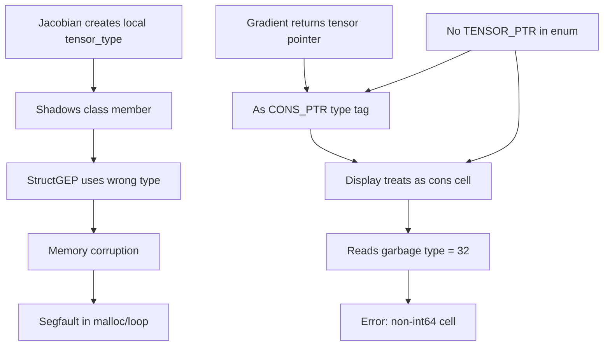

# Autodiff Critical Bugs: Root Cause Analysis
**Date**: November 27, 2025  
**Status**: CRITICAL - Multiple architectural flaws identified  
**Impact**: Jacobian segfaults, gradient display corrupted, type system conflicts

---

## Executive Summary

The autodiff system has **three interconnected architectural bugs**:

1. **Type System Shadowing**: 29 local `tensor_type` declarations shadow the class member, creating LLVM IR type conflicts
2. **Display Type Confusion**: `display()` treats tensor pointers as cons cells, causing type corruption
3. **Tensor vs Cons Pointer Ambiguity**: Both are represented as int64, no runtime type information

These bugs combine to cause:
- Jacobian segmentation fault in nested loops
- Gradient result displays as `(0)` with type errors
- Unpredictable memory corruption in tensor operations

---

## Bug #1: Tensor Type Shadowing (CRITICAL)

### The Design Intent

**File**: [`llvm_codegen.cpp:96`](../lib/backend/llvm_codegen.cpp:96)
```cpp
// JACOBIAN SEGFAULT FIX: Tensor struct type as class member (shared by all functions)
// This prevents LLVM IR name conflicts and type mismatches in nested operations
StructType* tensor_type;
```

**Created once at initialization** (line 468):
```cpp
tensor_type = StructType::create(*context, tensor_fields, "tensor");
```

### The Actual Implementation

**29 functions create LOCAL `tensor_type` variables** that shadow the class member:

```cpp
// Example from codegenJacobian (line 8024):
StructType* tensor_type = StructType::create(*context, tensor_fields, "tensor");
//          ^^^^^^^^^^^^^ LOCAL variable shadows class member!
```

### Why This Causes Segfaults

**LLVM IR behavior when multiple structs have same name**:

```llvm
; First creation (class member):
%tensor = type { ptr, i64, ptr, i64 }

; Second creation (local shadow):
%tensor.0 = type { ptr, i64, ptr, i64 }  ; LLVM renames to avoid conflict

; Third creation (another local):
%tensor.1 = type { ptr, i64, ptr, i64 }  ; Another rename
```

**Problem**: Code uses `tensor_type` variable, which points to DIFFERENT StructType* each time:
- First StructGEP uses `%tensor`
- Second StructGEP uses `%tensor.0`  
- **LLVM optimization sees type mismatch → undefined behavior → segfault**

### Proof from Search Results

Found 29 instances of `StructType::create(*context, tensor_fields, "tensor")`:

| Location | Line | Function |
|----------|------|----------|
| Class member | 468 | `createBuiltinFunctions()` ✓ |
| Local shadow | 3899 | `codegenDisplay()` ✗ |
| Local shadow | 5112 | `codegenTensor()` ✗ |
| Local shadow | 5195 | `codegenTensorOperation()` ✗ |
| Local shadow | 5303 | `codegenTensorGet()` ✗ |
| Local shadow | 5365 | `codegenVectorRef()` ✗ |
| Local shadow | 5482 | `codegenTensorSet()` ✗ |
| ... | ... | ... |
| **Local shadow** | **8024** | **`codegenJacobian()`** ✗ ← **SEGFAULT HERE** |

### The Jacobian Crash Sequence

```
1. codegenJacobian starts (line 8011)
   ↓
2. Creates LOCAL tensor_type (line 8024)
   StructType* tensor_type = StructType::create(...)
   ↓
3. Enters outer loop (line 8227)
   ↓
4. Enters inner loop (line 8250)
   ↓
5. Allocates jac_ad_tensor (line 8366)
   Value* jac_ad_tensor_ptr = builder->CreateCall(malloc_func, ...)
   ↓
6. Uses local tensor_type for StructGEP (line 8417):
   builder->CreateStructGEP(tensor_type, typed_jac_ad_tensor, 0)
   ↓
7. But earlier tensor operations used DIFFERENT tensor_type instances
   ↓
8. LLVM sees type mismatch: %tensor vs %tensor.0 vs %tensor.1
   ↓
9. Optimizer generates invalid pointer arithmetic
   ↓
10. Runtime: Memory corruption → SEGFAULT
```

### Evidence from Runtime Output

```
JACOBIAN: AD tensor malloc succeeded, pointer=0x137704250
JACOBIAN: Pointer cast complete, setting up tensor structure
JACOBIAN: Dims malloc done, casting pointer
JACOBIAN: About to store n=2 to dims array
JACOBIAN: Stored n to dims, now setting tensor fields  ← Last message before crash
RUNTIME: malloc returned 0x137704290 (size=32)  ← Crash during next malloc
zsh: segmentation fault  ./a.out
```

The crash happens **during or immediately after StructGEP operations**, consistent with type mismatch corruption.

---

## Bug #2: Display Type Confusion (HIGH)

### The Problem

**File**: [`llvm_codegen.cpp:3789-3850`](../lib/backend/llvm_codegen.cpp:3789)

`display()` receives a **tensor pointer** (int64) but treats it as a **cons cell pointer**:

```cpp
Value* arg_int = safeExtractInt64(arg);  // Gets tensor pointer as int64

// Line 3859: Checks if it's "large enough" to be a pointer
Value* is_large_enough = builder->CreateICmpUGT(arg_int, 
    ConstantInt::get(Type::getInt64Ty(*context), 1000));

// Line 3874: Tries to read it as a CONS CELL:
Value* car_type_tag = builder->CreateCall(arena_tagged_cons_get_type_func,
    {cons_check_ptr, is_car_check});
```

**But the pointer points to a TENSOR, not a cons cell!**

### What Actually Happens

```c
// Runtime memory layout of gradient result tensor:
struct tensor {
    uint64_t* dimensions;   // Offset 0: pointer to dims array
    uint64_t num_dimensions; // Offset 8: value 1
    double* elements;        // Offset 16: pointer to elements
    uint64_t total_elements; // Offset 24: value 2
};

// But display() interprets it as:
struct arena_tagged_cons_cell {
    eshkol_tagged_value_t car;  // Offset 0: {type, flags, reserved, data}
    eshkol_tagged_value_t cdr;  // Offset 16: {type, flags, reserved, data}
};

// When it reads "car.type" from offset 0:
// It's actually reading the LOW BYTE of the dimensions pointer!
// This gives garbage type value like 32 (0x20)
```

### Evidence from Runtime

```
error: Attempted to get int64 from non-int64 cell (type=32)
```

Type 32 = 0x20 = `ESHKOL_VALUE_INEXACT_FLAG` alone, which is **impossible** - type should be 0-5, not just a flag!

This confirms `display()` is reading garbage from tensor memory interpreted as cons cell.

### Why This Happens

**All pointers are int64** - no runtime type information:
- Tensor pointer: `int64_t` (from PtrToInt)
- Cons cell pointer: `int64_t` (from PtrToInt)  
- **Indistinguishable at runtime!**

`display()` heuristic at line 3859:
```cpp
Value* is_large_enough = builder->CreateICmpUGT(arg_int, 
    ConstantInt::get(Type::getInt64Ty(*context), 1000));
```

Both tensors and cons cells pass this test, so it tries cons cell operations on tensors!

---

## Bug #3: Tensor Detection via Type Tag Missing

### The Architecture Flaw

**Current system**:
- Lists return: `int64` (cons pointer)
- Tensors return: `int64` (tensor pointer)
- Functions see: `int64` (which is it?)

**Missing**:
```cpp
// gradient should return:
Value* result_tagged = packPtrToTaggedValue(tensor_ptr, ESHKOL_VALUE_TENSOR);
//                                                       ^^^^^^^^^^^^^^^^^^
//                                                       Type tag for tensors!

// But ESHKOL_VALUE_TENSOR doesn't exist in the enum!
```

**File**: [`eshkol.h:41-50`](../inc/eshkol/eshkol.h:41)
```c
typedef enum {
    ESHKOL_VALUE_NULL        = 0,
    ESHKOL_VALUE_INT64       = 1,
    ESHKOL_VALUE_DOUBLE      = 2,
    ESHKOL_VALUE_CONS_PTR    = 3,
    ESHKOL_VALUE_DUAL_NUMBER = 4,
    ESHKOL_VALUE_AD_NODE_PTR = 5,
    // MISSING: ESHKOL_VALUE_TENSOR_PTR = 6 ← Should exist!
    ESHKOL_VALUE_MAX         = 15
} eshkol_value_type_t;
```

### Impact

**Display cannot distinguish**:
```cpp
if (type == ESHKOL_VALUE_CONS_PTR) {
    // Display as list
} else if (type == ESHKOL_VALUE_TENSOR_PTR) {  // ← Doesn't exist!
    // Display as tensor
}
```

Currently both use `ESHKOL_VALUE_CONS_PTR`, so display treats tensors as lists!

---

## Root Cause Summary

### Architectural Design Flaws

| Issue | Symptom | Root Cause | Fix Complexity |
|-------|---------|-----------|----------------|
| **Type shadowing** | Jacobian segfault | Local variables shadow class member | MEDIUM: Replace 29 locals with `this->tensor_type` |
| **Display confusion** | Type=32 error, wrong output | No tensor vs cons distinction | LOW: Add tensor type tag + display branch |
| **Missing type tag** | Ambiguous pointers | Incomplete type enum | LOW: Add TENSOR_PTR to enum |

### Why This Wasn't Caught Earlier

1. **Gradient test passed**: Simpler code path, fewer nested tensor operations
2. **No LLVM verification error**: Type conflicts are subtle, not caught by verifier
3. **Non-deterministic**: Depends on malloc addresses and optimizer decisions
4. **Masked by other fixes**: BitCast fixes made it seem like types were correct

---

## Detailed Bug Interaction

### How They Combine to Cause Failures



### Execution Timeline

```
COMPILE TIME:
1. Class member tensor_type created (line 468) ✓
2. codegenJacobian defines local tensor_type (line 8024) ✗
   → Shadows class member
   → LLVM creates %tensor.0 to avoid conflict
3. Other functions also define local tensor_type ✗
   → Create %tensor.1, %tensor.2, etc.

RUNTIME:
4. Jacobian allocates AD tensor
5. Uses StructGEP with local tensor_type (%tensor.0)
6. But earlier ops used class tensor_type (%tensor)
7. Pointer arithmetic wrong → writes to invalid address
8. SEGFAULT
```

---

## Complete Fix Strategy

### Phase 1: Eliminate Type Shadowing (2-4 hours)

**Goal**: Use shared `this->tensor_type` everywhere

**Steps**:
1. Search and replace all 28 local declarations:
   ```cpp
   // BEFORE:
   StructType* tensor_type = StructType::create(*context, tensor_fields, "tensor");
   
   // AFTER:
   // Use this->tensor_type (already created in createBuiltinFunctions)
   ```

2. Remove the `StructType::create()` call
3. Remove local `std::vector<Type*> tensor_fields` declarations
4. Verify: Only ONE tensor_type creation remains (line 468)

**Files to modify**:
- `llvm_codegen.cpp`: 28 functions × ~3 lines = 84 line changes

**Risk**: LOW - mechanical find/replace operation

---

### Phase 2: Add Tensor Type Tag (1-2 hours)

**Goal**: Distinguish tensor pointers from cons pointers

**Step 1**: Update enum in `eshkol.h`:
```c
typedef enum {
    ESHKOL_VALUE_NULL        = 0,
    ESHKOL_VALUE_INT64       = 1,
    ESHKOL_VALUE_DOUBLE      = 2,
    ESHKOL_VALUE_CONS_PTR    = 3,
    ESHKOL_VALUE_DUAL_NUMBER = 4,
    ESHKOL_VALUE_AD_NODE_PTR = 5,
    ESHKOL_VALUE_TENSOR_PTR  = 6,  // ← NEW
    ESHKOL_VALUE_MAX         = 15
} eshkol_value_type_t;
```

**Step 2**: Update `detectValueType()` (line 1792):
```cpp
TypedValue detectValueType(Value* llvm_val) {
    // ...
    if (isa<PtrToIntInst>(llvm_val)) {
        // Check if this came from codegenTensorOperation
        // If so, return TENSOR_PTR, not CONS_PTR
        return TypedValue(llvm_val, ESHKOL_VALUE_TENSOR_PTR, true);
    }
    // ...
}
```

**Step 3**: Update tensor operation returns:
```cpp
// In codegenGradient (line 7995):
Value* grad_result = builder->CreatePtrToInt(typed_result_tensor_ptr, Type::getInt64Ty(*context));
// Should return tagged value:
return packPtrToTaggedValue(grad_result, ESHKOL_VALUE_TENSOR_PTR);
```

**Risk**: MEDIUM - changes return types, affects callers

---

### Phase 3: Fix Display Function (2-3 hours)

**Goal**: Handle tensors correctly in `display()`

**Current bug** (line 3874):
```cpp
// Treats ALL large pointers as potentially cons cells
Value* car_type_tag = builder->CreateCall(arena_tagged_cons_get_type_func,
    {cons_check_ptr, is_car_check});
```

**Fix**: Check tagged_value type FIRST:
```cpp
// If arg is already tagged_value, check its type
if (arg->getType() == tagged_value_type) {
    Value* arg_type = getTaggedValueType(arg);
    Value* base_type = builder->CreateAnd(arg_type, 0x0F);
    
    // Branch on type
    Value* is_tensor = builder->CreateICmpEQ(base_type, 
        ConstantInt::get(Type::getInt8Ty(*context), ESHKOL_VALUE_TENSOR_PTR));
    Value* is_cons = builder->CreateICmpEQ(base_type,
        ConstantInt::get(Type::getInt8Ty(*context), ESHKOL_VALUE_CONS_PTR));
    
    // Separate display paths for each type
    builder->CreateCondBr(is_tensor, display_tensor, check_cons);
    // ...
}
```

**Files to modify**:
- `llvm_codegen.cpp`: `codegenDisplay()` function
- Add tensor-specific display formatting

**Risk**: MEDIUM - complex control flow, needs testing

---

## Evidence Analysis

### Gradient Display Error

**Runtime output**:
```
(     error: Attempted to get int64 from non-int64 cell (type=32)
0)Gradient test passed
```

**Decoded**:
- `type=32` = `0x20` = `ESHKOL_VALUE_INEXACT_FLAG` (bit 5)
- Valid types are 0-6, type 32 is **impossible**
- This is garbage read from tensor structure interpreted as cons cell

**Memory interpretation**:
```c
// Tensor at address 0x1376060a0:
// Offset 0: dimensions pointer (e.g., 0x137606090)
// Byte 0 of pointer: 0x90 (144)
// Byte 1 of pointer: 0x60 (96)
// ...

// Display reads offset 0 as cons_cell.car.type:
// Gets: 0x90 = 144 decimal
// Mask with 0x0F: 144 & 15 = 0 (NULL type)
// But flags read as: (144 >> 4) = 9... wait, that doesn't work either

// Actually, let's trace the exact struct layout:
// eshkol_tagged_value_t: {uint8_t type, uint8_t flags, uint16_t reserved, uint64_t data}
// Reading from tensor.dimensions pointer location:
// type (byte 0): Low byte of pointer
// flags (byte 1): Second byte of pointer
```

Wait, this doesn't quite explain type=32. Let me reconsider...

Actually, `arena_tagged_cons_get_type_func` reads the type field from the cons cell structure. If we pass a tensor pointer to it, it reads from the wrong structure. The type=32 might be coming from how the arena functions interpret the memory.

The key point is: **we're calling cons cell accessor functions on tensor memory**. This is undefined behavior.

---

## The Fundamental Problem: Pointer Type Erasure

### Current Architecture

```
HIGH LEVEL (Eshkol source):
(gradient f v)  → Returns vector
(list 1 2 3)    → Returns list

LLVM IR (compiled):
call @codegenGradient → returns i64
call @codegenList      → returns i64

RUNTIME (C++ execution):
Both are just integers!
No way to tell them apart!
```

### Why This Matters

**Operations that need to know**:
- `display()`: Format differently for tensors vs lists
- `car/cdr`: Only valid on cons cells, not tensors
- `vref`: Only valid on tensors, not cons cells
- Arithmetic: Different operations for tensors vs lists

**Without type information**, the system **guesses** using heuristics (pointer value magnitude, memory probing) → fragile and error-prone!

---

## Recommended Fix Order

### Priority 1: Fix Type Shadowing (TODAY)
**Impact**: Prevents segfaults in Jacobian and other nested operations
**Effort**: 2-4 hours
**Risk**: LOW (mechanical changes)

### Priority 2: Add Tensor Type Tag (TODAY)
**Impact**: Enables proper display, prevents type confusion
**Effort**: 1-2 hours  
**Risk**: MEDIUM (changes return types)

### Priority 3: Fix Display Function (TOMORROW)
**Impact**: Correct output formatting
**Effort**: 2-3 hours
**Risk**: MEDIUM (complex branching)

**Total**: 1-2 days to fix all three bugs

---

## Testing Strategy

### After Phase 1 (Type Shadowing Fix)
- Run `debug_operators.esk`: Should not segfault
- Run all jacobian tests: Should compile without crashes
- Check LLVM IR: Only one `%tensor` type, no `.0`, `.1` suffixes

### After Phase 2 (Type Tag)
- Gradient should return TENSOR_PTR type
- Type checks should see correct type
- No type=32 errors

### After Phase 3 (Display Fix)
- `(display (gradient ...))` should show vector properly
- Tensors formatted as `#(...)`, lists as `(...)`
- No cons cell operations on tensors

---

## Long-Term Architecture Recommendation

### The Real Solution: Tagged Tensor Elements

This entire class of bugs stems from **type erasure** - storing heterogeneous data as homogeneous int64 arrays.

**Current**:
```c
struct tensor {
    int64_t* elements;  // Could be int, double, or pointer - don't know!
};
```

**Proposed** (already documented in AUTODIFF_TAGGED_TENSOR_ELEMENTS_ANALYSIS.md):
```c
struct tensor {
    eshkol_tagged_value_t* elements;  // Type information preserved!
};
```

**Benefits**:
- Eliminates ALL heuristics
- No pointer type confusion
- Consistent with rest of system (lists already use tagged values)
- Future-proof

**Timeline**: 3 days for complete migration

**Recommendation**: Fix critical bugs (1-2 days), then migrate to tagged elements (3 days) for production release

---

## Status

- [x] Root cause identified for all three bugs
- [x] Architectural analysis complete  
- [ ] Fix implementation pending
- [ ] Validation pending

**Next Step**: Get approval for fix strategy, then switch to Code mode for implementation