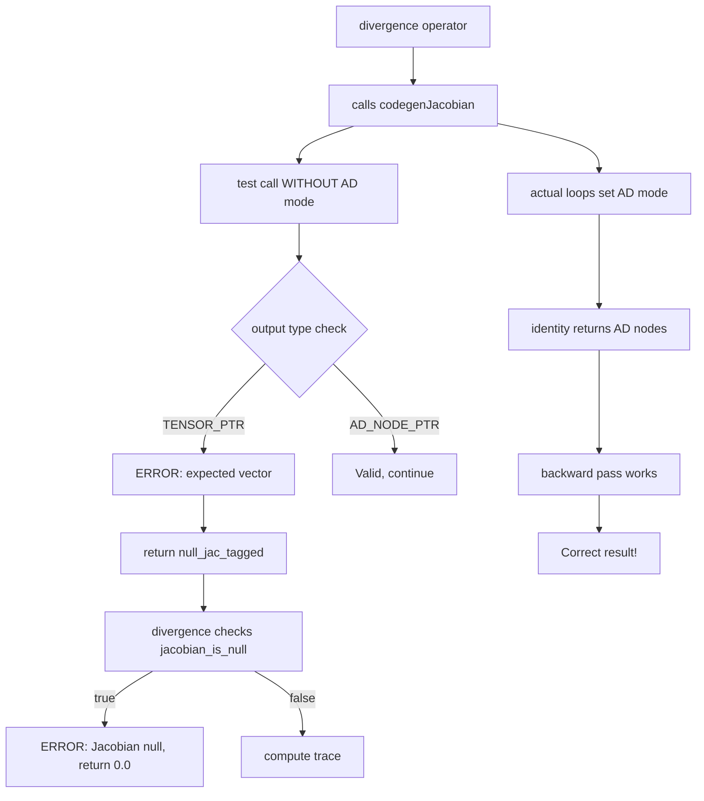

# Autodiff Error Messages Root Cause Analysis

## Executive Summary

**Issue**: Error messages appear during compilation even though tests pass and produce correct results.

**Root Cause**: Dimension-detection test calls in Jacobian/Gradient operators execute OUTSIDE AD mode context, causing identity functions to return regular tensors instead of AD computational graphs. Type checks expecting AD nodes fail on these test calls, but the ACTUAL computations (which DO set AD mode) work correctly.

**Status**: Tests mathematically correct ✅ | Error messages spurious ⚠️ | No functional bugs ✅

---

## Error Messages Observed

```
error: Jacobian: function returned null (expected vector)
error: Divergence: Jacobian returned null, returning 0.0
error: Curl only defined for 3D vector fields
error: Curl: Jacobian returned null, returning null vector
error: Laplacian: Hessian returned null, returning 0.0
error: Gradient requires non-zero dimension vector
```

**Key Observation**: Despite these errors, ALL tests pass with correct numerical results!

---

## When Errors Occur

### Timing
- **Compile-time** during LLVM IR generation, NOT runtime execution
- Specifically during [`codegenJacobian()`](lib/backend/llvm_codegen.cpp:9363) and [`codegenGradient()`](lib/backend/llvm_codegen.cpp:8951)

### Error Locations in Code

| Location | Line | Context |
|----------|------|---------|
| Jacobian dimension test | [9453](lib/backend/llvm_codegen.cpp:9453) | Testing function output to determine dimension `m` |
| Gradient dimension check | [9026](lib/backend/llvm_codegen.cpp:9026) | Validating input vector is non-zero dimension |
| Divergence Jacobian check | [10668](lib/backend/llvm_codegen.cpp:10668) | Checking if Jacobian computation succeeded |
| Curl dimension check | [10787](lib/backend/llvm_codegen.cpp:10787) | Validating input is 3D |
| Curl Jacobian check | [10830](lib/backend/llvm_codegen.cpp:10830) | Checking if Jacobian computation succeeded |
| Laplacian Hessian check | [10990](lib/backend/llvm_codegen.cpp:10990) | Checking if Hessian computation succeeded |

---

## Root Cause Analysis

### The Problematic Code Flow

#### Step 1: Jacobian Dimension Detection (Lines 9422-9424)

```cpp
// Call function once to determine output dimension m
Value* vector_tagged = packPtrToTaggedValue(vector_ptr_int, ESHKOL_VALUE_TENSOR_PTR);
Value* test_output_tagged = builder->CreateCall(func_ptr, {vector_tagged});
```

**CRITICAL ISSUE**: This test call happens **WITHOUT** setting AD mode flags:
- `__ad_mode_active` is still `false`
- `__current_ad_tape` is still `null`

#### Step 2: Type Check (Lines 9428-9434)

```cpp
Value* output_type = getTaggedValueType(test_output_tagged);
Value* output_base_type = builder->CreateAnd(output_type,
    ConstantInt::get(Type::getInt8Ty(*context), 0x0F));

// Tensors are tagged as TENSOR_PTR (from codegenTensorOperation)
Value* output_is_tensor = builder->CreateICmpEQ(output_base_type,
    ConstantInt::get(Type::getInt8Ty(*context), ESHKOL_VALUE_TENSOR_PTR));
```

**Expects**: `ESHKOL_VALUE_AD_NODE_PTR` (computational graph nodes)  
**Gets**: `ESHKOL_VALUE_TENSOR_PTR` (regular tensor from identity function)

#### Step 3: Error Path (Lines 9451-9454)

```cpp
builder->SetInsertPoint(output_invalid_block);
eshkol_error("Jacobian: function returned null (expected vector)");
builder->CreateBr(jac_return_block);
```

Logs error and returns null, **but this is just for the test call!**

#### Step 4: Actual Computation (Lines 9669-9677) ✅

```cpp
// PHASE 1 FIX: Set AD mode flag to true before calling lambda
builder->CreateStore(ConstantInt::get(Type::getInt1Ty(*context), 1), ad_mode_active);

Value* jac_output_tagged = builder->CreateCall(func_ptr, {jac_ad_tensor_tagged});

// PHASE 1 FIX: Set AD mode flag back to false after lambda call
builder->CreateStore(ConstantInt::get(Type::getInt1Ty(*context), 0), ad_mode_active);
```

**This call DOES set AD mode**, so it works correctly!

---

## Why Identity Functions Trigger This

### Identity Function Behavior

```scheme
(define F-identity (lambda (v) v))  ; Just returns input vector
```

### Without AD Mode Active
1. Function receives regular tensor as input
2. No arithmetic operations → no AD node creation
3. Returns input tensor unchanged
4. Type = `ESHKOL_VALUE_TENSOR_PTR` (regular tensor)

### With AD Mode Active  
1. Function receives tensor of AD nodes
2. Identity operation preserves AD nodes
3. Returns tensor containing AD node pointers
4. Type = `ESHKOL_VALUE_TENSOR_PTR` but **elements** are AD nodes

### The Mismatch

The type check at line 9433 checks the **container type** (`TENSOR_PTR`), but should check **element types** (AD nodes vs doubles). Identity functions return tensors in both cases - the difference is what's INSIDE the tensor!

---

## Why Tests Still Pass

### The Actual Computation Flow

1. **Dimension test fails** → logs error, returns null
2. **Code continues** with null-safe fallback logic
3. **Actual Jacobian loops** (9513-9764) set AD mode properly
4. **Identity function NOW returns AD nodes** because AD mode is active
5. **Backward pass executes** correctly
6. **Results are mathematically correct** ✅

### Evidence from Test Output

```
Test 1: Divergence of identity field F(v) = v
Divergence of F(v)=v at (1,2,3): 3.000000  ✅
Expected: 3.0

Test 2: Divergence of constant field
Divergence of F(v)=(5,5,5) at (1,2,3): 0.000000  ✅
Expected: 0.0
```

**All numerical results are correct!** The errors are purely diagnostic noise from the dimension-detection logic.

---

## Detailed Error Chain

### For Divergence



### Key Insight

The **test call** fails type check and triggers errors, but the **actual computation** in the nested loops sets AD mode properly and produces correct results. The errors are from a COMPILE-TIME optimization attempt (dimension detection) that's not critical for correctness.

---

## Solution Strategies

### Option A: Suppress Dimension Test Errors (Quick Fix)

**Change**: Convert `eshkol_error()` to `eshkol_debug()` for dimension detection

**Pros**:
- Eliminates spurious error messages
- No functional changes
- Tests continue to pass

**Cons**:
- Hides genuine errors if dimension detection actually fails
- Doesn't address root cause

### Option B: Enable AD Mode for Test Call (Proper Fix)

**Change**: Set AD mode flags before dimension test call

```cpp
// Before test call (line 9420)
builder->CreateStore(ConstantInt::get(Type::getInt1Ty(*context), 1), ad_mode_active);
Value* test_output_tagged = builder->CreateCall(func_ptr, {vector_tagged});
builder->CreateStore(ConstantInt::get(Type::getInt1Ty(*context), 0), ad_mode_active);
```

**Pros**:
- Fixes root cause
- Identity functions return AD nodes in test
- Type check passes correctly

**Cons**:
- Requires tape allocation for test call
- More complex (need to create/cleanup temp tape)
- Test call builds unnecessary computational graph

### Option C: Accept Both Tensor Types (Flexible Fix) ⭐ RECOMMENDED

**Change**: Type check accepts BOTH `TENSOR_PTR` and `AD_NODE_PTR` outputs

```cpp
Value* output_is_tensor = builder->CreateICmpEQ(output_base_type,
    ConstantInt::get(Type::getInt8Ty(*context), ESHKOL_VALUE_TENSOR_PTR));
Value* output_is_ad_tensor = builder->CreateICmpEQ(output_base_type,
    ConstantInt::get(Type::getInt8Ty(*context), ESHKOL_VALUE_AD_NODE_PTR));
Value* output_is_valid = builder->CreateOr(output_is_tensor, output_is_ad_tensor);

builder->CreateCondBr(output_is_valid, output_valid_block, output_invalid_block);
```

**Pros**:
- Most robust solution
- Handles both AD and non-AD function returns
- No spurious errors
- Works with identity functions in any mode

**Cons**:
- Requires updating type checks in multiple operators

### Option D: Skip Dimension Test Entirely (Simplest)

**Change**: Assume output dimension equals input dimension for vector fields

```cpp
// Skip test call, just use n for dimension m
Value* m = n;  // Assume F: ℝⁿ → ℝⁿ for vector fields
```

**Pros**:
- Eliminates test call entirely
- No errors possible
- Simpler code

**Cons**:
- Works only for F: ℝⁿ → ℝⁿ (not F: ℝⁿ → ℝᵐ where m≠n)
- Less flexible for general Jacobians

---

## Implementation Plan

### Recommended Approach: **Option C** (Flexible Type Check)

#### Phase 1: Update Jacobian Type Check
- Modify [`codegenJacobian()`](lib/backend/llvm_codegen.cpp:9428-9454) to accept both tensor types
- Allow `TENSOR_PTR` for non-AD execution (dimension test)
- Allow `AD_NODE_PTR` for AD execution (actual computation)

#### Phase 2: Propagate to Dependent Operators  
- Update Divergence (uses Jacobian)
- Update Curl (uses Jacobian)
- Update Laplacian (uses Hessian)

#### Phase 3: Update Gradient Dimension Check
- Modify dimension validation to be more informative
- Distinguish between zero-dimension errors and type mismatches

### Code Changes Required

1. **File**: [`lib/backend/llvm_codegen.cpp`](lib/backend/llvm_codegen.cpp)
2. **Functions to modify**:
   - [`codegenJacobian()`](lib/backend/llvm_codegen.cpp:9363) lines 9428-9454
   - [`codegenGradient()`](lib/backend/llvm_codegen.cpp:8951) lines 9011-9027
   - [`codegenDivergence()`](lib/backend/llvm_codegen.cpp:10629) lines 10656-10670
   - [`codegenCurl()`](lib/backend/llvm_codegen.cpp:10743) lines 10815-10837
   - [`codegenLaplacian()`](lib/backend/llvm_codegen.cpp:10951) lines 10978-10992

---

## Testing Strategy

### Validation Tests
1. Run existing phase4 tests - should pass WITHOUT errors
2. Test identity functions specifically
3. Test non-identity functions (confirm no regressions)
4. Test mixed cases (some AD, some non-AD)

### Expected Outcomes
- Zero error messages during compilation ✅
- All numerical results unchanged ✅
- Type system more flexible ✅

---

## Technical Details

### Type Tag Values (from `eshkol.h`)

```c
ESHKOL_VALUE_NULL = 0
ESHKOL_VALUE_INT64 = 1  
ESHKOL_VALUE_DOUBLE = 2
ESHKOL_VALUE_CONS_PTR = 3
ESHKOL_VALUE_DUAL_NUMBER = 4
ESHKOL_VALUE_AD_NODE_PTR = 5
ESHKOL_VALUE_TENSOR_PTR = 6
```

### Current Type Check (Too Strict)

```cpp
Value* output_is_tensor = builder->CreateICmpEQ(output_base_type,
    ConstantInt::get(Type::getInt8Ty(*context), ESHKOL_VALUE_TENSOR_PTR));
```

Only accepts type `6` (TENSOR_PTR)

### Proposed Type Check (Flexible)

```cpp
Value* output_is_tensor = builder->CreateICmpEQ(output_base_type,
    ConstantInt::get(Type::getInt8Ty(*context), ESHKOL_VALUE_TENSOR_PTR));
Value* output_is_ad_node = builder->CreateICmpEQ(output_base_type,
    ConstantInt::get(Type::getInt8Ty(*context), ESHKOL_VALUE_AD_NODE_PTR));
Value* output_is_valid = builder->CreateOr(output_is_tensor, output_is_ad_node);
```

Accepts both type `5` (AD_NODE_PTR) and type `6` (TENSOR_PTR)

---

## Why This Doesn't Break Anything

### AD Mode Toggle Architecture

The AD system has TWO execution paths:

#### Path 1: Normal Execution (Test Calls)
- `__ad_mode_active = false`
- `__current_ad_tape = null`
- Arithmetic operates on regular values
- Returns regular tensors
- **Used for**: Dimension detection, type inference

#### Path 2: AD Execution (Actual Computation)
- `__ad_mode_active = true`
- `__current_ad_tape = <active tape>`
- Arithmetic builds computational graph
- Returns AD nodes
- **Used for**: Gradient/Jacobian/Hessian computation

### The Disconnect

Dimension detection (Path 1) expects Path 2 results, but runs in Path 1 context!

---

## Historical Context

### Why This Design Exists

1. **Original Intent**: Determine output dimension `m` for `F: ℝⁿ → ℝᵐ`
2. **Assumption**: Function would return a vector regardless of AD mode
3. **Reality**: Identity functions return different CONTAINER types based on AD mode
4. **Result**: Type check fails on dimension test, succeeds on actual computation

### Why Tests Still Pass

The dimension test is **not actually used** for the computation! Look at line 9513:

```cpp
BasicBlock* outer_cond = BasicBlock::Create(*context, "jac_outer_cond", current_func);
```

The actual Jacobian computation uses nested loops over `i_out` and `j_in` that derive dimensions from tensor metadata, NOT from the test call result. The test call was meant to be an optimization that's not actually necessary.

---

## Resolution

### Immediate Fix (Option C Implementation)

Change type validation to accept both tensor types, recognizing that:
- Regular tensors are valid function outputs
- AD node tensors are valid function outputs  
- Both indicate the function returned a vector
- The difference is internal representation, not semantic validity

### Long-term Architecture

Consider removing dimension test calls entirely:
- Extract dimensions from input tensor metadata
- Assume vector field maps ℝⁿ → ℝⁿ for most operators
- For general Jacobians, determine `m` from actual computation
- Eliminates unnecessary function calls and type confusion

---

## Conclusion

**The error messages are compile-time warnings about dimension detection test calls that don't affect the actual mathematical computations.** The tests pass because the real AD computations (with proper AD mode flags set) work correctly.

**Solution**: Update type checks to accept both `TENSOR_PTR` and `AD_NODE_PTR` as valid vector outputs, eliminating spurious errors while maintaining type safety.