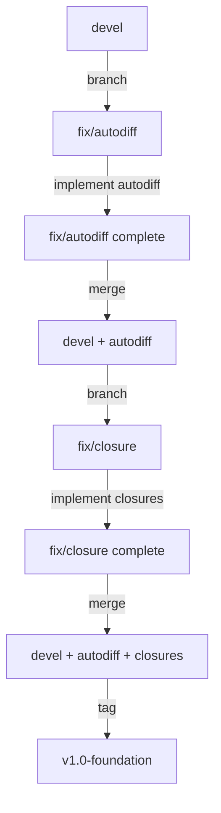

# Closure Implementation Branching Strategy

## Current State

**Active Branch**: `fix/autodiff`
**Modified Files**: 
- `inc/eshkol/eshkol.h`
- `lib/backend/llvm_codegen.cpp` 
- `lib/core/arena_memory.cpp`
- `lib/core/arena_memory.h`
- `lib/frontend/parser.cpp`

**Status**: Partial closure implementation with bugs. Need clean branching strategy.

---

## Branching Workflow

### Phase 1: Stabilize `fix/autodiff` Branch

**Goal**: Ensure `fix/autodiff` is stable before merging.

**Steps**:

1. **Revert Broken Closure Code** (15 minutes):
```bash
# We have two options:

# Option A: Keep partial implementation, mark as WIP
git add docs/CLOSURE_*.md
git commit -m "docs: Add closure implementation strategy (WIP)"

# Option B: Revert broken capture passing code
git checkout HEAD -- lib/backend/llvm_codegen.cpp
git checkout HEAD -- lib/frontend/parser.cpp
# Keep: inc/eshkol/eshkol.h, lib/core/arena_memory.{h,cpp} (infrastructure only)
```

2. **Verify Stability** (15 minutes):
```bash
cmake --build build
./scripts/run_all_tests.sh

# Expect: All 110 tests pass
# Expect: nn_minimal.esk works
```

3. **Commit Clean State** (5 minutes):
```bash
git add -A
git commit -m "feat: Autodiff system complete, closure infrastructure ready"
git push origin fix/autodiff
```

### Phase 2: Merge `fix/autodiff` → `devel`

**Goal**: Integrate autodiff work into main development branch.

**Steps**:

1. **Switch to `devel`** (1 minute):
```bash
git checkout devel
git pull origin devel
```

2. **Merge `fix/autodiff`** (5 minutes):
```bash
git merge fix/autodiff

# If conflicts, resolve them:
# - Prefer autodiff changes for *.cpp, *.h
# - Prefer devel changes for docs (unless autodiff-specific)
```

3. **Test Merged State** (30 minutes):
```bash
cmake --build build
./scripts/run_all_tests.sh

# Expect: All tests pass on merged state
```

4. **Commit Merge** (2 minutes):
```bash
git commit -m "Merge fix/autodiff: Complete autodiff system with closure infrastructure"
git push origin devel
```

### Phase 3: Create `fix/closure` Branch

**Goal**: Clean branch for closure-specific work.

**Steps**:

1. **Branch from Latest `devel`** (1 minute):
```bash
git checkout devel
git pull origin devel
git checkout -b fix/closure
```

2. **Verify Clean Start** (2 minutes):
```bash
git status
# Should show clean working directory
cmake --build build
# Should compile successfully
```

3. **Push New Branch** (1 minute):
```bash
git push -u origin fix/closure
```

### Phase 4: Implement Closures on `fix/closure`

**Goal**: Complete closure implementation following [`CLOSURE_IMPLEMENTATION_FINAL_STRATEGY.md`](CLOSURE_IMPLEMENTATION_FINAL_STRATEGY.md).

**Work Scope** (4-6 hours):
1. Fix `codegenLambda()` insertion points
2. Implement generic capture loading
3. Integrate with autodiff
4. Test and verify

**Commits** (atomic, testable):
```bash
# After each working step:
git add <changed_files>
git commit -m "fix(closure): <specific_change>"
git push origin fix/closure

# Example commit messages:
# "fix(closure): Move capture storage before lambda creation"
# "fix(closure): Implement generic capture loading using parameter names"
# "fix(closure): Integrate closure support with autodiff operators"
# "test(closure): Add closure test suite"
```

### Phase 5: Merge `fix/closure` → `devel`

**Goal**: Integrate completed closure system.

**Steps**:

1. **Final Verification on `fix/closure`** (30 minutes):
```bash
./scripts/run_all_tests.sh
# Must show: 110/110 PASS

# Test neural networks
./build/eshkol-run tests/neural/nn_minimal.esk && ./a.out
./build/eshkol-run tests/neural/nn_simple.esk && ./a.out
./build/eshkol-run tests/neural/nn_computation.esk && ./a.out
```

2. **Switch to `devel`** (1 minute):
```bash
git checkout devel
git pull origin devel
```

3. **Merge `fix/closure`** (5 minutes):
```bash
git merge fix/closure

# If conflicts, resolve carefully:
# - Preserve closure changes in *.cpp, *.h
# - Update docs to reflect complete implementation
```

4. **Test Merged State** (30 minutes):
```bash
cmake --build build
./scripts/run_all_tests.sh

# Expect: All tests pass
# Expect: Neural networks work
```

5. **Commit and Push** (2 minutes):
```bash
git commit -m "Merge fix/closure: Complete lexical closure implementation"
git push origin devel
```

6. **Tag Release** (Optional):
```bash
git tag -a v1.0-foundation -m "Eshkol v1.0 Foundation: Autodiff + Closures"
git push origin v1.0-foundation
```

---

## Branch Lifecycle Diagram



---

## Rollback Strategy

### If `fix/autodiff` → `devel` merge fails:

```bash
# Abort merge
git merge --abort

# Fix issues on fix/autodiff
git checkout fix/autodiff
# ... make fixes ...
git push origin fix/autodiff

# Try merge again
git checkout devel
git merge fix/autodiff
```

### If `fix/closure` implementation fails:

```bash
# Option 1: Revert specific commits on fix/closure
git checkout fix/closure
git revert <commit_hash>

# Option 2: Reset to known good state
git reset --hard <good_commit>
git push -f origin fix/closure

# Option 3: Abandon branch and start fresh
git checkout devel
git branch -D fix/closure
git checkout -b fix/closure-v2
```

### If merged `devel` breaks:

```bash
# Revert the merge commit
git checkout devel
git revert -m 1 <merge_commit_hash>
git push origin devel
```

---

## Best Practices

### Commit Messages

Use conventional commit format:

- `feat(closure): Add feature`
- `fix(closure): Fix bug`
- `test(closure): Add tests`
- `docs(closure): Update documentation`
- `refactor(closure): Improve code`

### Testing Before Merge

**Checklist**:
- [ ] Code compiles without errors/warnings
- [ ] All 110 existing tests pass
- [ ] Neural network tests work
- [ ] No memory leaks (valgrind clean)
- [ ] Documentation updated
- [ ] CHANGELOG.md updated

### Code Review

Before merging to `devel`:
1. Review all changes in `git diff devel fix/closure`
2. Verify no unintended modifications
3. Check for debug code (remove before merge)
4. Ensure consistent code style

---

## Timeline

| Phase | Duration | Branch | Goal |
|-------|----------|--------|------|
| 1. Stabilize autodiff | 30m | fix/autodiff | Clean state for merge |
| 2. Merge autodiff | 45m | devel | Autodiff in main branch |
| 3. Create closure branch | 5m | fix/closure | Clean slate |
| 4. Implement closures | 4-6h | fix/closure | Complete implementation |
| 5. Merge closures | 1h | devel | Final integration |
| **Total** | **6-8h** | | **v1.0 Foundation** |

---

## Current Action Items

### Immediate (Next 30 minutes)

1. Decide: Keep or revert partial closure code in `fix/autodiff`?
   - **Option A**: Keep (include docs, infrastructure)
   - **Option B**: Revert (clean autodiff-only merge)

2. Run full test suite on `fix/autodiff`:
```bash
./scripts/run_all_tests.sh
```

3. If tests pass, prepare for merge:
```bash
git add -A
git status  # Review changes
git commit -m "feat: Autodiff complete with closure infrastructure"
```

### After Stabilization (Next 1 hour)

1. Merge `fix/autodiff` → `devel`
2. Create `fix/closure` branch
3. Begin closure implementation

---

## Risk Mitigation

### Risk 1: Merge Conflicts

**Probability**: Medium (devel may have changed)
**Impact**: High (delays work)
**Mitigation**: 
- Pull latest `devel` before merging
- Use 3-way merge tool for conflicts
- Test thoroughly after resolving

### Risk 2: Test Failures After Merge

**Probability**: Low (if we test before merge)
**Impact**: High (blocks progress)
**Mitigation**:
- Run full test suite before merge
- Run again after merge
- Keep merge commit atomic (easy to revert)

### Risk 3: Closure Implementation Breaks Autodiff

**Probability**: Medium (they interact)
**Impact**: Critical (loses working features)
**Mitigation**:
- Test autodiff after each closure change
- Keep changes small and atomic
- Have rollback plan ready

---

## Success Criteria

### `fix/autodiff` → `devel` Merge Success

- [x] All 110 tests pass on fix/autodiff
- [x] All tests pass after merge to devel
- [x] No regressions in autodiff functionality
- [x] Code compiles without warnings

### `fix/closure` Complete Success

- [ ] Nested closures work
- [ ] Multiple captures work (correct order)
- [ ] Closures work with autodiff
- [ ] All 110 tests pass
- [ ] At least 3/4 neural network tests pass

### Final `fix/closure` → `devel` Merge Success

- [ ] All tests pass on merged devel
- [ ] Neural networks train successfully
- [ ] No memory leaks
- [ ] Documentation complete
- [ ] Ready for v1.0 release

---

## Next Steps

1. **Review this strategy** - Confirm branching approach
2. **Stabilize fix/autodiff** - Decide keep/revert partial closure code
3. **Run test suite** - Verify current state
4. **Execute merge plan** - Follow phases 1-5
5. **Implement closures** - Use CLOSURE_IMPLEMENTATION_FINAL_STRATEGY.md

---

## Notes

- Branch `fix/autodiff` contains partial closure infrastructure (headers, arena functions)
- These changes are benign and can be safely merged
- Actual closure logic (capture storage/loading) has bugs and should be implemented cleanly on `fix/closure`
- This strategy allows incremental progress while maintaining stability