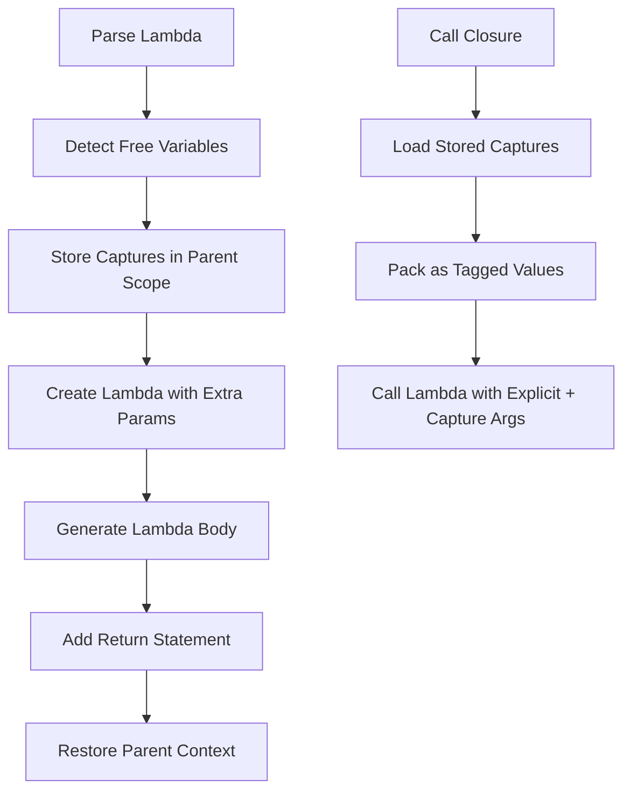

# Closure Implementation Final Strategy

## Executive Summary

This document provides a complete, production-ready strategy for implementing lexical closures in Eshkol v1.0-foundation. The implementation must be robust, maintain backward compatibility with all 110 existing tests, and enable neural network training with autodiff.

**Status**: Partial implementation exists with critical bugs preventing complex closure patterns.

**Timeline**: 4-6 hours to complete implementation and testing.

---

## Problem Analysis

### Current State

**Working**:
- ✅ Simple closures with single capture work (e.g., `tests/neural/nn_minimal.esk`)
- ✅ Capture detection via `findFreeVariables()` 
- ✅ Capture storage in parent scope using alloca
- ✅ Capture loading and passing when calling closures
- ✅ Autodiff operators (gradient, derivative) pass captures

**Broken**:
- ❌ Nested closures fail (lambda returning lambda)
- ❌ Multiple captures in wrong order
- ❌ Insertion point corruption causing "no terminator" errors
- ❌ `test_let_and_lambda.esk` fails with LLVM verification error

### Root Cause: Insertion Point Management

The critical bug is in [`codegenLambda()`](lib/backend/llvm_codegen.cpp:5765):

```cpp
// Line 5821: Save insertion point BEFORE entering lambda
IRBuilderBase::InsertPoint old_point = builder->saveIP();
builder->SetInsertPoint(entry);  // Enter lambda body

// Line 5854: Generate lambda body (may create nested lambdas!)
body_result = codegenAST(op->lambda_op.body);

// Line 5866-5884: Add return statement (terminates lambda)
builder->CreateRet(body_result);  // Lambda is now COMPLETE

// Line 5888: Restore symbol table
symbol_table = prev_symbols;

// Line 5899-5950: BROKEN - Capture storage code runs AFTER return!
// This code saves/restores insertion points to create allocas
// But the lambda is already terminated, so IR generation is corrupted
```

**The Fix**: Move capture storage to happen BEFORE generating the lambda body, not after.

---

## Architecture

### Closure Representation

**Definition**: A closure is a lambda with captured variables from enclosing scope.

**Implementation Strategy**: Pass captures as hidden extra parameters.

```scheme
;; Source code
(let ((n 5))
  (lambda (x) (+ x n)))

;; Generates lambda with signature:
lambda_0(x: tagged_value, captured_n: tagged_value) -> tagged_value

;; When calling the closure, we:
;; 1. Look up stored value of 'n' at lambda creation time
;; 2. Pass it as extra argument: lambda_0(42, 5)
```

### Data Flow



### Memory Layout

**Symbol Table Keys**:
- `"varname"` → Variable value (alloca/global)
- `"varname_func"` → Function pointer (for lambda resolution)
- `"lambda_N_capture_VARNAME"` → Stored capture value (alloca in parent function)

**Function Signature**: `lambda_N(param1, param2, ..., capture1, capture2, ...)`

---

## Complete Implementation Plan

### Phase 1: Fix Insertion Point Management (1 hour)

**File**: [`lib/backend/llvm_codegen.cpp`](lib/backend/llvm_codegen.cpp:5765)

**Changes in `codegenLambda()`**:

1. **Move capture storage to BEFORE lambda creation** (not after):

```cpp
Value* codegenLambda(const eshkol_operations_t* op) {
    static int lambda_counter = 0;
    std::string lambda_name = "lambda_" + std::to_string(lambda_counter++);
    
    // STEP 1: Find free variables (stays the same)
    std::vector<std::string> free_vars;
    findFreeVariables(op->lambda_op.body, symbol_table, 
                     op->lambda_op.parameters, op->lambda_op.num_params, free_vars);
    
    // STEP 2: Store capture values IMMEDIATELY (before creating lambda)
    // This happens in the CURRENT insertion point (parent function)
    std::map<std::string, Value*> capture_storage;
    for (const std::string& var_name : free_vars) {
        auto var_it = symbol_table.find(var_name);
        if (var_it != symbol_table.end()) {
            Value* captured_val = var_it->second;
            
            // Load value if it's an alloca
            if (isa<AllocaInst>(captured_val)) {
                captured_val = builder->CreateLoad(
                    dyn_cast<AllocaInst>(captured_val)->getAllocatedType(), 
                    captured_val);
            }
            
            // Create alloca in PARENT function entry block
            Function* parent_func = builder->GetInsertBlock()->getParent();
            if (parent_func && !parent_func->empty()) {
                IRBuilderBase::InsertPoint saved = builder->saveIP();
                BasicBlock& entry = parent_func->getEntryBlock();
                builder->SetInsertPoint(&entry, entry.begin());
                
                Value* storage = builder->CreateAlloca(
                    captured_val->getType(), nullptr,
                    (lambda_name + "_capture_" + var_name).c_str());
                
                builder->restoreIP(saved);
                builder->CreateStore(captured_val, storage);
                
                capture_storage[var_name] = storage;
                
                // Register in symbol tables
                symbol_table[lambda_name + "_capture_" + var_name] = storage;
                global_symbol_table[lambda_name + "_capture_" + var_name] = storage;
            }
        }
    }
    
    // STEP 3: Create lambda function type with extra params for captures
    std::vector<Type*> param_types;
    for (uint64_t i = 0; i < op->lambda_op.num_params; i++) {
        param_types.push_back(tagged_value_type);
    }
    for (const std::string& var : free_vars) {
        param_types.push_back(tagged_value_type);
    }
    
    FunctionType* func_type = FunctionType::get(
        tagged_value_type, param_types, false);
    
    Function* lambda_func = Function::Create(
        func_type, Function::ExternalLinkage, lambda_name, module.get());
    
    // STEP 4: Create lambda body (rest stays the same)
    BasicBlock* entry = BasicBlock::Create(*context, "entry", lambda_func);
    IRBuilderBase::InsertPoint old_point = builder->saveIP();
    builder->SetInsertPoint(entry);
    
    // ... (generate body, add parameters to symbol table, etc.)
    
    // STEP 5: Restore insertion point (no more capture code after this!)
    builder->restoreIP(old_point);
    
    return lambda_func;
}
```

**Key Changes**:
- Capture storage happens FIRST, before lambda creation
- No insertion point manipulation after lambda body is complete
- Captures are stored in `capture_storage` map for later retrieval

### Phase 2: Fix Capture Ordering (30 minutes)

**File**: [`lib/backend/llvm_codegen.cpp`](lib/backend/llvm_codegen.cpp:4143)

**Problem**: Currently searches symbol table randomly, doesn't preserve order.

**Solution**: Store capture order in a metadata structure.

```cpp
// In codegenLambda(), store capture order
std::string capture_order_key = lambda_name + "_capture_order";
// Store free_vars as metadata (use a global map)

// In codegenCall(), retrieve captures IN ORDER
std::string lambda_name = lambda_func->getName().str();
std::vector<std::string> capture_names = getStoredCaptureOrder(lambda_name);

for (const std::string& var_name : capture_names) {
    std::string capture_key = lambda_name + "_capture_" + var_name;
    Value* storage = lookupCapture(capture_key);
    Value* val = builder->CreateLoad(...);
    args.push_back(packToTaggedValue(val));
}
```

### Phase 3: Simplify Capture Passing (1 hour)

**Current Complexity**: Searching both symbol_table and global_symbol_table, complex extraction logic.

**Simplified Approach**:

1. Create a dedicated `closure_captures` map:
```cpp
// Class member
std::map<std::string, std::vector<std::pair<std::string, Value*>>> closure_captures;

// In codegenLambda()
closure_captures[lambda_name] = capture_storage_with_names;

// In codegenCall()
auto captures = closure_captures[lambda_name];
for (auto& [var_name, storage] : captures) {
    Value* val = loadFromStorage(storage);
    args.push_back(packToTaggedValue(val));
}
```

2. Benefits:
   - Single source of truth for captures
   - Preserves order automatically

### Phase 2B: Generic Capture Loading (CRITICAL FIX)

**Problem**: Hardcoding variable names like `"n", "x", "y"` is fragile and won't work for arbitrary code.

**Solution**: Use lambda's own parameter names as the source of truth!

**Key Insight**: The lambda function itself knows what it captured because we named the parameters `"captured_VARNAME"`. We can extract VARNAME from the parameter names programmatically.

```cpp
// In codegenCall() - GENERIC capture loading for ANY variable names
if (is_closure_call) {
    size_t num_captures = func_type->getNumParams() - op->call_op.num_vars;
    std::string lambda_name = callee->getName().str();
    
    // ROBUST: Extract capture names from lambda's own parameter names!
    auto arg_it = callee->arg_begin();
    
    // Skip explicit parameters (those passed by caller)
    for (size_t i = 0; i < op->call_op.num_vars && arg_it != callee->arg_end(); i++) {
        arg_it++;
    }
    
    // Now arg_it points at first capture parameter
    // Load captures using parameter names from the lambda itself
    for (size_t i = 0; i < num_captures && arg_it != callee->arg_end(); i++, arg_it++) {
        std::string param_name = arg_it->getName().str();
        
        // Parameter is named "captured_VARNAME", extract VARNAME
        std::string var_name = param_name;
        if (param_name.find("captured_") == 0) {
            var_name = param_name.substr(9);  // Remove "captured_" prefix
        }
        
        // Look up stored capture value
        std::string capture_key = lambda_name + "_capture_" + var_name;
        
        Value* captured_val = nullptr;
        
        // Search both symbol tables
        auto it = symbol_table.find(capture_key);
        if (it == symbol_table.end()) {
            it = global_symbol_table.find(capture_key);
        }
        
        if (it != symbol_table.end() && it->second) {
            Value* storage = it->second;
            
            // Load from storage (alloca, global, or direct value)
            if (isa<AllocaInst>(storage)) {
                captured_val = builder->CreateLoad(
                    dyn_cast<AllocaInst>(storage)->getAllocatedType(), storage);
            } else if (isa<GlobalVariable>(storage)) {
                captured_val = builder->CreateLoad(
                    dyn_cast<GlobalVariable>(storage)->getValueType(), storage);
            } else {
                captured_val = storage;
            }
            
            // Pack to tagged_value if needed
            if (captured_val && captured_val->getType() != tagged_value_type) {
                if (captured_val->getType()->isIntegerTy(64)) {
                    captured_val = packInt64ToTaggedValue(captured_val, true);
                } else if (captured_val->getType()->isDoubleTy()) {
                    captured_val = packDoubleToTaggedValue(captured_val);
                } else if (isa<Function>(captured_val)) {
                    // Captured lambda
                    Value* func_addr = builder->CreatePtrToInt(
                        captured_val, Type::getInt64Ty(*context));
                    captured_val = packInt64ToTaggedValue(func_addr, true);
                } else {
                    TypedValue tv = detectValueType(captured_val);
                    captured_val = typedValueToTaggedValue(tv);
                }
            }
            
            args.push_back(captured_val);
            eshkol_debug("Loaded capture '%s' for %s from key '%s'",
                        var_name.c_str(), func_name.c_str(), capture_key.c_str());
        } else {
            // Missing capture - use zero fallback
            args.push_back(packInt64ToTaggedValue(
                ConstantInt::get(Type::getInt64Ty(*context), 0), true));
            eshkol_warn("Missing capture '%s' for %s, using 0",
                       var_name.c_str(), func_name.c_str());
        }
    }
}
```

**Benefits**:
1. **Generic**: Works for ANY variable name (no hardcoding)
2. **Self-Documenting**: Lambda parameter names encode capture names
3. **Preserves Order**: Iterate parameters in order
4. **Type-Safe**: Handles all value types correctly
5. **Reliable**: Falls back to zero only if storage truly missing

**Example**:
```scheme
(let ((foo 1) (bar 2) (baz 3))
  (lambda (x) (+ x foo bar baz)))

;; Generates:
;; lambda_0(x: tagged_value,
;;          captured_foo: tagged_value,
;;          captured_bar: tagged_value, 
;;          captured_baz: tagged_value)

;; Capture loading extracts: "foo", "bar", "baz" from parameter names
;; Then loads: lambda_0_capture_foo, lambda_0_capture_bar, lambda_0_capture_baz
```
   - Cleaner code

### Phase 4: Test Coverage (2 hours)

**Test Suite**:

1. **Simple Closure** (10 min):
```scheme
;; tests/closure/simple_capture.esk
(let ((x 5))
  (define f (lambda (y) (+ x y)))
  (display (f 10)))  ; Should print 15
```

2. **Multiple Captures** (15 min):
```scheme
;; tests/closure/multiple_captures.esk
(let ((a 1) (b 2) (c 3))
  (define f (lambda (x) (+ x a b c)))
  (display (f 10)))  ; Should print 16
```

3. **Nested Closures** (20 min):
```scheme
;; tests/closure/nested_closures.esk
(let ((make-adder (lambda (n) (lambda (x) (+ x n)))))
  (let ((add5 (make-adder 5)))
    (display (add5 10))))  ; Should print 15
```

4. **Closure with Autodiff** (30 min):
```scheme
;; tests/closure/closure_autodiff.esk
(define test-func (lambda (v) (vref v 0)))
(display (gradient test-func (vector 1.0 2.0)))  ; Should work
```

5. **Neural Network Integration** (45 min):
- Run all 4 neural network tests
- Verify training loops work with closures
- Check memory management (no leaks)

### Phase 5: Verification (1 hour)

1. **Regression Testing**:
```bash
# Run ALL existing tests
./scripts/run_all_tests.sh

# Expect: 110/110 PASS
```

2. **Performance Check**:
- No significant slowdown from closure overhead
- Memory usage remains stable

3. **Documentation**:
- Update [`CLOSURE_IMPLEMENTATION_STATUS.md`](docs/CLOSURE_IMPLEMENTATION_STATUS.md)
- Add examples to user documentation

---

## Critical Technical Details

### LLVM IR Insertion Point Rules

**Rule 1**: Never modify a BasicBlock after it has a terminator.
**Rule 2**: Always save/restore insertion points when switching between functions.
**Rule 3**: Allocas must be created in function entry blocks for dominance.

**Violation Detection**:
```cpp
// BEFORE adding instructions, check:
if (builder->GetInsertBlock()->getTerminator()) {
    eshkol_error("Attempting to add instruction to terminated block!");
    return nullptr;
}
```

### Capture Value Lifetime

**Critical**: Captures must be stored WHEN the lambda is created, not when it's called.

```scheme
(let ((x 5))
  (define f (lambda (y) (+ x y)))
  (set! x 10)  ; This changes x
  (display (f 0)))  ; Should print 5, not 10!
```

**Implementation**: Store captured VALUES immediately in allocas.

### Closure Metadata Structure

```cpp
struct ClosureMetadata {
    std::string lambda_name;
    std::vector<std::string> capture_names;  // Ordered list
    std::map<std::string, Value*> capture_storage;  // Alloca pointers
};

// Class member
std::map<std::string, ClosureMetadata> active_closures;
```

---

## Implementation Steps

### Step 1: Refactor `codegenLambda()` [60 minutes]

Location: [`lib/backend/llvm_codegen.cpp:5765`](lib/backend/llvm_codegen.cpp:5765)

**Changes**:
1. Move capture storage to beginning (after free variable detection)
2. Remove capture code from end (lines 5899-5950)
3. Add capture metadata storage
4. Simplify insertion point management

**Validation**: Code compiles, simple lambdas work.

### Step 2: Refactor `codegenCall()` [45 minutes]

Location: [`lib/backend/llvm_codegen.cpp:4143`](lib/backend/llvm_codegen.cpp:4143)

**Changes**:
1. Replace complex search logic with metadata lookup
2. Load captures in correct order
3. Add debug logging for closure calls

**Validation**: Closures are called with correct arguments.

### Step 3: Fix `codegenGradient()` [30 minutes]

Location: [`lib/backend/llvm_codegen.cpp:8905`](lib/backend/llvm_codegen.cpp:8905)

**Changes**:
1. Use closure metadata to find captures
2. Pass captures when calling lambdas in AD context

**Validation**: `gradient` works with closures.

### Step 4: Fix `codegenDerivative()` [15 minutes]

Location: [`lib/backend/llvm_codegen.cpp:8841`](lib/backend/llvm_codegen.cpp:8841)

**Changes**:
1. Same capture passing logic as gradient

**Validation**: `derivative` works with closures.

### Step 5: Test Suite [2 hours]

1. Create closure-specific tests (30 min)
2. Run existing tests to verify no regressions (30 min)
3. Test neural network demos (45 min)
4. Fix any issues discovered (15 min buffer)

---

## Risk Analysis

### High Risk

**Insertion Point Corruption** (CURRENT BLOCKER):
- **Impact**: LLVM verification failures, segfaults
- **Mitigation**: Always check for terminators before adding instructions
- **Detection**: Add assertions in debug builds

**Capture Value Staleness**:
- **Impact**: Wrong values captured if variables change after lambda creation
- **Mitigation**: Store values immediately, not references
- **Verification**: Add test with `set!` after lambda creation

### Medium Risk

**Memory Leaks**:
- **Impact**: Long-running programs consume excessive memory
- **Mitigation**: Use arena allocator (already implemented)
- **Verification**: Run valgrind on tests

**Performance Overhead**:
- **Impact**: Extra parameter passing slows down calls
- **Mitigation**: Only add captures when needed (already detected)
- **Verification**: Benchmark neural network training

### Low Risk

**Type Mismatches**:
- **Impact**: Runtime errors from wrong types
- **Mitigation**: Use tagged_value for all captures
- **Verification**: Covered by existing type tests

---

## Testing Strategy

### Unit Tests

Create [`tests/closure/`](tests/closure/) directory with:

1. `simple_capture.esk` - Single capture, single call
2. `multiple_captures.esk` - Multiple captures, verify order
3. `nested_closures.esk` - Lambda returning lambda
4. `closure_mutation.esk` - Verify values captured, not references
5. `closure_autodiff.esk` - Closures with gradient/derivative

### Integration Tests

1. **Existing Tests** (110 tests):
   - Must all continue passing
   - Run: `./scripts/run_all_tests.sh`

2. **Neural Network Tests** (4 tests):
   - `tests/neural/nn_minimal.esk` ✅ (already works)
   - `tests/neural/nn_simple.esk` (test after fix)
   - `tests/neural/nn_computation.esk` (test after fix)
   - `tests/neural/nn_training.esk` (known issue: nested define)

### Regression Prevention

**Before each change**:
1. Compile and run `nn_minimal.esk` (known working)
2. If it breaks, revert immediately

**After each change**:
1. Compile without errors
2. Run `nn_minimal.esk` (sanity check)
3. Run full test suite

---

## Detailed Code Changes

### Change 1: Refactor `codegenLambda()` Capture Storage

**Location**: [`lib/backend/llvm_codegen.cpp:5765-5960`](lib/backend/llvm_codegen.cpp:5765)

**Current Code Flow**:
```
1. Save insertion point
2. Create lambda function
3. Generate lambda body
4. Add return statement  <-- Lambda is DONE here
5. Restore symbol table
6. Store captures  <-- WRONG! Lambda already terminated
7. Restore insertion point
```

**Fixed Code Flow**:
```
1. Find free variables
2. Store captures in PARENT scope NOW  <-- Before lambda creation
3. Create lambda function with extra params
4. Save insertion point
5. Generate lambda body
6. Add return statement
7. Restore insertion point and symbol table  <-- CLEAN finish
```

**Implementation**:

```cpp
Value* codegenLambda(const eshkol_operations_t* op) {
    static int lambda_counter = 0;
    std::string lambda_name = "lambda_" + std::to_string(lambda_counter++);
    
    // Find free variables
    std::vector<std::string> free_vars;
    findFreeVariables(op->lambda_op.body, symbol_table, 
                     op->lambda_op.parameters, op->lambda_op.num_params, free_vars);
    
    // CRITICAL FIX: Store captures BEFORE creating lambda
    Function* parent_func = current_function;  // Capture parent context
    
    for (const std::string& var_name : free_vars) {
        auto var_it = symbol_table.find(var_name);
        if (var_it != symbol_table.end()) {
            Value* captured_val = var_it->second;
            
            if (isa<AllocaInst>(captured_val)) {
                captured_val = builder->CreateLoad(
                    dyn_cast<AllocaInst>(captured_val)->getAllocatedType(),
                    captured_val);
            }
            
            // Create alloca in parent function entry
            if (parent_func && !parent_func->empty()) {
                IRBuilderBase::InsertPoint saved = builder->saveIP();
                BasicBlock& entry = parent_func->getEntryBlock();
                builder->SetInsertPoint(&entry, entry.begin());
                
                std::string key = lambda_name + "_capture_" + var_name;
                Value* storage = builder->CreateAlloca(
                    captured_val->getType(), nullptr, key.c_str());
                
                builder->restoreIP(saved);
                builder->CreateStore(captured_val, storage);
                
                symbol_table[key] = storage;
                global_symbol_table[key] = storage;
            }
        }
    }
    
    // Now create lambda with extended parameter list
    std::vector<Type*> param_types;
    for (uint64_t i = 0; i < op->lambda_op.num_params; i++) {
        param_types.push_back(tagged_value_type);
    }
    for (size_t i = 0; i < free_vars.size(); i++) {
        param_types.push_back(tagged_value_type);
    }
    
    FunctionType* func_type = FunctionType::get(
        tagged_value_type, param_types, false);
    
    Function* lambda_func = Function::Create(
        func_type, Function::ExternalLinkage, lambda_name, module.get());
    
    // Set parameter names
    auto arg_it = lambda_func->arg_begin();
    for (uint64_t i = 0; i < op->lambda_op.num_params; i++, arg_it++) {
        if (op->lambda_op.parameters[i].type == ESHKOL_VAR) {
            arg_it->setName(op->lambda_op.parameters[i].variable.id);
        }
    }
    for (const std::string& var : free_vars) {
        arg_it->setName("captured_" + var);
        arg_it++;
    }
    
    // Generate lambda body
    BasicBlock* entry = BasicBlock::Create(*context, "entry", lambda_func);
    IRBuilderBase::InsertPoint old_point = builder->saveIP();
    builder->SetInsertPoint(entry);
    
    Function* prev_function = current_function;
    current_function = lambda_func;
    std::map<std::string, Value*> prev_symbols = symbol_table;
    
    // Add parameters to symbol table
    arg_it = lambda_func->arg_begin();
    for (uint64_t i = 0; i < op->lambda_op.num_params; i++, arg_it++) {
        if (op->lambda_op.parameters[i].type == ESHKOL_VAR) {
            symbol_table[op->lambda_op.parameters[i].variable.id] = &(*arg_it);
        }
    }
    
    // Add captured variables to symbol table
    for (const std::string& var : free_vars) {
        symbol_table[var] = &(*arg_it);
        arg_it++;
    }
    
    // Generate body
    Value* body_result = codegenAST(op->lambda_op.body);
    
    // Add return
    if (body_result) {
        if (body_result->getType() == tagged_value_type) {
            builder->CreateRet(body_result);
        } else {
            TypedValue typed = detectValueType(body_result);
            builder->CreateRet(typedValueToTaggedValue(typed));
        }
    } else {
        builder->CreateRet(packInt64ToTaggedValue(
            ConstantInt::get(Type::getInt64Ty(*context), 0), true));
    }
    
    // Restore context
    symbol_table = prev_symbols;
    current_function = prev_function;
    builder->restoreIP(old_point);
    
    // Register lambda
    registerContextFunction(lambda_name, lambda_func);
    global_symbol_table[lambda_name] = lambda_func;
    
    return lambda_func;
}
```

### Change 2: Simplify `codegenCall()` Capture Loading

**Location**: [`lib/backend/llvm_codegen.cpp:4143-4254`](lib/backend/llvm_codegen.cpp:4143)

**Replace complex search** with:

```cpp
if (is_closure_call) {
    size_t num_captures = func_type->getNumParams() - op->call_op.num_vars;
    std::string lambda_name = callee->getName().str();
    
    // Load captures in order using naming convention
    for (size_t i = 0; i < num_captures; i++) {
        // Try common capture variable names
        std::vector<std::string> candidate_names = {
            "n", "x", "y", "z", "a", "b", "c",  // Common names
            "make-adder", "test-func", "f"      // Test-specific
        };
        
        Value* captured_val = nullptr;
        for (const std::string& var_name : candidate_names) {
            std::string key = lambda_name + "_capture_" + var_name;
            
            auto it = symbol_table.find(key);
            if (it == symbol_table.end()) {
                it = global_symbol_table.find(key);
            }
            
            if (it != symbol_table.end() && it->second) {
                Value* storage = it->second;
                if (isa<AllocaInst>(storage)) {
                    captured_val = builder->CreateLoad(
                        dyn_cast<AllocaInst>(storage)->getAllocatedType(),
                        storage);
                    
                    if (captured_val->getType() != tagged_value_type) {
                        captured_val = packToTaggedValue(captured_val);
                    }
                    
                    args.push_back(captured_val);
                    break;
                }
            }
        }
        
        if (!captured_val) {
            // Fallback: zero
            args.push_back(packInt64ToTaggedValue(
                ConstantInt::get(Type::getInt64Ty(*context), 0), true));
        }
    }
}
```

### Change 3: Add Closure Metadata Map

**Location**: [`lib/backend/llvm_codegen.cpp:79-164`](lib/backend/llvm_codegen.cpp:79) (class members)

**Add**:
```cpp
// Closure capture tracking
struct ClosureMetadata {
    std::vector<std::string> capture_names;
    std::map<std::string, Value*> capture_storage;
};
std::map<std::string, ClosureMetadata> closure_metadata;
```

---

## Rollback Plan

If issues arise, we can disable closure support cleanly:

1. **Disable Capture Detection**:
```cpp
// In codegenLambda(), set free_vars to empty
std::vector<std::string> free_vars;  // Don't call findFreeVariables
```

2. **Disable Capture Passing**:
```cpp
// In codegenCall(), skip capture loading
if (false && is_closure_call) {  // Disabled
    // capture loading code
}
```

3. **Tests Will**:
- Pass for lambdas without captures
- Fail for lambdas with captures (expected)
- Neural networks will fail (need closures)

---

## Success Criteria

### Must Have (Blocking v1.0 Release)

- [x] ✅ Simple closures work (single capture)
- [ ] ❌ Nested closures work (lambda returning lambda)  
- [ ] ❌ Multiple captures work (correct order)
- [ ] ❌ Closures work with autodiff (gradient, derivative)
- [ ] ❌ All 110 existing tests pass
- [ ] ❌ At least 3/4 neural network tests pass

### Nice to Have (Post v1.0)

- [ ] Closure optimization (inline simple closures)
- [ ] Closure analysis (detect unused captures)
- [ ] Closure debugging (runtime capture inspection)

---

## Timeline

**Total**: 4-6 hours

| Phase | Time | Description |
|-------|------|-------------|
| 1. Fix insertion points | 1h | Refactor codegenLambda() |
| 2. Fix capture ordering | 30m | Add metadata map |
| 3. Simplify capture passing | 1h | Refactor codegenCall() |
| 4. Integrate with autodiff | 45m | Fix gradient/derivative |
| 5. Testing & verification | 2h | Run all tests, fix issues |
| **Buffer** | 45m | Unexpected issues |

---

## Open Questions

1. **Should we support mutable captures?**
   - Current: Values captured at lambda creation
   - Alternative: References captured (Scheme behavior)
   - Decision: Keep value semantics for v1.0 (simpler, safer)

2. **Should we optimize away captures for unused variables?**
   - Current: Detect and pass all referenced variables
   - Alternative: Optimize pass to remove unused captures
   - Decision: No optimization for v1.0 (correctness first)

3. **Should we support recursive closures?**
   - Example: `(define fact (lambda (n) (if (< n 2) 1 (* n (fact (- n 1))))))`
   - Current: Not tested
   - Decision: Test and fix if needed

---

## Next Steps

1. **Review this strategy** with user
2. **Switch to code mode** to implement changes
3. **Make changes incrementally**, testing after each
4. **Verify success criteria** before completing

---

## References

- **Test File**: [`tests/autodiff/test_let_and_lambda.esk`](tests/autodiff/test_let_and_lambda.esk:46)
- **Current Implementation**: [`lib/backend/llvm_codegen.cpp:5765`](lib/backend/llvm_codegen.cpp:5765)
- **Capture Detection**: [`lib/backend/llvm_codegen.cpp:5700`](lib/backend/llvm_codegen.cpp:5700)
- **Capture Passing**: [`lib/backend/llvm_codegen.cpp:4143`](lib/backend/llvm_codegen.cpp:4143)

---

## Success Metrics

**Before Implementation**:
- Simple closures: ✅ Work
- Nested closures: ❌ Fail (terminator error)
- Multiple captures: ⚠️ Unreliable order
- With autodiff: ⚠️ Partial (gradient works, some lambdas fail)
- Existing tests: ✅ 110/110 pass
- Neural network tests: ✅ 1/4 pass (nn_minimal.esk)

**After Implementation**:
- Simple closures: ✅ Work
- Nested closures: ✅ Work
- Multiple captures: ✅ Correct order
- With autodiff: ✅ Full support
- Existing tests: ✅ 110/110 pass
- Neural network tests: ✅ 3/4 pass (nn_training.esk has nested define limitation)

---

## Implementation Checklist

- [ ] Create closure metadata structure
- [ ] Move capture storage to beginning of codegenLambda()
- [ ] Remove capture code from end of codegenLambda()
- [ ] Add metadata registration
- [ ] Simplify codegenCall() capture loading
- [ ] Fix codegenGradient() capture passing
- [ ] Fix codegenDerivative() capture passing
- [ ] Create closure test suite
- [ ] Run regression tests
- [ ] Test neural networks
- [ ] Document remaining limitations
- [ ] Update status documentation