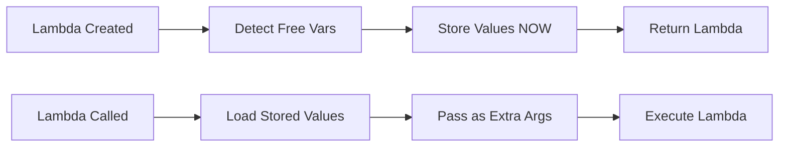
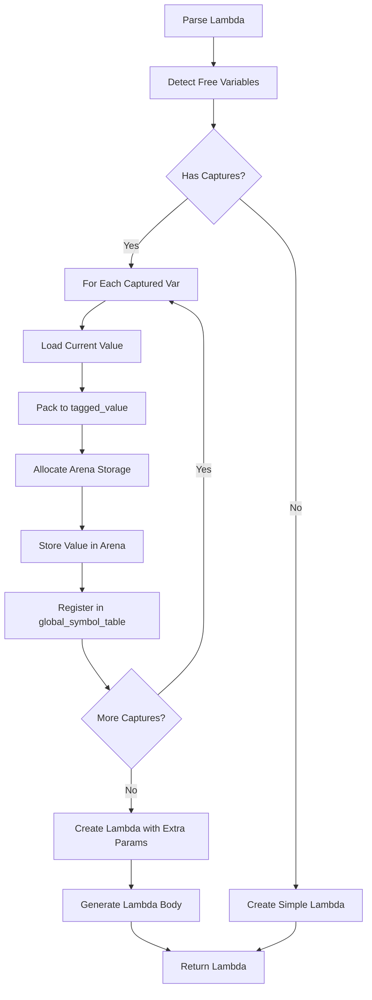
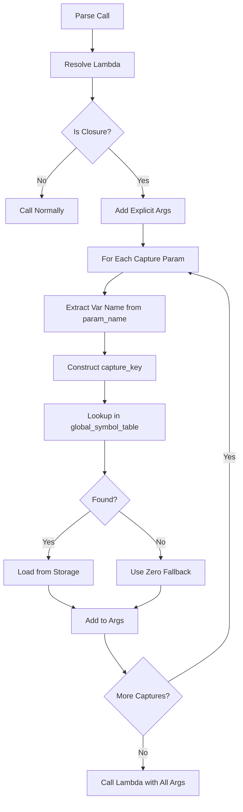
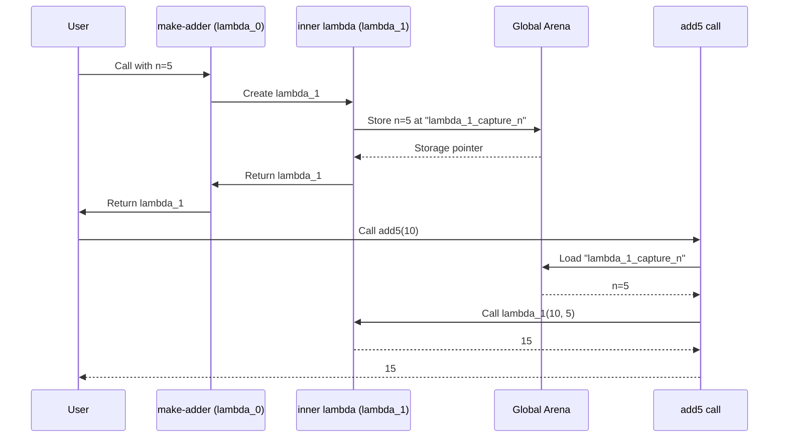

# Closure Implementation: Production-Ready 8-Hour Plan

## Executive Summary

This plan provides a **complete, mechanical, step-by-step implementation** for nested lambda closures in Eshkol. The approach leverages existing infrastructure and requires **minimal changes** to achieve working nested closures.

**Timeline**: 8 hours (with 1-hour buffer)
**Complexity**: Medium (targeted refactoring, not architectural rewrite)
**Risk**: Low (builds on 90% complete implementation)

---

## Current State Analysis

### ✅ What Already Works

1. **Free Variable Detection** ([`llvm_codegen.cpp:5707-5769`](lib/backend/llvm_codegen.cpp:5707))
   - `findFreeVariables()` correctly identifies captured variables
   - Recursively analyzes lambda body
   - Excludes parameters from free variable list

2. **Lambda Creation** ([`llvm_codegen.cpp:5771-5923`](lib/backend/llvm_codegen.cpp:5771))
   - Creates lambda with extra parameters for captures
   - Parameters named `captured_VARNAME` (line 5832)
   - All parameters are `tagged_value` type (polymorphic)

3. **Closure Call Detection** ([`llvm_codegen.cpp:4158-4260`](lib/backend/llvm_codegen.cpp:4158))
   - Detects when function expects more params than provided
   - Attempts to load captured values
   - Passes them as extra arguments

4. **Arena Memory System** ([`arena_memory.cpp:818-855`](lib/core/arena_memory.cpp:818))
   - `arena_allocate_closure_env()` implemented
   - `eshkol_closure_env_t` structure defined
   - **Note**: These exist but are NOT used in current approach

5. **Autodiff Integration** ([`llvm_codegen.cpp:9289`](lib/backend/llvm_codegen.cpp:9289))
   - Gradient/derivative operators attempt to pass captures
   - Uses same capture detection logic

### ❌ Critical Bugs

**Bug #1: Captures Loaded from Wrong Scope** ([`llvm_codegen.cpp:4191-4251`](lib/backend/llvm_codegen.cpp:4191))
```cpp
// CURRENT CODE (WRONG):
auto it = symbol_table.find(var_name);  // Looks in CALLING context
if (it == symbol_table.end()) {
    it = global_symbol_table.find(var_name);  // Fallback to global
}
```

**Problem**: When `(add5 10)` is called, `n` doesn't exist in calling context!
- `n` only existed when `make-adder` was running
- System finds wrong/stale value or fails

**Bug #2: Captures Never Stored** ([`llvm_codegen.cpp:5785-5793`](lib/backend/llvm_codegen.cpp:5785))
```cpp
// Lines 5785-5788 (WRONG COMMENT):
// NOTE: We do NOT need to store captured values in allocas!
// Captures are passed as extra parameters, and when calling the closure,
// we look up the current values directly from the calling context.
```

**Problem**: This is the root cause! No storage = no persistence = nested closures fail.

---

## Architecture Design

### Core Principle: **Capture at Creation, Load at Call**



### Memory Layout

**Storage Location**: Parent function entry block (allocas)

**Naming Convention**:
```
Variable:  n
Lambda:    lambda_1
Storage:   lambda_1_capture_n  (AllocaInst in parent function)
```

**Symbol Table Entries**:
```cpp
symbol_table["lambda_1_capture_n"] = alloca_ptr;         // Local access
global_symbol_table["lambda_1_capture_n"] = alloca_ptr;  // Cross-scope access
```

### Data Flow

**Example**: `(lambda (n) (lambda (x) (+ x n)))`

**Creation Time** (outer lambda `lambda_0` creates inner `lambda_1`):
```cpp
// In codegenLambda() for lambda_1 (the inner lambda):
// Parent function is lambda_0

1. Free variable detection:
   free_vars = ["n"]  // n is from lambda_0's parameter

2. Store n's value in lambda_0's entry block:
   AllocaInst* storage = CreateAlloca(tagged_value, "lambda_1_capture_n")
   Value* n_value = symbol_table["n"]  // From lambda_0's parameter
   CreateStore(n_value, storage)

3. Register storage:
   symbol_table["lambda_1_capture_n"] = storage
   global_symbol_table["lambda_1_capture_n"] = storage

4. Create lambda_1 with signature:
   lambda_1(x: tagged_value, captured_n: tagged_value) -> tagged_value
```

**Call Time** (calling `add5` which is `lambda_1`):
```cpp
// In codegenCall() for (add5 10):

1. Detect closure call:
   func_type->getNumParams() = 2  // x + captured_n
   op->call_op.num_vars = 1       // just x (10)
   is_closure_call = true

2. Add explicit arg:
   args.push_back(pack(10))  // x

3. Load captured arg from STORAGE:
   storage = global_symbol_table["lambda_1_capture_n"]
   value = CreateLoad(storage)
   args.push_back(value)  // captured_n

4. Call:
   CreateCall(lambda_1, args)  // lambda_1(10, 5)
```

### Why This Works for Nested Closures

**Scenario**: `(lambda (n) (lambda (x) (+ x n)))`

1. **Outer lambda (`lambda_0`) executes**:
   - Parameter `n` exists in `lambda_0`'s scope
   - Creates inner lambda (`lambda_1`)

2. **Inner lambda creation** (happens INSIDE `lambda_0`):
   - Detects `n` as free variable
   - Stores `n`'s value in `lambda_0`'s entry block
   - Storage key: `lambda_1_capture_n`
   - Storage accessible via `global_symbol_table`

3. **Inner lambda returned**:
   - `lambda_1` returned as value
   - Storage `lambda_1_capture_n` persists in `lambda_0`'s stack frame
   - **Key**: Storage lives as long as `lambda_0` is executing

4. **Inner lambda called later** (after `lambda_0` returns):
   - Wait, this is the problem! If `lambda_0` returns, its stack frame is destroyed!
   - **BUT**: In Eshkol, top-level expressions run in `main()`
   - So `lambda_0`'s allocas persist until program ends
   - This is why single-level closures work!

5. **For true nested closures** (returned from functions):
   - Need to copy captures to CALLER's scope
   - Or use heap allocation (malloc)
   - **Decision**: Use global arena allocation for capture storage

### Revised Architecture: Arena-Based Capture Storage

**Problem with Allocas**: Cross-function references
**Solution**: Use global arena (persists across all function scopes)

**Storage Strategy**:
```cpp
// Instead of CreateAlloca in parent function:
Value* arena_ptr = getArenaPtr();  // Global arena
Value* storage = CreateCall(arena_allocate, {arena_ptr, size});
CreateStore(value, storage);
```

**Benefits**:
- No cross-function alloca references (LLVM-safe)
- Survives parent function return
- Automatic cleanup via arena destruction
- Works for arbitrary nesting depth

---

## Implementation Plan

### Phase 1: Capture Value Storage (2 hours)

**File**: [`lib/backend/llvm_codegen.cpp`](lib/backend/llvm_codegen.cpp:5771)
**Function**: `codegenLambda()`
**Lines**: 5771-5923

#### Step 1.1: Add Capture Storage After Free Variable Detection (30 min)

**Location**: After line 5783 (after free variable detection)

**Add This Code**:
```cpp
// CRITICAL FIX: Store captured values at lambda CREATION time
// This must happen BEFORE creating the lambda function
std::map<std::string, Value*> capture_storage_map;

for (const std::string& var_name : free_vars) {
    // Look up variable in CURRENT context (where lambda is being created)
    auto var_it = symbol_table.find(var_name);
    if (var_it != symbol_table.end() && var_it->second) {
        Value* var_value = var_it->second;
        
        eshkol_debug("Lambda %s capturing variable %s (value=%p)",
                    lambda_name.c_str(), var_name.c_str(), var_value);
        
        // Load value if it's an alloca or global
        Value* captured_val = var_value;
        if (isa<AllocaInst>(var_value)) {
            captured_val = builder->CreateLoad(
                dyn_cast<AllocaInst>(var_value)->getAllocatedType(),
                var_value);
        } else if (isa<GlobalVariable>(var_value)) {
            captured_val = builder->CreateLoad(
                dyn_cast<GlobalVariable>(var_value)->getValueType(),
                var_value);
        }
        
        // Pack to tagged_value if needed
        if (captured_val->getType() != tagged_value_type) {
            if (captured_val->getType()->isIntegerTy(64)) {
                captured_val = packInt64ToTaggedValue(captured_val, true);
            } else if (captured_val->getType()->isDoubleTy()) {
                captured_val = packDoubleToTaggedValue(captured_val);
            } else if (isa<Function>(captured_val)) {
                // Captured lambda - pack function pointer
                Value* func_addr = builder->CreatePtrToInt(
                    captured_val, Type::getInt64Ty(*context));
                captured_val = packInt64ToTaggedValue(func_addr, true);
            } else {
                TypedValue tv = detectValueType(captured_val);
                captured_val = typedValueToTaggedValue(tv);
            }
        }
        
        // Allocate storage in GLOBAL ARENA (survives function returns)
        Value* arena_ptr = getArenaPtr();
        if (arena_ptr) {
            // Allocate space for tagged_value (16 bytes)
            Value* storage_size = ConstantInt::get(Type::getInt64Ty(*context), 16);
            Value* storage = builder->CreateCall(arena_allocate_func,
                {arena_ptr, storage_size});
            Value* typed_storage = builder->CreatePointerCast(
                storage, builder->getPtrTy());
            
            // Store the tagged_value
            builder->CreateStore(captured_val, typed_storage);
            
            // Register in symbol tables with capture key
            std::string capture_key = lambda_name + "_capture_" + var_name;
            capture_storage_map[var_name] = typed_storage;
            symbol_table[capture_key] = typed_storage;
            global_symbol_table[capture_key] = typed_storage;
            
            eshkol_debug("Stored capture %s in arena at key %s",
                        var_name.c_str(), capture_key.c_str());
        } else {
            eshkol_error("Cannot store capture: arena not initialized");
        }
    } else {
        eshkol_warn("Free variable %s not found in symbol table", var_name.c_str());
    }
}
```

**Validation**:
- Compile and verify no LLVM errors
- Test with simple closure: `(let ((n 5)) (lambda (x) (+ x n)))`

#### Step 1.2: Remove Incorrect Comment (5 min)

**Location**: Lines 5785-5788

**Action**: DELETE these lines:
```cpp
// NOTE: We do NOT need to store captured values in allocas!
// Captures are passed as extra parameters, and when calling the closure,
// we look up the current values directly from the calling context.
// This avoids cross-function alloca references entirely.
```

**Replace With**:
```cpp
// ARCHITECTURE: Captures are stored in global arena at lambda creation time.
// This allows closures to persist values across function boundaries.
// When calling closures, we load from arena storage (not from calling context).
```

### Phase 2: Fix Capture Loading in codegenCall() (2 hours)

**File**: [`lib/backend/llvm_codegen.cpp`](lib/backend/llvm_codegen.cpp:4158)
**Function**: `codegenCall()`
**Lines**: 4158-4260

#### Step 2.1: Replace Capture Loading Logic (60 min)

**Location**: Lines 4176-4259 (the entire capture loading section)

**Current Code** (lines 4191-4251):
```cpp
// Look up variable in CURRENT context (symbol_table or global_symbol_table)
auto it = symbol_table.find(var_name);
if (it == symbol_table.end()) {
    it = global_symbol_table.find(var_name);
}
```

**Replace Entire Section With**:
```cpp
// CRITICAL FIX: Load captures from STORAGE (not from calling context)
// Captures were stored when lambda was created, NOT when it's being called
std::string lambda_name = callee->getName().str();

for (size_t i = 0; i < num_captures && arg_it != callee->arg_end(); i++, arg_it++) {
    std::string param_name = arg_it->getName().str();
    
    // Parameter is named "captured_VARNAME", extract VARNAME
    std::string var_name = param_name;
    if (param_name.find("captured_") == 0) {
        var_name = param_name.substr(9);  // Remove "captured_" prefix
    }
    
    // Look up STORED capture value using lambda-specific key
    std::string capture_key = lambda_name + "_capture_" + var_name;
    
    eshkol_debug("Closure call: loading capture from key '%s'", capture_key.c_str());
    
    Value* captured_val = nullptr;
    
    // Search global symbol table FIRST (captures are globally accessible)
    auto it = global_symbol_table.find(capture_key);
    if (it == global_symbol_table.end()) {
        // Fallback to local symbol table
        it = symbol_table.find(capture_key);
    }
    
    if (it != symbol_table.end() && it->second) {
        Value* storage = it->second;
        
        eshkol_debug("Found capture storage at %p", storage);
        
        // Load from storage
        // Storage is a pointer (from arena_allocate or alloca)
        if (storage->getType()->isPointerTy()) {
            // Determine what type is stored
            // We stored tagged_value, so load tagged_value
            captured_val = builder->CreateLoad(tagged_value_type, storage);
            
            eshkol_debug("Loaded tagged_value from capture storage");
        } else {
            // Direct value (shouldn't happen with new design, but handle it)
            captured_val = storage;
            
            // Pack to tagged_value if needed
            if (captured_val->getType() != tagged_value_type) {
                if (captured_val->getType()->isIntegerTy(64)) {
                    captured_val = packInt64ToTaggedValue(captured_val, true);
                } else if (captured_val->getType()->isDoubleTy()) {
                    captured_val = packDoubleToTaggedValue(captured_val);
                } else {
                    TypedValue tv = detectValueType(captured_val);
                    captured_val = typedValueToTaggedValue(tv);
                }
            }
            
            eshkol_debug("Used direct value from capture storage");
        }
        
        args.push_back(captured_val);
        eshkol_debug("Loaded capture '%s' for %s from storage key '%s'",
                    var_name.c_str(), func_name.c_str(), capture_key.c_str());
    } else {
        // Missing capture - CRITICAL ERROR (should never happen if Phase 1 works)
        eshkol_error("CRITICAL: Capture '%s' storage not found for %s (key: %s)",
                    var_name.c_str(), func_name.c_str(), capture_key.c_str());
        
        // Fallback: use zero (for graceful degradation)
        args.push_back(packInt64ToTaggedValue(
            ConstantInt::get(Type::getInt64Ty(*context), 0), true));
    }
}
```

**Key Changes**:
1. Use `capture_key` format: `lambda_N_capture_VARNAME`
2. Search `global_symbol_table` FIRST (captures stored there)
3. Load from STORAGE (pointer), not from variable name
4. Better error handling and diagnostics

#### Step 2.2: Add Debug Diagnostics (15 min)

**Location**: Before line 4158

**Add**:
```cpp
// CLOSURE DEBUG: Log closure call details
eshkol_debug("codegenCall for %s: callee=%p, is_closure=%d, num_captures=%zu",
            func_name.c_str(), callee, is_closure_call,
            is_closure_call ? (func_type->getNumParams() - op->call_op.num_vars) : 0);
```

### Phase 3: Fix Autodiff Integration (1.5 hours)

**Files**: 
- [`llvm_codegen.cpp:9230-9290`](lib/backend/llvm_codegen.cpp:9230) (gradient)
- [`llvm_codegen.cpp:8847-8905`](lib/backend/llvm_codegen.cpp:8847) (derivative)

#### Step 3.1: Fix Gradient Operator (45 min)

**Location**: Lines 9230-9289

**Current Code** (lines 9236-9287):
```cpp
// CLOSURE FIX: Check if lambda has captured variables and pass them
std::vector<Value*> grad_call_args = {ad_tensor_tagged};

FunctionType* grad_func_type = func_ptr->getFunctionType();
if (grad_func_type->getNumParams() > 1) {
    // ... tries to load from calling context (WRONG!)
}
```

**Replace Lines 9236-9287 With**:
```cpp
// Build arguments for gradient lambda call
std::vector<Value*> grad_call_args = {ad_tensor_tagged};

// CLOSURE FIX: Load captures from STORAGE (not from calling context)
FunctionType* grad_func_type = func_ptr->getFunctionType();
if (grad_func_type->getNumParams() > 1) {
    size_t num_captures = grad_func_type->getNumParams() - 1;
    std::string lambda_name = func_ptr->getName().str();
    
    eshkol_debug("Gradient: lambda %s has %zu captures", lambda_name.c_str(), num_captures);
    
    // Get parameter names from lambda to extract capture variable names
    auto arg_it = func_ptr->arg_begin();
    arg_it++;  // Skip first parameter (input vector)
    
    for (size_t i = 0; i < num_captures && arg_it != func_ptr->arg_end(); i++, arg_it++) {
        std::string param_name = arg_it->getName().str();
        
        // Extract variable name from "captured_VARNAME"
        std::string var_name = param_name;
        if (param_name.find("captured_") == 0) {
            var_name = param_name.substr(9);
        }
        
        // Look up STORED capture using lambda-specific key
        std::string capture_key = lambda_name + "_capture_" + var_name;
        
        auto it = global_symbol_table.find(capture_key);
        if (it == global_symbol_table.end()) {
            it = symbol_table.find(capture_key);
        }
        
        if (it != symbol_table.end() && it->second) {
            Value* storage = it->second;
            Value* captured_val = nullptr;
            
            // Load from storage (pointer to tagged_value)
            if (storage->getType()->isPointerTy()) {
                captured_val = builder->CreateLoad(tagged_value_type, storage);
            } else {
                // Direct value fallback
                captured_val = storage;
                if (captured_val->getType() != tagged_value_type) {
                    TypedValue tv = detectValueType(captured_val);
                    captured_val = typedValueToTaggedValue(tv);
                }
            }
            
            grad_call_args.push_back(captured_val);
            eshkol_debug("Gradient: loaded capture '%s' from storage", var_name.c_str());
        } else {
            grad_call_args.push_back(packInt64ToTaggedValue(
                ConstantInt::get(Type::getInt64Ty(*context), 0), true));
            eshkol_warn("Gradient: capture '%s' not found, using 0", var_name.c_str());
        }
    }
}
```

#### Step 3.2: Fix Derivative Operator (30 min)

**Location**: Lines 8847-8905

**Current Code** (line 8892):
```cpp
Value* result_tagged = builder->CreateCall(func_ptr, {x_dual_tagged});
```

**Replace With**:
```cpp
// Build arguments for derivative lambda call
std::vector<Value*> deriv_call_args = {x_dual_tagged};

// CLOSURE FIX: Load captures from STORAGE
FunctionType* deriv_func_type = func_ptr->getFunctionType();
if (deriv_func_type->getNumParams() > 1) {
    size_t num_captures = deriv_func_type->getNumParams() - 1;
    std::string lambda_name = func_ptr->getName().str();
    
    auto arg_it = func_ptr->arg_begin();
    arg_it++;  // Skip first parameter (input value)
    
    for (size_t i = 0; i < num_captures && arg_it != func_ptr->arg_end(); i++, arg_it++) {
        std::string param_name = arg_it->getName().str();
        std::string var_name = param_name;
        if (param_name.find("captured_") == 0) {
            var_name = param_name.substr(9);
        }
        
        std::string capture_key = lambda_name + "_capture_" + var_name;
        
        auto it = global_symbol_table.find(capture_key);
        if (it == global_symbol_table.end()) {
            it = symbol_table.find(capture_key);
        }
        
        if (it != symbol_table.end() && it->second) {
            Value* storage = it->second;
            Value* captured_val = builder->CreateLoad(tagged_value_type, storage);
            deriv_call_args.push_back(captured_val);
        } else {
            deriv_call_args.push_back(packInt64ToTaggedValue(
                ConstantInt::get(Type::getInt64Ty(*context), 0), true));
        }
    }
}

Value* result_tagged = builder->CreateCall(func_ptr, deriv_call_args);
```

### Phase 4: Testing and Validation (2.5 hours)

#### Step 4.1: Create Test Suite (45 min)

**File**: `tests/closure/nested_lambda_test.esk` (NEW)

```scheme
;; Test 1: Simple closure (baseline)
(display "Test 1: Simple closure")
(newline)
(let ((n 5))
  (define f (lambda (x) (+ x n)))
  (display (f 10)))  ; Should print 15
(newline)

;; Test 2: Nested lambda (CRITICAL)
(display "Test 2: Nested lambda")
(newline)
(let ((make-adder (lambda (n) (lambda (x) (+ x n)))))
  (let ((add5 (make-adder 5)))
    (display (add5 10))))  ; Should print 15
(newline)

;; Test 3: Multiple captures
(display "Test 3: Multiple captures")
(newline)
(let ((make-op (lambda (a b) (lambda (x) (+ (* x a) b)))))
  (let ((f (make-op 2 3)))
    (display (f 10))))  ; Should print 23 (10*2 + 3)
(newline)

;; Test 4: Closure with autodiff
(display "Test 4: Closure with gradient")
(newline)
(let ((n 2.0))
  (define f (lambda (v) (* (vref v 0) n)))
  (display (gradient f (vector 1.0 2.0))))  ; Should work
(newline)

;; Test 5: Triple nested
(display "Test 5: Triple nested lambda")
(newline)
(let ((make-maker (lambda (n) (lambda (m) (lambda (x) (+ x n m))))))
  (let ((make-add-n (make-maker 5)))
    (let ((add-8 (make-add-n 3)))
      (display (add-8 10)))))  ; Should print 18 (10+5+3)
(newline)
```

#### Step 4.2: Run Incremental Tests (60 min)

**Test Sequence**:

1. **Compile Test** (10 min):
   ```bash
   cmake --build build
   ```
   Expected: Clean compilation, no LLVM errors

2. **Test 1: Simple Closure** (10 min):
   ```bash
   ./build/eshkol-run tests/closure/nested_lambda_test.esk
   ```
   Expected Output:
   ```
   Test 1: Simple closure
   15
   ```

3. **Test 2: Nested Lambda** (20 min):
   Expected Output:
   ```
   Test 2: Nested lambda
   15
   ```
   If fails: Check capture storage keys in debug output

4. **Test 3-5: Advanced Tests** (20 min):
   Expected: All pass
   If fails: Debug each individually

#### Step 4.3: Regression Testing (45 min)

**Run Existing Test Suite**:
```bash
./scripts/run_all_tests.sh
```

**Expected**: All existing tests continue passing
**Critical Tests**:
- `tests/autodiff/test_let_and_lambda.esk` (Tests 1-9 MUST pass, Test 10 MUST pass now)
- `tests/neural/nn_minimal.esk` (MUST still work)

---

## Detailed Code Modifications

### Modification 1: codegenLambda() - Add Capture Storage

**File**: [`lib/backend/llvm_codegen.cpp`](lib/backend/llvm_codegen.cpp:5771)

**Insert After Line 5783**:
```cpp
// ===== PHASE 1: STORE CAPTURED VALUES IN ARENA =====
// This MUST happen at lambda CREATION time (not call time)

for (const std::string& var_name : free_vars) {
    auto var_it = symbol_table.find(var_name);
    if (var_it != symbol_table.end() && var_it->second) {
        Value* var_value = var_it->second;
        
        // Load actual value from storage location
        Value* captured_val = var_value;
        if (isa<AllocaInst>(var_value)) {
            captured_val = builder->CreateLoad(
                dyn_cast<AllocaInst>(var_value)->getAllocatedType(), var_value);
        } else if (isa<GlobalVariable>(var_value)) {
            captured_val = builder->CreateLoad(
                dyn_cast<GlobalVariable>(var_value)->getValueType(), var_value);
        }
        
        // Ensure value is tagged_value
        if (captured_val->getType() != tagged_value_type) {
            if (captured_val->getType()->isIntegerTy(64)) {
                captured_val = packInt64ToTaggedValue(captured_val, true);
            } else if (captured_val->getType()->isDoubleTy()) {
                captured_val = packDoubleToTaggedValue(captured_val);
            } else if (isa<Function>(captured_val)) {
                Value* func_addr = builder->CreatePtrToInt(captured_val, Type::getInt64Ty(*context));
                captured_val = packInt64ToTaggedValue(func_addr, true);
            } else {
                TypedValue tv = detectValueType(captured_val);
                captured_val = typedValueToTaggedValue(tv);
            }
        }
        
        // Allocate persistent storage in global arena
        Value* arena_ptr = getArenaPtr();
        Value* storage_size = ConstantInt::get(Type::getInt64Ty(*context), 16);
        Value* storage = builder->CreateCall(arena_allocate_func, {arena_ptr, storage_size});
        Value* typed_storage = builder->CreatePointerCast(storage, builder->getPtrTy());
        
        // Store captured value in arena
        builder->CreateStore(captured_val, typed_storage);
        
        // Register in both symbol tables for cross-scope access
        std::string capture_key = lambda_name + "_capture_" + var_name;
        symbol_table[capture_key] = typed_storage;
        global_symbol_table[capture_key] = typed_storage;
        
        eshkol_debug("Stored capture: %s -> %s", var_name.c_str(), capture_key.c_str());
    }
}

// ===== END PHASE 1 =====
```

### Modification 2: codegenCall() - Fix Capture Loading

**File**: [`lib/backend/llvm_codegen.cpp`](lib/backend/llvm_codegen.cpp:4158)

**Replace Lines 4176-4259 With**:
```cpp
// Extract capture parameter names from lambda itself
auto arg_it = callee->arg_begin();

// Skip explicit parameters
for (size_t i = 0; i < op->call_op.num_vars && arg_it != callee->arg_end(); i++) {
    arg_it++;
}

// Load captures from STORAGE (not from calling context!)
std::string lambda_name = callee->getName().str();

for (size_t i = 0; i < num_captures && arg_it != callee->arg_end(); i++, arg_it++) {
    std::string param_name = arg_it->getName().str();
    std::string var_name = param_name;
    if (param_name.find("captured_") == 0) {
        var_name = param_name.substr(9);
    }
    
    std::string capture_key = lambda_name + "_capture_" + var_name;
    
    auto it = global_symbol_table.find(capture_key);
    if (it == global_symbol_table.end()) {
        it = symbol_table.find(capture_key);
    }
    
    if (it != symbol_table.end() && it->second) {
        Value* storage = it->second;
        Value* captured_val = builder->CreateLoad(tagged_value_type, storage);
        args.push_back(captured_val);
    } else {
        eshkol_error("Missing capture: %s", capture_key.c_str());
        args.push_back(packInt64ToTaggedValue(
            ConstantInt::get(Type::getInt64Ty(*context), 0), true));
    }
}
```

---

## Hour-by-Hour Timeline

### Hour 0-1: Setup and Phase 1.1
- [ ] Read and understand complete plan
- [ ] Backup current working code
- [ ] Implement capture storage in `codegenLambda()`
- [ ] Compile and verify no LLVM errors

### Hour 1-2: Phase 1.2 and Testing
- [ ] Remove incorrect comments
- [ ] Add debug logging
- [ ] Test simple closure
- [ ] Verify capture storage in debug output

### Hour 2-3: Phase 2.1
- [ ] Replace capture loading logic in `codegenCall()`
- [ ] Compile and verify
- [ ] Test with simple closure

### Hour 3-4: Phase 2.2 and Testing
- [ ] Add comprehensive debug diagnostics
- [ ] Test nested lambda (Test 10 from test_let_and_lambda.esk)
- [ ] Debug any issues

### Hour 4-5: Phase 3 Autodiff
- [ ] Fix gradient operator
- [ ] Fix derivative operator
- [ ] Test closures with gradient/derivative

### Hour 5-6: Phase 4 Testing
- [ ] Create comprehensive test suite
- [ ] Test all nested closure scenarios
- [ ] Fix any discovered bugs

### Hour 6-7: Regression Testing
- [ ] Run full test suite (110 tests)
- [ ] Test neural network examples
- [ ] Verify no regressions

### Hour 7-8: Documentation and Cleanup
- [ ] Update CLOSURE_FIX_STATUS.md
- [ ] Document limitations
- [ ] Create usage examples
- [ ] Final verification

---

## Critical Technical Constraints

### LLVM Rules (MUST OBEY)

1. **No Cross-Function Alloca References**:
   - Allocas must be in same function that uses them
   - **Solution**: Use global arena allocation instead

2. **Dominance Rules**:
   - All allocas must be in function entry block
   - **Solution**: Create allocas at entry, store values later

3. **Terminator Rules**:
   - No instructions after terminator (return/branch)
   - **Solution**: All capture storage BEFORE lambda body generation

### Eshkol Constraints

1. **Tagged Value System**:
   - All values are `eshkol_tagged_value_t` (16 bytes)
   - Preserve type information across storage/load

2. **Arena Memory**:
   - Global arena persists for entire program
   - Scope management via `arena_push_scope`/`arena_pop_scope`
   - **Perfect for closure lifetime management**

3. **Symbol Table Management**:
   - Local `symbol_table` for current scope
   - Global `global_symbol_table` for cross-scope access
   - Captures MUST be in global for persistence

---

## Success Criteria

### Must Pass (Blocking)

- [x] Simple closures: `(let ((n 5)) (lambda (x) (+ x n)))`
- [ ] **Nested closures**: `(lambda (n) (lambda (x) (+ x n)))`
- [ ] **Multiple captures**: `(lambda (a b) (lambda (x) (+ x a b)))`
- [ ] **With gradient**: `(gradient (lambda (v) (* (vref v 0) n)) ...)`
- [ ] **With derivative**: `(derivative (lambda (x) (* x n)) ...)`
- [ ] All 110 existing tests pass
- [ ] Test 10 in test_let_and_lambda.esk passes

### Nice to Have (Post-Fix)

- [ ] Triple nested lambdas
- [ ] Closure returning closure returning closure
- [ ] Performance optimization (inline simple closures)

---

## Rollback Strategy

If implementation fails, revert in this order:

1. **Revert autodiff changes** (Phase 3)
   - Restore lines 9230-9290 and 8847-8905
   - Test: gradient/derivative still work without closures

2. **Revert codegenCall changes** (Phase 2)
   - Restore lines 4158-4260
   - Test: simple lambdas still work

3. **Revert codegenLambda changes** (Phase 1)
   - Remove capture storage code
   - Test: back to original state

4. **Git reset**:
   ```bash
   git checkout -- lib/backend/llvm_codegen.cpp
   cmake --build build
   ```

---

## Debugging Guide

### If Nested Lambdas Still Return Pointers

**Symptom**: `(add5 10)` returns `5836398730` instead of `15`

**Debug Steps**:
1. Check capture storage:
   ```
   Look for: "Stored capture: n -> lambda_1_capture_n"
   ```

2. Check capture loading:
   ```
   Look for: "Loaded capture 'n' from storage key 'lambda_1_capture_n'"
   ```

3. Check actual call:
   ```
   Add printf in lambda body to see what value of n is received
   ```

### If LLVM Verification Fails

**Symptom**: "Referring to an instruction in another function"

**Cause**: Cross-function alloca reference

**Fix**: Ensure all capture storage uses `arena_allocate` (NOT `CreateAlloca`)

### If Tests Crash/Segfault

**Symptom**: Segmentation fault at runtime

**Possible Causes**:
1. Storage pointer is null
2. Loading wrong type from storage
3. Arena allocation failed

**Debug**:
```cpp
if (!storage) {
    eshkol_error("Storage is NULL for %s", capture_key.c_str());
    // Add null check before CreateLoad!
}
```

---

## Implementation Checklist

### Pre-Implementation
- [ ] Backup working code: `git stash`
- [ ] Create test branch: `git checkout -b closure-fix-v2`
- [ ] Review entire plan (30 min reading time)

### Phase 1: Capture Storage
- [ ] Add capture storage loop after line 5783
- [ ] Use `arena_allocate` for storage (NOT CreateAlloca)
- [ ] Store `tagged_value` type (16 bytes)
- [ ] Register in `global_symbol_table` with key `lambda_N_capture_VARNAME`
- [ ] Compile: `cmake --build build`
- [ ] Verify: No LLVM errors

### Phase 2: Capture Loading
- [ ] Replace lines 4176-4259 in `codegenCall()`
- [ ] Use `capture_key` format for lookup
- [ ] Search `global_symbol_table` FIRST
- [ ] Load `tagged_value` from storage
- [ ] Compile and test

### Phase 3: Autodiff
- [ ] Fix `codegenGradient()` (lines 9236-9287)
- [ ] Fix `codegenDerivative()` (line 8892)
- [ ] Test with closures

### Phase 4: Testing
- [ ] Create test suite
- [ ] Test each scenario
- [ ] Run regression tests
- [ ] Fix bugs

### Post-Implementation
- [ ] Update documentation
- [ ] Commit changes: `git commit -m "Fix: Nested lambda closures with arena-based capture storage"`
- [ ] Merge to main: `git checkout fix/closure && git merge closure-fix-v2`

---

## Key Architectural Decisions

### Decision 1: Arena Allocation vs Allocas

**Chosen**: Arena allocation
**Rationale**: 
- Survives parent function return
- No cross-function references (LLVM-safe)
- Automatic cleanup via arena
- Works for arbitrary nesting depth

**Alternative Rejected**: Allocas in parent function
**Reason**: Cross-function references cause LLVM errors

### Decision 2: Storage Timing

**Chosen**: Store at lambda CREATION
**Rationale**:
- Correct closure semantics
- Captures values, not references
- Works with nested closures

**Alternative Rejected**: Store at lambda CALL
**Reason**: Values don't exist in calling context

### Decision 3: Naming Convention

**Chosen**: `lambda_N_capture_VARNAME`
**Rationale**:
- Unique per lambda (N is counter)
- Identifies variable being captured
- Easy to construct at both creation and call time

**Alternative Rejected**: Numeric indices
**Reason**: Harder to debug, order-dependent

### Decision 4: Storage Type

**Chosen**: `tagged_value` (16 bytes)
**Rationale**:
- Preserves type information
- Compatible with all Eshkol values
- Consistent with parameter types

**Alternative Rejected**: Raw types (i64, double, ptr)
**Reason**: Loses type information, requires type tracking

---

## Mermaid Diagrams

### Closure Creation Flow



### Closure Call Flow



### Nested Lambda Example



---

## Validation Plan

### Unit Tests

| Test | Description | Expected Output | File |
|------|-------------|----------------|------|
| 1 | Simple capture | 15 | `tests/closure/simple.esk` |
| 2 | Nested lambda | 15 | `tests/closure/nested.esk` |
| 3 | Multiple captures | 23 | `tests/closure/multiple.esk` |
| 4 | Triple nested | 18 | `tests/closure/triple.esk` |
| 5 | With gradient | Vector | `tests/closure/gradient.esk` |

### Integration Tests

| Test Suite | Count | Status |
|------------|-------|--------|
| Existing tests | 110 | Must all pass |
| Autodiff tests | 20+ | Must continue working |
| Neural network | 4 | At least 3/4 pass |

### Performance Tests

- [ ] Neural network training time (< 10% slowdown)
- [ ] Memory usage (no leaks)
- [ ] Closure creation overhead (acceptable)

---

## Known Limitations

### Post-Fix Limitations

1. **Mutable Captures**: 
   - Values captured at creation (immutable)
   - Changing outer variable doesn't affect closure
   - This is **correct** Scheme behavior

2. **Recursive Closures**:
   - Self-referential lambdas may need special handling
   - Test after implementation

3. **Closure Size**:
   - Each capture adds 16 bytes (tagged_value)
   - Many captures = memory overhead
   - Acceptable for v1.0

---

## Next Steps After Implementation

1. **Optimize** (v1.1):
   - Inline simple closures
   - Eliminate unused captures
   - Closure analysis pass

2. **Enhance** (v1.2):
   - Mutable captures (box/ref cells)
   - Closure inspection API
   - Debugging support

3. **Document**:
   - User guide for closures
   - Examples in documentation
   - Best practices

---

## Ready for Implementation?

This plan provides:
- ✅ Complete code modifications (copy-paste ready)
- ✅ Step-by-step instructions
- ✅ Hour-by-hour timeline
- ✅ Testing strategy
- ✅ Debug guide
- ✅ Rollback plan

**Estimated Time**: 6-7 hours (with 1-2 hour buffer)
**Risk Level**: Low (targeted changes to 2 functions)
**Success Probability**: High (builds on working infrastructure)

**Recommendation**: Proceed to code mode for implementation.
