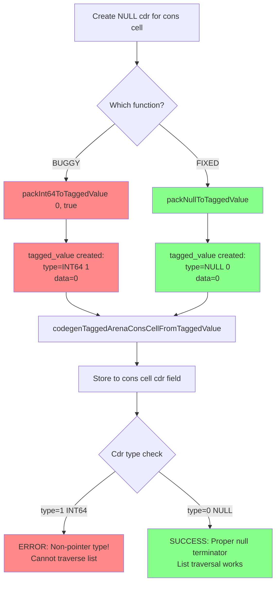
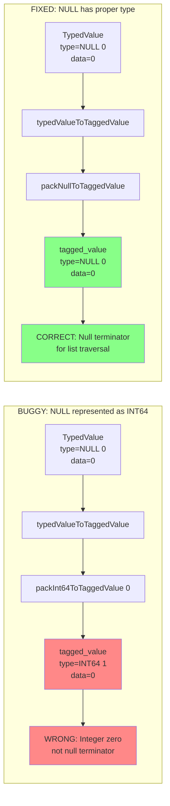
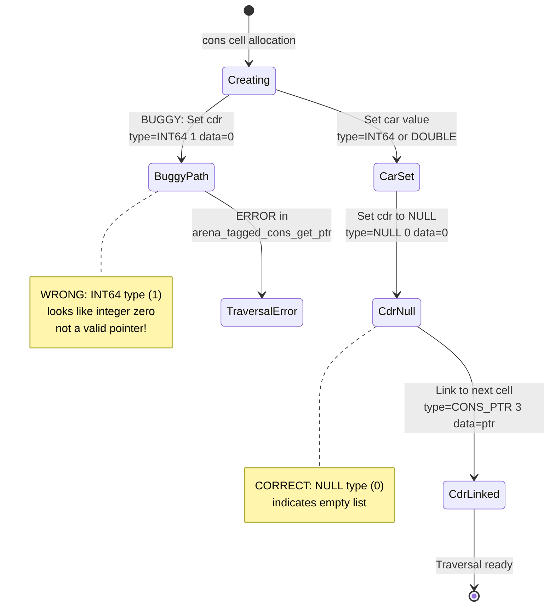
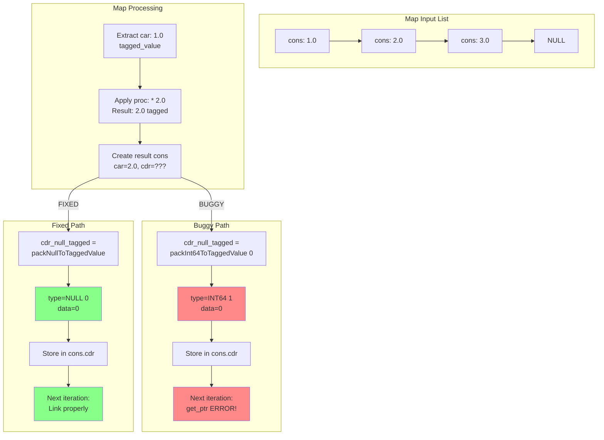
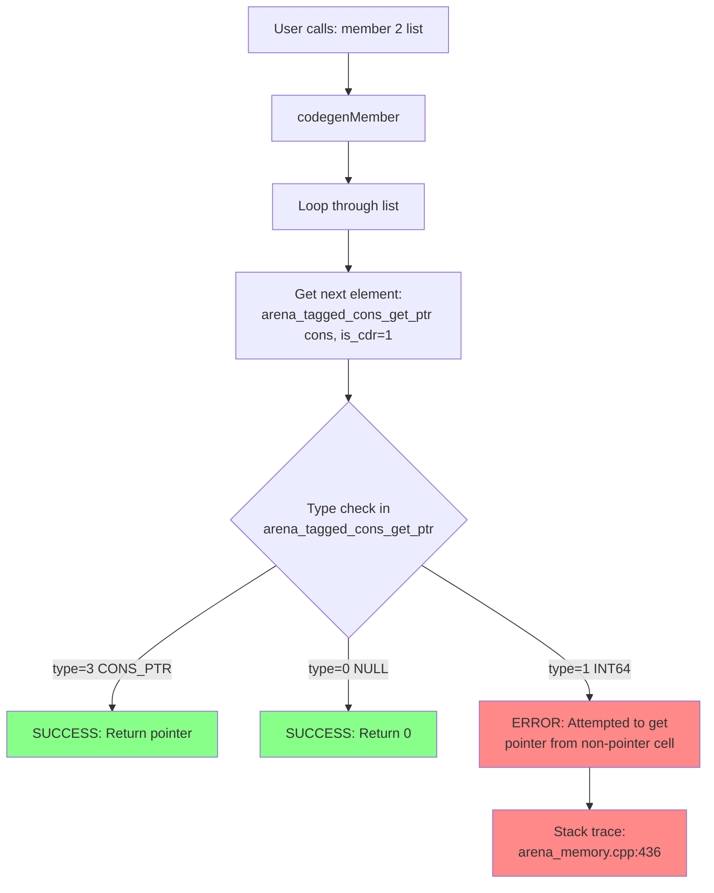
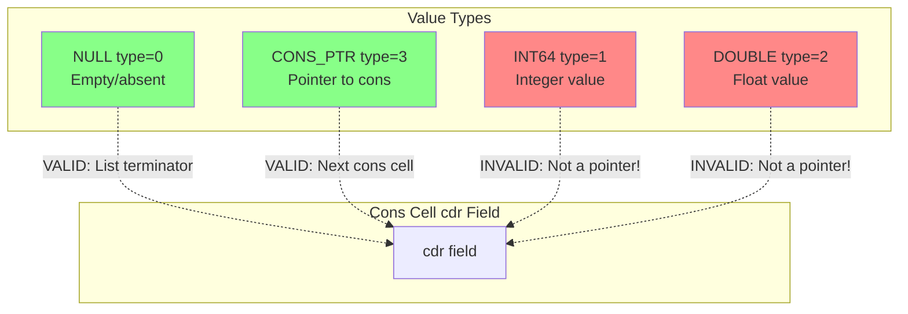
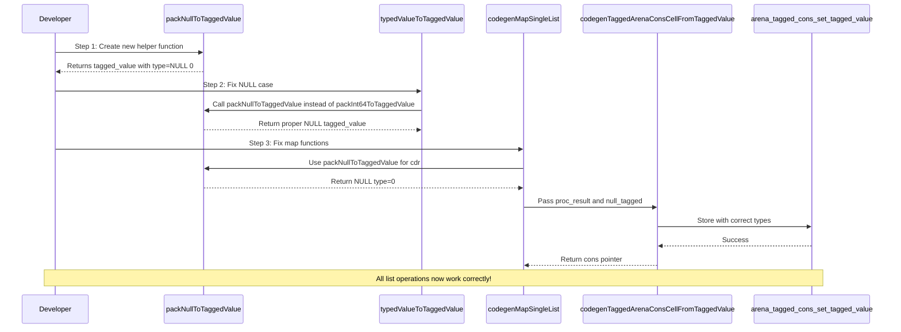

# Critical Bug: Type Encoding Architecture

## Bug Flow Diagram

## Type Semantic Distinction

## Cons Cell State Transitions

## Data Flow: Map Operation

## Function Call Stack at Error

## Type Hierarchy and Valid Transitions

## Fix Implementation Sequence

---

## Key Insights

### 1. Type Semantics Matter
- **NULL** (type=0): Represents "absence of value" - proper list terminator
- **INT64(0)** (type=1): Represents "integer with value zero" - a data value
- These are **semantically different** and must be encoded differently!

### 2. Phase 3B Transition Challenge
The Phase 3B refactoring introduced full `tagged_value` storage but didn't properly handle the NULL semantic. The old system used raw int64 where 0 was naturally null. The new system requires explicit type encoding.

### 3. Prevention Through Type Safety
The fix introduces a dedicated `packNullToTaggedValue()` helper that makes NULL creation explicit and type-safe, preventing future confusion between NULL and INT64(0).

---

## Success Criteria

After the fix, the following should work:

✅ **List Traversal**: All functions that walk through lists  
✅ **Member Search**: Find elements in multi-element lists  
✅ **List Slicing**: Take first N elements, drop first N elements  
✅ **Mixed Types**: Lists containing int64, double, and cons cells  
✅ **Higher-Order**: Map, filter, fold over polymorphic lists  

---

## Architecture Decision

**Decision**: Create dedicated helper functions for each semantic type:
- `packInt64ToTaggedValue()` - For integer data values
- `packDoubleToTaggedValue()` - For floating-point data values
- `packPtrToTaggedValue()` - For pointer values (cons cells, etc.)
- `packNullToTaggedValue()` - For null/empty/absent values ← **NEW**

This enforces **type safety at the API level** and prevents semantic confusion.