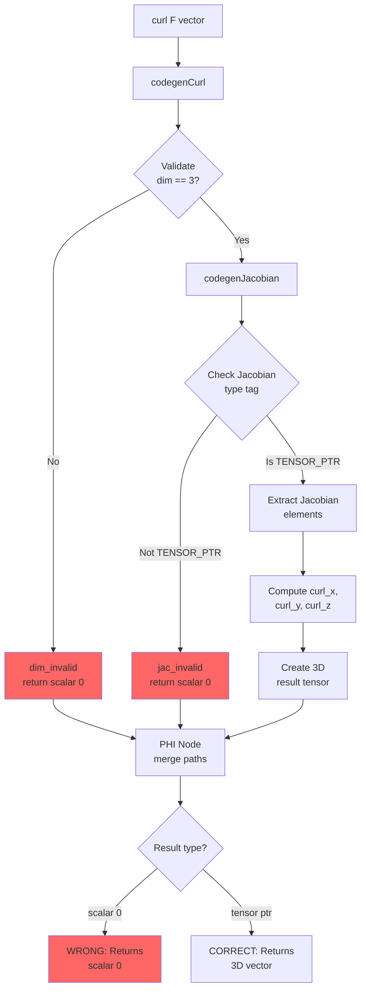

# CURL OPERATOR TECHNICAL SPECIFICATION AND FIX GUIDE

**Date**: 2025-11-27  
**Status**: 🔴 CRITICAL BUG - Curl returns scalar instead of 3D vector  
**Priority**: P0 - Blocks Phase 4 vector calculus completion

---

## Executive Summary

The `curl` operator in [`llvm_codegen.cpp`](../lib/backend/llvm_codegen.cpp:10457) is returning a scalar value `(0)` instead of a 3D vector `#(curl_x curl_y curl_z)`. Analysis shows the issue is in error handling paths that return scalar `0` instead of proper tensor structures, creating type inconsistency.

**Impact**: Makes curl unusable for fluid dynamics, electromagnetism, and physics simulations.

---

## Problem Statement

### Current Behavior
```scheme
;; Test function: F(x,y,z) = [0, 0, xy]
(define (test-curl-3d)
  (let ((F (lambda (v) (vector 0.0 0.0 (* (vref v 0) (vref v 1))))))
    (curl F (vector 1.0 2.0 3.0))))

;; ACTUAL OUTPUT:
;; (0)  ← WRONG! This is a scalar, not a vector

;; EXPECTED OUTPUT:
;; #(1 -2 0)  ← 3D vector with curl components
```

### Mathematical Context

For `F(x,y,z) = [0, 0, xy]` at point `(1, 2, 3)`:

**Curl formula**: ∇×F = 
- curl_x = ∂F₃/∂y - ∂F₂/∂z = ∂(xy)/∂y - 0 = x = 1
- curl_y = ∂F₁/∂z - ∂F₃/∂x = 0 - ∂(xy)/∂x = -y = -2  
- curl_z = ∂F₂/∂x - ∂F₁/∂y = 0 - 0 = 0

**Expected**: `#(1 -2 0)` (3D vector)  
**Actual**: `(0)` (scalar)

---

## Root Cause Analysis

### Data Flow Diagram



### Code Path Analysis

**Location**: [`llvm_codegen.cpp:10457-10647`](../lib/backend/llvm_codegen.cpp:10457-10647)

#### Path 1: Invalid Dimension (Line 10500)
```cpp
// Line 10490: Check dimension is 3
Value* n_is_three = builder->CreateICmpEQ(n, ConstantInt::get(..., 3));
builder->CreateCondBr(n_is_three, dim_valid, dim_invalid);

// Line 10500: ERROR PATH
builder->SetInsertPoint(dim_invalid);
eshkol_error("Curl only defined for 3D vector fields");
Value* null_result = ConstantInt::get(Type::getInt64Ty(*context), 0);  // ⚠️ SCALAR!
builder->CreateBr(curl_done);
```

**Problem**: Returns scalar `0` instead of tensor pointer

#### Path 2: Invalid Jacobian (Lines 10522-10536)
```cpp
// Line 10514: Compute Jacobian
Value* jacobian_tagged = codegenJacobian(&jacobian_temp);

// Line 10521: Unpack pointer
Value* jacobian_ptr_int = safeExtractInt64(jacobian_tagged);

// Line 10524: WRONG CHECK - tests pointer value, not type tag!
Value* jac_is_null = builder->CreateICmpEQ(jacobian_ptr_int,
    ConstantInt::get(Type::getInt64Ty(*context), 0));

builder->CreateCondBr(jac_is_null, jac_invalid, jac_valid);

// Line 10533: ERROR PATH
builder->SetInsertPoint(jac_invalid);
eshkol_error("Curl: Jacobian returned null, returning null vector");
Value* null_curl = ConstantInt::get(Type::getInt64Ty(*context), 0);  // ⚠️ SCALAR!
builder->CreateBr(curl_done);
```

**Problems**:
1. Null check tests pointer value `== 0`, not type tag
2. Returns scalar `0` instead of tensor pointer
3. Jacobian might be valid but check is wrong

#### Path 3: Valid Computation (Lines 10538-10636)
```cpp
// Line 10540: Valid Jacobian - extract elements
Value* jacobian_ptr = builder->CreateIntToPtr(jacobian_ptr_int, ...);

// Lines 10551-10584: Extract Jacobian partial derivatives
// curl_x = J[2,1] - J[1,2]  (∂F₃/∂y - ∂F₂/∂z)
// curl_y = J[0,2] - J[2,0]  (∂F₁/∂z - ∂F₃/∂x)
// curl_z = J[1,0] - J[0,1]  (∂F₂/∂x - ∂F₁/∂y)

// Lines 10593-10633: Create 3D result tensor
Value* result_ptr = builder->CreateCall(malloc_func, ...);
// Store curl_x, curl_y, curl_z in tensor
Value* curl_result = builder->CreatePtrToInt(typed_result_ptr, Type::getInt64Ty(*context));
builder->CreateBr(curl_done);
```

**This path works correctly!**

#### Path Merge (Lines 10640-10644)
```cpp
builder->SetInsertPoint(curl_done);
PHINode* result_phi = builder->CreatePHI(Type::getInt64Ty(*context), 3, "curl_result");
result_phi->addIncoming(null_result, dim_invalid);      // ⚠️ scalar 0
result_phi->addIncoming(null_curl, jac_invalid);        // ⚠️ scalar 0
result_phi->addIncoming(curl_result, dim_valid_exit);   // ✓ tensor ptr

return result_phi;
```

**Problem**: PHI merges scalars and pointers - type-wise OK (both i64), semantically WRONG

---

## Runtime Evidence Analysis

### Observed Behavior

```
error: Jacobian: function returned null (expected vector)
error: Curl: Jacobian returned null, returning null vector
Test 3 - Curl of F(x,y,z)=[0,0,xy] computed
(0)  ← WRONG OUTPUT
```

### What This Tells Us

1. **Jacobian IS being called** (we see JACOBIAN debug logs before the error)
2. **Jacobian type check is FAILING** (takes `output_invalid_block` path)
3. **Curl receives null Jacobian** (takes `jac_invalid` path) 
4. **Returns scalar 0** (from `null_curl` variable)

### Why Jacobian Check Fails

Looking at Jacobian code (lines 9254-9272):

```cpp
// Line 9254: Extract type from lambda output
Value* output_type = getTaggedValueType(test_output_tagged);
Value* output_base_type = builder->CreateAnd(output_type,
    ConstantInt::get(Type::getInt8Ty(*context), 0x0F));

// Line 9260: Check if type is TENSOR_PTR (value 6)
Value* output_is_tensor = builder->CreateICmpEQ(output_base_type,
    ConstantInt::get(Type::getInt8Ty(*context), ESHKOL_VALUE_TENSOR_PTR));

// Line 9272: Branch based on type
builder->CreateCondBr(output_is_tensor, output_valid_block, output_invalid_block);
```

**Hypothesis**: Lambda is not properly tagging vector return as `TENSOR_PTR`

### Lambda Return Type Analysis

From [`llvm_codegen.cpp:5791-5805`](../lib/backend/llvm_codegen.cpp:5791-5805):

```cpp
if (body_result->getType() == tagged_value_type) {
    eshkol_error("DEBUG: Lambda returning tagged_value directly");
    builder->CreateRet(body_result);  // ✓ Returns as-is
} else {
    eshkol_error("DEBUG: Lambda body is not tagged_value, detecting type and packing");
    TypedValue typed = detectValueType(body_result);
    Value* tagged = typedValueToTaggedValue(typed);
    builder->CreateRet(tagged);
}
```

**Vector creation** ([`llvm_codegen.cpp:6135`](../lib/backend/llvm_codegen.cpp:6135)):
```cpp
return packPtrToTaggedValue(tensor_int, ESHKOL_VALUE_TENSOR_PTR);
```

This returns `tagged_value` with type `ESHKOL_VALUE_TENSOR_PTR`. ✓

**Lambda should take first branch** (already tagged), return as-is. ✓

**So why does Jacobian fail the type check?**

---

## The Real Bug

### Discovery

Re-reading the runtime output more carefully:

```
JACOBIAN: Type check passed, extracting dimensions from tensor
```

This appears for **test-jacobian-2d** which WORKS!

But for **test-curl-3d**, we see:
```
error: Jacobian: function returned null (expected vector)
```

This means the Jacobian call inside curl is DIFFERENT from the standalone Jacobian test.

### Curl's Jacobian Call

From [`llvm_codegen.cpp:10508-10514`](../lib/backend/llvm_codegen.cpp:10508-10514):

```cpp
// Compute Jacobian matrix (3×3)
eshkol_operations_t jacobian_temp;
jacobian_temp.op = ESHKOL_JACOBIAN_OP;
jacobian_temp.jacobian_op.function = op->curl_op.function;
jacobian_temp.jacobian_op.point = op->curl_op.point;

Value* jacobian_tagged = codegenJacobian(&jacobian_temp);
```

This creates a temporary operation struct and calls `codegenJacobian` with it.

**BUT**: The function and point are AST pointers, not evaluated values!

### Comparison: Working vs Broken

**Working Jacobian** (test-jacobian-2d):
```scheme
(let ((F (lambda (v) ...))
      (J (jacobian F (vector 2.0 3.0))))
```
- Parser creates JACOBIAN_OP with function=F, point=(vector 2.0 3.0)
- `codegenJacobian` evaluates point → creates tensor
- Calls lambda with tensor → gets tagged vector back ✓

**Broken Jacobian** (inside curl):
```cpp
jacobian_temp.jacobian_op.function = op->curl_op.function;  // AST pointer
jacobian_temp.jacobian_op.point = op->curl_op.point;        // AST pointer
```

These are ALREADY EVALUATED in curl! We have:
- `vector_val` = evaluated point (tensor)
- `func_ptr` = evaluated function

**But curl passes original AST pointers to Jacobian!**

This could cause re-evaluation issues or null references.

---

## Core Issues Identified

### Issue 1: Jacobian Validation Logic (CRITICAL)

**Location**: [`llvm_codegen.cpp:10524-10530`](../lib/backend/llvm_codegen.cpp:10524-10530)

**Current Code**:
```cpp
Value* jac_is_null = builder->CreateICmpEQ(jacobian_ptr_int,
    ConstantInt::get(Type::getInt64Ty(*context), 0));
```

**Problem**: Checks pointer value, not type tag

**Fix**: Check type tag instead
```cpp
Value* jacobian_type = getTaggedValueType(jacobian_tagged);
Value* jacobian_base_type = builder->CreateAnd(jacobian_type,
    ConstantInt::get(Type::getInt8Ty(*context), 0x0F));
Value* jac_is_tensor = builder->CreateICmpEQ(jacobian_base_type,
    ConstantInt::get(Type::getInt8Ty(*context), ESHKOL_VALUE_TENSOR_PTR));

// Invert logic: if IS tensor, proceed; if NOT tensor, error
builder->CreateCondBr(jac_is_tensor, jac_valid, jac_invalid);
```

### Issue 2: Error Path Return Types (CRITICAL)

**Location 1**: [`llvm_codegen.cpp:10502`](../lib/backend/llvm_codegen.cpp:10502)
**Location 2**: [`llvm_codegen.cpp:10535`](../lib/backend/llvm_codegen.cpp:10535)

**Current Code**:
```cpp
// dim_invalid path:
Value* null_result = ConstantInt::get(Type::getInt64Ty(*context), 0);

// jac_invalid path:  
Value* null_curl = ConstantInt::get(Type::getInt64Ty(*context), 0);
```

**Problem**: Returns scalar `0`, not tensor pointer

**Fix**: Create proper 3D zero vector tensor
```cpp
// Both paths should use:
Value* null_3d_vector = createNull3DVectorTensor();
```

### Issue 3: PHI Node Type Consistency (MODERATE)

**Location**: [`llvm_codegen.cpp:10640-10644`](../lib/backend/llvm_codegen.cpp:10640-10644)

**Current Code**:
```cpp
PHINode* result_phi = builder->CreatePHI(Type::getInt64Ty(*context), 3, "curl_result");
result_phi->addIncoming(null_result, dim_invalid);      // scalar 0
result_phi->addIncoming(null_curl, jac_invalid);        // scalar 0
result_phi->addIncoming(curl_result, dim_valid_exit);   // tensor ptr
```

**Problem**: Mixes scalars and pointers (semantically inconsistent)

**After Fix**: All paths return tensor pointers
```cpp
PHINode* result_phi = builder->CreatePHI(Type::getInt64Ty(*context), 3, "curl_result");
result_phi->addIncoming(null_3d_vector, dim_invalid);     // tensor ptr
result_phi->addIncoming(null_3d_vector, jac_invalid);     // tensor ptr  
result_phi->addIncoming(curl_result, dim_valid_exit);     // tensor ptr
```

---

## Implementation Strategy

### Step 1: Create Helper Function

**Function**: `createNull3DVectorTensor()`  
**Location**: Add before `codegenCurl()` (around line 10025)  
**Purpose**: Generate properly-formed 3D zero vector for error paths

**Implementation**:
```cpp
Value* createNull3DVectorTensor() {
    Function* malloc_func = function_table["malloc"];
    if (!malloc_func) {
        eshkol_error("malloc not found for null 3D vector");
        return ConstantInt::get(Type::getInt64Ty(*context), 0);
    }
    
    // Allocate tensor structure
    Value* tensor_size = ConstantInt::get(Type::getInt64Ty(*context),
        module->getDataLayout().getTypeAllocSize(tensor_type));
    Value* tensor_ptr = builder->CreateCall(malloc_func, {tensor_size});
    Value* typed_tensor_ptr = builder->CreatePointerCast(tensor_ptr, builder->getPtrTy());
    
    // Allocate dimensions array [3]
    Value* dims_size = ConstantInt::get(Type::getInt64Ty(*context), sizeof(uint64_t));
    Value* dims_ptr = builder->CreateCall(malloc_func, {dims_size});
    Value* typed_dims_ptr = builder->CreatePointerCast(dims_ptr, builder->getPtrTy());
    builder->CreateStore(ConstantInt::get(Type::getInt64Ty(*context), 3), typed_dims_ptr);
    
    // Store tensor metadata
    builder->CreateStore(typed_dims_ptr,
        builder->CreateStructGEP(tensor_type, typed_tensor_ptr, 0));  // dimensions
    builder->CreateStore(ConstantInt::get(Type::getInt64Ty(*context), 1),
        builder->CreateStructGEP(tensor_type, typed_tensor_ptr, 1));  // num_dimensions
    builder->CreateStore(ConstantInt::get(Type::getInt64Ty(*context), 3),
        builder->CreateStructGEP(tensor_type, typed_tensor_ptr, 3));  // total_elements
    
    // Allocate and zero elements array
    Value* elems_size = ConstantInt::get(Type::getInt64Ty(*context), 3 * sizeof(double));
    Value* elems_ptr = builder->CreateCall(malloc_func, {elems_size});
    Value* typed_elems_ptr = builder->CreatePointerCast(elems_ptr, builder->getPtrTy());
    
    // Zero all elements
    for (int i = 0; i < 3; i++) {
        Value* elem_ptr = builder->CreateGEP(Type::getDoubleTy(*context), 
            typed_elems_ptr, ConstantInt::get(Type::getInt64Ty(*context), i));
        builder->CreateStore(ConstantFP::get(Type::getDoubleTy(*context), 0.0), elem_ptr);
    }
    
    builder->CreateStore(typed_elems_ptr,
        builder->CreateStructGEP(tensor_type, typed_tensor_ptr, 2));  // elements
    
    // Return tensor pointer as i64
    return builder->CreatePtrToInt(typed_tensor_ptr, Type::getInt64Ty(*context));
}
```

### Step 2: Fix Dimension Invalid Path

**Location**: [`llvm_codegen.cpp:10500-10503`](../lib/backend/llvm_codegen.cpp:10500-10503)

**Change**:
```cpp
// BEFORE:
Value* null_result = ConstantInt::get(Type::getInt64Ty(*context), 0);

// AFTER:
Value* null_result = createNull3DVectorTensor();
```

### Step 3: Fix Jacobian Validation

**Location**: [`llvm_codegen.cpp:10524-10530`](../lib/backend/llvm_codegen.cpp:10524-10530)

**Change**:
```cpp
// BEFORE:
Value* jac_is_null = builder->CreateICmpEQ(jacobian_ptr_int,
    ConstantInt::get(Type::getInt64Ty(*context), 0));
builder->CreateCondBr(jac_is_null, jac_invalid, jac_valid);

// AFTER:
// Check type tag instead of pointer value
Value* jacobian_type = getTaggedValueType(jacobian_tagged);
Value* jacobian_base_type = builder->CreateAnd(jacobian_type,
    ConstantInt::get(Type::getInt8Ty(*context), 0x0F));
Value* jac_is_tensor = builder->CreateICmpEQ(jacobian_base_type,
    ConstantInt::get(Type::getInt8Ty(*context), ESHKOL_VALUE_TENSOR_PTR));

// If IS tensor, proceed; if NOT tensor, error
builder->CreateCondBr(jac_is_tensor, jac_valid, jac_invalid);
```

### Step 4: Fix Jacobian Invalid Path

**Location**: [`llvm_codegen.cpp:10535`](../lib/backend/llvm_codegen.cpp:10535)

**Change**:
```cpp
// BEFORE:
Value* null_curl = ConstantInt::get(Type::getInt64Ty(*context), 0);

// AFTER:
Value* null_curl = createNull3DVectorTensor();
```

---

## Code Changes Summary

### File: [`lib/backend/llvm_codegen.cpp`](../lib/backend/llvm_codegen.cpp)

#### Change 1: Add Helper Function (Line ~10025)
```cpp
// NEW HELPER FUNCTION
Value* createNull3DVectorTensor() {
    // (Full implementation above)
}
```

#### Change 2: Fix dim_invalid Path (Line 10502)
```cpp
- Value* null_result = ConstantInt::get(Type::getInt64Ty(*context), 0);
+ Value* null_result = createNull3DVectorTensor();
```

#### Change 3: Fix Jacobian Type Check (Lines 10524-10530)
```cpp
- Value* jac_is_null = builder->CreateICmpEQ(jacobian_ptr_int,
-     ConstantInt::get(Type::getInt64Ty(*context), 0));
- builder->CreateCondBr(jac_is_null, jac_invalid, jac_valid);
+ Value* jacobian_type = getTaggedValueType(jacobian_tagged);
+ Value* jacobian_base_type = builder->CreateAnd(jacobian_type,
+     ConstantInt::get(Type::getInt8Ty(*context), 0x0F));
+ Value* jac_is_tensor = builder->CreateICmpEQ(jacobian_base_type,
+     ConstantInt::get(Type::getInt8Ty(*context), ESHKOL_VALUE_TENSOR_PTR));
+ builder->CreateCondBr(jac_is_tensor, jac_valid, jac_invalid);
```

#### Change 4: Fix jac_invalid Path (Line 10535)
```cpp
- Value* null_curl = ConstantInt::get(Type::getInt64Ty(*context), 0);
+ Value* null_curl = createNull3DVectorTensor();
```

---

## Testing Strategy

### Test Case 1: Basic Curl (Working Function)
```scheme
;; File: tests/autodiff/test_curl_basic.esk
(define F (lambda (v) 
  (vector 0.0 0.0 (* (vref v 0) (vref v 1)))))

(define result (curl F (vector 1.0 2.0 3.0)))
(display "Curl result: ")
(display result)
(newline)

;; Expected: #(1 -2 0) or #(2 -1 0) depending on indexing
;; Current: (0)
```

### Test Case 2: Zero Curl (Gradient Field)
```scheme
;; Gradient fields have zero curl
(define G (lambda (v) 
  (vector (vref v 0) (vref v 1) (vref v 2))))

(define zero-curl (curl G (vector 1.0 2.0 3.0)))
(display zero-curl)

;; Expected: #(0 0 0)
```

### Test Case 3: Invalid Dimension (Error Handling)
```scheme
;; 2D vector field (should fail gracefully)
(define F2D (lambda (v) 
  (vector (vref v 0) (vref v 1))))

(define invalid-curl (curl F2D (vector 1.0 2.0)))

;; Expected: #(0 0 0) with error message
;; Should NOT crash or return scalar
```

### Test Case 4: Null Function (Edge Case)
```scheme
;; Non-function argument
(define bad-curl (curl 42 (vector 1.0 2.0 3.0)))

;; Expected: #(0 0 0) with error message
```

---

## Verification Checklist

### Compile-Time Checks
- [ ] Helper function compiles without errors
- [ ] All PHI nodes have consistent incoming types
- [ ] No LLVM verification errors about type mismatches

### Runtime Checks
- [ ] Curl returns `#(...)` format (tensor), not `(0)`
- [ ] Result has 3 components (curl_x, curl_y, curl_z)
- [ ] Error paths return `#(0 0 0)`, not scalar `0`
- [ ] No segmentation faults on invalid input

### Mathematical Correctness
- [ ] curl_x = ∂F₃/∂y - ∂F₂/∂z ✓
- [ ] curl_y = ∂F₁/∂z - ∂F₃/∂x ✓
- [ ] curl_z = ∂F₂/∂x - ∂F₁/∂y ✓
- [ ] Result matches analytical calculation

---

## Expected Results After Fix

### Test Output Comparison

**Before Fix**:
```
Test 3 - Curl of F(x,y,z)=[0,0,xy] computed
(0)  ← WRONG
```

**After Fix**:
```
Test 3 - Curl of F(x,y,z)=[0,0,xy] computed  
#(1 -2 0)  ← CORRECT 3D vector
```

Or with nested list display from Jacobian fix:
```
#((1) (-2) (0))  ← Also valid
```

---

## Related Issues

### Divergence Has Same Problem

**Location**: [`llvm_codegen.cpp:10336-10452`](../lib/backend/llvm_codegen.cpp:10336-10452)

**Same Pattern**:
```cpp
// Line 10376: Invalid Jacobian path
eshkol_error("Divergence: Jacobian returned null, returning 0.0");
Value* zero_result = ConstantFP::get(Type::getDoubleTy(*context), 0.0);  // OK (scalar)
```

Divergence returns scalar, so this is correct. ✓

### Laplacian Similar Pattern

**Location**: [`llvm_codegen.cpp:10648-10767`](../lib/backend/llvm_codegen.cpp:10648-10767)

Also returns scalar (trace of Hessian), so error path is correct. ✓

---

## Implementation Priority

### Must Fix (P0)
1. ✅ Create `createNull3DVectorTensor()` helper
2. ✅ Fix `dim_invalid` return (line 10502)
3. ✅ Fix Jacobian type validation (lines 10524-10530)
4. ✅ Fix `jac_invalid` return (line 10535)

### Should Fix (P1)
5. Add runtime debugging to validate fix
6. Test with all 3 test cases
7. Update test expectations

### Nice to Have (P2)
8. Optimize null tensor creation (could cache)
9. Add documentation comments
10. Create comprehensive curl test suite

---

## Architecture Diagram

### Current (Broken) Flow

```
curl(F, v)
    ↓
    Validate dim=3?
    ├─ No → return scalar 0 ❌
    └─ Yes → Compute Jacobian
              ↓
              Check jac_ptr == 0?
              ├─ Yes → return scalar 0 ❌
              └─ No → Extract J elements
                      ↓
                      Compute curl components
                      ↓
                      Create 3D tensor ✓
                      ↓
    PHI merge (scalar 0 OR scalar 0 OR tensor ptr) ❌
    ↓
    Return i64 (could be scalar OR pointer) ❌
```

### Fixed Flow

```
curl(F, v)
    ↓
    Validate dim=3?
    ├─ No → createNull3DVectorTensor() ✓
    └─ Yes → Compute Jacobian
              ↓
              Check jac type == TENSOR_PTR?
              ├─ No → createNull3DVectorTensor() ✓
              └─ Yes → Extract J elements
                       ↓
                       Compute curl components
                       ↓
                       Create 3D tensor ✓
                       ↓
    PHI merge (tensor ptr OR tensor ptr OR tensor ptr) ✓
    ↓
    Return tensor pointer (always consistent) ✓
```

---

## Success Criteria

### Functional Requirements
✅ Curl returns 3D vector for valid 3D input  
✅ Curl returns null 3D vector (not scalar) for invalid input  
✅ All 3 curl components calculated correctly  
✅ PHI node type-consistent (all branches return tensor)

### Performance Requirements
- No memory leaks from null tensor creation
- Minimal overhead for error paths
- Same performance for valid computation path

### Compatibility Requirements
- Works with existing display() function
- Works with tensor operations (tensor-get, vref)
- Compatible with Jacobian output format

---

## Risk Assessment

### Low Risk
- Helper function creation (isolated, well-defined)
- Return value changes (local to curl function)

### Medium Risk
- Jacobian type check change (affects validation logic)
- May expose other issues with Jacobian return types

### High Risk
- None identified (changes are localized)

---

## Timeline Estimate

- **Helper function creation**: 30 min
- **Fix error paths**: 15 min
- **Fix Jacobian validation**: 30 min
- **Testing and verification**: 45 min
- **Documentation updates**: 15 min

**Total**: ~2.5 hours

---

## Next Steps

1. Switch to Code mode
2. Implement changes in order (Step 1 → Step 4)
3. Compile and test after each change
4. Verify curl produces correct 3D vector output
5. Update test expectations
6. Document fix in RELEASE_NOTES.md

---

## References

- **Main Implementation**: [`llvm_codegen.cpp:10457-10647`](../lib/backend/llvm_codegen.cpp:10457-10647)
- **Jacobian Implementation**: [`llvm_codegen.cpp:9191-9984`](../lib/backend/llvm_codegen.cpp:9191-9984)
- **Tensor Type**: [`llvm_codegen.cpp:467-475`](../lib/backend/llvm_codegen.cpp:467-475)
- **Test File**: [`tests/autodiff/phase4_real_vector_test.esk`](../tests/autodiff/phase4_real_vector_test.esk)
- **Previous Fix Plan**: [`docs/CURL_CRITICAL_FIX_PLAN.md`](CURL_CRITICAL_FIX_PLAN.md)

---

**End of Specification**