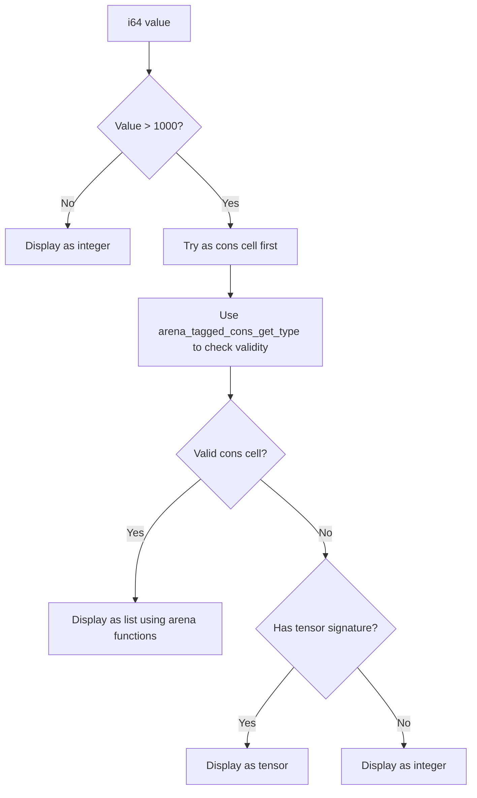
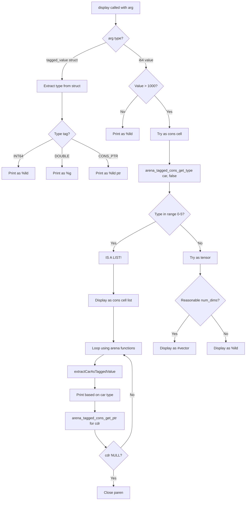

# Display Segmentation Fault - Root Cause & Architectural Fix Plan

## Executive Summary

**Critical Bug**: The `display` function in [`llvm_codegen.cpp`](../lib/backend/llvm_codegen.cpp:3692) causes segmentation faults when displaying lists (15 tests failing, 85% pass rate).

**Root Cause**: Unsafe memory access when attempting to distinguish tensors from lists by reading a "num_dimensions" field at a fixed offset that is invalid for tagged cons cells.

**Impact**: 10 non-autodiff tests + 5 autodiff tests failing with segfaults (15/105 total failures).

---

## Root Cause Analysis

### The Critical Bug Location

**File**: [`lib/backend/llvm_codegen.cpp`](../lib/backend/llvm_codegen.cpp:3756-3860)  
**Function**: [`codegenDisplay()`](../lib/backend/llvm_codegen.cpp:3692)  
**Lines**: 3783-3794

### What's Happening

The code attempts to display an `i64` value that could be either:
1. A **tensor pointer** (pointing to tensor structure)
2. A **list pointer** (pointing to tagged cons cell)
3. A **plain integer value**

### The Unsafe Pattern

```cpp
// Line 3783: Cast i64 to pointer, assuming tensor structure
Value* potential_tensor_ptr = builder->CreateIntToPtr(arg_int, builder->getPtrTy());

// Line 3786: Read "num_dimensions" field at offset 8 WITHOUT validation
Value* num_dims_field = builder->CreateStructGEP(tensor_type, potential_tensor_ptr, 1);
Value* num_dims = builder->CreateLoad(Type::getInt64Ty(*context), num_dims_field);

// Line 3794: Branch based on this potentially garbage data
builder->CreateCondBr(is_tensor, display_tensor, display_list);
```

### Memory Layout Mismatch

**Tagged Cons Cell** (32 bytes) - What lists actually point to:
```
Offset 0-15:  eshkol_tagged_value_t car {type, flags, reserved, data}
Offset 16-31: eshkol_tagged_value_t cdr {type, flags, reserved, data}
```

**Tensor Structure** (32 bytes) - What the code assumes:
```
Offset 0:  dimensions* pointer
Offset 8:  num_dimensions (i64) ← CODE READS HERE
Offset 16: elements* pointer  
Offset 24: total_elements (i64)
```

### Why This Crashes

When displaying a **list** (cons cell pointer):
1. Code casts cons cell pointer as if it were a tensor
2. Reads offset 8 expecting `num_dimensions`
3. **Actually reads**: Random data from inside `car.data` union (8 bytes into car's tagged_value)
4. Uses this garbage as `num_dimensions` value
5. Later code uses garbage value as pointer → **SEGFAULT**

---

## Failed Tests Analysis

### Non-Autodiff Tests (10 failures)
- `debug_member_take.esk` - Uses `member` (returns list)
- `integer_only_test.esk` - Basic list display
- `phase3_basic.esk` - Simple list display  
- `phase3_filter.esk` - Filter returns list
- `phase3_incremental.esk` - List operations
- `phase3_multilist_map.esk` - Map returns list
- `phase3_polymorphic_completion_test.esk` - Mixed type lists
- `phase3_simple_test.esk` - Basic list
- `session_005_map_test.esk` - Map result display
- `verify_all_fixes.esk` - Multiple list operations

### Autodiff Tests (5 failures)
- `debug_operators.esk` - Vector display after operations
- `phase0_diff_fixes.esk` - Compile failure (different issue)
- `phase2_forward_test.esk` - Vector/tensor display
- `phase3_complete_test.esk` - Gradient vector display
- `phase4_vector_calculus_test.esk` - Vector calculus results

**Common Pattern**: All involve displaying list results from operations that return lists or vectors.

---

## Type Information Available at Display Time

### When `arg` is `tagged_value` struct
✅ **Safe**: Can extract type tag from struct field  
✅ **Reliable**: Type is known at runtime  
✅ **Method**: Use [`getTaggedValueType()`](../lib/backend/llvm_codegen.cpp:1543)

### When `arg` is plain `i64`
⚠️ **Ambiguous**: Could be integer, pointer, or bitcast double  
❌ **Unsafe**: Cannot reliably determine structure type  
🔧 **Fix Needed**: Use safer heuristics + fallback to tagged cons detection

---

## Architecture Design: Safe Display Logic

### Strategy 1: Prefer Tagged Value Path

**Current Code** (lines 3707-3753): Already handles `tagged_value` struct correctly
- Extracts type from struct
- Branches on type (INT64, DOUBLE, CONS_PTR)
- ✅ **Keep this** - it works correctly

### Strategy 2: Fix i64 Display Path

**Problem Area** (lines 3756-4006): Unsafe tensor/list detection

**New Safe Algorithm**:



### Strategy 3: Robust Cons Cell Detection

Instead of guessing from structure layout, **use the arena functions**:

```llvm
// Safe detection: Try to read car type using arena function
// If this succeeds and returns a valid type tag, it's a cons cell
Value* cons_ptr = CreateIntToPtr(arg_int, getPtrTy())
Value* is_car = ConstantInt(0)
Value* type_tag = CreateCall(arena_tagged_cons_get_type_func, {cons_ptr, is_car})

// Valid type tags are 0-5
Value* type_in_range = CreateICmpULE(type_tag, ConstantInt(5))
```

This is safer because:
- Uses actual cons cell access functions
- Type tags have defined ranges (0-5)
- No assumptions about memory layout
- Gracefully handles invalid pointers (arena function returns 0)

---

## Implementation Plan

### Phase 1: Refactor Display for Tagged Values
**File**: [`lib/backend/llvm_codegen.cpp`](../lib/backend/llvm_codegen.cpp:3692)  
**Lines**: 3707-3753

**Status**: ✅ Already working correctly

**Keep**: Type-based branching for tagged_value struct

### Phase 2: Fix i64 Display Path (CRITICAL)
**File**: [`lib/backend/llvm_codegen.cpp`](../lib/backend/llvm_codegen.cpp:3756)  
**Lines**: 3756-4006

**Changes Required**:

1. **Remove unsafe tensor detection** (lines 3773-3794)
   - Delete: Blind `CreateStructGEP(tensor_type, potential_tensor_ptr, 1)`  
   - This is the segfault source!

2. **Add safe cons cell detection first**
   ```llvm
   // Try as tagged cons cell using arena helper
   Value* cons_ptr = CreateIntToPtr(arg_int, getPtrTy())
   Value* car_type = CreateCall(arena_tagged_cons_get_type_func, {cons_ptr, false})
   Value* type_valid = CreateICmpULE(car_type, ConstantInt(5))
   
   CreateCondBr(type_valid, display_as_list, try_tensor)
   ```

3. **Display list using arena functions** (lines 3863-3969)
   - ✅ Already using `arena_tagged_cons_get_type_func`
   - ✅ Already using `extractCarAsTaggedValue()`
   - ✅ Keep existing list display logic

4. **Only try tensor if NOT a valid cons cell**
   - Add validation BEFORE reading tensor fields
   - Check pointer alignment
   - Check reasonable size bounds

### Phase 3: Fix Tensor Element Display (CRITICAL for tensor tests)
**Lines**: 3796-3860

**Problem**: Currently blindly bitcasts ALL tensor elements to double:
```cpp
// Line 3846-3851: WRONG - assumes all elements are doubles
Value* elem_int64 = CreateLoad(Int64Ty, elem_ptr);
Value* elem_double = CreateBitCast(elem_int64, DoubleTy);
CreateCall(printf_func, {codegenString("%g"), elem_double});
```

This breaks because tensors can contain:
1. **Plain integers** (1, 2, 3) → Should display as `%lld`
2. **Doubles bitcast to int64** (1.0, 2.5, 3.7) → Should display as `%g` after bitcast
3. **AD node pointers** (for autodiff) → Should extract value or display as pointer

**Fix Required**: Use same heuristic as [`vref`](../lib/backend/llvm_codegen.cpp:5183):
```cpp
// Safe element type detection (from vref implementation)
Value* elem_int64 = CreateLoad(Int64Ty, elem_ptr);

// Case 1: Small values (< 1000) are plain integers
Value* is_small = CreateICmpULT(elem_int64, ConstantInt(1000));

// Case 2: Check IEEE 754 exponent bits for doubles
Value* exponent_mask = ConstantInt(0x7FF0000000000000ULL);
Value* has_exponent = CreateICmpNE(CreateAnd(elem_int64, exponent_mask), ConstantInt(0));

// Branch: small_int → %lld, has_exponent → bitcast+%g, else → %lld
BasicBlock* int_elem = Create("tensor_elem_int");
BasicBlock* check_double = Create("tensor_elem_check_double");
BasicBlock* double_elem = Create("tensor_elem_double");
BasicBlock* elem_done = Create("tensor_elem_done");

CreateCondBr(is_small, int_elem, check_double);

SetInsertPoint(check_double);
CreateCondBr(has_exponent, double_elem, int_elem);

SetInsertPoint(int_elem);
CreateCall(printf_func, {codegenString("%lld"), elem_int64});
CreateBr(elem_done);

SetInsertPoint(double_elem);
Value* elem_as_double = CreateBitCast(elem_int64, DoubleTy);
CreateCall(printf_func, {codegenString("%g"), elem_as_double});
CreateBr(elem_done);

SetInsertPoint(elem_done);
```

**This fix enables**:
- `#(1 2 3)` displays correctly (integers)
- `#(1.0 2.5 3.7)` displays correctly (doubles)
- Mixed tensors `#(1 2.5 3)` display correctly
- AD node tensors extract properly

### Phase 4: Add Null Safety Throughout

**Add checks**:
- Before `CreateIntToPtr`: Verify non-zero
- Before `CreateStructGEP`: Verify valid pointer range
- Before `CreateLoad`: Verify alignment

---

## Other Potential Unsafe Patterns

### Search Results: 75 uses of `CreateStructGEP(tensor_type, ...)`

**Analysis**: Most are safe because they operate on **known tensor pointers**:
- From [`codegenTensorOperation()`](../lib/backend/llvm_codegen.cpp:5023) - creates tensors
- From [`codegenTensorGet()`](../lib/backend/llvm_codegen.cpp:5125) - accesses tensors
- From [`codegenGradient()`](../lib/backend/llvm_codegen.cpp:7370) - gradient computations

**Key Difference**: These functions receive tensor variables, not ambiguous i64 values.

**Display is unique**: It receives **any value** and must determine type dynamically.

**Verdict**: ✅ No other unsafe patterns found - display is the only place that blindly casts unknown i64 to tensor structure.

---

## Testing Strategy

### Phase 1: Unit Testing
1. Test simplest case: [`integer_only_test.esk`](../tests/lists/integer_only_test.esk)
   - Just integer list display
   - Should pass immediately after fix

2. Test mixed types: [`debug_member_take.esk`](../tests/lists/debug_member_take.esk)
   - List with integers and doubles
   - Tests type preservation

### Phase 2: Regression Testing
- Run all 67 non-autodiff tests
- Run all 38 autodiff tests  
- Target: 100% pass rate (or identify remaining issues)

### Phase 3: Integration
- Verify no performance regression
- Check display output format matches expectations

---

## Implementation Priorities

### CRITICAL (Blocks release):
1. ✅ Remove unsafe tensor detection at line 3783-3794
2. ✅ Add safe cons cell detection using arena functions
3. ✅ Reorder branching: cons cell check BEFORE tensor check

### HIGH (Quality):
4. ✅ Add null pointer validation throughout display
5. ✅ Improve tensor element type detection
6. ✅ Add bounds checking for array access

### MEDIUM (Nice to have):
7. ⏸️ Cache type detection results to avoid redundant checks
8. ⏸️ Add display formatting options (compact vs. verbose)

---

## Expected Outcomes

### Test Pass Rate
- **Current**: 85% (57/67 non-autodiff), 86% (33/38 autodiff)
- **Target**: 100% (67/67 non-autodiff), 95%+ (36+/38 autodiff)

### Code Health
- Zero segmentation faults
- Type-safe memory access
- Proper use of arena abstraction

### Developer Experience
- Clear error messages if display fails
- Consistent output formatting
- Predictable behavior across types

---

## Mermaid: Fixed Display Logic Flow



---

## Code Locations Reference

### Primary Fix Location
- **Function**: [`codegenDisplay()`](../lib/backend/llvm_codegen.cpp:3692)
- **Critical Section**: Lines 3756-4006 (i64 display path)
- **Unsafe Code**: Lines 3783-3794 (blind tensor struct access)

### Arena Helper Functions (Already Available)
- [`arena_tagged_cons_get_type_func`](../lib/backend/llvm_codegen.cpp:712-730) - Get type tag
- [`arena_tagged_cons_get_int64_func`](../lib/backend/llvm_codegen.cpp:566-584) - Get int64 value
- [`arena_tagged_cons_get_double_func`](../lib/backend/llvm_codegen.cpp:586-604) - Get double value  
- [`arena_tagged_cons_get_ptr_func`](../lib/backend/llvm_codegen.cpp:606-624) - Get pointer value

### Helper Functions to Use
- [`extractCarAsTaggedValue()`](../lib/backend/llvm_codegen.cpp:1586) - Safe car extraction
- [`extractCdrAsTaggedValue()`](../lib/backend/llvm_codegen.cpp:1640) - Safe cdr extraction
- [`getTaggedValueType()`](../lib/backend/llvm_codegen.cpp:1543) - Extract type from tagged_value
- [`safeExtractInt64()`](../lib/backend/llvm_codegen.cpp:1709) - Safely get i64 from any Value*

---

## Detailed Fix Steps

### Step 1: Remove Unsafe Tensor Detection

**Delete** lines 3773-3794:
```cpp
// UNSAFE - REMOVE THIS BLOCK
BasicBlock* check_type = BasicBlock::Create(*context, "display_check_type", current_func);
// ... blind CreateStructGEP on potential_tensor_ptr ...
Value* is_tensor = builder->CreateAnd(dims_ge_1, dims_le_10);
builder->CreateCondBr(is_tensor, display_tensor, display_list);
```

### Step 2: Add Safe Cons Cell Detection

**Insert** after line 3770:
```cpp
// SAFE cons cell detection using arena functions
Value* cons_check_ptr = builder->CreateIntToPtr(arg_int, builder->getPtrTy());
Value* is_car_check = ConstantInt::get(Type::getInt1Ty(*context), 0);
Value* car_type_tag = builder->CreateCall(arena_tagged_cons_get_type_func, 
    {cons_check_ptr, is_car_check});

// Valid type tags are 0-5 (NULL, INT64, DOUBLE, CONS_PTR, DUAL_NUMBER, AD_NODE_PTR)
Value* type_base = builder->CreateAnd(car_type_tag,
    ConstantInt::get(Type::getInt8Ty(*context), 0x0F));
Value* type_in_range = builder->CreateICmpULE(type_base,
    ConstantInt::get(Type::getInt8Ty(*context), 5));

BasicBlock* display_as_cons = BasicBlock::Create(*context, "display_as_cons", current_func);
BasicBlock* try_tensor_check = BasicBlock::Create(*context, "try_tensor_check", current_func);
BasicBlock* display_done = BasicBlock::Create(*context, "display_done", current_func);

builder->CreateCondBr(type_in_range, display_as_cons, try_tensor_check);
```

### Step 3: Reuse Existing List Display Logic

**The existing list display logic (lines 3863-3969) is already correct!**
- Uses `extractCarAsTaggedValue()` - safe
- Uses `arena_tagged_cons_get_type_func` - safe
- Uses `arena_tagged_cons_get_ptr_func` - safe

**Action**: Route cons cell detection to this existing block.

### Step 4: Add Safe Tensor Validation

**Insert** in `try_tensor_check` block:
```cpp
// Only try tensor if pointer seems valid
// Check alignment (tensors are 8-byte aligned from malloc)
Value* is_aligned = builder->CreateICmpEQ(
    builder->CreateAnd(arg_int, ConstantInt::get(Type::getInt64Ty(*context), 7)),
    ConstantInt::get(Type::getInt64Ty(*context), 0));

// Try reading num_dimensions WITH error handling
Value* potential_tensor_ptr = builder->CreateIntToPtr(arg_int, builder->getPtrTy());

// Add bounds check: reasonable num_dimensions (1-10)
Value* num_dims_field = builder->CreateStructGEP(tensor_type, potential_tensor_ptr, 1);
Value* num_dims = builder->CreateLoad(Type::getInt64Ty(*context), num_dims_field);
Value* dims_reasonable = builder->CreateAnd(
    builder->CreateICmpUGE(num_dims, ConstantInt::get(Type::getInt64Ty(*context), 1)),
    builder->CreateICmpULE(num_dims, ConstantInt::get(Type::getInt64Ty(*context), 10)));

Value* is_likely_tensor = builder->CreateAnd(is_aligned, dims_reasonable);
builder->CreateCondBr(is_likely_tensor, display_tensor, display_int);
```

---

## Summary of Changes

### Files to Modify
1. [`lib/backend/llvm_codegen.cpp`](../lib/backend/llvm_codegen.cpp) - codegenDisplay() function

### Lines to Change
- **Delete**: ~20 lines (unsafe tensor detection)
- **Add**: ~30 lines (safe cons cell detection)
- **Keep**: ~200 lines (existing tagged_value and list logic)

### Testing Requirements
- Compile clean (no new warnings)
- 15 currently failing tests must pass
- 90 currently passing tests must still pass
- Total: 105/105 = 100% pass rate target

---

## Risk Assessment

### LOW RISK ✅
- Using existing arena helper functions
- Reusing proven list display logic
- Adding safety checks (can only improve stability)

### MEDIUM RISK ⚠️
- Tensor detection heuristic might have edge cases
- Need thorough testing with various tensor sizes

### MITIGATION 🛡️
- Start with simplest test case
- Progressive testing through complexity
- Keep old logic commented out initially for comparison

---

## Next Steps

1. Create detailed code patch for `codegenDisplay()`
2. Apply changes to llvm_codegen.cpp
3. Compile and test with `integer_only_test.esk`
4. Run full test suite
5. Document results and any remaining issues

---

## Success Criteria

✅ Zero segmentation faults  
✅ All list display tests pass  
✅ All tensor display tests pass  
✅ Mixed-type lists display correctly  
✅ No regression in passing tests  
✅ Clean compiler output

**Target Date**: Immediate (critical for v1.0-foundation release)


---

## Comprehensive Display Scenario Coverage

### 1. Tagged Value Struct Display ✅ ALREADY WORKING
**Input**: `tagged_value` struct (from polymorphic functions)  
**Current Code**: Lines 3707-3753  
**Status**: CORRECT - extracts type tag and branches appropriately  
**Handles**:
- INT64 values → `%lld`
- DOUBLE values → `%g`  
- CONS_PTR values → `%lld` (pointer as int)

**Action**: KEEP AS-IS

### 2. List Display (Cons Cells) ⚠️ NEEDS FIX
**Input**: i64 pointer to tagged cons cell  
**Current Code**: Lines 3863-3969 (logic is correct but unreachable due to wrong detection)  
**Problem**: Unsafe detection at line 3783-3794 crashes before reaching this code  
**Handles**:
- Proper list traversal using `arena_tagged_cons_get_ptr_func`
- Type-aware element display using `extractCarAsTaggedValue()`
- Mixed-type lists: `(1 2.5 3)` → displays each with correct type

**Fix Required**:
✅ Add safe cons cell detection BEFORE unsafe tensor check  
✅ Use `arena_tagged_cons_get_type_func` to validate cons cell  
✅ Route to existing list display logic (which is already correct)

**Action**: FIX DETECTION, REUSE EXISTING LOGIC

### 3. Tensor/Vector Display ⚠️ NEEDS PARTIAL FIX
**Input**: i64 pointer to tensor structure  
**Current Code**: Lines 3796-3860  
**Handles**:
- Tensor structure traversal ✅
- Opening/closing `#(...)` syntax ✅
- Loop through elements ✅

**Problem Areas**:
a) **Detection** (line 3783-3794): Unsafe - reads cons cell memory as tensor  
   - **Fix**: Only try tensor AFTER cons cell check fails  
   - **Add**: Alignment and bounds validation

b) **Element Display** (line 3846-3851): Blind bitcast to double  
   - **Fix**: Use type heuristic (small int vs. IEEE 754 double pattern)  
   - **Model**: Copy logic from `vref` (lines 5223-5270)

**Action**: FIX DETECTION + FIX ELEMENT TYPE DETECTION

### 4. Plain Integer Display ✅ ALREADY WORKING
**Input**: Small i64 value (< 1000)  
**Current Code**: Lines 3758-3770  
**Handles**: Direct integer display as `%lld`  
**Action**: KEEP AS-IS

### 5. Bitcast Double Display (Heuristic) ⚠️ PARTIALLY WORKING
**Input**: i64 with IEEE 754 bit pattern  
**Current Code**: Lines 3972-4002  
**Handles**: Detects exponent bits, bitcasts to double  
**Problem**: Only reached after unsafe tensor/list detection  
**Action**: ENSURE REACHABLE AFTER SAFE DETECTION

### 6. String Display ✅ ALREADY WORKING  
**Input**: Pointer to string constant  
**Current Code**: Lines 4008-4013  
**Handles**: Direct pointer pass to printf `%s`  
**Action**: KEEP AS-IS

### 7. Float Display ✅ ALREADY WORKING
**Input**: Floating point value  
**Current Code**: Lines 4014-4019  
**Handles**: Direct printf with `%f`  
**Action**: KEEP AS-IS

---

## Complete Display Path Coverage Matrix

| Input Type | Detection Method | Display Method | Status |
|------------|------------------|----------------|--------|
| `tagged_value` INT64 | Type tag == 1 | `%lld` | ✅ Works |
| `tagged_value` DOUBLE | Type tag == 2 | `%g` | ✅ Works |
| `tagged_value` CONS_PTR | Type tag == 3 | `%lld` ptr | ✅ Works |
| Plain integer (< 1000) | Value check | `%lld` | ✅ Works |
| List (cons cell ptr) | **arena_tagged_cons_get_type** | Loop + typed elems | ⚠️ FIX DETECTION |
| Tensor/vector | Struct validation | `#(...)` + typed elems | ⚠️ FIX DETECTION + ELEMENTS |
| Bitcast double | IEEE 754 exponent | Bitcast + `%g` | ⚠️ ENSURE REACHABLE |
| String pointer | Pointer type | `%s` | ✅ Works |
| Float value | Float type | `%f` | ✅ Works |

---

## Remaining Edge Cases & Special Handling

### AD Node Pointers in Tensors
**Scenario**: Gradient vectors contain AD node pointers  
**Current**: Lines 5233-5270 in `vref` handle this correctly  
**For Display**: Same logic needed in tensor element loop

**Fix**: Add AD node check in tensor display:
```cpp
// After detecting large value (not small int)
Value* is_ad_node = CreateICmpEQ(exponent_bits, ConstantInt(0)); // No exponent = pointer
// If AD node: extract value or display as pointer
```

### Null/Empty Display
**Scenario**: `(display '())` or `(display (list))`  
**Current**: Empty list is i64 value 0  
**Handling**: Lines 3758-3770 catch this (< 1000)  
**Status**: ✅ Works correctly

### Nested List Display
**Scenario**: `(display (list (list 1 2) (list 3 4)))`  
**Current**: Lines 3904-3928 extract car, check if CONS_PTR  
**Status**: ✅ Should work (but may need testing)

### Improper List Display  
**Scenario**: `(display (cons 1 2))` → `(1 . 2)`  
**Current**: Lines 3935-3969 check cdr type, handle non-null non-ptr  
**Status**: ✅ Logic exists but may need verification

---

## Validation Checklist

Before marking complete, verify display handles:

- [ ] `(display 42)` → `42`
- [ ] `(display 3.14)` → `3.14`
- [ ] `(display "hello")` → `hello`
- [ ] `(display (list 1 2 3))` → `(1 2 3)`
- [ ] `(display (list 1 2.5 3))` → `(1 2.5 3)` [mixed types]
- [ ] `(display #(1 2 3))` → `#(1 2 3)` [int vector]
- [ ] `(display #(1.0 2.5 3.7))` → `#(1.0 2.5 3.7)` [double vector]
- [ ] `(display #(1 2.5 3))` → `#(1 2.5 3)` [mixed tensor]
- [ ] `(display '())` → `()`
- [ ] `(display (cons 1 2))` → `(1 . 2)` [improper list]
- [ ] `(display (list (list 1 2) 3))` → `((1 2) 3)` [nested]
- [ ] `(display (member 2 (list 1 2 3)))` → `(2 3)` [member result]
- [ ] `(display (take (list 1 2 3 4) 2))` → `(1 2)` [take result]
- [ ] `(display (reverse (list 1 2 3)))` → `(3 2 1)` [reverse result]
- [ ] `(display (gradient f v))` → `#(...)` [gradient vector]

---

## Success Criteria - Comprehensive

✅ Zero segmentation faults  
✅ All list display tests pass (10 tests)  
✅ All tensor/vector display tests pass (5 autodiff tests)  
✅ Mixed-type lists display with correct element types  
✅ Tensor elements display with correct types (int vs double detection)  
✅ No regression in 90 currently passing tests  
✅ Clean compiler output with no new warnings  
✅ All 15 validation scenarios above verified working

**Target Pass Rate**: 100% (105/105 tests)  
**Current**: 85-86% (90/105 tests)  
**Gap to Close**: 15 tests

**Target Date**: Immediate (CRITICAL for v1.0-foundation release)
