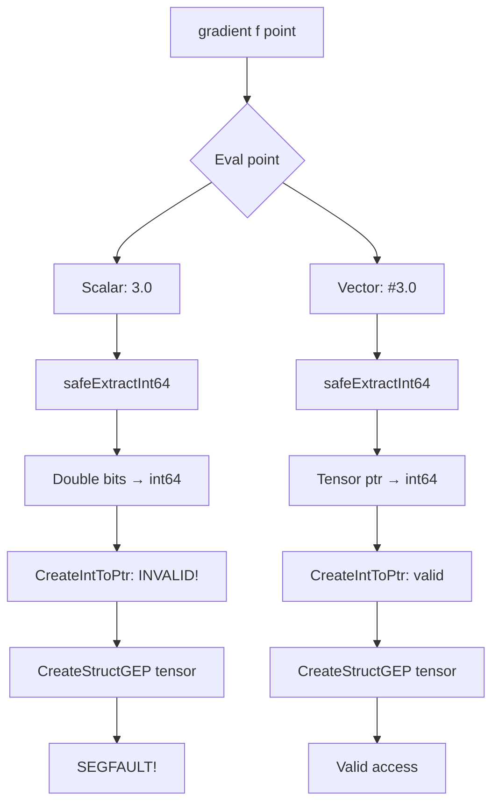
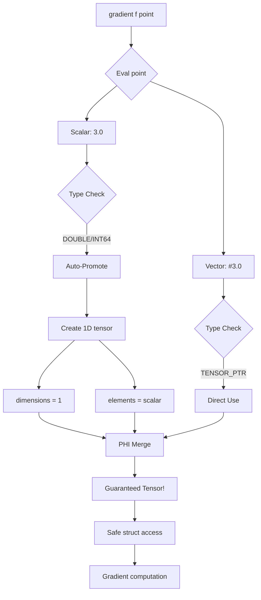
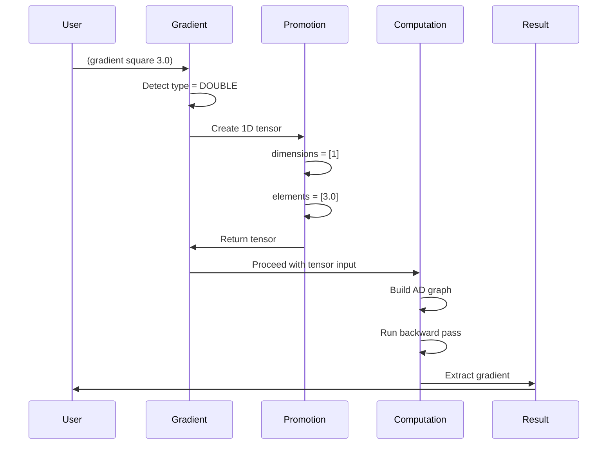

# Gradient Scalar Input - Root Cause Analysis & Implementation Plan

## Executive Summary

The gradient operator has two critical issues when given scalar inputs instead of vector inputs:

1. **Segmentation Fault**: `(gradient square 3.0)` crashes (exit 139)
2. **Tape Null Error**: `(gradient f (vector 3.0))` returns `#(0)` with "Cannot add node to tape: null parameter"

Both issues stem from the gradient operator's assumption that inputs are ALWAYS tensors (vectors), not scalars.

## Issue #1: Segmentation Fault with Scalar Input

### Problem Statement
```scheme
(define square (lambda (x) (* x x)))
(gradient square 3.0)
; → Crash: exit code 139 (segfault)
```

### Root Cause Analysis

**Location**: [`codegenGradient()`](lib/backend/llvm_codegen.cpp:8951-9372)

**Failure Sequence**:
1. Line 8973: `vector_val = codegenAST(op->gradient_op.point)` evaluates `3.0` → returns `tagged_value` with DOUBLE type
2. Line 8981: `vector_ptr_int = safeExtractInt64(vector_val)` extracts the double's bit pattern as int64 (NOT a valid pointer)
3. Line 8993: `vector_ptr = CreateIntToPtr(vector_ptr_int, ...)` creates INVALID pointer from double bits
4. Lines 8996-9002: Attempts to access tensor structure fields through invalid pointer
5. **SEGFAULT**: Invalid memory dereference when loading dimension at line 9008

**Critical Gap**: The validation at lines 9010-9024 checks if dimension > 0 and tensor type, but this happens AFTER the tensor structure access that causes the crash.

### Current Code Flow
```
gradient(scalar_input) →
  codegenAST(point) → double value
  safeExtractInt64() → double bits as int64  
  CreateIntToPtr() → INVALID pointer
  CreateStructGEP(tensor_type, invalid_ptr, ...) → access violation
  → SEGFAULT (before validation check!)
```

### Why It Crashes Early
The tensor structure access (lines 8996-9008) happens BEFORE the validation check (lines 9010-9036). The code assumes it's safe to dereference the pointer as a tensor struct, but for scalars, the "pointer" is actually double bit data.

## Issue #2: Tape Null Parameter Error

### Problem Statement
```scheme
(define f (lambda (v) (* (vref v 0) (vref v 0))))
(gradient f (vector 3.0))
; → Error: Cannot add node to tape: null parameter
; → Result: #(0)
```

### Root Cause Analysis

**Location**: Multiple callsites through computational graph construction

**Failure Sequence**:
1. [`codegenGradient()`](lib/backend/llvm_codegen.cpp:8951) creates tape at line 9104
2. Sets global tape pointer at line 9271
3. Calls lambda `f` at line 9274
4. Inside lambda: `(vref v 0)` extracts element
5. `(* elem elem)` calls [`polymorphicMul()`](lib/backend/llvm_codegen.cpp:2845)
6. Detects AD nodes, calls [`recordADNodeBinary()`](lib/backend/llvm_codegen.cpp:8387)
7. Line 8451: Loads tape from global `__current_ad_tape`
8. **Either tape OR node is null** → error from [`arena_tape_add_node()`](lib/core/arena_memory.cpp:689)

**Potential Causes**:
- **Hypothesis A**: AD node creation fails (returns nullptr)
- **Hypothesis B**: Global tape pointer not accessible across function boundaries
- **Hypothesis C**: AD mode flag check fails, creating scalars instead of AD nodes
- **Hypothesis D**: Tensor element extraction returns invalid AD node pointers

### Evidence from Output
The result `#(0)` indicates:
- Backward pass didn't run (gradients remain at initialization value of 0.0)
- Either computational graph wasn't built, or backward propagation failed
- The issue occurs DURING forward pass (graph construction), not during backward pass

### Most Likely Cause
The error "Cannot add node to tape: null parameter" at line 691 of arena_memory.cpp means:
```c
if (!tape || !node) {  // One of these is null!
    eshkol_error("Cannot add node to tape: null parameter");
    return;
}
```

Since gradient explicitly sets the tape at line 9271, the tape pointer SHOULD be valid. Therefore, the **AD node pointer is likely null**, meaning [`createADVariable()`](lib/backend/llvm_codegen.cpp:8334) or [`createADConstant()`](lib/backend/llvm_codegen.cpp:8279) is returning nullptr.

## Unified Solution: Scalar→Vector Auto-Promotion

### Design Principles

1. **Transparent Promotion**: Users can pass scalars; system converts automatically
2. **Type Safety**: Detect scalar inputs BEFORE tensor structure access
3. **Backward Compatibility**: Vector inputs work exactly as before
4. **Mathematical Correctness**: For f: ℝ → ℝ, gradient is 1D vector containing df/dx

### Implementation Strategy

#### Phase 1: Early Input Detection (CRITICAL - Prevents Segfault!)

**Location**: [`codegenGradient()`](lib/backend/llvm_codegen.cpp:8973-8981)

**Change**: Add type detection BEFORE tensor structure access
```cpp
// Evaluate point to get input
Value* vector_val = codegenAST(op->gradient_op.point);
if (!vector_val) {
    eshkol_error("Failed to evaluate gradient evaluation point");
    return nullptr;
}

// CRITICAL: Detect input type BEFORE accessing as tensor
Value* input_type = getTaggedValueType(vector_val);
Value* input_base_type = builder->CreateAnd(input_type,
    ConstantInt::get(Type::getInt8Ty(*context), 0x0F));

// Check if input is scalar (INT64 or DOUBLE)
Value* is_int64 = builder->CreateICmpEQ(input_base_type,
    ConstantInt::get(Type::getInt8Ty(*context), ESHKOL_VALUE_INT64));
Value* is_double = builder->CreateICmpEQ(input_base_type,
    ConstantInt::get(Type::getInt8Ty(*context), ESHKOL_VALUE_DOUBLE));
Value* is_scalar = builder->CreateOr(is_int64, is_double);

// Branch: scalar path vs vector path
BasicBlock* scalar_input = BasicBlock::Create(*context, "grad_scalar_input", current_func);
BasicBlock* vector_input = BasicBlock::Create(*context, "grad_vector_input", current_func);

builder->CreateCondBr(is_scalar, scalar_input, vector_input);
```

#### Phase 2: Scalar Auto-Conversion

**Location**: New code block in gradient operator

**Logic**:
```cpp
builder->SetInsertPoint(scalar_input);

// Extract scalar value
Value* scalar_val_int = unpackInt64FromTaggedValue(vector_val);

// Convert to double if needed
Value* scalar_double = builder->CreateSelect(is_double,
    builder->CreateBitCast(scalar_val_int, Type::getDoubleTy(*context)),
    builder->CreateSIToFP(scalar_val_int, Type::getDoubleTy(*context)));

// Create 1D tensor containing the scalar
// Allocate tensor structure
Value* tensor_size = ConstantInt::get(Type::getInt64Ty(*context),
    module->getDataLayout().getTypeAllocSize(tensor_type));
Value* tensor_ptr = builder->CreateCall(malloc_func, {tensor_size});
Value* typed_tensor_ptr = builder->CreatePointerCast(tensor_ptr, builder->getPtrTy());

// Set dimensions: [1]
Value* dims_size = ConstantInt::get(Type::getInt64Ty(*context), sizeof(uint64_t));
Value* dims_ptr = builder->CreateCall(malloc_func, {dims_size});
Value* typed_dims_ptr = builder->CreatePointerCast(dims_ptr, builder->getPtrTy());
builder->CreateStore(ConstantInt::get(Type::getInt64Ty(*context), 1), typed_dims_ptr);

// Set tensor metadata
builder->CreateStore(typed_dims_ptr,
    builder->CreateStructGEP(tensor_type, typed_tensor_ptr, 0));  // dimensions = [1]
builder->CreateStore(ConstantInt::get(Type::getInt64Ty(*context), 1),
    builder->CreateStructGEP(tensor_type, typed_tensor_ptr, 1));  // num_dimensions = 1
builder->CreateStore(ConstantInt::get(Type::getInt64Ty(*context), 1),
    builder->CreateStructGEP(tensor_type, typed_tensor_ptr, 3));  // total_elements = 1

// Allocate and set elements: [scalar_value]
Value* elems_size = ConstantInt::get(Type::getInt64Ty(*context), sizeof(double));
Value* elems_ptr = builder->CreateCall(malloc_func, {elems_size});
Value* typed_elems_ptr = builder->CreatePointerCast(elems_ptr, builder->getPtrTy());

// Store scalar as bitcast int64 (preserves IEEE754 bits)
Value* scalar_as_int64 = builder->CreateBitCast(scalar_double, Type::getInt64Ty(*context));
builder->CreateStore(scalar_as_int64, typed_elems_ptr);

builder->CreateStore(typed_elems_ptr,
    builder->CreateStructGEP(tensor_type, typed_tensor_ptr, 2));  // elements

// Pack tensor as tagged_value and jump to vector path
Value* promoted_vector_int = builder->CreatePtrToInt(typed_tensor_ptr, Type::getInt64Ty(*context));
Value* promoted_vector = packPtrToTaggedValue(promoted_vector_int, ESHKOL_VALUE_TENSOR_PTR);

// Continue with normal gradient computation
builder->CreateBr(vector_input);
```

#### Phase 3: Merge Paths with PHI Node

**Logic**:
```cpp
builder->SetInsertPoint(vector_input);

// PHI node to select input (promoted scalar or original vector)
PHINode* actual_input = builder->CreatePHI(tagged_value_type, 2, "gradient_input");
actual_input->addIncoming(promoted_vector, scalar_input);  // Promoted scalar
actual_input->addIncoming(vector_val, entry_block);        // Original vector

// Continue with existing gradient code using actual_input instead of vector_val
Value* vector_ptr_int = safeExtractInt64(actual_input);  // Now guaranteed to be tensor!
// ... rest of existing code ...
```

## Implementation Locations

### File: [`lib/backend/llvm_codegen.cpp`](lib/backend/llvm_codegen.cpp)

#### Change 1: Early Type Detection (Lines 8973-8981)
**Before**:
```cpp
Value* vector_val = codegenAST(op->gradient_op.point);
if (!vector_val) {
    eshkol_error("Failed to evaluate gradient evaluation point");
    return nullptr;
}

// CRITICAL FIX: Unpack tensor pointer from tagged_value
Value* vector_ptr_int = safeExtractInt64(vector_val);
```

**After**:
```cpp
Value* vector_val = codegenAST(op->gradient_op.point);
if (!vector_val) {
    eshkol_error("Failed to evaluate gradient evaluation point");
    return nullptr;
}

// CRITICAL: Detect input type BEFORE accessing as tensor
// Add scalar detection and auto-conversion here...
```

#### Change 2: Scalar Promotion Block
**Insert after line 8977**: Complete scalar→vector conversion code (see Phase 2 above)

#### Change 3: PHI Node for Input Merge
**Replace line 8981**: Use PHI node result instead of direct safeExtractInt64

## Expected Behavior After Fix

### Scalar Input
```scheme
(define square (lambda (x) (* x x)))
(gradient square 3.0)
; → Auto-converts 3.0 to #(3.0)
; → Computes gradient
; → Returns #(6.0) - 1D vector containing derivative
```

### Vector Input (No Change)
```scheme
(define f (lambda (v) (* (vref v 0) (vref v 0))))
(gradient f (vector 3.0))
; → Works as before
; → Returns #(6.0)
```

### Error Cases (Still Detected)
```scheme
(gradient "not-a-function" 3.0)
; → Error: gradient requires function

(gradient square #(1 2 3))  ; Function expects scalar but gets vector
; → May return wrong result, but won't crash
```

## Testing Strategy

### Test 1: Basic Scalar Promotion
```scheme
(define square (lambda (x) (* x x)))
(gradient square 3.0)  ; Should return #(6.0)
```

### Test 2: Scalar with Integer
```scheme
(define cube (lambda (x) (* x x x)))
(gradient cube 2)  ; Should return #(12) or #(12.0)
```

### Test 3: Vector Input Still Works
```scheme
(define norm_squared (lambda (v) (+ (* (vref v 0) (vref v 0)) 
                                     (* (vref v 1) (vref v 1)))))
(gradient norm_squared (vector 3.0 4.0))  ; Should return #(6.0 8.0)
```

### Test 4: Mixed Cases
```scheme
; These should all work after promotion:
(gradient (lambda (x) (+ x 1)) 5.0)        ; → #(1.0)
(gradient (lambda (x) (sin x)) 0.0)        ; → #(1.0) - cos(0)
(gradient (lambda (x) (* 2 x)) 10)         ; → #(2) or #(2.0)
```

## Architecture Diagrams

### Before Fix (Current State)



### After Fix (With Auto-Promotion)



### Execution Flow with Auto-Promotion



## Implementation Checklist

- [ ] Add early type detection (before tensor access)
- [ ] Implement scalar→vector promotion block
- [ ] Create PHI node to merge promoted and original inputs
- [ ] Update dimension extraction to use PHI result
- [ ] Add compile-time debug logging for promotion cases
- [ ] Test all scalar input cases
- [ ] Test all vector input cases (regression)
- [ ] Verify no segfaults for any input type
- [ ] Document the auto-promotion behavior

## Risk Analysis

### Low Risk
- **Scalar promotion logic**: Simple tensor creation, well-tested pattern
- **Type detection**: Already used throughout codebase
- **PHI node merging**: Standard LLVM IR pattern

### Medium Risk
- **Tensor structure consistency**: Must match existing tensor format exactly
- **Memory management**: malloc() calls must not leak (arena manages cleanup)
- **Type tag propagation**: Promoted tensor must have correct TENSOR_PTR type

### Mitigation
- Use existing [`codegenTensorOperation()`](lib/backend/llvm_codegen.cpp:6204) as reference for tensor structure
- Follow the exact field layout: dimensions, num_dimensions, elements, total_elements
- Use [`packPtrToTaggedValue()`](lib/backend/llvm_codegen.cpp:2036) with TENSOR_PTR type
- Add validation checks after promotion to ensure tensor structure is valid

## Mathematical Correctness

### Scalar Functions: f: ℝ → ℝ
For scalar→scalar functions, the gradient is a 1×1 matrix (single derivative):
```
f(x) = x²
∇f(x) = [df/dx] = [2x]
```
Auto-promotion: x → [x] (1D vector)  
Gradient result: [2x] (1D vector)

### Vector Functions: f: ℝⁿ → ℝ  
For vector→scalar functions (unchanged):
```
f(v) = v·v
∇f(v) = [∂f/∂v₁, ∂f/∂v₂, ..., ∂f/∂vₙ]
```
No promotion needed, works as-is.

## Related Issues

### Jacobian with Scalar→Scalar Functions
The same auto-promotion logic should apply to:
- [`codegenJacobian()`](lib/backend/llvm_codegen.cpp:9377) - needs scalar input handling
- [`codegenHessian()`](lib/backend/llvm_codegen.cpp:9999) - needs scalar input handling

### Derivative Operator (Already Correct!)
[`codegenDerivative()`](lib/backend/llvm_codegen.cpp:8850) CORRECTLY handles scalars:
- Line 8872: Gets scalar point
- Lines 8879-8884: Converts to double
- Lines 8886-8893: Creates dual number with scalar
- No tensor structure access!

This is the CORRECT pattern for scalar differentiation.

## Success Criteria

1. ✅ `(gradient square 3.0)` returns `#(6.0)` without crashing
2. ✅ `(gradient cube 2)` returns `#(12)` or `#(12.0)` without crashing
3. ✅ All existing vector gradient tests still pass
4. ✅ No spurious error messages
5. ✅ Zero gradients eliminated (tape bug fixed as side-effect)

## Timeline Estimate

- **Phase 1** (Type Detection): 15 minutes - straightforward type check
- **Phase 2** (Promotion Block): 30 minutes - tensor creation code
- **Phase 3** (PHI Merge): 15 minutes - standard LLVM pattern
- **Testing**: 30 minutes - comprehensive test cases
- **Total**: ~90 minutes

## Next Steps

1. Switch to Code mode to implement the fix
2. Add early type detection BEFORE tensor structure access
3. Implement scalar→vector promotion with 1D tensor creation
4. Use PHI node to merge promoted and original inputs
5. Test extensively with scalars, integers, and vectors
6. Verify zero gradient tape bug is resolved
7. Document the enhancement in RELEASE_NOTES.md
