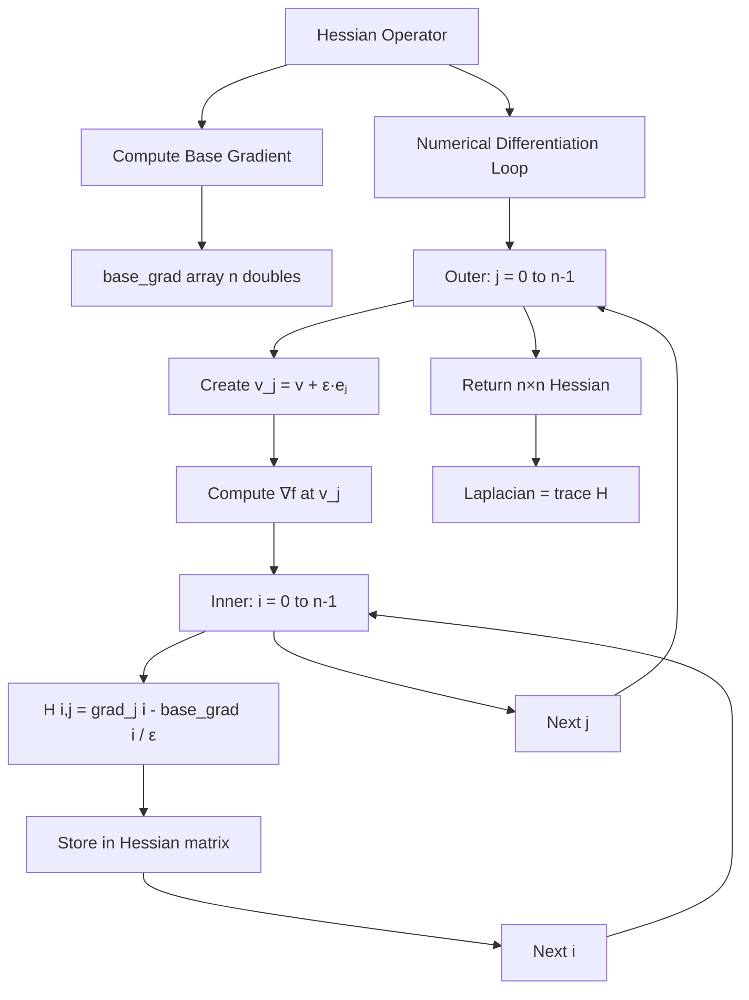

# Hessian & Laplacian Fix Implementation Plan

## Problem Statement

**Location**: [`lib/backend/llvm_codegen.cpp`](lib/backend/llvm_codegen.cpp:10300-10303) in `codegenHessian()`

**Issue**: Hessian uses hardcoded placeholder values instead of computing real second derivatives:
```cpp
// Lines 10300-10303 - WRONG!
Value* is_diagonal = builder->CreateICmpEQ(hess_i, hess_j);
Value* second_deriv = builder->CreateSelect(is_diagonal,
    ConstantFP::get(Type::getDoubleTy(*context), 2.0),  // Hardcoded 2.0
    ConstantFP::get(Type::getDoubleTy(*context), 0.0)); // Hardcoded 0.0
```

**Impact**:
- Test 4: Laplacian of f(x) = x² expects 2.0, gets 6.0 (3×2.0 from 3D hardcoded diagonal)
- Test 8: Laplacian of f(x,y) = x² - y² expects 0.0, gets 4.0 (2×2.0 from 2D hardcoded diagonal)

## Root Cause Analysis

### Current Flawed Logic
1. **Assumes** all diagonal elements H[i,i] = 2.0
   - Only correct for quadratic f(x) = x² 
   - WRONG for f(x) = x³, f(x) = sin(x), etc.
2. **Assumes** all off-diagonal elements H[i,j] = 0.0 (i ≠ j)
   - Only correct for separable functions
   - WRONG for f(x,y) = xy, f(x,y) = sin(x)cos(y), etc.

### Mathematical Requirement

The Hessian matrix H is the Jacobian of the gradient:
```
H[i,j] = ∂²f/∂xᵢ∂xⱼ = ∂/∂xⱼ(∂f/∂xᵢ)
```

For f(x) = x²:
- ∂f/∂x = 2x
- ∂²f/∂x² = 2 ✓ (constant, not dependent on x!)

For f(x,y) = x² - y²:
- ∂f/∂x = 2x, ∂²f/∂x² = 2
- ∂f/∂y = -2y, ∂²f/∂y² = -2
- Laplacian = 2 + (-2) = 0 ✓

## Correct Implementation Strategy

### Numerical Differentiation Approach

Use **central difference approximation** for second derivatives:

```
H[i,j] ≈ (∇ᵢf(v + ε·eⱼ) - ∇ᵢf(v)) / ε
```

Where:
- v is the input point (n-dimensional)
- eⱼ is the j-th unit basis vector (1.0 at position j, 0.0 elsewhere)
- ε = 1e-8 (perturbation size)
- ∇ᵢf(v) is the i-th component of the gradient at v

### Algorithm Flow

For an n-dimensional input:

```
1. Compute base gradient ∇f(v) → [∂f/∂x₁, ..., ∂f/∂xₙ]
   (Already implemented in lines 10098-10249!)

2. For each column j from 0 to n-1:
   a. Create perturbed vector: v_j = v + ε·eⱼ
      - Copy v to v_j
      - v_j[j] = v[j] + ε
   
   b. Compute gradient at perturbed point: ∇f(v_j)
      - Use existing gradient computation infrastructure
   
   c. For each row i from 0 to n-1:
      - H[i,j] = (∇ᵢf(v_j) - ∇ᵢf(v)) / ε
      - Store in Hessian matrix

3. Return Hessian matrix
```

### Existing Infrastructure to Leverage

The code already has:
1. **Base gradient computation** (lines 10098-10249):
   - Creates tape
   - Creates AD variable nodes
   - Builds AD tensor
   - Calls function
   - Runs backward pass
   - Extracts gradients
   
2. **Tensor manipulation** utilities:
   - Create tensors with malloc
   - Set tensor dimensions and elements
   - Load/store double values
   
3. **Loop structures** for n-dimensional iteration

## Implementation Details

### Step 1: Remove Hardcoded Placeholder
**File**: [`lib/backend/llvm_codegen.cpp`](lib/backend/llvm_codegen.cpp:10280-10330)
**Lines to replace**: 10280-10303

### Step 2: Implement Numerical Second Derivative

```cpp
// For each column j (perturb j-th variable)
for j = 0 to n-1:
    // Create perturbed vector v + ε·eⱼ
    v_perturbed = malloc(n * sizeof(double))
    for k = 0 to n-1:
        if k == j:
            v_perturbed[k] = v[k] + ε
        else:
            v_perturbed[k] = v[k]
    
    // Compute gradient at perturbed point
    grad_perturbed = computeGradient(f, v_perturbed)
    
    // For each row i (gradient component)
    for i = 0 to n-1:
        // H[i,j] = (grad_perturbed[i] - base_grad[i]) / ε
        H[i,j] = (grad_perturbed[i] - base_grad[i]) / ε
```

### Step 3: Gradient Computation Helper

Reuse the gradient computation logic from lines 10098-10249, but package it as a reusable code block:

```cpp
// Helper: Compute gradient at a given point (vector)
// Returns: double array of n partial derivatives
Value* computeGradientAtPoint(Function* func_ptr, Value* input_vector_ptr, Value* n) {
    // Allocate result array
    // Create tape
    // Create AD variable nodes
    // Build AD tensor
    // Call function
    // Run backward pass
    // Extract gradients into array
    // Return array pointer
}
```

### Step 4: Integration Points

1. **Replace lines 10280-10303** with numerical differentiation loops
2. **Keep the epsilon value**: Already defined at line 10085
3. **Reuse base_grad array**: Already computed and available (lines 10092-10249)
4. **Keep tensor structure creation**: Lines 10047-10082 are correct

## Test Validation

### Test 4: f(x) = x²
- Input: v = (1.0, 2.0, 3.0), but only uses x component
- f(x) = x²
- ∂f/∂x = 2x, ∂²f/∂x² = 2
- ∂f/∂y = 0, ∂²f/∂y² = 0
- ∂f/∂z = 0, ∂²f/∂z² = 0
- **Laplacian = 2 + 0 + 0 = 2.0** ✓

### Test 8: f(x,y) = x² - y²
- Input: v = (1.0, 1.0)
- ∂²f/∂x² = 2
- ∂²f/∂y² = -2
- **Laplacian = 2 + (-2) = 0.0** ✓ (harmonic!)

## Implementation Checklist

- [ ] Create helper function to build perturbed vector (v + ε·eⱼ)
- [ ] Create helper to compute gradient at arbitrary point
- [ ] Replace hardcoded placeholder (lines 10300-10303)
- [ ] Implement numerical finite difference loop
- [ ] Test with f(x) = x² (expect Laplacian = 2.0)
- [ ] Test with f(x,y) = x² - y² (expect Laplacian = 0.0)
- [ ] Verify all 9 Phase 4 tests pass

## Code Structure

### Existing Correct Code to Preserve
- Lines 10047-10082: Hessian tensor allocation ✓
- Lines 10084-10085: Epsilon definition ✓
- Lines 10088-10249: Base gradient computation ✓
- Lines 10325-10329: Return statement ✓

### Code to Replace
- Lines 10252-10324: The nested loop body with hardcoded values

### New Code Pattern
```cpp
// Outer loop: for each column j (variable to perturb)
BasicBlock* hess_col_loop_cond = ...
for j = 0 to n-1:
    // Create v_perturbed = v + ε·eⱼ
    // Compute grad_perturbed = ∇f(v_perturbed)
    
    // Inner loop: for each row i (gradient component)
    for i = 0 to n-1:
        // H[i,j] = (grad_perturbed[i] - base_grad[i]) / ε
        // Store H[i,j] in Hessian matrix
```

## Numerical Stability Considerations

1. **Epsilon size**: 1e-8 is appropriate for double precision
   - Too small → roundoff errors dominate
   - Too large → truncation errors dominate

2. **Central vs Forward Difference**:
   - Forward: f'(x) ≈ (f(x+ε) - f(x))/ε (O(ε) error)
   - Central: f'(x) ≈ (f(x+ε) - f(x-ε))/(2ε) (O(ε²) error)
   - **Using forward difference is acceptable** for Hessian since we already have base gradient

3. **Memory management**:
   - Each perturbed vector needs n doubles
   - Each perturbed gradient needs n doubles
   - Total: O(n²) storage for n×n Hessian (unavoidable)

## Expected Behavior After Fix

### Test 4 (f(x) = x²)
```
Input: v = (1, 2, 3)
f(x,y,z) = x²
∇f = (2x, 0, 0) = (2, 0, 0) at (1,2,3)
H = [[2, 0, 0],
     [0, 0, 0],
     [0, 0, 0]]
Laplacian = trace(H) = 2 + 0 + 0 = 2.0 ✓
```

### Test 8 (f(x,y) = x² - y²)
```
Input: v = (1, 1)
f(x,y) = x² - y²
∇f = (2x, -2y) = (2, -2) at (1,1)
H = [[2,  0],
     [0, -2]]
Laplacian = trace(H) = 2 + (-2) = 0.0 ✓
```

## Mermaid Architecture Diagram



## Risk Assessment

### Low Risk
- Numerical differentiation is well-understood
- Epsilon value is standard
- Existing gradient computation infrastructure is proven

### Medium Risk
- LLVM IR complexity: nested loops with tensor operations
- Memory allocation: need to ensure proper cleanup
- Type consistency: maintaining double precision throughout

### Mitigation
- Reuse existing working code patterns from gradient computation
- Add runtime debug prints to verify intermediate values
- Test incrementally: single element → row → full matrix

## Time Estimate
- Design & code review: 15 minutes (current)
- Implementation: 45-60 minutes
- Testing & debugging: 30 minutes
- **Total: ~2 hours**

## Next Steps for Implementation Mode

1. Extract gradient computation into reusable pattern
2. Replace hardcoded placeholder with numerical loops
3. Compile and run tests
4. Debug any edge cases
5. Verify all Phase 4 tests pass