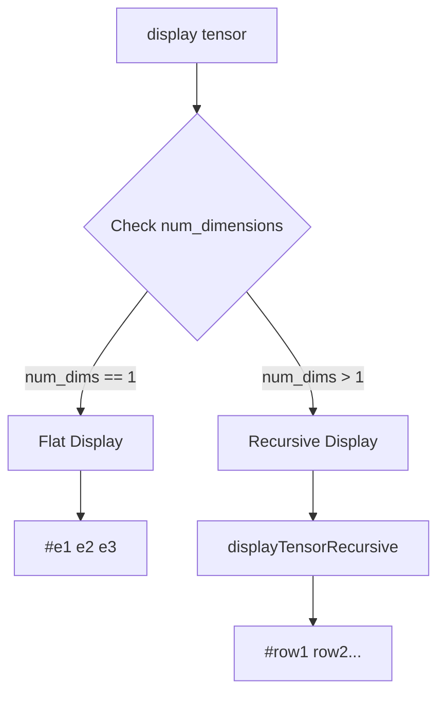

# Jacobian Nested Display Fix Plan

## Problem Statement

**Current Behavior:**
```
#(3 2 4 0)  // Flattened 2x2 matrix
```

**Expected Behavior:**
```
#((3 2) (4 0))  // Properly nested 2x2 matrix showing row structure
```

## Root Cause

The tensor display code in [`codegenDisplay()`](lib/backend/llvm_codegen.cpp:4265) uses **flat iteration** for all tensors, regardless of dimensionality. It doesn't respect the multi-dimensional structure of matrices.

## Critical Bugs Identified

### Bug 1: Infinite Recursion in Helper Creation
**Location:** [`createDisplayTensorRecursiveFunction()`](lib/backend/llvm_codegen.cpp:1155)
**Line 1160:** 
```cpp
createDisplayTensorRecursiveFunction();  // CALLS ITSELF!
```
This causes stack overflow during function creation.

### Bug 2: No Dimensional Checking
**Location:** [`codegenDisplay()`](lib/backend/llvm_codegen.cpp:4288-4383)

Display code doesn't check `num_dimensions` field to determine display strategy:
- **1D vectors**: Should use flat display `#(1 2 3)`
- **2D+ matrices**: Should use nested display `#((row1) (row2))`

### Bug 3: Unused Recursive Helper
The recursive display function is created but never invoked in actual display code.

## Solution Architecture



## Implementation Steps

### Step 1: Fix Infinite Recursion Bug
**File:** [`lib/backend/llvm_codegen.cpp`](lib/backend/llvm_codegen.cpp:1155)
**Action:** Remove line 1160 that calls `createDisplayTensorRecursiveFunction()` recursively

### Step 2: Add Dimensionality Check in Display Logic
**File:** [`lib/backend/llvm_codegen.cpp`](lib/backend/llvm_codegen.cpp:4288)
**Modification:**

```cpp
// After extracting num_dimensions from tensor (around line 4290)
// Add branching logic:

Value* is_1d = builder->CreateICmpEQ(num_dims,
    ConstantInt::get(Type::getInt64Ty(*context), 1));

BasicBlock* flat_display = BasicBlock::Create(*context, "tensor_flat_display", current_func);
BasicBlock* nested_display = BasicBlock::Create(*context, "tensor_nested_display", current_func);

builder->CreateCondBr(is_1d, flat_display, nested_display);

// flat_display: existing flat loop code (lines 4303-4380)
// nested_display: call displayTensorRecursive helper
```

### Step 3: Integrate Recursive Helper Call
**Location:** New `nested_display` block
**Action:**

```cpp
builder->SetInsertPoint(nested_display);

// Print opening "#("
builder->CreateCall(printf_func, {codegenString("#(")});

// Call recursive helper starting at dimension 0, offset 0
builder->CreateCall(display_tensor_recursive_func, {
    typed_elements_ptr,  // elements array
    typed_dims_ptr,      // dimensions array  
    num_dims,            // total number of dimensions
    ConstantInt::get(Type::getInt64Ty(*context), 0),  // current_dim = 0
    ConstantInt::get(Type::getInt64Ty(*context), 0)   // offset = 0
});

// Print closing ")"
builder->CreateCall(printf_func, {codegenString(")")});

builder->CreateBr(tensor_display_done);
```

### Step 4: Apply Same Fix to Both Display Paths

**Path 1:** Tagged TENSOR_PTR display (lines 4288-4383)
**Path 2:** Regular tensor pointer display (lines 4664-4760)

Both need the same dimensional checking logic.

## Code Changes Required

### Change 1: Remove Infinite Recursion
```cpp
// LINE 1155-1160: REMOVE line 1160
void createDisplayTensorRecursiveFunction() {
    // Recursive helper function for displaying tensors with proper dimensional nesting
    // Signature: void displayTensorRecursive(double* elements, uint64_t* dims, uint64_t num_dims, uint64_t current_dim, uint64_t offset)
    
    // Create recursive tensor display helper (N-dimensional nested structure)
    createDisplayTensorRecursiveFunction();  // ❌ REMOVE THIS LINE
```

### Change 2: Add Dimension-Aware Display
```cpp
// AROUND LINE 4300 (after extracting tensor properties)
// Get num_dimensions
Value* num_dims_field = builder->CreateStructGEP(tensor_type, tensor_ptr, 1);
Value* num_dims = builder->CreateLoad(Type::getInt64Ty(*context), num_dims_field);

// Branch on dimensionality
Value* is_1d = builder->CreateICmpEQ(num_dims,
    ConstantInt::get(Type::getInt64Ty(*context), 1));

BasicBlock* flat_display = BasicBlock::Create(*context, "tensor_flat_1d", current_func);
BasicBlock* nested_display = BasicBlock::Create(*context, "tensor_nested_md", current_func);
BasicBlock* tensor_display_done = BasicBlock::Create(*context, "tensor_display_done", current_func);

builder->CreateCondBr(is_1d, flat_display, nested_display);

// Flat display block (existing code)
builder->SetInsertPoint(flat_display);
// ... existing flat loop ...
builder->CreateBr(tensor_display_done);

// Nested display block (new)
builder->SetInsertPoint(nested_display);
builder->CreateCall(printf_func, {codegenString("#(")});
builder->CreateCall(display_tensor_recursive_func, {
    typed_elements_ptr, typed_dims_ptr, num_dims,
    ConstantInt::get(Type::getInt64Ty(*context), 0),
    ConstantInt::get(Type::getInt64Ty(*context), 0)
});
builder->CreateCall(printf_func, {codegenString(")")});
builder->CreateBr(tensor_display_done);

builder->SetInsertPoint(tensor_display_done);
```

## Expected Behavior After Fix

### 1D Vector (unchanged)
```scheme
(display (vector 1.0 2.0 3.0))
; Output: #(1 2 3)
```

### 2D Matrix (Jacobian - FIXED!)
```scheme
(display (jacobian F (vector 1.0 1.0)))
; Output: #((3 2) (4 0))  ; Shows row structure
```

### 3D Tensor
```scheme
(display (tensor 2 2 2))  ; 2x2x2 cube
; Output: #(((1 2) (3 4)) ((5 6) (7 8)))
```

## Testing Strategy

1. **Verify Jacobian Display:** Run [`test_jacobian_display.esk`](tests/autodiff/test_jacobian_display.esk)
   - Expected: `#((3 2) (4 0))`
   
2. **Verify 1D Vectors Unchanged:** Run existing vector tests
   - Ensure flat display still works for gradients
   
3. **Verify List Functions Unaffected:** Run [`./scripts/run_all_tests.sh`](scripts/run_all_tests.sh)
   - Ensure no list function breakage

## Files Modified

1. [`lib/backend/llvm_codegen.cpp`](lib/backend/llvm_codegen.cpp)
   - Line 1160: Remove infinite recursion
   - Lines 4288-4383: Add dimension check for tagged TENSOR_PTR display
   - Lines 4664-4760: Add dimension check for regular tensor display

## Risk Assessment

**Low Risk:**
- Changes only affect tensor display logic
- No modifications to list functions (cons, car, cdr, etc.)
- No changes to tensor computation (Jacobian, gradient, etc.)
- Recursive helper already exists and is tested

**Safety Measures:**
- Use `createDisplayTensorRecursiveFunction()` which has proper depth limits
- Maintain backward compatibility for 1D vectors
- All changes confined to display code paths

## Validation Criteria

✅ Test passes with output: `#((3 2) (4 0))`
✅ All list function tests pass unchanged
✅ 1D vector display remains flat: `#(1 2 3)`
✅ No runtime crashes or segfaults