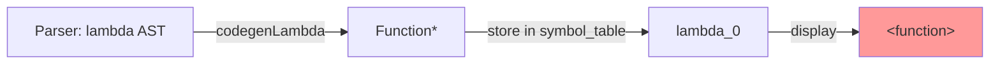
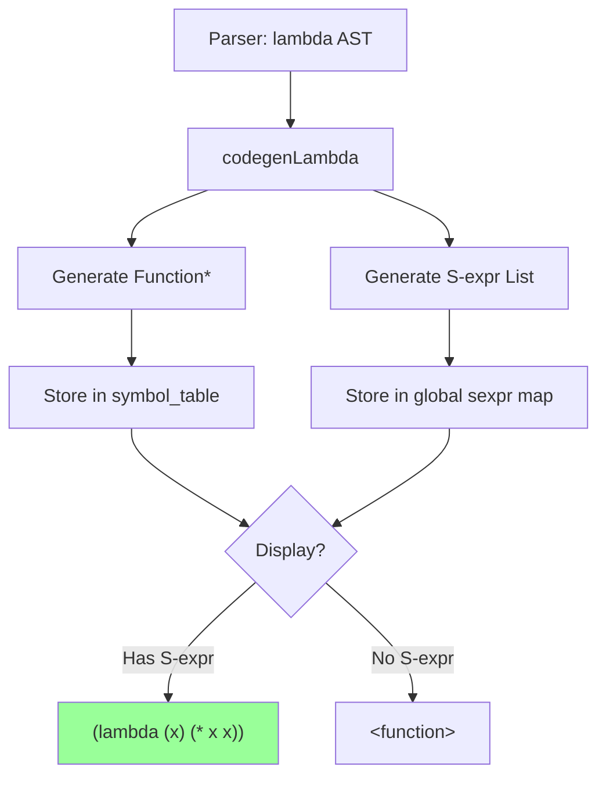

# Lambda S-Expression Display Architecture

## Overview

Transform Eshkol into a **homoiconic language** where unevaluated lambdas display as their source S-expression structure `(lambda (x) (* x x))` instead of the opaque `<function>` placeholder. This mirrors symbolic differentiation's approach and enables powerful metaprogramming capabilities.

## Current Architecture Analysis

### Lambda Compilation Flow
```
Parser (AST) → Codegen (LLVM Function*) → Execution
   ↓
Lambda AST discarded after compilation
Display shows: <function>
```

### Symbolic Differentiation Pattern (Successful Example)
```
AST → buildSymbolicDerivative() → AST' → codegenQuotedAST() → Runtime S-expression
Display shows: (* (cos x) 1)
```

**Key Insight**: Symbolic diff preserves mathematical structure as runtime data. We need the same for lambdas!

## Proposed Architecture

### Dual Representation Strategy

Lambdas will have **TWO representations**:
1. **Executable**: LLVM `Function*` (for actual computation)
2. **Displayable**: S-expression cons list (for inspection/display)

```
Lambda AST
    ↓
    ├─→ codegenLambda() ────→ Function* (execution)
    └─→ codegenLambdaToSExpr() → Cons List (display)
             ↓
    Store mapping: Function* → S-expression
```

## Implementation Plan

### Phase 1: Type System Extension

#### 1.1 Add Lambda S-Expression Type
**File**: [`inc/eshkol/eshkol.h`](inc/eshkol/eshkol.h:41)

```c
typedef enum {
    ESHKOL_VALUE_NULL        = 0,
    ESHKOL_VALUE_INT64       = 1,
    ESHKOL_VALUE_DOUBLE      = 2,
    ESHKOL_VALUE_CONS_PTR    = 3,
    ESHKOL_VALUE_DUAL_NUMBER = 4,
    ESHKOL_VALUE_AD_NODE_PTR = 5,
    ESHKOL_VALUE_TENSOR_PTR  = 6,
    ESHKOL_VALUE_LAMBDA_SEXPR = 7,  // NEW: Lambda S-expression metadata
    ESHKOL_VALUE_MAX         = 15
} eshkol_value_type_t;
```

#### 1.2 Lambda Metadata Structure
**File**: [`inc/eshkol/eshkol.h`](inc/eshkol/eshkol.h:211)

```c
// Lambda metadata for S-expression display (homoiconicity)
// Stores both executable function and displayable S-expression
typedef struct eshkol_lambda_metadata {
    uint64_t function_ptr;    // LLVM Function* as pointer value
    uint64_t sexpr_list_ptr;  // Pointer to cons list: (lambda (params) body)
    size_t num_params;        // Parameter count
    size_t num_captures;      // Captured variable count
} eshkol_lambda_metadata_t;
```

### Phase 2: S-Expression Generation

#### 2.1 Lambda AST → S-Expression Converter
**File**: [`lib/backend/llvm_codegen.cpp`](lib/backend/llvm_codegen.cpp:7938)

Add new function (similar to `codegenQuotedAST`):

```cpp
// Convert lambda AST to runtime S-expression for homoiconic display
// Returns cons list: (lambda (param1 param2 ...) body)
Value* codegenLambdaToSExpr(const eshkol_operations_t* lambda_op) {
    // Build parameter list: (param1 param2 ...)
    Value* param_list = buildParameterList(lambda_op->lambda_op.parameters,
                                          lambda_op->lambda_op.num_params);
    
    // Convert body AST to quoted S-expression
    Value* body_sexpr = codegenQuotedAST(lambda_op->lambda_op.body);
    
    // Build: (lambda params body)
    // 1. Create "lambda" symbol
    Value* lambda_symbol = codegenString("lambda");
    Value* lambda_tagged = packPtrToTaggedValue(lambda_symbol, ESHKOL_VALUE_CONS_PTR);
    
    // 2. Create params list (already built)
    Value* params_tagged = packPtrToTaggedValue(param_list, ESHKOL_VALUE_CONS_PTR);
    
    // 3. Create (params body)
    Value* params_body = codegenTaggedArenaConsCellFromTaggedValue(
        params_tagged, body_sexpr);
    
    // 4. Create (lambda params body)
    Value* params_body_tagged = packPtrToTaggedValue(params_body, ESHKOL_VALUE_CONS_PTR);
    Value* result = codegenTaggedArenaConsCellFromTaggedValue(
        lambda_tagged, params_body_tagged);
    
    return result;
}
```

#### 2.2 Parameter List Builder
```cpp
Value* buildParameterList(const eshkol_ast_t* params, uint64_t num_params) {
    Value* result = ConstantInt::get(Type::getInt64Ty(*context), 0); // null
    
    // Build list backwards
    for (int64_t i = num_params - 1; i >= 0; i--) {
        Value* param_name = codegenString(params[i].variable.id);
        Value* param_tagged = packPtrToTaggedValue(param_name, ESHKOL_VALUE_CONS_PTR);
        
        Value* rest_tagged = (result == ConstantInt::get(Type::getInt64Ty(*context), 0)) ?
            packNullToTaggedValue() :
            packPtrToTaggedValue(result, ESHKOL_VALUE_CONS_PTR);
        
        result = codegenTaggedArenaConsCellFromTaggedValue(param_tagged, rest_tagged);
    }
    
    return result;
}
```

### Phase 3: Lambda Codegen Enhancement

#### 3.1 Modify codegenLambda()
**File**: [`lib/backend/llvm_codegen.cpp`](lib/backend/llvm_codegen.cpp:5809)

**Current** (lines 5809-5998):
```cpp
Value* codegenLambda(const eshkol_operations_t* op) {
    // ... creates Function* lambda_func ...
    return lambda_func;  // Only returns Function*
}
```

**Enhanced**:
```cpp
Value* codegenLambda(const eshkol_operations_t* op) {
    // ... existing code creates Function* lambda_func ...
    
    // NEW: Generate S-expression representation
    Value* sexpr_list = codegenLambdaToSExpr(op);
    
    // NEW: Store mapping in global table
    // Use GlobalVariable for persistence across scopes
    std::string metadata_key = lambda_name + "_sexpr";
    GlobalVariable* sexpr_storage = new GlobalVariable(
        *module,
        Type::getInt64Ty(*context),
        false, // not constant
        GlobalValue::InternalLinkage,
        ConstantInt::get(Type::getInt64Ty(*context), 0),
        metadata_key
    );
    
    // Store S-expression at runtime
    builder->CreateStore(sexpr_list, sexpr_storage);
    global_symbol_table[metadata_key] = sexpr_storage;
    
    // Associate with Function* for later lookup
    // Store in lambda_sexpr_map: Function* -> sexpr_list_ptr
    
    return lambda_func;  // Still returns Function* for execution
}
```

### Phase 4: Display Integration

#### 4.1 Enhance codegenDisplay()
**File**: [`lib/backend/llvm_codegen.cpp`](lib/backend/llvm_codegen.cpp:5107)

**Current** (lines 5107-5114):
```cpp
if (isa<Function>(arg)) {
    // Display function/closure as "<function>"
    return builder->CreateCall(printf_func, {
        codegenString("<function>")
    });
}
```

**Enhanced**:
```cpp
if (isa<Function>(arg)) {
    Function* func = dyn_cast<Function>(arg);
    std::string func_name = func->getName().str();
    
    // Check if lambda has S-expression metadata
    std::string metadata_key = func_name + "_sexpr";
    auto it = global_symbol_table.find(metadata_key);
    
    if (it != global_symbol_table.end()) {
        // Lambda with S-expression - display it!
        Value* sexpr_storage = it->second;
        Value* sexpr_list = builder->CreateLoad(Type::getInt64Ty(*context), sexpr_storage);
        
        // Use existing displaySExprList to render
        Value* depth = ConstantInt::get(Type::getInt32Ty(*context), 0);
        builder->CreateCall(display_sexpr_list_func, {sexpr_list, depth});
        return ConstantInt::get(Type::getInt32Ty(*context), 0);
    } else {
        // Built-in or external function - keep <function>
        return builder->CreateCall(printf_func, {
            codegenString("<function>")
        });
    }
}
```

### Phase 5: Closure Handling

#### 5.1 Option A: Hide Captures (Cleaner Display)
```
(lambda (x) (* x n))  
; Shows as-written, doesn't reveal n is captured
```

#### 5.2 Option B: Show Captures (Full Transparency)
```
(lambda (x) [captures: n=5] (* x n))
; Reveals closure state, helpful for debugging
```

**Recommendation**: Start with **Option A** (hide captures), add Option B as debug feature later.

## Data Flow Diagrams

### Current Lambda Flow


### Enhanced Lambda Flow


### S-Expression Structure
```
(lambda (x y) (+ (* x x) (* y y)))
    ↓
cons("lambda", cons((x y), cons((+ (* x x) (* y y)), null)))
    ↓
Runtime cons chain in arena memory
```

## Technical Challenges & Solutions

### Challenge 1: Function* to S-Expression Lookup

**Problem**: Need to map Function* to S-expression efficiently

**Solution**: Use GlobalVariable storage with deterministic naming
```cpp
// Key: lambda_0_sexpr, lambda_1_sexpr, etc.
// Value: Pointer to cons list S-expression
std::string key = lambda_func->getName().str() + "_sexpr";
global_symbol_table[key] = sexpr_storage;
```

### Challenge 2: AST Available Only During Compilation

**Problem**: AST is temporary, must convert to runtime before compilation completes

**Solution**: Generate S-expression DURING [`codegenLambda()`](lib/backend/llvm_codegen.cpp:5809), store immediately
```cpp
// In codegenLambda, op->lambda_op has full AST
Value* sexpr = codegenLambdaToSExpr(op);  // Convert NOW
// Store in arena-allocated cons cells (persistent)
```

### Challenge 3: Nested Lambdas

**Problem**: `(lambda (x) (lambda (y) (+ x y)))` - inner lambda captures x

**Solution**: Each lambda gets its own S-expression, captures are transparent in source
```
Outer: (lambda (x) (lambda (y) (+ x y)))
Inner: (lambda (y) (+ x y))  ; x visible in AST, capture is implementation detail
```

### Challenge 4: Parameter vs Body Quoting

**Problem**: Parameters should be symbols, body should be nested structure

**Solution**: Use different quoting strategies
```cpp
// Parameters: just strings
Value* param_name = codegenString("x");

// Body: full recursive quoting
Value* body_sexpr = codegenQuotedAST(lambda_op->lambda_op.body);
```

## Implementation Strategy

### Minimal Viable Feature (Phase 1)

1. Add `ESHKOL_VALUE_LAMBDA_SEXPR = 7` to enum
2. Implement `codegenLambdaToSExpr()` converter
3. Store S-expression in `global_symbol_table` during lambda creation
4. Modify display to check for `_sexpr` suffix and render if found
5. Test with simple lambda: `(define square (lambda (x) (* x x)))`

### Expected Output
```scheme
> (define square (lambda (x) (* x x)))
> square
(lambda (x) (* x x))   ; Not <function>!

> (square 5)
25

> (diff (* x x) x)
(* 2 x)   ; Symbolic diff already works

> (map square (list 1 2 3))
(1 4 9)   ; Execution still works
```

## Backward Compatibility

### What Stays the Same
- **Execution**: Function* pointers still used for all calls
- **Performance**: No runtime overhead, S-expression only created once
- **Type System**: Tagged values, polymorphic arithmetic unchanged
- **Higher-order functions**: map/filter/fold work identically

### What Changes
- **Display**: Lambdas show source structure instead of `<function>`
- **REPL**: More informative, Lisp-like experience
- **Debugging**: Can inspect lambda structure at runtime

## Integration Points

### Files to Modify

1. **[`inc/eshkol/eshkol.h`](inc/eshkol/eshkol.h:41)**
   - Add `ESHKOL_VALUE_LAMBDA_SEXPR = 7`
   - Add helper macro `ESHKOL_IS_LAMBDA_SEXPR_TYPE(type)`

2. **[`lib/backend/llvm_codegen.cpp`](lib/backend/llvm_codegen.cpp:5809)**
   - Add `codegenLambdaToSExpr()` (new function, ~80 lines)
   - Add `buildParameterList()` (new helper, ~30 lines)
   - Modify `codegenLambda()` (+15 lines for S-expr storage)
   - Modify `codegenDisplay()` (+25 lines for lambda detection)

3. **[`lib/core/ast.cpp`](lib/core/ast.cpp:137)**
   - Add `eshkol_lambda_to_sexpr()` helper (optional, if needed at C level)

### Estimated Changes
- **New code**: ~150 lines (2 new functions, storage logic)
- **Modified code**: ~40 lines (display enhancement, enum)
- **Test code**: ~50 lines (validation tests)
- **Total impact**: Small, focused enhancement (~240 lines)

## Testing Strategy

### Test Cases

1. **Simple Lambda**
```scheme
(define f (lambda (x) (+ x 1)))
(display f)  ; Should show: (lambda (x) (+ x 1))
```

2. **Multi-Parameter Lambda**
```scheme
(define add (lambda (x y) (+ x y)))
(display add)  ; Should show: (lambda (x y) (+ x y))
```

3. **Nested Lambda (Closure)**
```scheme
(define make-adder (lambda (n) (lambda (x) (+ x n))))
(define add5 (make-adder 5))
(display add5)  ; Should show: (lambda (x) (+ x n))  ; n is captured but shown
```

4. **Lambda in List**
```scheme
(define funcs (list (lambda (x) (* x 2)) (lambda (x) (+ x 1))))
(display funcs)  ; Should show: ((lambda (x) (* x 2)) (lambda (x) (+ x 1)))
```

5. **Higher-Order Functions Still Work**
```scheme
(map (lambda (x) (* x x)) (list 1 2 3))
; Should still return: (1 4 9)
```

## Design Decisions

### Decision 1: When to Generate S-Expression?
**Options**:
- A. During lambda creation (eager)
- B. On first display (lazy)

**Choice**: **A (Eager)** - Generate during `codegenLambda()` because:
- AST is only available during compilation
- One-time cost, no repeated work
- Simpler implementation (no lazy evaluation logic)

### Decision 2: How to Store Mapping?
**Options**:
- A. Global C++ map: `std::map<Function*, Value*>`
- B. GlobalVariable per lambda: `lambda_N_sexpr`
- C. Tagged value extension with metadata field

**Choice**: **B (GlobalVariable)** - Because:
- Consistent with existing architecture
- Survives across LLVM compilation boundaries
- No need for new C++ runtime state
- Works with REPL mode naturally

### Decision 3: Display Format for Closures?
**Options**:
- A. Show captures: `(lambda (x) [n=5] (+ x n))`
- B. Hide captures: `(lambda (x) (+ x n))`
- C. Annotate: `(lambda (x) (+ x n) ; closes over n)`

**Choice**: **B (Hide captures)** - Because:
- Matches source code exactly (homoiconic)
- Cleaner output
- Capture is implementation detail
- Can add debug mode later if needed

### Decision 4: Scope of Feature?
**Options**:
- A. Only user-defined lambdas
- B. All functions including built-ins
- C. Configurable via flag

**Choice**: **A (User-defined only)** - Because:
- Built-ins like `sin`, `cos` don't have Eshkol source
- External functions show `<function>` appropriately
- Keeps implementation focused

## Implementation Sequence

### Step 1: Enum Extension (10 min)
- Add `ESHKOL_VALUE_LAMBDA_SEXPR = 7` to [`eshkol.h`](inc/eshkol/eshkol.h:47)
- Add helper macro

### Step 2: S-Expression Generator (45 min)
- Implement `codegenLambdaToSExpr()`
- Implement `buildParameterList()`
- Test on simple lambda AST

### Step 3: Lambda Storage (30 min)
- Modify `codegenLambda()` to generate and store S-expression
- Create GlobalVariable for each lambda's S-expression
- Store in `global_symbol_table` with `_sexpr` suffix

### Step 4: Display Enhancement (30 min)
- Modify `codegenDisplay()` to detect Function* with metadata
- Look up S-expression from global table
- Call existing `displaySExprList()` to render

### Step 5: Testing (45 min)
- Test simple lambda display
- Test closures
- Test nested lambdas
- Verify map/filter/fold still work
- Verify autodiff still works

**Total estimated time**: ~2.5 hours

## Alternative Approaches Considered

### Alternative 1: Runtime AST Preservation
Store full AST in runtime structure, reconstruct S-expression on demand.

**Rejected because**:
- AST is compile-time only in current architecture
- Would require major refactoring
- Higher memory overhead

### Alternative 2: Source String Storage
Store original source string `"(lambda (x) (* x x))"` as metadata.

**Rejected because**:
- Loses homoiconic benefits (can't manipulate structure)
- Doesn't work for programmatically generated lambdas
- String parsing needed for inspection

### Alternative 3: Lazy S-Expression Generation
Generate S-expression only when displayed.

**Rejected because**:
- AST not available at display time
- Would need AST serialization/persistence
- More complex than eager generation

## Success Criteria

### Functional Requirements
✅ Unevaluated lambdas display as `(lambda (params) body)`  
✅ Lambda execution unchanged (still uses Function*)  
✅ Works with closures (captures don't break display)  
✅ Nested lambdas display correctly  
✅ Compatible with map/filter/fold  
✅ Compatible with autodiff operators  

### Non-Functional Requirements
✅ Performance impact: negligible (one-time cost at lambda creation)  
✅ Memory impact: ~O(n) where n = lambda source size  
✅ Code complexity: minimal (reuses existing `codegenQuotedAST` pattern)  
✅ Backward compatibility: 100% (pure enhancement, no breaking changes)  

## Future Enhancements

### Enhancement 1: Lambda Introspection
```scheme
(lambda-parameters square)  ; Returns: (x)
(lambda-body square)        ; Returns: (* x x)
(lambda-arity square)       ; Returns: 1
```

### Enhancement 2: Source Location Metadata
```scheme
(lambda-source-file square)  ; Returns: "examples/math.esk"
(lambda-source-line square)  ; Returns: 42
```

### Enhancement 3: Lambda Equality
```scheme
(equal? (lambda (x) (* x 2)) (lambda (y) (* y 2)))  ; True (alpha-equivalent)
```

### Enhancement 4: Capture Inspection (Debug Mode)
```scheme
(set! *debug-lambda-display* #t)
(display add5)  
; Shows: (lambda (x) (+ x n)) [n=5]
```

## Risks & Mitigation

### Risk 1: S-Expression Generation Failures
**Mitigation**: Fallback to `<function>` if S-expression generation fails

### Risk 2: Memory Overhead for Many Lambdas
**Mitigation**: S-expressions stored in arena (efficient), cleaned up automatically

### Risk 3: Display Performance for Large Lambdas
**Mitigation**: Use existing optimized `displaySExprList()` with depth limits

### Risk 4: Circular References in Closures
**Mitigation**: Display AST structure (which can't be circular), not runtime values

## Conclusion

This architecture provides **homoiconic lambda display** with minimal invasiveness:
- **Leverages existing**: S-expression display, tagged values, arena memory
- **Small footprint**: ~200 lines of new code
- **High value**: Makes Eshkol feel more Lispy, enables metaprogramming
- **Future-proof**: Foundation for lambda introspection, macro systems

The key insight is treating lambdas like symbolic derivatives: preserve the **structure** alongside the **executable**, enabling code-as-data paradigm.