# Eshkol v1.0-Foundation Architecture Diagrams

**Created**: November 17, 2025  
**Purpose**: Visual representation of v1.0-foundation architecture and evolution  
**Scope**: Sessions 21-60 (Months 2-3)

---

## System Evolution: v1.0-architecture → v1.0-foundation

### Timeline View


---

## Component Architecture Evolution

### Before v1.0-foundation (Current State)

```mermaid
graph TB
    subgraph "Working Components ✅"
        Parser[Parser<br/>Scheme → AST]
        TypeSys[Type System<br/>70% complete]
        LLVM[LLVM Backend<br/>7050 lines]
        Arena[Arena Memory<br/>Tagged values]
        Lists[Mixed-Type Lists<br/>100% working]
        HOF[Higher-Order Funcs<br/>17/17 migrated]
    end
    
    subgraph "Needs Work ⚠️"
        AutodiffBugs[Autodiff<br/>SCH-006/007/008]
        Examples[Examples<br/>~100 outdated]
        Docs[Documentation<br/>Aspirational claims]
    end
    
    subgraph "Missing ❌"
        CI[CI/CD<br/>None]
        Packages[Packaging<br/>None]
        Infrastructure[Infrastructure<br/>None]
    end
    
    Parser --> LLVM
    TypeSys --> LLVM
    LLVM --> Arena
    Arena --> Lists
    Lists --> HOF
    
    style AutodiffBugs fill:#ffcccc
    style Examples fill:#ffcccc
    style Docs fill:#ffcccc
    style CI fill:#ffeeee
    style Packages fill:#ffeeee
    style Infrastructure fill:#ffeeee
```

### After v1.0-foundation (Target State)

```mermaid
graph TB
    subgraph "All Components Production-Ready ✅"
        Parser[Parser<br/>Scheme → AST]
        TypeSys[Type System<br/>85% complete]
        LLVM[LLVM Backend<br/>7500+ lines]
        Arena[Arena Memory<br/>Tagged values]
        Lists[Mixed-Type Lists<br/>100% working]
        HOF[Higher-Order Funcs<br/>17/17 migrated]
        Autodiff[Autodiff<br/>ALL BUGS FIXED]
        Examples[Examples<br/>30 curated]
        Docs[Documentation<br/>100% accurate]
        CI[CI/CD<br/>Ubuntu + macOS]
        Packages[Packaging<br/>.deb + Homebrew]
        Testing[Testing<br/>100% pass + Valgrind]
    end
    
    Parser --> LLVM
    TypeSys --> LLVM
    LLVM --> Arena
    LLVM --> Autodiff
    Arena --> Lists
    Lists --> HOF
    Autodiff --> Examples
    Examples --> Docs
    CI --> Testing
    Testing --> Packages
    
    style Autodiff fill:#90EE90
    style Examples fill:#90EE90
    style Docs fill:#90EE90
    style CI fill:#90EE90
    style Packages fill:#90EE90
    style Testing fill:#90EE90
```

---

## Autodiff Architecture (Sessions 21-30)

### Current Autodiff Flow (With Bugs)

```mermaid
graph LR
    Input[User Code<br/>with Autodiff] --> Parse[Parser]
    Parse --> AST[AST with<br/>autodiff nodes]
    AST --> TypeInf[Type Inference<br/>❌ SCH-006]
    TypeInf --> LLVM[LLVM Codegen]
    LLVM --> VectorGen[Vector Return Gen<br/>❌ SCH-007]
    VectorGen --> TypeCheck[Type Checking<br/>❌ SCH-008]
    TypeCheck --> IR[LLVM IR<br/>❌ Type conflicts]
    
    style TypeInf fill:#ffcccc
    style VectorGen fill:#ffcccc
    style TypeCheck fill:#ffcccc
    style IR fill:#ffcccc
```

### Target Autodiff Flow (After Fixes)

```mermaid
graph LR
    Input[User Code<br/>with Autodiff] --> Parse[Parser]
    Parse --> AST[AST with<br/>autodiff nodes]
    AST --> TypeInf[Type Inference<br/>✅ COMPLETE]
    TypeInf --> LLVM[LLVM Codegen]
    LLVM --> VectorGen[Vector Return Gen<br/>✅ WORKING]
    VectorGen --> TypeUnify[Type Unification<br/>✅ ADDED]
    TypeUnify --> IR[LLVM IR<br/>✅ Valid]
    IR --> Verify[LLVM Verifier<br/>✅ Passes]
    
    style TypeInf fill:#90EE90
    style VectorGen fill:#90EE90
    style TypeUnify fill:#90EE90
    style IR fill:#90EE90
    style Verify fill:#90EE90
```

### Autodiff Type Inference Strategy

```mermaid
graph TB
    Start[Autodiff Expression] --> Mode{Mode?}
    
    Mode -->|Forward| Forward[Forward Mode]
    Mode -->|Reverse| Reverse[Reverse Mode]
    
    Forward --> FwdType{Input Type?}
    FwdType -->|Scalar| FwdScalar[Return: Scalar<br/>d/dx returns same type]
    FwdType -->|Vector| FwdVector[Return: Vector<br/>Jacobian row]
    
    Reverse --> RevType{Input Type?}
    RevType -->|Scalar| RevError[Error: Gradient<br/>needs vector input]
    RevType -->|Vector| RevVector[Return: Vector<br/>Gradient same dims]
    
    FwdScalar --> Complete[Type Inference<br/>Complete ✅]
    FwdVector --> Complete
    RevVector --> Complete
    RevError --> Complete
    
    style Complete fill:#90EE90
```

---

## CI/CD Architecture (Sessions 41-50)

### CI/CD Pipeline

```mermaid
graph TB
    subgraph "Developer Workflow"
        Dev[Developer] --> Commit[Git Commit]
        Commit --> Push[Git Push]
    end
    
    subgraph "GitHub Actions"
        Push --> Trigger[Workflow Trigger]
        Trigger --> Ubuntu[Ubuntu 22.04 Build]
        Trigger --> macOS[macOS Build]
        
        Ubuntu --> UbuntuBuild[Install LLVM<br/>CMake Build<br/>Ninja]
        macOS --> macOSBuild[Brew LLVM<br/>CMake Build<br/>Ninja]
        
        UbuntuBuild --> UbuntuTest[Run 66 Tests]
        macOSBuild --> macOSTest[Run 66 Tests]
        
        UbuntuTest --> UbuntuCheck{All Pass?}
        macOSTest --> macOSCheck{All Pass?}
        
        UbuntuCheck -->|Yes| UbuntuPass[✅ Pass]
        UbuntuCheck -->|No| UbuntuFail[❌ Fail]
        macOSCheck -->|Yes| macOSPass[✅ Pass]
        macOSCheck -->|No| macOSFail[❌ Fail]
        
        UbuntuPass --> Success[✅ CI Success]
        macOSPass --> Success
        UbuntuFail --> Failure[❌ CI Failure]
        macOSFail --> Failure
    end
    
    subgraph "Notifications"
        Success --> Notify[Notify Developer<br/>✅ Green Badge]
        Failure --> Alert[Alert Developer<br/>❌ Red Badge]
    end
    
    style Success fill:#90EE90
    style Failure fill:#ffcccc
```

### Package Distribution Flow


---

## Testing Architecture

### Test Pyramid

```mermaid
graph TB
    subgraph "Test Levels"
        L1[Unit Tests<br/>66 tests<br/>Core functionality]
        L2[Integration Tests<br/>4 tests<br/>End-to-end scenarios]
        L3[Memory Tests<br/>Valgrind<br/>Zero leaks]
        L4[Performance Tests<br/>Benchmarks<br/>< 3x overhead]
        L5[CI Tests<br/>Automated<br/>Every commit]
    end
    
    L1 --> L2
    L2 --> L3
    L3 --> L4
    L4 --> L5
    
    L5 --> Release{Release<br/>Ready?}
    Release -->|All Pass| Ship[✅ Ship It!]
    Release -->|Any Fail| Fix[❌ Fix Issues]
    
    style Ship fill:#90EE90
    style Fix fill:#ffcccc
```

### Test Coverage Map


---

## Critical Path Analysis

### Dependency Graph

```mermaid
graph TB
    Start[v1.0-architecture<br/>COMPLETE ✅] --> SCH006[Session 21-24<br/>SCH-006 Fix]
    
    SCH006 --> SCH007[Session 25-26<br/>SCH-007 Fix]
    SCH007 --> SCH008[Session 27-28<br/>SCH-008 Fix]
    SCH008 --> AutodiffTest[Session 29-30<br/>Autodiff Testing]
    
    AutodiffTest --> Examples[Sessions 31-38<br/>Examples Update]
    Examples --> Docs[Sessions 39-40<br/>Documentation]
    
    Docs --> CI[Sessions 41-44<br/>CI/CD Setup]
    CI --> Install[Sessions 45-46<br/>Install Targets]
    Install --> Package[Sessions 47-48<br/>Packaging]
    Package --> Docker[Sessions 49-50<br/>Docker]
    
    Docker --> Homebrew[Sessions 51-52<br/>Homebrew]
    Homebrew --> Integration[Sessions 53-54<br/>Integration Tests]
    Integration --> MemPerf[Sessions 55-56<br/>Memory/Performance]
    MemPerf --> FinalDocs[Sessions 57-58<br/>Final Docs]
    
    FinalDocs --> Release[Sessions 59-60<br/>RELEASE]
    
    style Start fill:#90EE90
    style AutodiffTest fill:#FFD700
    style CI fill:#FFD700
    style Release fill:#FFD700
    
    classDef critical fill:#ff6b6b,stroke:#c92a2a,stroke-width:3px
    class SCH006,SCH007,SCH008,CI,Package,Release critical
```

### Critical Path Identification

```mermaid
graph LR
    subgraph "CRITICAL PATH (Must Complete Serially)"
        CP1[Autodiff Fixes<br/>Sessions 21-30<br/>⏱️ 10 sessions]
        CP2[CI/CD Setup<br/>Sessions 41-50<br/>⏱️ 10 sessions]
        CP3[Release Prep<br/>Sessions 51-60<br/>⏱️ 10 sessions]
    end
    
    subgraph "PARALLEL PATH (Can Overlap)"
        PP1[Examples<br/>Sessions 31-38<br/>⏱️ 8 sessions]
        PP2[Documentation<br/>Sessions 39-40<br/>⏱️ 2 sessions]
    end
    
    CP1 --> PP1
    PP1 --> CP2
    CP2 --> CP3
    
    PP1 -.Can overlap with.-> CP2
    
    style CP1 fill:#ff6b6b
    style CP2 fill:#ff6b6b
    style CP3 fill:#ff6b6b
    style PP1 fill:#87CEEB
    style PP2 fill:#87CEEB
```

**Critical Path Duration**: 30 sessions minimum  
**Parallel Opportunities**: 10 sessions can overlap  
**Total Timeline**: 40 sessions (can be completed in 20-30 session equivalents with parallelization)

---

## Autodiff Bug Fix Flow (Sessions 21-30)

### SCH-006: Type Inference Fix

```mermaid
graph TB
    Start[Autodiff Expression<br/>e.g. d/dx f x] --> Analyze[Analyze Function f]
    
    Analyze --> InputType{Input Type<br/>of f?}
    
    InputType -->|Scalar| ScalarInput[Input: Scalar]
    InputType -->|Vector| VectorInput[Input: Vector]
    
    ScalarInput --> OutputType1{Output Type<br/>of f?}
    VectorInput --> OutputType2{Output Type<br/>of f?}
    
    OutputType1 -->|Scalar| SS[Scalar → Scalar<br/>Return: Scalar]
    OutputType1 -->|Vector| SV[Scalar → Vector<br/>Return: Vector]
    
    OutputType2 -->|Scalar| VS[Vector → Scalar<br/>Return: Vector<br/>Gradient]
    OutputType2 -->|Vector| VV[Vector → Vector<br/>Return: Matrix<br/>Jacobian]
    
    SS --> Infer[Type Inference<br/>Complete ✅]
    SV --> Infer
    VS --> Infer
    VV --> Infer
    
    style Infer fill:#90EE90
```

### SCH-007: Vector Return Implementation

```mermaid
graph TB
    Gradient[Gradient Function<br/>∇f] --> Compute[Compute Partial<br/>Derivatives]
    
    Compute --> Partial1[∂f/∂x₁]
    Compute --> Partial2[∂f/∂x₂]
    Compute --> PartialN[∂f/∂xₙ]
    
    Partial1 --> Pack[Pack into LLVM<br/>Vector Type]
    Partial2 --> Pack
    PartialN --> Pack
    
    Pack --> VectorType[VectorType::get<br/>elementType, n]
    VectorType --> Insert1[InsertElement 0]
    Insert1 --> Insert2[InsertElement 1]
    Insert2 --> InsertN[InsertElement n-1]
    
    InsertN --> Return[Return Vector<br/>✅ Correct Type]
    
    style Return fill:#90EE90
```

### SCH-008: Type Conflict Resolution

```mermaid
graph TB
    CodeGen[LLVM Code<br/>Generation] --> Check{Type<br/>Consistent?}
    
    Check -->|Yes| Continue[Continue<br/>Generation]
    Check -->|No| Conflict[Type Conflict<br/>Detected]
    
    Conflict --> Analyze[Analyze<br/>Conflict]
    
    Analyze --> Pattern1{Scalar vs<br/>Vector?}
    Analyze --> Pattern2{Int vs<br/>Float?}
    Analyze --> Pattern3{PHI<br/>Mismatch?}
    
    Pattern1 -->|Yes| Fix1[Insert Vector<br/>Constructor]
    Pattern2 -->|Yes| Fix2[Insert Type<br/>Conversion]
    Pattern3 -->|Yes| Fix3[Unify PHI<br/>Incoming Types]
    
    Fix1 --> Unified[Types Unified<br/>✅]
    Fix2 --> Unified
    Fix3 --> Unified
    
    Unified --> Continue
    Continue --> ValidIR[Valid LLVM IR<br/>✅]
    
    style ValidIR fill:#90EE90
    style Unified fill:#90EE90
```

---

## Release Workflow (Sessions 59-60)

### Release Pipeline


### Release Quality Gates

```mermaid
graph LR
    subgraph "Quality Gates (All Must Pass)"
        G1[Tests: 100%]
        G2[Memory: Clean]
        G3[CI: Green]
        G4[Autodiff: Fixed]
        G5[Examples: 30]
        G6[Docs: Accurate]
        G7[Packages: Built]
        G8[Perf: < 3x]
    end
    
    G1 --> Check{All Gates<br/>Pass?}
    G2 --> Check
    G3 --> Check
    G4 --> Check
    G5 --> Check
    G6 --> Check
    G7 --> Check
    G8 --> Check
    
    Check -->|Yes| GO[🟢 GO FOR<br/>RELEASE]
    Check -->|No| NOGO[🔴 NO GO<br/>FIX ISSUES]
    
    NOGO --> Fix[Fix Issues]
    Fix --> G1
    
    style GO fill:#90EE90
    style NOGO fill:#ffcccc
```

---

## System Architecture: v1.0-foundation

### High-Level Architecture


### Memory Architecture


---

## Example Organization Architecture

### Example Directory Structure


### Learning Path

```mermaid
graph LR
    Start[New User] --> L1[01-basics/hello.esk<br/>5 min]
    L1 --> L2[01-basics/arithmetic.esk<br/>5 min]
    L2 --> L3[01-basics/lists.esk<br/>10 min]
    L3 --> L4[showcase/mixed_types_demo.esk<br/>15 min]
    L4 --> L5[02-list-ops/map_filter.esk<br/>15 min]
    L5 --> L6[showcase/higher_order_demo.esk<br/>20 min]
    L6 --> L7[showcase/autodiff_tutorial.esk<br/>30 min]
    L7 --> Advanced[Advanced Examples<br/>As needed]
    
    Advanced --> Proficient[Proficient User<br/>✅]
    
    style Start fill:#87CEEB
    style Proficient fill:#90EE90
```

---

## Infrastructure Architecture

### Build and Distribution System

```mermaid
graph TB
    subgraph "Source Control"
        Git[Git Repository]
        Main[main branch]
        Dev[develop branch]
        Tags[version tags]
    end
    
    subgraph "CI/CD"
        Actions[GitHub Actions]
        UbuntuCI[Ubuntu 22.04<br/>Runner]
        macOSCI[macOS<br/>Runner]
    end
    
    subgraph "Build System"
        CMake[CMake 3.14+]
        Ninja[Ninja Build]
        CPack[CPack]
    end
    
    subgraph "Testing"
        UnitTests[Unit Tests<br/>66 tests]
        IntTests[Integration Tests<br/>4 tests]
        MemTests[Memory Tests<br/>Valgrind]
        PerfTests[Performance Tests<br/>Benchmarks]
    end
    
    subgraph "Artifacts"
        DEB[.deb Package<br/>Ubuntu/Debian]
        Homebrew[Homebrew<br/>Formula]
        Docker[Docker Image<br/>ubuntu:22.04]
        Tarball[Source Tarball<br/>.tar.gz]
    end
    
    Git --> Actions
    Actions --> UbuntuCI
    Actions --> macOSCI
    
    UbuntuCI --> CMake
    macOSCI --> CMake
    
    CMake --> Ninja
    Ninja --> UnitTests
    UnitTests --> IntTests
    IntTests --> MemTests
    MemTests --> PerfTests
    
    PerfTests --> CPack
    CPack --> DEB
    CPack --> Homebrew
    CPack --> Docker
    CPack --> Tarball
    
    style PerfTests fill:#90EE90
    style DEB fill:#FFD700
    style Homebrew fill:#FFD700
```

---

## Risk Mitigation Architecture

### Risk Decision Tree

```mermaid
graph TB
    Risk[Identified Risk] --> Assess{Severity?}
    
    Assess -->|High| High[HIGH PRIORITY]
    Assess -->|Medium| Med[MEDIUM PRIORITY]
    Assess -->|Low| Low[LOW PRIORITY]
    
    High --> H1{Can we<br/>mitigate?}
    H1 -->|Yes| H2[Implement<br/>Mitigation]
    H1 -->|No| H3[Escalate/<br/>Descope]
    
    Med --> M1{Worth fixing<br/>now?}
    M1 -->|Yes| M2[Schedule Fix]
    M1 -->|No| M3[Document &<br/>Defer]
    
    Low --> L1[Document]
    
    H2 --> Monitor[Monitor &<br/>Verify]
    M2 --> Monitor
    
    style High fill:#ff6b6b
    style Med fill:#ffa500
    style Low fill:#90EE90
    style Monitor fill:#87CEEB
```

### Risk Register: v1.0-foundation

```mermaid
graph LR
    subgraph "Technical Risks"
        T1[Autodiff Complexity<br/>🔴 HIGH]
        T2[LLVM Compatibility<br/>🟡 MEDIUM]
        T3[Memory Issues<br/>🟡 MEDIUM]
    end
    
    subgraph "Timeline Risks"
        TL1[Scope Creep<br/>🟡 MEDIUM]
        TL2[Autodiff Underestimate<br/>🔴 HIGH]
        TL3[Example Updates<br/>🟢 LOW]
    end
    
    subgraph "Mitigations"
        M1[Buffer time:<br/>Sessions 27-30]
        M2[Multi-LLVM CI<br/>testing]
        M3[Daily Valgrind<br/>runs]
        M4[Strict scope<br/>discipline]
        M5[Daily progress<br/>tracking]
        M6[Can parallelize<br/>with other work]
    end
    
    T1 --> M1
    T1 --> M5
    T2 --> M2
    T3 --> M3
    TL1 --> M4
    TL2 --> M5
    TL3 --> M6
    
    style T1 fill:#ff6b6b
    style TL2 fill:#ff6b6b
    style M1 fill:#90EE90
    style M5 fill:#90EE90
```

---

## Data Flow: Autodiff Example

### Example: `(gradient (lambda (v) (dot v v)) #(1 2 3))`

```mermaid
graph TB
    Input["User Input:<br/>(gradient f #(1 2 3))"] --> Parse[Parser]
    
    Parse --> AST["AST:<br/>CALL(gradient,<br/>  LAMBDA(...),<br/>  VECTOR(1,2,3))"]
    
    AST --> TypeInf["Type Inference:<br/>Input: vector<br/>Output: scalar<br/>Result: vector"]
    
    TypeInf --> CodeGen["LLVM Codegen:<br/>codegenGradient()"]
    
    CodeGen --> ComputePartials["Compute Partials:<br/>∂(v·v)/∂v₀ = 2v₀<br/>∂(v·v)/∂v₁ = 2v₁<br/>∂(v·v)/∂v₂ = 2v₂"]
    
    ComputePartials --> BuildVector["Build LLVM Vector:<br/>VectorType::get(double, 3)<br/>InsertElement(2*1, 0)<br/>InsertElement(2*2, 1)<br/>InsertElement(2*3, 2)"]
    
    BuildVector --> Return["Return Vector:<br/>#(2 4 6)"]
    
    style TypeInf fill:#FFD700
    style ComputePartials fill:#FFD700
    style BuildVector fill:#FFD700
    style Return fill:#90EE90
```

---

## Deployment Architecture

### Installation Paths

```mermaid
graph TB
    subgraph "Ubuntu/Debian"
        U1[Download .deb<br/>from GitHub]
        U2[sudo dpkg -i<br/>eshkol.deb]
        U3[Installed to<br/>/usr/bin]
    end
    
    subgraph "macOS"
        M1[brew tap<br/>tsotchke/eshkol]
        M2[brew install<br/>eshkol]
        M3[Installed to<br/>/opt/homebrew/bin]
    end
    
    subgraph "Docker"
        D1[docker pull<br/>eshkol:1.0]
        D2[docker run<br/>eshkol:1.0]
        D3[Container<br/>environment]
    end
    
    subgraph "From Source"
        S1[git clone]
        S2[cmake + make]
        S3[./build/<br/>eshkol-run]
    end
    
    U1 --> U2 --> U3
    M1 --> M2 --> M3
    D1 --> D2 --> D3
    S1 --> S2 --> S3
    
    U3 --> Run[Run Eshkol<br/>Programs]
    M3 --> Run
    D3 --> Run
    S3 --> Run
    
    style Run fill:#90EE90
```

---

## Component Dependency Graph

### Build-Time Dependencies

```mermaid
graph TB
    subgraph "External Dependencies"
        LLVM[LLVM 14+<br/>Required]
        CMake[CMake 3.14+<br/>Required]
        Ninja[Ninja<br/>Optional]
        GCC[GCC 9+ or<br/>Clang 10+]
    end
    
    subgraph "Eshkol Components"
        Parser[Parser<br/>lib/frontend/]
        AST[AST<br/>lib/core/ast.cpp]
        Arena[Arena Memory<br/>lib/core/arena_memory.cpp]
        Backend[LLVM Backend<br/>lib/backend/llvm_codegen.cpp]
        Runtime[Runtime<br/>exe/eshkol-run.cpp]
    end
    
    LLVM --> Backend
    CMake --> Parser
    GCC --> Parser
    
    Parser --> AST
    AST --> Backend
    Backend --> Arena
    Backend --> Runtime
    Arena --> Runtime
    
    Runtime --> Executable[eshkol-run<br/>Executable]
    
    style Executable fill:#90EE90
```

### Runtime Dependencies

```mermaid
graph LR
    Program[User Program] --> Executable[eshkol-run]
    
    Executable --> Load[Load & Parse]
    Load --> Compile[JIT Compile]
    Compile --> Execute[Execute]
    
    Execute --> ArenaAlloc[Arena Allocate<br/>Tagged values]
    Execute --> Builtins[Call Builtins<br/>C helpers]
    Execute --> Results[Output Results]
    
    ArenaAlloc --> Memory[System Memory]
    Builtins --> LibC[libc]
    
    style Execute fill:#FFD700
    style Results fill:#90EE90
```

---

## Performance Architecture

### Autodiff Performance Model

```mermaid
graph TB
    HandCoded[Hand-Coded<br/>Derivative] --> Baseline[Baseline<br/>Performance<br/>1.0x]
    
    Autodiff[Eshkol<br/>Autodiff] --> Overhead[Measured<br/>Overhead]
    
    Overhead --> Check{< 3x<br/>target?}
    
    Check -->|Yes| Pass[✅ PASS<br/>Performance<br/>Acceptable]
    Check -->|No| Fail[❌ FAIL<br/>Optimization<br/>Needed]
    
    Fail --> Optimize[Optimize<br/>Autodiff]
    Optimize --> Autodiff
    
    style Baseline fill:#87CEEB
    style Pass fill:#90EE90
    style Fail fill:#ffcccc
```

### Memory Performance Model

```mermaid
graph LR
    subgraph "Memory Allocation"
        Arena[Arena<br/>Allocation]
        Pool[Memory Pool]
        Batch[Batch Alloc<br/>O(1)]
    end
    
    subgraph "Memory Access"
        Tagged[Tagged Value<br/>Access]
        Helper[C Helper<br/>Function]
        Union[Union Access<br/>Type-safe]
    end
    
    subgraph "Memory Cleanup"
        Scope[Scope-based<br/>Lifetime]
        Free[Free Arena<br/>O(1)]
    end
    
    Arena --> Pool
    Pool --> Batch
    
    Batch --> Tagged
    Tagged --> Helper
    Helper --> Union
    
    Union --> Scope
    Scope --> Free
    
    style Batch fill:#90EE90
    style Union fill:#90EE90
    style Free fill:#90EE90
```

---

## Session Workflow Architecture

### Per-Session Process

```mermaid
graph TB
    Start[Start Session N] --> Review[Review Session<br/>Objectives]
    
    Review --> Switch{Need to<br/>code?}
    Switch -->|Yes| CodeMode[Switch to<br/>Code Mode]
    Switch -->|No| Architect[Stay in<br/>Architect Mode]
    
    CodeMode --> Implement[Implement<br/>Changes]
    Architect --> Design[Design/<br/>Document]
    
    Implement --> Test[Test<br/>Changes]
    Design --> Test
    
    Test --> Pass{Tests<br/>Pass?}
    
    Pass -->|No| Debug[Debug<br/>Issues]
    Debug --> Implement
    
    Pass -->|Yes| Commit[Commit with<br/>Session Tag]
    
    Commit --> Update[Update<br/>BUILD_STATUS.md]
    
    Update --> Complete[Session<br/>Complete ✅]
    
    style Complete fill:#90EE90
    style Pass fill:#FFD700
```

### Weekly Review Process

```mermaid
graph LR
    Week[End of Week] --> Review[Review Progress]
    
    Review --> Check{On Track?}
    
    Check -->|Yes| Continue[Continue Plan]
    Check -->|No| Assess[Assess Issues]
    
    Assess --> Adjust{Need<br/>Adjustment?}
    
    Adjust -->|Yes| Replan[Adjust Plan]
    Adjust -->|No| Workaround[Find<br/>Workaround]
    
    Replan --> Document[Document<br/>Changes]
    Workaround --> Document
    Continue --> Document
    
    Document --> NextWeek[Start Next<br/>Week]
    
    style Check fill:#FFD700
    style NextWeek fill:#90EE90
```

---

## Integration Points

### CI/CD Integration Flow

```mermaid
graph TB
    subgraph "Development"
        Code[Write Code] --> LocalTest[Local Test]
        LocalTest --> Commit[Git Commit]
    end
    
    subgraph "Continuous Integration"
        Commit --> Push[Git Push]
        Push --> Trigger[CI Trigger]
        
        Trigger --> Build1[Ubuntu Build]
        Trigger --> Build2[macOS Build]
        
        Build1 --> Test1[Ubuntu Tests]
        Build2 --> Test2[macOS Tests]
        
        Test1 --> Result{Both<br/>Pass?}
        Test2 --> Result
    end
    
    subgraph "Continuous Deployment"
        Result -->|Yes| Merge[Merge to main]
        Result -->|No| Notify[Notify Developer]
        
        Merge --> Tag{Tagged<br/>Release?}
        Tag -->|Yes| Package[Build Packages]
        Tag -->|No| Done[Done]
        
        Package --> Publish[Publish<br/>Artifacts]
    end
    
    Notify --> Code
    
    style Merge fill:#90EE90
    style Publish fill:#FFD700
```

---

## Appendix: Architecture Patterns

### Pattern 1: Type-Safe Memory Access

```mermaid
sequenceDiagram
    participant Code as LLVM IR
    participant Extract as extractCarAsTaggedValue()
    participant Helper as C Helper (arena_tagged_cons_get_*)
    participant Cell as Tagged Cons Cell
    
    Code->>Extract: cons_ptr
    Extract->>Cell: Read type tag
    Cell-->>Extract: type (INT64/DOUBLE/PTR)
    
    Extract->>Helper: Call appropriate getter
    Note over Helper: Type-safe union access
    Helper->>Cell: Read data union
    Cell-->>Helper: Typed value
    Helper-->>Extract: Typed result
    
    Extract-->>Code: Tagged value (type preserved)
```

### Pattern 2: Polymorphic Function Call

```mermaid
sequenceDiagram
    participant Map as map function
    participant Proc as User lambda
    participant Value as Tagged value
    participant Result as Result list
    
    Map->>Value: Extract car (tagged)
    Note over Value: NO unpacking!
    
    Map->>Proc: Call with tagged value
    Note over Proc: Polymorphic:<br/>accepts any type
    
    Proc-->>Map: Return tagged value
    Note over Map: Type preserved
    
    Map->>Result: Store in new cons
    Note over Result: Type info<br/>maintained
```

### Pattern 3: CI/CD Automation

```mermaid
sequenceDiagram
    participant Dev as Developer
    participant Git as Git
    participant GH as GitHub Actions
    participant Build as Build System
    participant Test as Test Suite
    
    Dev->>Git: git push
    Git->>GH: Webhook trigger
    
    GH->>Build: Start build job
    Build->>Build: Install LLVM
    Build->>Build: cmake + ninja
    Build-->>GH: Build status
    
    GH->>Test: Run test suite
    Test->>Test: Execute 66 tests
    Test-->>GH: Test results
    
    GH->>Dev: ✅ Success notification
    
    alt Any failure
        Test-->>GH: ❌ Failure
        GH->>Dev: ❌ Failure notification
        Dev->>Git: Fix and push again
    end
```

---

## System Boundary Diagram

### What's In v1.0-foundation

```mermaid
graph TB
    subgraph "IN SCOPE ✅"
        Core[Core Language<br/>Scheme basics]
        Lists[Mixed-Type Lists<br/>Type-safe]
        HOF[Higher-Order<br/>17 functions]
        Autodiff[Autodiff<br/>Forward + Reverse]
        Examples[30 Examples<br/>Production quality]
        CI[CI/CD<br/>Automated]
        Packages[Packaging<br/>.deb + Homebrew]
        Docs[Documentation<br/>Accurate]
        Tests[66 Tests<br/>100% pass]
    end
    
    subgraph "OUT OF SCOPE ❌"
        Eval[Eval/Apply<br/>→ v1.1]
        Macros[Macros<br/>→ v1.1]
        Modules[Module System<br/>→ v1.2]
        REPL[REPL<br/>→ v1.2]
        IO[File I/O<br/>→ v1.2]
        TCO[Tail Call Opt<br/>→ Future]
        Continuations[Continuations<br/>→ Future]
    end
    
    style Core fill:#90EE90
    style Lists fill:#90EE90
    style HOF fill:#90EE90
    style Autodiff fill:#90EE90
```

---

## Appendix: Critical Metrics Dashboard

### Release Readiness Scorecard

```mermaid
graph LR
    subgraph "Technical Metrics"
        M1[Tests: 66/66 ✅]
        M2[Autodiff: 3/3 bugs fixed ✅]
        M3[Memory: 0 leaks ✅]
        M4[CI: 2/2 platforms ✅]
    end
    
    subgraph "Quality Metrics"
        Q1[Examples: 30/30 ✅]
        Q2[Docs: 100% accurate ✅]
        Q3[Performance: < 3x ✅]
        Q4[Packages: 2/2 working ✅]
    end
    
    subgraph "Release Decision"
        M1 --> Decision{All Metrics<br/>Green?}
        M2 --> Decision
        M3 --> Decision
        M4 --> Decision
        Q1 --> Decision
        Q2 --> Decision
        Q3 --> Decision
        Q4 --> Decision
        
        Decision -->|Yes| Ship[🚀 SHIP<br/>v1.0-foundation]
        Decision -->|No| Hold[🛑 HOLD<br/>Fix Issues]
    end
    
    style Ship fill:#90EE90
    style Hold fill:#ffcccc
```

---

**Document Status**: Architecture diagrams complete  
**Created**: November 17, 2025  
**Purpose**: Visual guide for v1.0-foundation development  
**Usage**: Reference during Sessions 21-60

**Related Documents**:
- [`V1_0_FOUNDATION_EXECUTION_PLAN.md`](V1_0_FOUNDATION_EXECUTION_PLAN.md) - Detailed execution plan
- [`V1_0_FOUNDATION_RELEASE_PLAN.md`](V1_0_FOUNDATION_RELEASE_PLAN.md) - Original release plan
- [`V1_0_ARCHITECTURE_COMPLETION_REPORT.md`](V1_0_ARCHITECTURE_COMPLETION_REPORT.md) - Month 1 completion

---

**END OF ARCHITECTURE DIAGRAMS**