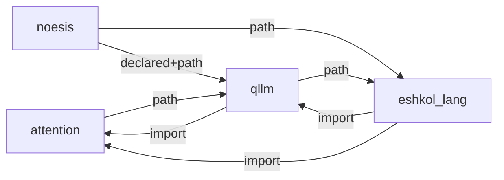

# Eshkol v1.3 -> v1.5 Dependency Plan (2026-06-28)

This plan uses the ICC dependency graph and the local source audit of Eshkol,
Noesis, semiclassical_qllm, and attention.

## Correct Model

Eshkol has two release lanes that must not be confused:

1. Eshkol core is self-contained. The compiler, runtime, stdlib, AD substrate,
   VM, SICP gate, and core language release cannot require qLLM or attention to
   build or run.
2. Noesis is first-party Eshkol, and is the v1.5 intelligence layer. It is not
   downstream. Its v1.5 stack can depend on Eshkol core plus optional qLLM and
   attention artifacts through explicit integration contracts.

ICC graph:

Read this as stack integration, not as a core-build dependency. Eshkol core must
stay independently releasable. Noesis v1.5 then composes Eshkol, qLLM, and
attention.

## v1.3-evolve Completion Criteria

v1.3 is the self-contained core evolution release. It should ship when these are
green:

- ICC `readiness --repo eshkol_lang --target v1.3-evolve` is backed by a real
  smoke command, not only static evidence. Current status is ready/100 on atlas
  using `scripts/run_v1_3_readiness.sh` and `scripts/icc_traces`.
- SICP gate is part of the normal release smoke. PR #85 landed the corpus,
  smoke harness, and ICC oracle.
- R7RS library compatibility is not partial. ROADMAP still calls out the full
  bare-prefix export list for the R7RS library surface.
- PGO is operational: workload selection, profile collection, and canonical
  profile merge are scripted and reproducible.
- WPO is operational enough for the release: cross-module inline/DCE paths are
  tested on representative programs.
- Static and manual-link paths are covered: especially `--emit-object` plus
  `stdlib.o` plus `libeshkol-static.a` for env/capability behavior.

## Full SICP Compatibility Gaps

SICP is close, but "full compatibility" should mean no silent xfail in the core
chapters and a clear boundary around optional advanced exercises.

Required before claiming full core SICP compatibility:

- ESH-0079: first-class/apply'd builtin predicates must return real booleans.
  Landed in PR #86.
- ESH-0075: multi-instance closure-state aliasing after shared mutable capture.
  This protects object/message-passing patterns in ch3.
- ESH-0080: deep CPS continuation chains should not SIGILL. This affects ch4
  amb/search depth and general continuation robustness.
- SICP gate has flipped the metacircular evaluator and predicate repro xfails
  after ESH-0079. PR #87 is merged; the gate is now 22/22 PASS.
- The gate should run both `-r` and AOT for the chapter programs that exercise
  compiler/runtime semantics.

Nice-to-have, but not required for core compatibility:

- ch4.4 query system as a separate compatibility tier.
- ch5.4/ch5.5 explicit-control evaluator/compiler once predicate and CPS gaps
  are closed.

## v1.5-intelligence Completion Criteria

v1.5 is Noesis as the first-party intelligence layer on top of self-contained
Eshkol core. The local Noesis gates already demonstrate the shape:

- `gate_v1_5_intelligence.esk`: differentiable unification, differentiable
  belief propagation, free energy AD, geometric self-improvement, recursive
  self-improvement.
- `gate_v1_5_learned_encoder.esk`.
- `gate_semantic_unify.esk`.
- `gate_v1_5_recursive.esk`.
- `gate_v1_5_session.esk`.
- `gate_v1_5_live_agent.esk`.

The gates pass when run with an explicit Eshkol source path, but that is not yet
a release-quality integration. Missing for v1.5:

- Package/search-path contract: Noesis must find Eshkol source modules such as
  `lib/core/ad/tape.esk` without manual ad hoc setup.
- Noesis v1.5 ICC oracle: current ICC readiness is generic and lacks runtime
  attempt-eval health for the v1.5 gates.
- Crypto/static/JIT symbol hygiene: recursive/session gates reported undefined
  `_eshkol_hmac_sha256`, `_eshkol_random_bytes`, `_eshkol_random_hex`, and
  `_eshkol_sha256` diagnostics while still returning success. That must be made
  clean and fail-closed.
- Capability/env clarity: Noesis fixed its side by lazy reads, but Eshkol still
  needs runtime-level denied-vs-absent diagnostics and static-link coverage.
- qLLM checkpoint path: `src/core/encoder/qllm_encoder.esk` currently preserves
  the encoder contract with a stub state. Real `qllm-load-checkpoint` must read
  the qLLM/GeoRefine artifact instead of silently returning the stub for a real
  path.
- EAGLE/native training scale path: scalar native training works; 7168-dim scale
  needs either ESH-0081 vector AD or qLLM FFI `linear_backward` wired into the
  Noesis training surface.

## qLLM Contract

semiclassical_qllm already exposes the needed ABI surfaces:

- `qllm_eshkol_eval_*` for same-address-space Eshkol evaluation from qLLM.
- `qllm_eshkol_register_qllm_natives()` for Eshkol-callable qLLM tensor and
  linear primitives.
- `qllm-linear-forward`, `qllm-linear-backward-dx`,
  `qllm-linear-backward-dw`, `qllm-linear-backward-db`.
- Gradient tape handles and `qllm_gradient_tape_*`.
- ESKB/VM bridge: `qllm_run_bytecode`, VM host-native registry, bytecode tensor
  packing.

The missing work is adapter glue and release gating, not a new ABI.

## attention / GeoRefine Contract

attention already defines the runtime and artifact side:

- TRE protocol for load/unload, generate, metrics, training jobs, promote,
  rollback, and loop status.
- `QllmBackend` as the native inference backend over semiclassical_qllm.
- `EshkolBackend` as the Eshkol-native control plane over a native delegate.
- `qllm_bundle.json` sidecar with BLAKE3 checksums, tokenizer/config/weights,
  geometric artifacts, certificates, and graduation evidence.

The v1.5 artifact path should be:

1. attention/GeoRefine emits a complete `qllm_bundle.json` plus certificates.
2. qLLM verifies and loads the bundle through its C/Python native bridge.
3. Noesis `qllm-load-checkpoint` consumes that verified artifact and returns a
   non-stub qLLM state.
4. Noesis v1.5 gates exercise semantic encoding, differentiable learning, and
   recursive self-improvement using that state.
5. Eshkol CI keeps the core lane self-contained, while full-stack CI runs the
   Noesis/qLLM/attention lane.

## Ordered Work Plan

1. Finish the v1.3 core gate.
   - ICC smoke evidence for `v1.3-evolve` is fixed on atlas.
   - SICP gate is merged in #85; PR #87 removed stale xfails after #86.
   - Windows ARM64 is green after PR #77 / 6d57ab8f.
   - Close ESH-0075 and ESH-0080.
   - Add the static-link capability/env CTest from ESH-0077.
   - ESH-0087 mesh certification is complete: cosbox, old-donkey, jack-blupc,
     and xavier all have focused v1.3 feature + AD/input2 PASS evidence.

2. Make Noesis first-party in the release machinery.
   - Add a Noesis v1.5 release gate script under Eshkol orchestration.
   - Register a real ICC attempt-eval/oracle for the v1.5 gate suite.
   - Fix the source/module path packaging so Noesis gates do not require manual
     `ESHKOL_PATH` setup in release mode.
   - Clean the crypto undefined-symbol diagnostics.

3. Wire qLLM artifact loading into Noesis.
   - Replace the real-path branch of `qllm-load-checkpoint` with a checked
     loader path.
   - Preserve stub behavior only for `#f` or explicit `stub`.
   - Add a tiny fixture artifact for CI, separate from large model artifacts.

4. Wire attention/GeoRefine artifacts into the stack gate.
   - Validate `qllm_bundle.json` and certificate/graduation evidence.
   - Feed the verified bundle through qLLM into Noesis.
   - Add promote/rollback loop checks through TRE/EshkolBackend where feasible.

5. Promote native continuous learning into Noesis.
   - Use the EAGLE/qLLM linear backward FFI path for wide layers.
   - Keep ESH-0081 open for root-cause vector-valued AD, but do not block the
     first production-scale EAGLE path on it.

## Groundwork For Later Versions

v1.4 should be the performance and packaging release:

- PGO and WPO are defaulted for release builds.
- Cross-platform static-link/AOT coverage is complete.
- windows-arm64 is green with #77 evidence.
- GPU campaign lands as optional acceleration, not a core semantic dependency.

v1.5 should be Noesis intelligence:

- Noesis v1.5 gates are first-party release checks.
- qLLM checkpoint loader is real.
- attention/GeoRefine artifacts are verified and consumed.
- Native EAGLE/continuous-learning loop is available from Eshkol/Noesis.

v1.6 should be full-stack autonomous learning:

- TRE training jobs, artifact promote/rollback, and Noesis self-improvement are
  one audited loop.
- qLLM bytecode/ESKB path runs selected Eshkol control programs inside the qLLM
  runtime without Python.
- Capability policy and security boundaries are first-class in the release
  gate.

v1.7 should be distributed intelligence:

- qLLM distributed checkpoint/sharding surfaces become real artifacts, not
  only stubs.
- Noesis memory/reasoning loops operate over distributed dKB/Mneme profiles.
- GPU/mesh runtime chooses CUDA/Metal backends from capability evidence.

## Immediate Next Actions

- ESH-0082: Noesis v1.5 first-party release gate and ICC oracle.
- ESH-0083: qLLM real checkpoint/artifact loader for Noesis.
- ESH-0084: attention/GeoRefine `qllm_bundle.json` integration gate.
- ESH-0085: crypto symbol hygiene for Noesis recursive/session gates.
- ESH-0086 and ESH-0087 are done locally: ICC smoke evidence is fixed and mesh
  certification has PASS evidence on Linux, Windows, and xavier Nix paths.
- Continue existing ESH-0075, ESH-0076, ESH-0077, ESH-0080, and ESH-0081.
