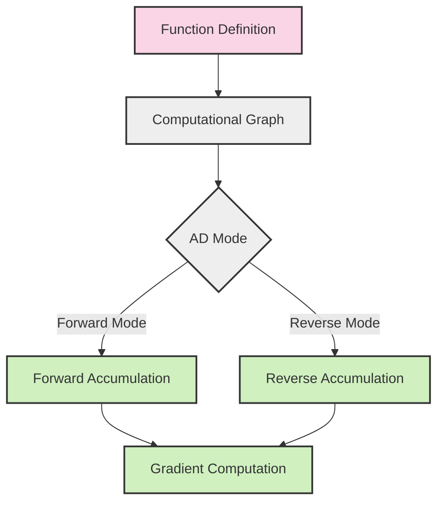

# Automatic Differentiation in Eshkol

## Overview of Automatic Differentiation

Automatic differentiation (AD) is a computational technique for efficiently and accurately evaluating derivatives of numeric functions. Unlike numerical differentiation (which uses finite differences) or symbolic differentiation, automatic differentiation computes exact derivatives by applying the chain rule systematically to elementary operations.



## Forward-Mode and Reverse-Mode Differentiation

Eshkol supports both forward-mode and reverse-mode automatic differentiation:

### Forward-Mode AD

Forward-mode AD computes derivatives alongside function evaluation by propagating derivative information forward through the computation. It's efficient for functions with few inputs and many outputs.

```scheme
;; Define a function
(define (f x) (* x x))

;; Create a dual number (value and derivative)
(define x (dual 3.0 1.0))  ; Value 3.0, derivative 1.0

;; Evaluate f(x) with derivative
(define result (f x))  ; Result is dual number with value 9.0 and derivative 6.0

;; Extract value and derivative
(define value (dual-value result))      ; 9.0
(define derivative (dual-derivative result))  ; 6.0
```

### Reverse-Mode AD

Reverse-mode AD first evaluates the function to build a computational graph, then propagates derivatives backward from outputs to inputs. It's efficient for functions with many inputs and few outputs, making it ideal for gradient-based optimization.

```scheme
;; Define a function
(define (f x y) (+ (* x x) (* y y)))

;; Create a computational node
(define result (f (node 2.0) (node 3.0)))  ; Result is 13.0

;; Compute gradients with respect to inputs
(backward result)

;; Extract gradients
(define dx (gradient (node 2.0)))  ; 4.0
(define dy (gradient (node 3.0)))  ; 6.0
```

## Implementation Details

Eshkol's automatic differentiation system is implemented in `src/core/utils/autodiff.c` and includes:

### Dual Numbers for Forward-Mode AD

```c
typedef struct {
    float value;
    float derivative;
} DualNumber;

DualNumber dual_number_create(float value, float derivative);
DualNumber dual_number_add(DualNumber a, DualNumber b);
DualNumber dual_number_mul(DualNumber a, DualNumber b);
// Additional operations...
```

### Computational Graph for Reverse-Mode AD

```c
typedef enum {
    NODE_CONSTANT,
    NODE_VARIABLE,
    NODE_ADD,
    NODE_MULTIPLY,
    // Additional operations...
} NodeType;

typedef struct ComputationalNode {
    NodeType type;
    float value;
    float gradient;
    struct ComputationalNode* inputs[2];
    // Additional fields...
} ComputationalNode;

void compute_gradients(ComputationalNode* node);
```

## Code Examples of Gradient Computation

### Computing Derivatives of a Simple Function

```scheme
;; Define a function: f(x) = x^2 + 3x + 2
(define (f x)
  (+ (* x x) (* 3 x) 2))

;; Compute the derivative: f'(x) = 2x + 3
(define df (gradient f))

;; Evaluate the derivative at x = 4
(df 4)  ; Returns 11 (2*4 + 3)
```

### Computing Gradients of Multivariate Functions

```scheme
;; Define a multivariate function: f(x, y) = x^2 + xy + y^2
(define (f x y)
  (+ (* x x) (* x y) (* y y)))

;; Compute the gradient: ∇f(x, y) = [2x + y, x + 2y]
(define grad-f (gradient f))

;; Evaluate the gradient at (2, 3)
(grad-f 2 3)  ; Returns [7, 8]
```

### Computing Jacobian Matrices

```scheme
;; Define a vector-valued function: f(x, y) = [x^2 + y, x*y]
(define (f x y)
  (vector (+ (* x x) y) (* x y)))

;; Compute the Jacobian matrix
(define J (jacobian f))

;; Evaluate the Jacobian at (2, 3)
(J 2 3)  ; Returns [[4, 1], [3, 2]]
```

## Integration with the Type System

Eshkol's automatic differentiation is deeply integrated with its type system:

```scheme
;; Function with explicit types
(define f : (-> (Float) Float)
  (lambda (x) (* x x)))

;; Gradient function has the same type signature
(define df : (-> (Float) Float)
  (gradient f))

;; Dual numbers have their own type
(define x : (Dual Float) (dual 3.0 1.0))

;; Vector functions for gradient computation
(define g : (-> ((Vector Float 3)) Float)
  (lambda (v) (vector-dot v v)))

;; Gradient of vector function returns a vector
(define dg : (-> ((Vector Float 3)) (Vector Float 3))
  (gradient g))
```

## Applications in Machine Learning and Optimization

### Gradient Descent Optimization

```scheme
;; Define an objective function to minimize
(define (objective x y)
  (+ (* x x) (* 2 y y)))

;; Compute the gradient
(define grad (gradient objective))

;; Gradient descent optimization
(define (optimize initial-x initial-y learning-rate iterations)
  (let loop ((x initial-x)
             (y initial-y)
             (i 0))
    (if (>= i iterations)
        (vector x y)
        (let* ((g (grad x y))
               (new-x (- x (* learning-rate (vector-ref g 0))))
               (new-y (- y (* learning-rate (vector-ref g 1)))))
          (loop new-x new-y (+ i 1))))))

;; Optimize starting from (5, 5) with learning rate 0.1 for 100 iterations
(optimize 5.0 5.0 0.1 100)
```

### Neural Network Training

```scheme
;; Define a simple neural network
(define (neural-network x w1 w2 b1 b2)
  (let* ((hidden (tanh (+ (* w1 x) b1)))
         (output (+ (* w2 hidden) b2)))
    output))

;; Define loss function (mean squared error)
(define (loss x y w1 w2 b1 b2)
  (let* ((pred (neural-network x w1 w2 b1 b2))
         (error (- pred y)))
    (* error error)))

;; Compute gradients with respect to parameters
(define loss-grad (gradient loss))

;; Update parameters using gradients
(define (train-step x y w1 w2 b1 b2 learning-rate)
  (let* ((grads (loss-grad x y w1 w2 b1 b2))
         (dw1 (vector-ref grads 2))
         (dw2 (vector-ref grads 3))
         (db1 (vector-ref grads 4))
         (db2 (vector-ref grads 5)))
    (vector (- w1 (* learning-rate dw1))
            (- w2 (* learning-rate dw2))
            (- b1 (* learning-rate db1))
            (- b2 (* learning-rate db2)))))
```

## Advanced Features

### Higher-Order Derivatives

Eshkol supports computing higher-order derivatives by applying the gradient function multiple times:

```scheme
;; Define a function
(define (f x) (* x x x))  ; f(x) = x^3

;; First derivative: f'(x) = 3x^2
(define df (gradient f))

;; Second derivative: f''(x) = 6x
(define d2f (gradient df))

;; Evaluate second derivative at x = 4
(d2f 4)  ; Returns 24
```

### Hessian Computation

For multivariate functions, Eshkol can compute the Hessian matrix (matrix of second derivatives):

```scheme
;; Define a multivariate function
(define (f x y) (+ (* x x y) (* y y)))

;; Compute the Hessian matrix
(define H (hessian f))

;; Evaluate the Hessian at (2, 3)
(H 2 3)  ; Returns [[0, 2], [2, 2]]
```

## Best Practices

1. **Use forward-mode for functions with few inputs** - More efficient for scalar-to-vector functions
2. **Use reverse-mode for functions with many inputs** - More efficient for neural networks and large parameter spaces
3. **Leverage type annotations** - Helps catch errors in differentiation code
4. **Avoid non-differentiable operations** - Operations like `abs` or `floor` can cause issues
5. **Use higher-order derivatives judiciously** - They increase computational cost
6. **Batch computations when possible** - More efficient for large-scale optimization

## Limitations and Considerations

1. **Memory usage in reverse-mode** - Storing the computational graph can be memory-intensive
2. **Non-differentiable points** - Functions with discontinuities require special handling
3. **Numerical stability** - Very large or small values can lead to precision issues
4. **Performance considerations** - Complex functions may have significant overhead
