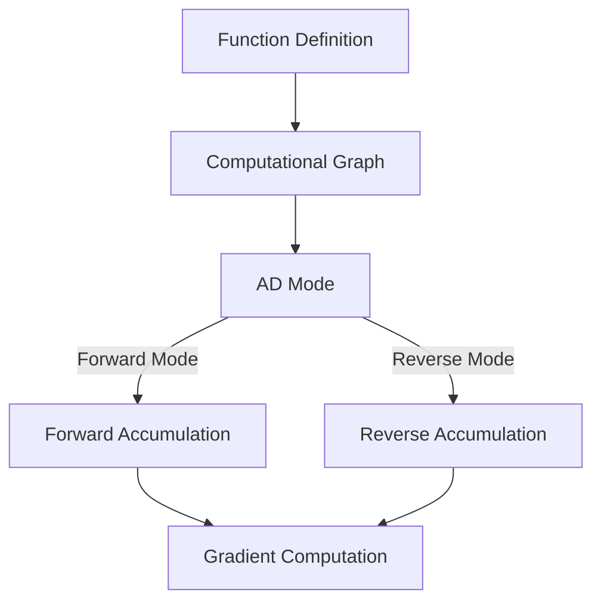

# Automatic Differentiation in Eshkol

## Table of Contents
- [Overview](#overview)
- [Forward-Mode and Reverse-Mode Differentiation](#forward-mode-and-reverse-mode-differentiation)
- [Implementation Details](#implementation-details)
- [Code Examples](#code-examples)
- [Practical Example: Neural Network Training](#practical-example-neural-network-training)
- [Troubleshooting](#troubleshooting)

## Overview of Automatic Differentiation

Automatic differentiation (AD) is a computational technique for efficiently and accurately evaluating derivatives of numeric functions. Unlike numerical differentiation (which uses finite differences) or symbolic differentiation, automatic differentiation computes exact derivatives by applying the chain rule systematically to elementary operations.



## Forward-Mode and Reverse-Mode Differentiation

Eshkol supports both forward-mode and reverse-mode automatic differentiation:

### Forward-Mode AD

Forward-mode AD computes derivatives alongside function evaluation by propagating derivative information forward through the computation. It's efficient for functions with few inputs and many outputs.

```scheme
;; Define a function
(define (f x) (* x x))

;; Create a dual number (value and derivative)
(define x (dual 3.0 1.0))  ; Value 3.0, derivative 1.0

;; Evaluate f(x) with derivative
(define result (f x))  ; Result is dual number with value 9.0 and derivative 6.0

;; Extract value and derivative
(define value (dual-value result))      ; 9.0
(define derivative (dual-derivative result))  ; 6.0
```

### Reverse-Mode AD

Reverse-mode AD first evaluates the function to build a computational graph, then propagates derivatives backward from outputs to inputs. It's efficient for functions with many inputs and few outputs, making it ideal for gradient-based optimization.

```scheme
;; Define a function
(define (f x y) (+ (* x x) (* x y) (* y y)))

;; Create a computational node
(define result (f (node 2.0) (node 3.0)))  ; Result is 13.0

;; Compute gradients with respect to inputs
(backward result)

;; Extract gradients
(define dx (gradient (node 2.0)))  ; 4.0
(define dy (gradient (node 3.0)))  ; 6.0
```

## Implementation Details

Eshkol's automatic differentiation system is implemented in `src/core/utils/autodiff.c` and includes:

### Dual Numbers for Forward-Mode AD

```c
typedef struct {
    float value;
    float derivative;
} DualNumber;

// Create a dual number
DualNumber dual_number_create(float value, float derivative);

// Arithmetic operations
DualNumber dual_number_add(DualNumber a, DualNumber b);
DualNumber dual_number_mul(DualNumber a, DualNumber b);
// Additional operations...
```

### Computational Graph for Reverse-Mode AD

```c
typedef enum {
    NODE_CONSTANT,
    NODE_VARIABLE,
    NODE_ADD,
    NODE_MULTIPLY,
    // Additional operations...
} NodeType;

typedef struct ComputationalNode {
    NodeType type;
    float value;
    float gradient;
    struct ComputationalNode* inputs[2];
    // Additional fields...
} ComputationalNode;

// Compute gradients
void compute_gradients(ComputationalNode* node);
```

## Code Examples of Gradient Computation

### Computing Derivatives of a Simple Function

```scheme
;; Define a function: f(x) = x^2 + 3x + 2
(define (f x)
  (+ (* x x) (* 3 x) 2))

;; Compute the derivative: f'(x) = 2x + 3
(define df (gradient f))

;; Evaluate the derivative at x = 4
(df 4)  ; Returns 11 (2*4 + 3)
```

### Computing Gradients of Multivariate Functions

```scheme
;; Define a multivariate function: f(x, y) = x^2 + xy + y^2
(define (f x y)
  (+ (* x x) (* x y) (* y y)))

;; Compute the gradient: ∇f(x, y) = [2x + y, x + 2y]
(define grad-f (gradient f))

;; Evaluate the gradient at (2, 3)
(grad-f 2 3)  ; Returns [7, 8]
```

## Practical Example: Neural Network Training

Here's how you can implement a simple neural network training loop using Eshkol's automatic differentiation:

```scheme
(define (neural-network x w1 w2)
  (let* ((layer1 (matrix-multiply x w1))
         (activation1 (relu layer1))
         (layer2 (matrix-multiply activation1 w2)))
    layer2))

(define (loss-function prediction actual)
  (mean-squared-error prediction actual))

(define (train-step x y w1 w2 learning-rate)
  ;; Forward pass with automatic differentiation tracking
  (let* ((prediction (neural-network x w1 w2))
         (loss (loss-function prediction y))
         ;; Compute gradients using reverse-mode AD
         (gradients (backward loss)))
    
    ;; Update weights using gradients
    (set! w1 (matrix-subtract w1 (matrix-scale (gradient w1) learning-rate)))
    (set! w2 (matrix-subtract w2 (matrix-scale (gradient w2) learning-rate)))
    
    (values loss w1 w2)))
```

## Troubleshooting

### Common Issues

#### Issue: Incorrect Gradients
**Symptom:** Gradients have unexpected values or NaN
**Cause:** Often due to computational graph issues or numerical instability
**Solution:** Check for proper node creation and ensure values are within reasonable ranges

```scheme
;; Debug gradients by printing intermediate values
(define (debug-gradients f x)
  (let* ((result (f (node x)))
         (_ (backward result))
         (grad (gradient (node x))))
    (display "f(" x ") = " (node-value result))
    (display "df/dx(" x ") = " grad)
    grad))
```

#### Issue: Memory Leaks
**Symptom:** Increasing memory usage during repeated AD operations
**Cause:** Computational graph nodes not being properly released
**Solution:** Use the `reset-gradients` function after each optimization step

```scheme
;; Proper cleanup after gradient computation
(define (optimize f x learning-rate steps)
  (let loop ((x x) (i 0))
    (if (>= i steps)
        x
        (let* ((result (f (node x)))
               (_ (backward result))
               (grad (gradient (node x)))
               (new-x (- x (* learning-rate grad))))
          (reset-gradients)  ;; Important: clean up computational graph
          (loop new-x (+ i 1))))))
```

## Performance Considerations

- Forward-mode AD is more efficient for functions with few inputs
- Reverse-mode AD is more efficient for functions with many inputs and few outputs
- For large models, consider using batched operations to improve performance
- The computational graph size grows with the complexity of your function, so reset gradients regularly

For more information on optimizing automatic differentiation performance, see the [Compiler Architecture](COMPILER_ARCHITECTURE.md) documentation.
