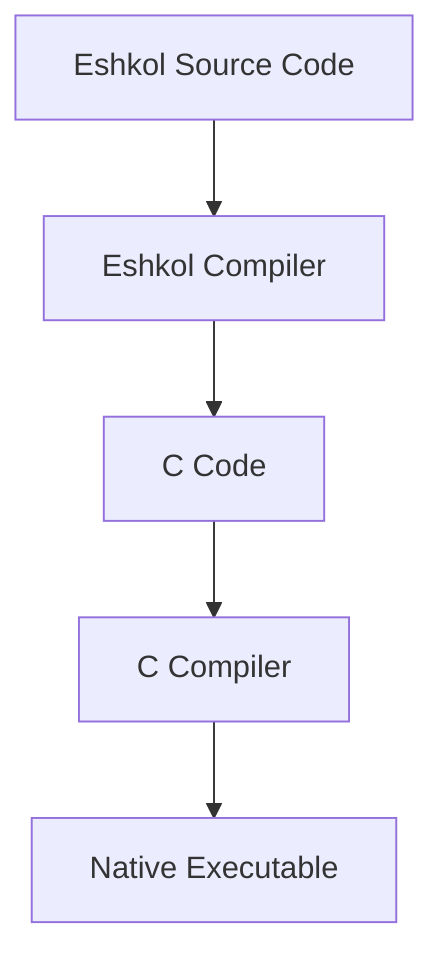

# Compilation Guide for Eshkol

## Table of Contents
- [Overview](#overview)
- [Prerequisites](#prerequisites)
- [Building from Source](#building-from-source)
- [Compilation Process](#compilation-process)
- [Compilation Options](#compilation-options)
- [Optimizations](#optimizations)
- [Cross-Compilation](#cross-compilation)
- [Debugging Compiled Code](#debugging-compiled-code)
- [Common Issues](#common-issues)
- [Advanced Topics](#advanced-topics)

## Overview

This guide explains how to compile Eshkol programs into efficient native executables. Eshkol uses a multi-stage compilation process that transforms high-level Eshkol code into C, which is then compiled to native machine code.



## Prerequisites

Before compiling Eshkol programs, ensure you have the following installed:

- **Eshkol Compiler**: Version 0.1.0 or later
- **C Compiler**: GCC 7+ or Clang 6+
- **Build Tools**: Make, CMake (3.10+)
- **Development Libraries**:
  - LLVM (optional, for advanced optimizations)
  - BLAS/LAPACK (for scientific computing)

### Installing Prerequisites

#### Ubuntu/Debian

```bash
sudo apt-get update
sudo apt-get install build-essential cmake llvm-dev liblapack-dev
```

#### macOS

```bash
brew install llvm cmake openblas
```

#### Windows

```bash
# Using Chocolatey
choco install llvm cmake make
```

## Building from Source

If you need to build the Eshkol compiler from source:

```bash
# Clone the repository
git clone https://github.com/openSVM/eshkol.git
cd eshkol

# Create build directory
mkdir build
cd build

# Configure with CMake
cmake ..

# Build
make

# Install (optional)
sudo make install
```

## Compilation Process

### Basic Compilation

To compile a simple Eshkol program:

```bash
# Create hello.esk
echo '(display "Hello, Eshkol!")' > hello.esk

# Compile
eshkol hello.esk

# Run
./hello
```

### Compilation Stages

The Eshkol compilation process involves several stages:

1. **Parsing**: Convert Eshkol code to an abstract syntax tree (AST)
2. **Type Checking**: Perform static type analysis
3. **Optimization**: Apply various optimization passes
4. **C Code Generation**: Generate C code from the optimized AST
5. **C Compilation**: Compile the generated C code to native code

You can inspect intermediate outputs with the `--save-temps` flag:

```bash
eshkol compile --save-temps program.esk
```

This will generate:
- `program.ast`: The abstract syntax tree
- `program.ir`: The intermediate representation
- `program.c`: The generated C code
- `program.o`: The compiled object file
- `program`: The final executable

### Multi-File Projects

For larger projects with multiple files:

```bash
# Project structure
project/
├── src/
│   ├── main.esk
│   └── utils.esk
└── include/
    └── types.esk

# Compile
eshkol build --source-dir=src --include-dir=include --output=myapp
```

Alternatively, use a build file:

```scheme
;; build.esk
(define-project "MyApp"
  (sources "src/main.esk" "src/utils.esk")
  (includes "include")
  (output "myapp"))
```

Then compile with:

```bash
eshkol build build.esk
```

## Compilation Options

### Basic Options

```bash
# Specify output file
eshkol compile program.esk -o program_name

# Set optimization level (0-3)
eshkol compile program.esk -O2

# Include debug information
eshkol compile program.esk -g

# Specify include directories
eshkol compile program.esk -I/path/to/includes

# Link with libraries
eshkol compile program.esk -lm -lblas
```

### Advanced Options

```bash
# Generate only C code without compiling
eshkol compile --emit=c program.esk

# Specify C compiler
eshkol compile --cc=clang program.esk

# Pass flags to C compiler
eshkol compile --cflags="-march=native -ffast-math" program.esk

# Control SIMD vectorization
eshkol compile --simd=avx2 program.esk

# Enable specific optimizations
eshkol compile --inline --unroll-loops program.esk
```

## Optimizations

Eshkol provides several optimization levels:

- `-O0`: No optimization (fastest compilation, slowest execution)
- `-O1`: Basic optimizations
- `-O2`: Moderate optimizations (recommended)
- `-O3`: Aggressive optimizations (may increase code size)

### Optimization Passes

The following optimization passes are applied at different levels:

| Optimization | -O1 | -O2 | -O3 |
|--------------|-----|-----|-----|
| Constant folding | ✓ | ✓ | ✓ |
| Dead code elimination | ✓ | ✓ | ✓ |
| Function inlining | | ✓ | ✓ |
| Loop unrolling | | | ✓ |
| SIMD vectorization | | ✓ | ✓ |
| Type specialization | ✓ | ✓ | ✓ |
| Memory optimizations | | ✓ | ✓ |

### Profile-Guided Optimization

For maximum performance, use profile-guided optimization (PGO):

```bash
# Step 1: Compile with instrumentation
eshkol compile --profile-gen program.esk -o program

# Step 2: Run the program to collect profile data
./program
# This generates program.profdata

# Step 3: Recompile using the profile data
eshkol compile --profile-use program.esk -o program
```

## Cross-Compilation

Eshkol supports cross-compilation for different target platforms:

```bash
# Cross-compile for ARM
eshkol compile --target=arm-linux-gnueabihf program.esk

# Cross-compile for Windows from Linux
eshkol compile --target=x86_64-w64-mingw32 program.esk

# Cross-compile for macOS from Linux
eshkol compile --target=x86_64-apple-darwin program.esk
```

### Using Docker for Cross-Compilation

For reliable cross-compilation, you can use Docker:

```bash
# Create a Dockerfile
cat > Dockerfile << EOF
FROM ubuntu:20.04
RUN apt-get update && apt-get install -y build-essential cmake
COPY . /app
WORKDIR /app
EOF

# Build the Docker image
docker build -t eshkol-build .

# Compile inside Docker
docker run -v $(pwd):/app eshkol-build eshkol compile program.esk
```

## Debugging Compiled Code

### Generating Debug Information

To include debug information in your compiled program:

```bash
eshkol compile -g program.esk
```

### Using GDB

```bash
# Compile with debug info
eshkol compile -g program.esk

# Debug with GDB
gdb ./program

# Common GDB commands
(gdb) break main
(gdb) run
(gdb) next
(gdb) print variable_name
(gdb) backtrace
```

### Memory Debugging

For memory debugging, use Valgrind:

```bash
# Compile with debug info
eshkol compile -g program.esk

# Run with Valgrind
valgrind --leak-check=full ./program
```

## Common Issues

### Compilation Errors

#### Type Errors

```
Error: Type mismatch at line 10, column 5
Expected: Number
Found: String
```

**Solution**: Check your type annotations and ensure type compatibility.

#### Undefined References

```
Error: Undefined reference to 'function_name'
```

**Solution**: Ensure all functions are defined or imported before use.

#### Memory Management Errors

```
Error: Arena already destroyed at line 25, column 10
```

**Solution**: Check your arena lifetime management.

### Runtime Errors

#### Segmentation Faults

**Cause**: Usually due to memory access issues.
**Solution**: Compile with `-g` and use GDB to identify the problem.

#### Stack Overflow

**Cause**: Excessive recursion or large stack allocations.
**Solution**: Use tail recursion or increase stack size with `--stack-size=16m`.

#### Performance Issues

**Cause**: Suboptimal code or missing optimizations.
**Solution**: Use profiling tools to identify bottlenecks:

```bash
# Compile with profiling
eshkol compile -pg program.esk

# Run the program
./program

# Analyze with gprof
gprof ./program gmon.out > analysis.txt
```

## Advanced Topics

### Custom Memory Allocators

You can specify custom memory allocators for your program:

```bash
eshkol compile --allocator=jemalloc program.esk
```

### Link-Time Optimization

Enable link-time optimization for better performance:

```bash
eshkol compile --lto program.esk
```

### Embedding Resources

To embed resources in your executable:

```bash
eshkol compile --embed-resource=data.txt program.esk
```

Access the resource in your code:

```scheme
(define data (get-embedded-resource "data.txt"))
```

### Creating Libraries

To create a shared library:

```bash
eshkol compile --shared -o libmylib.so library.esklib
```

To create a static library:

```bash
eshkol compile --static -o libmylib.a library.esklib
```

### Compiler Plugins

Extend the compiler with plugins:

```bash
# Install a plugin
eshkol plugin install my-plugin

# Use the plugin during compilation
eshkol compile --plugin=my-plugin program.esk
```

For more information on specific aspects of the Eshkol language, refer to the following documentation:
- [Getting Started](GETTING_STARTED.md)
- [Memory Management](MEMORY_MANAGEMENT.md)
- [Type System](TYPE_SYSTEM.md)
- [Compiler Architecture](COMPILER_ARCHITECTURE.md)
- [Vector Operations](VECTOR_OPERATIONS.md)
