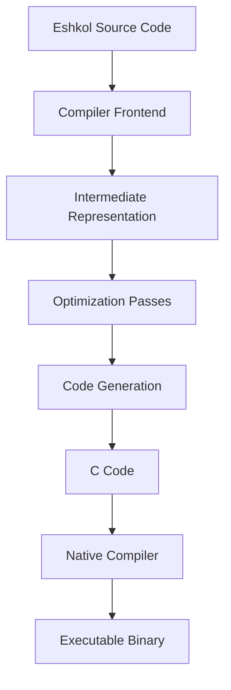

# Compiler Architecture in Eshkol

## Table of Contents
- [Overview](#overview)
- [Compiler Pipeline](#compiler-pipeline)
- [Frontend Components](#frontend-components)
- [Backend Components](#backend-components)
- [Optimization Passes](#optimization-passes)
- [Code Generation](#code-generation)
- [Runtime System](#runtime-system)
- [Performance Considerations](#performance-considerations)
- [Extending the Compiler](#extending-the-compiler)

## Overview

The Eshkol compiler transforms high-level Eshkol code into efficient native binaries through a multi-stage compilation pipeline. It combines traditional compiler techniques with specialized optimizations for scientific computing and automatic differentiation.



## Compiler Pipeline

The Eshkol compiler follows a traditional compilation pipeline with several stages:

1. **Lexical Analysis**: Converts source code into tokens
2. **Parsing**: Builds an abstract syntax tree (AST) from tokens
3. **Semantic Analysis**: Performs type checking and inference
4. **Optimization**: Applies various optimization passes
5. **Code Generation**: Produces C code
6. **Compilation**: Uses a C compiler to generate native code

## Frontend Components

### Lexer

The lexer breaks down Eshkol source code into tokens, handling:

- S-expression delimiters
- Identifiers
- Literals (numbers, strings, etc.)
- Comments

```c
typedef enum {
    TOKEN_LPAREN,
    TOKEN_RPAREN,
    TOKEN_IDENTIFIER,
    TOKEN_NUMBER,
    TOKEN_STRING,
    TOKEN_COMMENT,
    // ...
} TokenType;

typedef struct {
    TokenType type;
    const char* start;
    int length;
    int line;
} Token;
```

### Parser

The parser converts tokens into an abstract syntax tree (AST), handling:

- S-expressions
- Special forms (define, lambda, if, etc.)
- Function calls
- Literals

```c
typedef enum {
    AST_LITERAL,
    AST_IDENTIFIER,
    AST_DEFINE,
    AST_LAMBDA,
    AST_IF,
    AST_CALL,
    // ...
} AstNodeType;

typedef struct AstNode {
    AstNodeType type;
    union {
        // For literals
        struct {
            ValueType value_type;
            union {
                double number;
                char* string;
                bool boolean;
                // ...
            } value;
        } literal;
        
        // For identifiers
        char* identifier;
        
        // For function calls and special forms
        struct {
            struct AstNode* operator;
            struct AstNode** operands;
            int operand_count;
        } call;
        
        // ...
    } as;
} AstNode;
```

### Type Checker

The type checker performs static type analysis, handling:

- Type inference
- Type checking
- Type annotations
- Gradual typing

```c
typedef enum {
    TYPE_ANY,
    TYPE_NUMBER,
    TYPE_STRING,
    TYPE_BOOLEAN,
    TYPE_FUNCTION,
    TYPE_VECTOR,
    TYPE_RECORD,
    // ...
} TypeTag;

typedef struct Type {
    TypeTag tag;
    union {
        // For function types
        struct {
            struct Type* parameter_types;
            int parameter_count;
            struct Type* return_type;
        } function;
        
        // For vector types
        struct Type* element_type;
        
        // For record types
        struct {
            char** field_names;
            struct Type** field_types;
            int field_count;
        } record;
        
        // ...
    } as;
} Type;
```

## Backend Components

### Intermediate Representation (IR)

Eshkol uses a custom IR that represents the program in a form suitable for optimization:

```c
typedef enum {
    IR_CONST,
    IR_VAR,
    IR_ASSIGN,
    IR_CALL,
    IR_IF,
    IR_LOOP,
    IR_RETURN,
    // ...
} IrNodeType;

typedef struct IrNode {
    IrNodeType type;
    Type* result_type;
    // Node-specific data...
    struct IrNode** children;
    int child_count;
} IrNode;
```

### Optimization Manager

The optimization manager orchestrates various optimization passes:

```c
typedef struct {
    bool constant_folding;
    bool dead_code_elimination;
    bool inlining;
    bool loop_unrolling;
    int optimization_level;  // 0-3
    // ...
} OptimizationOptions;

void optimize_ir(IrNode* root, OptimizationOptions options);
```

### C Code Generator

The C code generator produces C code from the optimized IR:

```c
typedef struct {
    bool generate_debug_info;
    bool include_runtime;
    char* output_file;
    // ...
} CodeGenOptions;

void generate_c_code(IrNode* root, CodeGenOptions options);
```

## Optimization Passes

Eshkol implements several optimization passes to improve performance:

### Constant Folding and Propagation

Evaluates constant expressions at compile time:

```scheme
;; Before optimization
(define x (+ 1 2))
(define y (* x 3))

;; After optimization
(define x 3)
(define y 9)
```

### Dead Code Elimination

Removes code that has no effect on the program's output:

```scheme
;; Before optimization
(define (f x)
  (let ((y (expensive-computation x)))
    (if (> x 0)
        (+ x 1)
        y)))
        
(f 5)

;; After optimization (when x > 0 is known)
(define (f x)
  (+ x 1))
  
(f 5)
```

### Function Inlining

Replaces function calls with the function body:

```scheme
;; Before optimization
(define (square x) (* x x))
(define (f y) (+ (square y) 1))

;; After optimization
(define (square x) (* x x))
(define (f y) (+ (* y y) 1))
```

### Loop Unrolling

Unrolls loops to reduce loop overhead:

```scheme
;; Before optimization
(for-each (lambda (i) (vector-set! v i i)) (range 0 4))

;; After optimization
(vector-set! v 0 0)
(vector-set! v 1 1)
(vector-set! v 2 2)
(vector-set! v 3 3)
```

### SIMD Vectorization

Automatically vectorizes operations using SIMD instructions:

```scheme
;; Before optimization
(define (vector-add v1 v2)
  (let ((result (make-vector (vector-length v1))))
    (for-each (lambda (i)
                (vector-set! result i
                             (+ (vector-ref v1 i)
                                (vector-ref v2 i))))
              (range 0 (vector-length v1)))
    result))

;; After optimization (conceptual C code)
void vector_add(float* result, float* v1, float* v2, int n) {
    for (int i = 0; i < n; i += 4) {
        __m128 a = _mm_load_ps(&v1[i]);
        __m128 b = _mm_load_ps(&v2[i]);
        __m128 r = _mm_add_ps(a, b);
        _mm_store_ps(&result[i], r);
    }
}
```

### Type-Directed Optimizations

Uses type information to optimize operations:

```scheme
;; Before optimization
(define (add x y) (+ x y))

;; After optimization with type information
;; When x and y are known to be integers:
int add(int x, int y) {
    return x + y;
}

;; When x and y are known to be floats:
float add(float x, float y) {
    return x + y;
}
```

## Code Generation

The Eshkol compiler generates C code as an intermediate step before producing native binaries. This approach leverages existing C compilers for platform-specific optimizations while allowing Eshkol to focus on high-level optimizations.

### C Code Structure

Generated C code typically includes:

1. Runtime library inclusion
2. Type definitions
3. Function declarations
4. Global variable definitions
5. Function implementations

Example of generated C code:

```c
// Generated from Eshkol source
#include "eshkol_runtime.h"

// Type definitions
typedef struct {
    double x;
    double y;
} Point;

// Function declarations
double distance(Point p1, Point p2);
void process_points(Point* points, int count);

// Global variables
Arena* global_arena;

// Function implementations
double distance(Point p1, Point p2) {
    double dx = p1.x - p2.x;
    double dy = p1.y - p2.y;
    return sqrt(dx * dx + dy * dy);
}

void process_points(Point* points, int count) {
    for (int i = 0; i < count; i++) {
        // Process each point
    }
}

int main() {
    global_arena = create_arena(1024 * 1024);
    
    // Main program logic
    
    destroy_arena(global_arena);
    return 0;
}
```

### Compilation Process

The final compilation process:

```bash
# 1. Eshkol compiler generates C code
eshkol compile -c program.esk -o program.esk.c

# 2. C compiler compiles to native code
gcc program.esk.c -o program -leshkol_runtime
```

## Runtime System

The Eshkol runtime system provides essential services to compiled programs:

### Memory Management

The arena-based memory management system:

```c
// Arena creation and destruction
Arena* create_arena(size_t initial_size);
void destroy_arena(Arena* arena);

// Memory allocation
void* arena_alloc(Arena* arena, size_t size);
void* arena_realloc(Arena* arena, void* ptr, size_t new_size);

// Arena statistics
size_t arena_used_memory(Arena* arena);
size_t arena_total_memory(Arena* arena);
```

### Type System Runtime

Runtime type checking for gradual typing:

```c
// Type checking
bool check_type(Value value, Type* type);
void type_error(const char* message);

// Type representation
Type* make_function_type(Type* param_types[], int param_count, Type* return_type);
Type* make_vector_type(Type* element_type);
```

### Vector Operations

SIMD-optimized vector operations:

```c
// Vector creation
Vector* make_vector(size_t length, double initial_value);
Vector* vector_copy(Vector* source);

// Vector operations
void vector_add(Vector* result, Vector* a, Vector* b);
void vector_subtract(Vector* result, Vector* a, Vector* b);
double vector_dot(Vector* a, Vector* b);
```

### Automatic Differentiation

Runtime support for automatic differentiation:

```c
// Forward mode
DualNumber* make_dual(double value, double derivative);
DualNumber* dual_add(DualNumber* a, DualNumber* b);
DualNumber* dual_multiply(DualNumber* a, DualNumber* b);

// Reverse mode
Node* make_node(double value);
void backward(Node* output);
double get_gradient(Node* node);
```

## Performance Considerations

### Compilation Flags

Eshkol provides various compilation flags to control optimization:

```bash
# Set optimization level (0-3)
eshkol compile --opt-level=3 program.esk

# Enable/disable specific optimizations
eshkol compile --inline --no-loop-unroll program.esk

# Control SIMD vectorization
eshkol compile --simd=avx2 program.esk
```

### Profiling and Benchmarking

Eshkol includes built-in profiling tools:

```bash
# Compile with profiling
eshkol compile --profile program.esk

# Run the program to collect profile data
./program

# Generate profile report
eshkol profile-report program.profile
```

## Extending the Compiler

### Adding New Optimizations

To add a new optimization pass:

1. Create a new pass implementation:
   ```c
   bool my_optimization_pass(IrNode* root) {
       // Implement the pass
       return true;  // Return true if the IR was modified
   }
   ```

2. Register the pass with the optimization manager:
   ```c
   register_optimization_pass("my_optimization", my_optimization_pass);
   ```

### Adding New Language Features

To add a new language feature:

1. Update the lexer and parser to recognize the new syntax
2. Add semantic analysis rules for the new feature
3. Implement IR generation for the feature
4. Add optimization rules if applicable
5. Update code generation to handle the new feature

### Custom Code Generation Backends

Eshkol supports custom code generation backends:

```c
typedef struct {
    const char* name;
    void (*generate)(IrNode* root, void* options);
    bool (*compile)(const char* source_file, const char* output_file, void* options);
} CodeGenBackend;

void register_backend(CodeGenBackend* backend);
```

For more detailed information on specific compiler components, refer to the following documentation:
- [Memory Management](MEMORY_MANAGEMENT.md)
- [Type System](TYPE_SYSTEM.md)
- [Function Composition](FUNCTION_COMPOSITION.md)
- [Automatic Differentiation](AUTODIFF.md)
- [Vector Operations](VECTOR_OPERATIONS.md)
