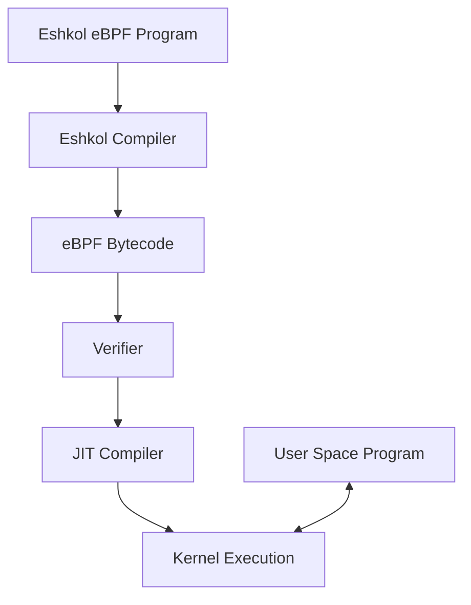

# eBPF Guide for Eshkol

## Table of Contents
- [Overview](#overview)
- [eBPF Basics](#ebpf-basics)
- [Eshkol eBPF Integration](#eshkol-ebpf-integration)
- [Setting Up the Environment](#setting-up-the-environment)
- [Writing eBPF Programs in Eshkol](#writing-ebpf-programs-in-eshkol)
- [Compiling to eBPF](#compiling-to-ebpf)
- [Loading and Running eBPF Programs](#loading-and-running-ebpf-programs)
- [Common Use Cases](#common-use-cases)
- [Debugging eBPF Programs](#debugging-ebpf-programs)
- [Performance Considerations](#performance-considerations)
- [Security Considerations](#security-considerations)
- [Examples](#examples)

## Overview

Eshkol provides first-class support for developing eBPF (extended Berkeley Packet Filter) programs. eBPF is a revolutionary technology that allows running sandboxed programs in the Linux kernel without changing kernel source code or loading kernel modules. This guide explains how to use Eshkol to write, compile, and deploy eBPF programs for networking, security, and performance monitoring applications.



## eBPF Basics

### What is eBPF?

eBPF (extended Berkeley Packet Filter) is a technology that allows running sandboxed programs in the Linux kernel without changing kernel source code or loading kernel modules. It is used for a wide range of applications, including:

- Network packet filtering and manipulation
- Performance monitoring and tracing
- Security policy enforcement
- Kernel and application profiling

### eBPF Architecture

eBPF programs run within the Linux kernel and are triggered by specific events:

1. **Hook Points**: eBPF programs attach to various hook points in the kernel
2. **Bytecode**: Programs are compiled to eBPF bytecode
3. **Verification**: The kernel verifier ensures safety and termination
4. **JIT Compilation**: Bytecode is compiled to native code for performance
5. **Maps**: Shared data structures between kernel and user space

## Eshkol eBPF Integration

Eshkol provides a high-level interface for eBPF development, abstracting away many of the low-level details while maintaining full access to eBPF capabilities.

### Key Features

- **Type-safe eBPF programming**: Leverage Eshkol's type system for safer eBPF programs
- **High-level abstractions**: Write eBPF programs using familiar functional programming patterns
- **Direct compilation**: Compile Eshkol code directly to eBPF bytecode
- **Seamless integration**: Easily communicate between user space and kernel eBPF programs
- **Comprehensive library**: Built-in support for common eBPF maps and helper functions

## Setting Up the Environment

### Prerequisites

To develop eBPF programs with Eshkol, you need:

- Linux kernel 4.18+ (5.0+ recommended)
- Eshkol compiler with eBPF support
- `libbpf` development libraries
- Root privileges or `CAP_BPF` capability

### Installation

```bash
# Install dependencies
sudo apt-get update
sudo apt-get install -y build-essential llvm clang libbpf-dev linux-headers-$(uname -r)

# Install Eshkol with eBPF support
git clone https://github.com/openSVM/eshkol.git
cd eshkol
make ebpf-support
sudo make install
```

### Verifying Installation

```bash
# Check if eBPF is supported
eshkol ebpf-check

# This should output:
# eBPF support: available
# Kernel version: 5.x.x (supported)
# BTF support: available
# CO-RE support: available
```

## Writing eBPF Programs in Eshkol

### Basic Structure

An eBPF program in Eshkol typically consists of:

1. **Program Type Declaration**: Specifies the type of eBPF program
2. **License**: Required for accessing certain kernel functions
3. **Maps Definition**: Shared data structures
4. **Main Function**: The entry point executed when the event occurs

```scheme
;; Define an XDP (eXpress Data Path) program
(define-ebpf-program xdp-drop
  (license "GPL")
  (program-type :xdp)
  
  ;; Define a map to count packets
  (define-map packet-counter :array
    (key-type :u32)
    (value-type :u64)
    (max-entries 1))
  
  ;; Main function
  (define (xdp-main ctx)
    ;; Increment counter
    (let ((key 0)
          (counter (map-lookup packet-counter key)))
      (if counter
          (map-update packet-counter key (+ counter 1))))
    
    ;; Drop the packet
    :xdp-drop))
```

### Program Types

Eshkol supports various eBPF program types:

```scheme
;; XDP program for high-performance packet processing
(define-ebpf-program my-xdp
  (program-type :xdp)
  ...)

;; Socket filter program
(define-ebpf-program my-socket-filter
  (program-type :socket-filter)
  ...)

;; Tracepoint program
(define-ebpf-program my-tracepoint
  (program-type :tracepoint)
  (attach-point "syscalls:sys_enter_write")
  ...)

;; kprobe program
(define-ebpf-program my-kprobe
  (program-type :kprobe)
  (attach-point "tcp_v4_connect")
  ...)
```

### Maps

eBPF maps are key-value stores that allow data sharing between eBPF programs and user space:

```scheme
;; Hash map
(define-map connection-table :hash
  (key-type :ipv4-tuple)  ; Custom type for src-ip, dst-ip, src-port, dst-port
  (value-type :u64)       ; Connection ID
  (max-entries 1024))

;; Array map
(define-map statistics :array
  (key-type :u32)
  (value-type :stats-struct)  ; Custom struct
  (max-entries 256))

;; Per-CPU array for better performance
(define-map per-cpu-stats :percpu-array
  (key-type :u32)
  (value-type :u64)
  (max-entries 10))

;; Ring buffer for events
(define-map events :ringbuf
  (size (* 1024 1024)))  ; 1MB buffer
```

### Helper Functions

Eshkol provides wrappers around eBPF helper functions:

```scheme
;; Get current timestamp
(define (get-time)
  (bpf-ktime-get-ns))

;; Print debug information (only works with bpf_trace_printk kernel support)
(define (debug-print fmt . args)
  (bpf-trace-printk fmt args))

;; Get current process ID
(define (get-pid)
  (bpf-get-current-pid-tgid))
```

## Compiling to eBPF

### Basic Compilation

```bash
# Compile Eshkol program to eBPF object file
eshkol compile --target=bpf -o xdp_program.o xdp_program.esh
```

### Compilation Options

```bash
# Enable BTF (BPF Type Format) for better debugging
eshkol compile --target=bpf --btf -o program.o program.esh

# Enable CO-RE (Compile Once, Run Everywhere)
eshkol compile --target=bpf --core -o program.o program.esh

# Set optimization level
eshkol compile --target=bpf -O2 -o program.o program.esh

# Generate LLVM IR for inspection
eshkol compile --target=bpf --emit=llvm-ir -o program.ll program.esh
```

### Inspecting Compiled Programs

```bash
# Show program information
bpftool prog dump xlated name my_program

# Show map information
bpftool map show
```

## Loading and Running eBPF Programs

### User Space Loader

Eshkol generates a user space loader program that loads and manages the eBPF program:

```bash
# Generate both eBPF object and loader
eshkol compile --target=bpf --gen-loader -o program program.esh

# Run the loader
sudo ./program
```

### Manual Loading with Eshkol

```scheme
;; User space program to load and manage eBPF program
(import (eshkol bpf))

(define (main)
  ;; Load the eBPF program
  (let ((prog (bpf-prog-load "program.o" "xdp-main")))
    
    ;; Attach to interface
    (bpf-xdp-attach "eth0" prog)
    
    ;; Read from maps
    (let ((counter (bpf-map-lookup prog "packet-counter" 0)))
      (println "Packet count: " counter))
    
    ;; Wait for Ctrl+C
    (wait-for-signal :sigint)
    
    ;; Detach program
    (bpf-xdp-detach "eth0")))
```

### Using libbpf Directly

For more complex scenarios, you can use libbpf directly:

```c
// Generated C loader
#include <bpf/bpf.h>
#include <bpf/libbpf.h>

int main(int argc, char **argv) {
    struct bpf_object *obj;
    struct bpf_program *prog;
    int prog_fd;
    
    // Load BPF program
    obj = bpf_object__open("program.o");
    bpf_object__load(obj);
    
    // Get program FD
    prog = bpf_object__find_program_by_name(obj, "xdp_main");
    prog_fd = bpf_program__fd(prog);
    
    // Attach to interface
    bpf_xdp_attach(if_nametoindex("eth0"), prog_fd, 0, NULL);
    
    // Main loop
    while (!stop) {
        // Read from maps, process data, etc.
        sleep(1);
    }
    
    // Cleanup
    bpf_xdp_detach(if_nametoindex("eth0"), 0, NULL);
    bpf_object__close(obj);
    
    return 0;
}
```

## Common Use Cases

### Network Packet Filtering (XDP)

```scheme
(define-ebpf-program xdp-firewall
  (license "GPL")
  (program-type :xdp)
  
  ;; Blocklist map
  (define-map blocklist :hash
    (key-type :u32)  ; IP address
    (value-type :u8)  ; Blocked flag
    (max-entries 1024))
  
  (define (xdp-main ctx)
    ;; Parse Ethernet header
    (let ((eth-hdr (parse-eth-header ctx)))
      (if (not eth-hdr)
          :xdp-pass  ; Not an Ethernet frame, pass to stack
          
          ;; Check if it's an IPv4 packet
          (if (not (= (eth-type eth-hdr) :eth-p-ip))
              :xdp-pass  ; Not IPv4, pass to stack
              
              ;; Parse IPv4 header
              (let ((ip-hdr (parse-ipv4-header (eth-payload eth-hdr))))
                (if (not ip-hdr)
                    :xdp-pass  ; Invalid IPv4 header, pass to stack
                    
                    ;; Check if source IP is in blocklist
                    (let ((src-ip (ipv4-src ip-hdr)))
                      (if (map-lookup blocklist src-ip)
                          :xdp-drop  ; Blocked IP, drop packet
                          :xdp-pass)))))))))  ; Not blocked, pass to stack
```

### System Call Tracing

```scheme
(define-ebpf-program syscall-tracer
  (license "GPL")
  (program-type :tracepoint)
  (attach-point "syscalls:sys_enter_execve")
  
  ;; Event map
  (define-map exec-events :ringbuf
    (size (* 1024 1024)))  ; 1MB buffer
  
  ;; Event structure
  (define-struct exec-event
    (pid :u32)
    (comm :char-array 16)
    (filename :char-array 256))
  
  (define (trace-main ctx)
    ;; Get process info
    (let ((pid (bpf-get-current-pid-tgid))
          (event (make-exec-event)))
      
      ;; Fill event data
      (set-exec-event-pid! event pid)
      (bpf-get-current-comm (exec-event-comm event) 16)
      
      ;; Get filename from context
      (let ((filename-ptr (get-syscall-arg ctx 0)))
        (bpf-probe-read-user-str (exec-event-filename event) 256 filename-ptr))
      
      ;; Submit event to ring buffer
      (ringbuf-submit exec-events event)
      
      0)))  ; Return success
```

### Performance Monitoring

```scheme
(define-ebpf-program latency-monitor
  (license "GPL")
  (program-type :kprobe)
  (attach-point "tcp_sendmsg")
  
  ;; Start time map
  (define-map start-times :hash
    (key-type :u64)  ; socket pointer
    (value-type :u64)  ; timestamp
    (max-entries 1024))
  
  ;; Latency histogram
  (define-map latency-hist :histogram
    (key-type :u64)  ; latency bucket
    (value-type :u64)  ; count
    (max-entries 100))
  
  (define (entry-probe ctx)
    ;; Get socket pointer and current time
    (let ((sock-ptr (get-kprobe-arg ctx 0))
          (now (bpf-ktime-get-ns)))
      
      ;; Store start time
      (map-update start-times sock-ptr now)
      
      0))
  
  (define-ebpf-program latency-monitor-return
    (license "GPL")
    (program-type :kretprobe)
    (attach-point "tcp_sendmsg")
    
    (define (return-probe ctx)
      ;; Get socket pointer and current time
      (let ((sock-ptr (get-kprobe-arg ctx 0))
            (now (bpf-ktime-get-ns)))
        
        ;; Get start time
        (let ((start-time (map-lookup start-times sock-ptr)))
          (when start-time
            ;; Calculate latency
            (let ((latency (- now start-time)))
              ;; Update histogram
              (update-histogram latency-hist latency)
              ;; Delete start time
              (map-delete start-times sock-ptr))))
        
        0))))
```

## Debugging eBPF Programs

### Trace Printing

For simple debugging, use `bpf-trace-printk`:

```scheme
(define (debug-print fmt . args)
  (bpf-trace-printk fmt args))

;; In your eBPF program
(debug-print "Processing packet: src=%u dst=%u" src-ip dst-ip)

;; View debug output
;; In shell: sudo cat /sys/kernel/debug/tracing/trace_pipe
```

### BTF and CO-RE

For better debugging, use BTF (BPF Type Format):

```bash
# Compile with BTF support
eshkol compile --target=bpf --btf -o program.o program.esh

# Inspect BTF information
bpftool btf dump file program.o
```

### Verifier Logs

View verifier logs to understand program rejection:

```bash
# Enable verbose logging
eshkol compile --target=bpf --verbose -o program.o program.esh

# Or view logs during loading
sudo cat /sys/kernel/debug/tracing/trace_pipe
```

### Common Debugging Issues

1. **Verifier Rejections**: The eBPF verifier may reject programs for various reasons:
   - Unbounded loops
   - Out-of-bounds memory access
   - Uninitialized variables
   - Stack size limitations

2. **Map Access Issues**: Common problems with maps:
   - Forgetting to check if `map-lookup` returned a valid pointer
   - Not handling concurrent access properly
   - Exceeding map size limits

## Performance Considerations

### Optimizing eBPF Programs

1. **Minimize Packet Processing Time**:
   - Keep XDP programs as simple as possible
   - Avoid complex calculations in the data path
   - Use tail calls for complex logic

2. **Efficient Map Usage**:
   - Use per-CPU maps for high-update scenarios
   - Choose appropriate map types for your use case
   - Consider map size and memory usage

3. **Avoid Unnecessary Work**:
   - Early packet filtering
   - Short-circuit evaluation
   - Batch processing when possible

### Benchmarking

```scheme
(define-ebpf-program benchmark
  (license "GPL")
  (program-type :xdp)
  
  ;; Performance counter map
  (define-map perf-stats :percpu-array
    (key-type :u32)
    (value-type :u64)
    (max-entries 4))
  
  ;; Stat indices
  (define STAT-PACKETS 0)
  (define STAT-BYTES 1)
  (define STAT-START-TIME 2)
  (define STAT-CURRENT-TIME 3)
  
  (define (xdp-main ctx)
    ;; Get packet info
    (let ((data-end (ctx-data-end ctx))
          (data (ctx-data ctx))
          (length (- data-end data)))
      
      ;; Update packet count
      (let ((packets (or (map-lookup perf-stats STAT-PACKETS) 0)))
        (map-update perf-stats STAT-PACKETS (+ packets 1)))
      
      ;; Update byte count
      (let ((bytes (or (map-lookup perf-stats STAT-BYTES) 0)))
        (map-update perf-stats STAT-BYTES (+ bytes length)))
      
      ;; Update timestamp
      (let ((now (bpf-ktime-get-ns))
            (start (or (map-lookup perf-stats STAT-START-TIME) now)))
        (map-update perf-stats STAT-START-TIME start)
        (map-update perf-stats STAT-CURRENT-TIME now))
      
      :xdp-pass)))
```

## Security Considerations

### Privilege Requirements

eBPF programs require elevated privileges:

```bash
# Run with root privileges
sudo ./program

# Or use capabilities
sudo setcap cap_bpf=ep ./program
./program
```

### Limiting eBPF Access

Use seccomp filters to limit eBPF syscall access:

```scheme
(define (apply-seccomp-filter)
  (let ((filter (seccomp-new :allow-all)))
    ;; Only allow specific BPF commands
    (seccomp-rule-add filter :bpf :arg0 :eq :bpf-prog-load)
    (seccomp-rule-add filter :bpf :arg0 :eq :bpf-map-lookup-elem)
    ;; Apply filter
    (seccomp-load filter)))
```

### Secure Coding Practices

1. **Validate All Input**:
   - Check packet boundaries
   - Validate header lengths
   - Verify map lookup results

2. **Limit Resource Usage**:
   - Set reasonable map sizes
   - Avoid excessive memory usage
   - Consider performance impact

3. **Follow Principle of Least Privilege**:
   - Only request necessary permissions
   - Limit program attachment points
   - Use unprivileged eBPF where possible

## Examples

### Traffic Counter

```scheme
;; Traffic counter using XDP
(define-ebpf-program traffic-counter
  (license "GPL")
  (program-type :xdp)
  
  ;; Traffic statistics map
  (define-map traffic-stats :percpu-array
    (key-type :u32)
    (value-type :traffic-stats)
    (max-entries 256))
  
  ;; Stats structure
  (define-struct traffic-stats
    (packets :u64)
    (bytes :u64))
  
  (define (xdp-main ctx)
    ;; Parse Ethernet header
    (let ((eth-hdr (parse-eth-header ctx)))
      (if (not eth-hdr)
          :xdp-pass
          
          ;; Check protocol
          (let ((protocol (eth-type eth-hdr)))
            ;; Get stats for this protocol
            (let ((key protocol)
                  (stats (map-lookup traffic-stats key)))
              (if (not stats)
                  (let ((new-stats (make-traffic-stats 1 (packet-length ctx))))
                    (map-update traffic-stats key new-stats))
                  (begin
                    (set-traffic-stats-packets! stats (+ (traffic-stats-packets stats) 1))
                    (set-traffic-stats-bytes! stats (+ (traffic-stats-bytes stats) (packet-length ctx)))
                    (map-update traffic-stats key stats))))
            
            ;; Pass packet to network stack
            :xdp-pass)))))
```

### Connection Tracker

```scheme
;; TCP connection tracker
(define-ebpf-program conn-tracker
  (license "GPL")
  (program-type :socket-filter)
  
  ;; Connection table
  (define-map connections :hash
    (key-type :connection-tuple)
    (value-type :connection-info)
    (max-entries 1024))
  
  ;; Connection tuple structure
  (define-struct connection-tuple
    (src-ip :u32)
    (dst-ip :u32)
    (src-port :u16)
    (dst-port :u16)
    (protocol :u8))
  
  ;; Connection info structure
  (define-struct connection-info
    (state :u8)
    (packets :u64)
    (bytes :u64)
    (start-time :u64)
    (last-seen :u64))
  
  (define (socket-filter ctx)
    ;; Parse packet headers
    (let ((eth-hdr (parse-eth-header ctx)))
      (if (and eth-hdr (= (eth-type eth-hdr) :eth-p-ip))
          (let ((ip-hdr (parse-ipv4-header (eth-payload eth-hdr))))
            (if (and ip-hdr (= (ipv4-protocol ip-hdr) :ipproto-tcp))
                (let ((tcp-hdr (parse-tcp-header (ipv4-payload ip-hdr))))
                  (if tcp-hdr
                      (begin
                        ;; Create connection tuple
                        (let ((tuple (make-connection-tuple
                                      (ipv4-src ip-hdr)
                                      (ipv4-dst ip-hdr)
                                      (tcp-src-port tcp-hdr)
                                      (tcp-dst-port tcp-hdr)
                                      :ipproto-tcp)))
                          
                          ;; Update connection info
                          (let ((now (bpf-ktime-get-ns))
                                (info (map-lookup connections tuple)))
                            (if (not info)
                                ;; New connection
                                (let ((new-info (make-connection-info
                                                 (tcp-flags->state tcp-hdr)
                                                 1
                                                 (packet-length ctx)
                                                 now
                                                 now)))
                                  (map-update connections tuple new-info))
                                ;; Existing connection
                                (begin
                                  (set-connection-info-state! info (tcp-flags->state tcp-hdr))
                                  (set-connection-info-packets! info (+ (connection-info-packets info) 1))
                                  (set-connection-info-bytes! info (+ (connection-info-bytes info) (packet-length ctx)))
                                  (set-connection-info-last-seen! info now)
                                  (map-update connections tuple info)))))
                        
                        ;; Accept packet
                        -1)
                      0))
                0))
          0))))
```

### System Call Auditing

```scheme
;; System call auditing
(define-ebpf-program syscall-audit
  (license "GPL")
  (program-type :tracepoint)
  (attach-point "raw_syscalls:sys_enter")
  
  ;; Event ring buffer
  (define-map events :ringbuf
    (size (* 1024 1024)))
  
  ;; Event structure
  (define-struct syscall-event
    (timestamp :u64)
    (pid :u32)
    (uid :u32)
    (syscall-id :u64)
    (args :u64-array 6)
    (comm :char-array 16))
  
  (define (trace-main ctx)
    ;; Get syscall info
    (let ((syscall-id (get-syscall-id ctx))
          (pid (bpf-get-current-pid-tgid))
          (uid (bpf-get-current-uid-gid))
          (now (bpf-ktime-get-ns)))
      
      ;; Create event
      (let ((event (make-syscall-event)))
        (set-syscall-event-timestamp! event now)
        (set-syscall-event-pid! event pid)
        (set-syscall-event-uid! event uid)
        (set-syscall-event-syscall-id! event syscall-id)
        
        ;; Get arguments
        (for-each (lambda (i)
                    (set-syscall-event-args! event i (get-syscall-arg ctx i)))
                  (range 0 6))
        
        ;; Get process name
        (bpf-get-current-comm (syscall-event-comm event) 16)
        
        ;; Submit event
        (ringbuf-submit events event)
        
        0))))
```

For more information on specific aspects of Eshkol, refer to the following documentation:
- [Getting Started](GETTING_STARTED.md)
- [Compiler Architecture](COMPILER_ARCHITECTURE.md)
- [Compilation Guide](COMPILATION_GUIDE.md)
