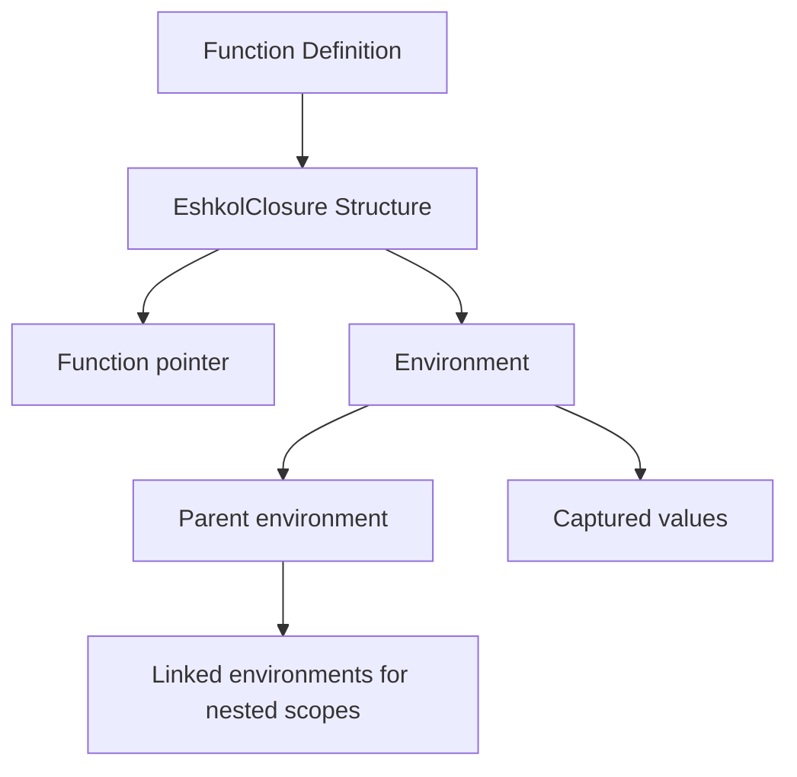

# Function Composition in Eshkol

## Table of Contents
- [Overview](#overview)
- [Closure Implementation](#closure-implementation)
- [Core Components](#core-components)
- [Code Examples](#code-examples)
- [Best Practices](#best-practices)
- [Performance Considerations](#performance-considerations)
- [Troubleshooting](#troubleshooting)

## Overview of Function Composition

Function composition is a core feature of Eshkol, allowing developers to build complex operations by combining simpler functions. This functional programming approach enables cleaner, more modular code with improved reusability.

```mermaid
graph TD
    A[Function f] --> C[Composition f ∘ g]
    B[Function g] --> C
    C --> D[Result: f(g(x))]
```

## Closure Implementation

Closures in Eshkol are implemented using a combination of function pointers and environment structures. This allows functions to capture and retain access to variables from their defining scope.



## Core Components

### 1. **EshkolClosure Structure**: Contains a function pointer and an environment

```c
typedef struct {
    void* (*function)(void**, EshkolEnvironment*);  // Function pointer
    EshkolEnvironment* environment;                // Captured environment
} EshkolClosure;
```

### 2. **EshkolEnvironment**: Stores captured variables and their values

```c
typedef struct EshkolEnvironment {
    struct EshkolEnvironment* parent;  // Parent environment
    void** values;                     // Captured values
    size_t value_count;                // Number of values
} EshkolEnvironment;
```

### 3. **Environment Chain**: Linked environments for nested scopes

```c
// Parent environment
EshkolEnvironment* parent = create_environment(NULL);
// Child environment with access to parent
EshkolEnvironment* child = create_environment(parent);
```

## Code Examples

### Basic Function Composition

```scheme
;; Define two simple functions
(define (square x) (* x x))
(define (add-one x) (+ x 1))

;; Compose them: first add-one, then square
(define square-after-add-one (compose square add-one))

;; Usage
(square-after-add-one 4)  ; Returns 25: (4+1)^2 = 5^2 = 25
```

### Creating and Using Closures

```scheme
;; Create a function that captures its environment
(define (make-adder n)
  (lambda (x) (+ x n)))

;; Create closures with different captured values
(define add-five (make-adder 5))
(define add-ten (make-adder 10))

;; Usage
(add-five 3)  ; Returns 8
(add-ten 3)   ; Returns 13
```

### Advanced Composition with Multiple Arguments

```scheme
;; Define a function that takes multiple arguments
(define (weighted-sum a b weight)
  (+ (* a weight) (* b (- 1 weight))))

;; Partially apply the function to create a new function
(define (make-weighted-averager weight)
  (lambda (a b) (weighted-sum a b weight)))

;; Create specific averagers
(define equal-weight (make-weighted-averager 0.5))
(define favor-first (make-weighted-averager 0.8))

;; Usage
(equal-weight 10 20)  ; Returns 15: 10*0.5 + 20*0.5
(favor-first 10 20)   ; Returns 12: 10*0.8 + 20*0.2
```

## Best Practices

### 1. Keep Functions Pure

Pure functions (those without side effects) are easier to compose and reason about:

```scheme
;; Good: Pure function
(define (add-tax price tax-rate)
  (* price (+ 1 tax-rate)))

;; Bad: Impure function with side effects
(define (add-tax-and-log price tax-rate)
  (let ((result (* price (+ 1 tax-rate))))
    (println "Tax added: " result)
    result))
```

### 2. Use Partial Application for Flexibility

```scheme
;; Create a general-purpose formatter
(define (format-number num decimals)
  (string-format "%.{decimals}f" num))

;; Create specialized formatters through partial application
(define format-currency (lambda (num) (format-number num 2)))
(define format-percentage (lambda (num) (format-number (* num 100) 1)))
```

### 3. Compose Small, Single-Purpose Functions

```scheme
;; Small, focused functions
(define (parse-int str) (string->number str))
(define (is-even? num) (= (remainder num 2) 0))
(define (format-result x) (if x "even" "odd"))

;; Compose them for a complete operation
(define is-string-even?
  (compose format-result is-even? parse-int))
```

## Performance Considerations

Function composition in Eshkol is designed to be efficient, but there are some considerations:

1. **Closure Creation Cost**: Creating closures has a small overhead due to environment allocation
2. **Call Depth**: Deeply nested function compositions can impact performance
3. **Memory Usage**: Captured environments persist as long as the closure exists

### Optimizing Composition Performance

```scheme
;; Less efficient: Creates intermediate closures
(define f (compose h (compose g (compose f e))))

;; More efficient: Single composition operation
(define f (compose-all h g f e))
```

## Troubleshooting

### Common Issues

#### Issue: Unexpected Variable Values
**Symptom:** Closure captures unexpected variable values
**Cause:** Variables are captured by reference, not by value
**Solution:** Ensure variables have their intended values when the closure is created

```scheme
;; Problematic code
(define (make-functions)
  (let ((functions '()))
    (for-each (lambda (i)
                (set! functions (cons (lambda () i) functions)))
              (range 0 5))
    (reverse functions)))

;; Fixed version
(define (make-functions)
  (let ((functions '()))
    (for-each (lambda (i)
                (let ((captured-i i))  ; Create new binding for each iteration
                  (set! functions (cons (lambda () captured-i) functions))))
              (range 0 5))
    (reverse functions)))
```

#### Issue: Memory Leaks
**Symptom:** Increasing memory usage with many closures
**Cause:** Environments not being released
**Solution:** Limit closure lifetime or manually clear references

```scheme
;; Create a closure with a cleanup function
(define (with-resource resource action)
  (let ((result (action resource)))
    (cleanup resource)  ; Explicitly clean up
    result))
```

#### Issue: Stack Overflow
**Symptom:** Stack overflow with deeply nested compositions
**Cause:** Too many nested function calls
**Solution:** Use tail-call optimization or iterative approaches

```scheme
;; Potentially problematic with deep recursion
(define (map-compose f g lst)
  (if (null? lst)
      '()
      (cons ((compose f g) (car lst))
            (map-compose f g (cdr lst)))))

;; Better: Use tail recursion
(define (map-compose f g lst)
  (let loop ((lst lst) (result '()))
    (if (null? lst)
        (reverse result)
        (loop (cdr lst) 
              (cons ((compose f g) (car lst)) result)))))
```

For more information on function composition and its applications, see the [Compiler Architecture](COMPILER_ARCHITECTURE.md) documentation.
