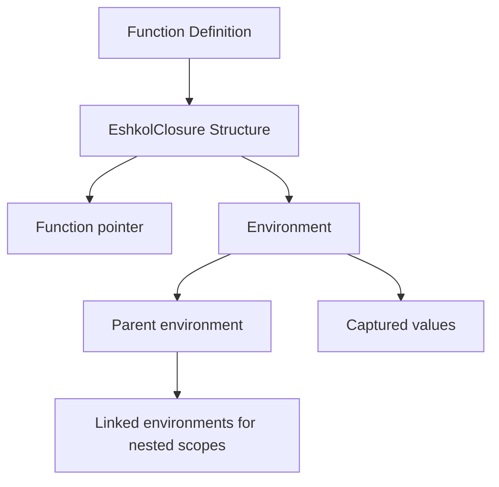

# Function Composition in Eshkol

## Table of Contents
- [Overview](#overview)
- [Closure Implementation](#closure-implementation)
- [Core Components](#core-components)
- [Composition Patterns](#composition-patterns)
- [Code Examples](#code-examples)
- [MCP Tools for Analysis](#mcp-tools-for-analysis)
- [Best Practices](#best-practices)
- [Performance Considerations](#performance-considerations)
- [Troubleshooting](#troubleshooting)

## Overview of Function Composition

Function composition is a core feature of Eshkol, allowing developers to build complex operations by combining simpler functions. This functional programming approach enables cleaner, more modular code with improved reusability.

```mermaid
graph TD
    A[Function f] --> C[Composition f ∘ g]
    B[Function g] --> C
    C --> D[Result: f(g(x))]
```

In Eshkol, function composition is implemented using closures and a dynamic registry system that enables efficient composition of functions with proper environment management.

## Closure Implementation

Closures in Eshkol are implemented using a dynamic registry system that manages function pointers and environment structures. This allows functions to capture and retain access to variables from their defining scope.



The closure system uses a dynamic registry rather than a fixed-size registry, allowing for scalable management of closures and efficient function composition.

## Core Components

### 1. **Dynamic Closure Registry**: Manages closures with a scalable approach

```c
// Dynamic registry for closures
typedef struct {
    EshkolClosure** closures;  // Array of closure pointers
    size_t capacity;           // Current capacity of the array
    size_t count;              // Number of closures in the registry
} ClosureRegistry;
```

### 2. **EshkolClosure Structure**: Contains a function pointer and an environment

```c
// Closure structure
typedef struct {
    ClosureFunction function;  // Direct function pointer
    EshkolEnvironment* environment;
    Type* return_type;
    Type** param_types;
    size_t param_count;
    int registry_index;  // Index in the registry, or -1 if not registered
} EshkolClosure;
```

### 3. **EshkolEnvironment**: Stores captured variables and their values

```c
typedef struct EshkolEnvironment {
    struct EshkolEnvironment* parent;  // Parent environment
    void** values;                     // Captured values
    size_t value_count;                // Number of values
} EshkolEnvironment;
```

### 4. **Specialized Function Composition**: Optimized for composing functions

```c
// Composed function structure
typedef struct {
    EshkolClosure* f;  // First function to apply (outer)
    EshkolClosure* g;  // Second function to apply (inner)
} ComposedFunction;
```

## Composition Patterns

Eshkol supports several function composition patterns:

### 1. **Binary Composition**

The simplest form of composition, combining two functions:

```scheme
(define (compose f g)
  (lambda (x)
    (f (g x))))
```

### 2. **N-ary Composition**

Composing multiple functions in sequence:

```scheme
(define (compose-n . fns)
  (lambda (x)
    (apply-functions (reverse fns) x)))
```

### 3. **Array-based Composition**

Using arrays for efficient composition of multiple functions:

```scheme
(define (make-function-array . fns)
  (let ((size (length fns))
        (fs (list->vector fns)))
    (lambda (x)
      (eval-array fs size x))))
```

### 4. **Dynamic Composition**

Mutable function composition that can be modified at runtime:

```scheme
(define (make-mutable-function-array . fns)
  (let ((fs (list->vector fns)))
    (lambda (op . args)
      (case op
        ((apply) (eval-array fs (vector-length fs) (car args)))
        ((get) (vector-ref fs (car args)))
        ((set!) (vector-set! fs (car args) (cadr args)))
        ((size) (vector-length fs))
        (else (error "Unknown operation" op))))))
```

### 5. **Pipeline Composition**

Left-to-right composition (as opposed to the traditional right-to-left):

```scheme
(define (pipeline . fns)
  (lambda (x)
    (fold (lambda (f acc) (f acc)) x fns)))
```

## Code Examples

### Basic Function Composition

```scheme
;; Define two simple functions
(define (square x) (* x x))
(define (add1 x) (+ x 1))

;; Compose them: first add1, then square
(define square-after-add1 (compose square add1))

;; Usage
(square-after-add1 4)  ; Returns 25: (4+1)^2 = 5^2 = 25
```

### Creating and Using Closures

```scheme
;; Create a function that captures its environment
(define (make-adder n)
  (lambda (x) (+ x n)))

;; Create closures with different captured values
(define add-five (make-adder 5))
(define add-ten (make-adder 10))

;; Usage
(add-five 3)  ; Returns 8
(add-ten 3)   ; Returns 13
```

### Advanced Composition with Multiple Arguments

```scheme
;; Define a function that takes multiple arguments
(define (weighted-sum a b weight)
  (+ (* a weight) (* b (- 1 weight))))

;; Partially apply the function to create a new function
(define (make-weighted-averager weight)
  (lambda (a b) (weighted-sum a b weight)))

;; Create specific averagers
(define equal-weight (make-weighted-averager 0.5))
(define favor-first (make-weighted-averager 0.8))

;; Usage
(equal-weight 10 20)  ; Returns 15: 10*0.5 + 20*0.5
(favor-first 10 20)   ; Returns 12: 10*0.8 + 20*0.2
```

### Triple Composition

```scheme
;; Create a triple composition
(define add1-then-square-then-double 
  (compose double (compose square add1)))

;; Usage
(add1-then-square-then-double 4)  ; Returns 50: double(square(add1(4))) = double(square(5)) = double(25) = 50
```

## MCP Tools for Analysis

Eshkol provides MCP tools for analyzing function composition patterns and performance:

### 1. **analyze-composition-chains**

Analyzes function composition patterns in Eshkol code:

```bash
use_mcp_tool eshkol-tools analyze-composition-chains '{"filePath": "examples/function_composition.esk", "detail": "detailed", "format": "mermaid"}'
```

This tool provides insights into:
- Optimization opportunities
- Type issues
- Memory management
- Performance insights
- JIT compilation candidates

### 2. **analyze-binding-access**

Analyzes how bindings are used in function composition:

```bash
use_mcp_tool eshkol-tools analyze-binding-access '{"filePath": "examples/function_composition.esk", "bindingName": "compose"}'
```

### 3. **analyze-lambda-captures**

Analyzes lambda captures in function composition:

```bash
use_mcp_tool eshkol-tools analyze-lambda-captures '{"filePath": "examples/function_composition.esk", "detail": "detailed"}'
```

### 4. **visualize-closure-memory**

Visualizes how closures are represented in memory:

```bash
use_mcp_tool eshkol-tools visualize-closure-memory '{"filePath": "examples/function_composition_closure.esk", "format": "mermaid"}'
```

## Best Practices

### 1. Keep Functions Pure

Pure functions (those without side effects) are easier to compose and reason about:

```scheme
;; Good: Pure function
(define (add-tax price tax-rate)
  (* price (+ 1 tax-rate)))

;; Bad: Impure function with side effects
(define (add-tax-and-log price tax-rate)
  (let ((result (* price (+ 1 tax-rate))))
    (display "Tax added: ")
    (display result)
    (newline)
    result))
```

### 2. Use Partial Application for Flexibility

```scheme
;; Create a general-purpose formatter
(define (format-number num decimals)
  (string-format "%.{decimals}f" num))

;; Create specialized formatters through partial application
(define format-currency (lambda (num) (format-number num 2)))
(define format-percentage (lambda (num) (format-number (* num 100) 1)))
```

### 3. Compose Small, Single-Purpose Functions

```scheme
;; Small, focused functions
(define (parse-int str) (string->number str))
(define (is-even? num) (= (remainder num 2) 0))
(define (format-result x) (if x "even" "odd"))

;; Compose them for a complete operation
(define is-string-even?
  (compose format-result is-even? parse-int))
```

### 4. Consider Memory Management

Be mindful of closure environments and memory usage:

```scheme
;; Use the dynamic closure system for efficient memory management
(define (process-with-cleanup resource processor)
  (let ((result (processor resource)))
    ;; Cleanup is handled automatically by the dynamic closure system
    result))
```

### 5. Use Type Annotations for Complex Compositions

```scheme
;; Type annotations help with complex compositions
(define (compose-typed : ((b -> c) -> (a -> b) -> (a -> c)))
  (lambda (f g)
    (lambda (x)
      (f (g x)))))
```

## Performance Considerations

Function composition in Eshkol is designed to be efficient, with several optimizations:

### 1. **Dynamic Registry**

The dynamic registry system allows for efficient management of closures without the limitations of a fixed-size registry.

### 2. **JIT Compilation**

Eshkol uses JIT compilation for frequently used function compositions, improving performance for hot paths.

### 3. **Optimized Composition Patterns**

Different composition patterns have different performance characteristics:

- **Binary composition**: Simple and efficient for composing two functions
- **N-ary composition**: More flexible but slightly less efficient
- **Array-based composition**: More efficient for composing many functions
- **Pipeline composition**: More intuitive for left-to-right composition

### 4. **Memory Usage Optimization**

```scheme
;; Less efficient: Creates intermediate closures
(define f (compose h (compose g (compose f e))))

;; More efficient: Single composition operation
(define f (compose-n h g f e))
```

## Troubleshooting

### Common Issues

#### Issue: Unexpected Variable Values
**Symptom:** Closure captures unexpected variable values
**Cause:** Variables are captured by reference, not by value
**Solution:** Ensure variables have their intended values when the closure is created

```scheme
;; Problematic code
(define (make-functions)
  (let ((functions '()))
    (for-each (lambda (i)
                (set! functions (cons (lambda () i) functions)))
              (range 0 5))
    (reverse functions)))

;; Fixed version
(define (make-functions)
  (let ((functions '()))
    (for-each (lambda (i)
                (let ((captured-i i))  ; Create new binding for each iteration
                  (set! functions (cons (lambda () captured-i) functions))))
              (range 0 5))
    (reverse functions)))
```

#### Issue: Memory Leaks
**Symptom:** Increasing memory usage with many closures
**Cause:** Environments not being released
**Solution:** Use the dynamic closure system which properly manages memory

```scheme
;; The dynamic closure system handles cleanup automatically
(define (with-resource resource action)
  (let ((result (action resource)))
    ;; Cleanup happens automatically
    result))
```

#### Issue: Stack Overflow
**Symptom:** Stack overflow with deeply nested compositions
**Cause:** Too many nested function calls
**Solution:** Use tail-call optimization or iterative approaches

```scheme
;; Potentially problematic with deep recursion
(define (map-compose f g lst)
  (if (null? lst)
      '()
      (cons ((compose f g) (car lst))
            (map-compose f g (cdr lst)))))

;; Better: Use tail recursion
(define (map-compose f g lst)
  (let loop ((lst lst) (result '()))
    (if (null? lst)
        (reverse result)
        (loop (cdr lst) 
              (cons ((compose f g) (car lst)) result)))))
```

#### Issue: Type Errors in Composition
**Symptom:** Type errors when composing functions
**Cause:** Incompatible function signatures
**Solution:** Use type annotations and the MCP tools to analyze type issues

```scheme
;; Use the analyze-types MCP tool to identify type issues
;; use_mcp_tool eshkol-tools analyze-types '{"filePath": "examples/function_composition.esk", "detail": "detailed"}'

;; Use type annotations to catch errors at compile time
(define (compose-typed : ((b -> c) -> (a -> b) -> (a -> c)))
  (lambda (f g)
    (lambda (x)
      (f (g x)))))
```

For more information on function composition and its applications, see the [Scheme Compatibility](SCHEME_COMPATIBILITY.md) documentation and the [MCP Tools for Scheme](../scheme_compatibility/MCP_TOOLS_FOR_SCHEME.md) documentation.
