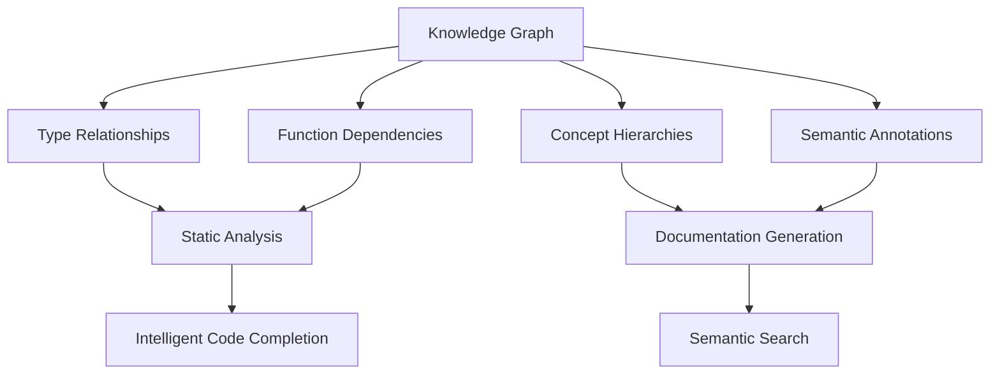
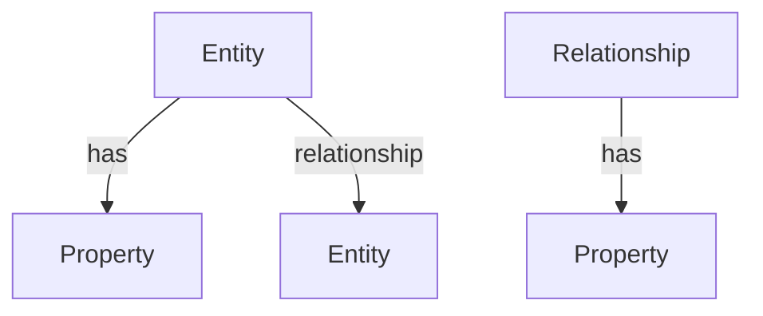

# Knowledge Graph in Eshkol

## Table of Contents
- [Overview](#overview)
- [Knowledge Representation](#knowledge-representation)
- [Graph Structure](#graph-structure)
- [Creating and Manipulating Graphs](#creating-and-manipulating-graphs)
- [Querying the Knowledge Graph](#querying-the-knowledge-graph)
- [Integration with Type System](#integration-with-type-system)
- [Applications](#applications)
- [Performance Considerations](#performance-considerations)
- [Examples](#examples)

## Overview

The Knowledge Graph in Eshkol provides a powerful mechanism for representing and reasoning about relationships between concepts, types, and functions in your code. It serves as a semantic layer that enhances code understanding, enables advanced static analysis, and supports intelligent code generation.



## Knowledge Representation

The Knowledge Graph represents information as a network of entities and relationships, where:

- **Entities** represent concepts, types, functions, variables, etc.
- **Relationships** represent connections between entities (e.g., "implements", "depends on", "is a")
- **Properties** provide additional information about entities and relationships

### Entity Types

```scheme
;; Define entity types
(define-entity-type :Type
  (properties
    (name : String)
    (description : String)
    (source-location : SourceLocation)))

(define-entity-type :Function
  (properties
    (name : String)
    (parameters : List)
    (return-type : Entity)
    (source-location : SourceLocation)))

(define-entity-type :Concept
  (properties
    (name : String)
    (description : String)))
```

### Relationship Types

```scheme
;; Define relationship types
(define-relationship-type :implements
  (properties
    (source : Entity)
    (target : Entity)))

(define-relationship-type :depends-on
  (properties
    (source : Entity)
    (target : Entity)
    (dependency-type : String)))

(define-relationship-type :is-a
  (properties
    (source : Entity)
    (target : Entity)))
```

## Graph Structure

The Knowledge Graph is implemented as a directed property graph, where:



### Internal Representation

```c
typedef struct {
    uint64_t id;
    EntityType type;
    HashMap* properties;
} Entity;

typedef struct {
    uint64_t id;
    RelationshipType type;
    Entity* source;
    Entity* target;
    HashMap* properties;
} Relationship;

typedef struct {
    HashMap* entities;
    HashMap* relationships;
    IndexMap* indices;
} KnowledgeGraph;
```

## Creating and Manipulating Graphs

### Creating a Knowledge Graph

```scheme
;; Create a new knowledge graph
(define graph (make-knowledge-graph))

;; Add entities
(define int-type (add-entity! graph :Type
                             `((name . "Int")
                               (description . "Integer type"))))

(define float-type (add-entity! graph :Type
                               `((name . "Float")
                                 (description . "Floating-point type"))))

(define number-concept (add-entity! graph :Concept
                                  `((name . "Number")
                                    (description . "Numeric value concept"))))

;; Add relationships
(add-relationship! graph :is-a int-type number-concept)
(add-relationship! graph :is-a float-type number-concept)
```

### Modifying the Graph

```scheme
;; Update entity properties
(update-entity! graph int-type
               `((description . "Signed integer type")))

;; Remove entities or relationships
(remove-entity! graph entity-id)
(remove-relationship! graph relationship-id)

;; Merge graphs
(define combined-graph (merge-graphs graph1 graph2))
```

## Querying the Knowledge Graph

Eshkol provides a powerful query language for extracting information from the Knowledge Graph.

### Basic Queries

```scheme
;; Find all entities of a specific type
(define types (query-entities graph :Type))

;; Find entities by property
(define int-entities (query-entities graph :Type '(name . "Int")))

;; Find relationships between entities
(define type-hierarchies (query-relationships graph :is-a))
```

### Path Queries

```scheme
;; Find paths between entities
(define paths (find-paths graph entity1 entity2))

;; Find all entities reachable from a starting point
(define reachable (find-reachable graph start-entity :depends-on))
```

### Pattern Matching

```scheme
;; Match complex patterns in the graph
(define results (match-pattern graph
                              '((:Function ?f) -[:depends-on]-> (:Type ?t))
                              '((:Type ?t) -[:is-a]-> (:Concept "Number"))))
```

## Integration with Type System

The Knowledge Graph integrates deeply with Eshkol's type system, enhancing type checking and inference.

### Type Relationships

```scheme
;; Define type relationships
(define-type Vector
  (properties
    (element-type : Type)))

(add-relationship! graph :parameterized-by
                  (get-entity graph "Vector")
                  (get-entity graph "element-type"))

;; Use in type checking
(define (vector-add v1 v2)
  (let ((type1 (type-of v1))
        (type2 (type-of v2)))
    (if (compatible-types? graph type1 type2)
        (perform-add v1 v2)
        (type-error "Incompatible vector types"))))
```

### Semantic Type Inference

```scheme
;; Infer types based on semantic relationships
(define (infer-return-type graph function args)
  (let* ((param-types (map type-of args))
         (function-entity (get-function-entity graph function))
         (type-rules (query-relationships graph :type-rule function-entity)))
    (apply-type-rules graph type-rules param-types)))
```

## Applications

### Documentation Generation

The Knowledge Graph can automatically generate rich documentation:

```scheme
;; Generate documentation for a type
(define (generate-type-doc graph type-entity)
  (let* ((name (get-property type-entity 'name))
         (description (get-property type-entity 'description))
         (supertypes (query-relationships graph :is-a type-entity))
         (operations (query-relationships graph :operates-on target: type-entity)))
    `(## ,name
       
       ,description
       
       ### Hierarchy
       
       ${(format-hierarchy supertypes)}
       
       ### Operations
       
       ${(format-operations operations)})))
```

### Code Analysis

```scheme
;; Find unused functions
(define (find-unused-functions graph)
  (let* ((all-functions (query-entities graph :Function))
         (used-functions (query-relationships graph :calls target: ?)))
    (filter (lambda (func)
              (not (member func (map relationship-target used-functions))))
            all-functions)))
```

### Semantic Search

```scheme
;; Search for functions by semantic concept
(define (search-by-concept graph concept-name)
  (let* ((concept (query-entities graph :Concept `(name . ,concept-name)))
         (related-types (query-relationships graph :is-a target: concept))
         (functions (query-relationships graph :operates-on
                                       target: (map relationship-source related-types))))
    (map relationship-source functions)))
```

## Performance Considerations

### Optimizing Graph Operations

1. **Use indices** for frequently queried properties:
   ```scheme
   (add-index! graph :Type 'name)
   (add-index! graph :Function 'name)
   ```

2. **Batch operations** for better performance:
   ```scheme
   (with-transaction graph
     (for-each (lambda (entity-data)
                 (add-entity! graph :Type entity-data))
               entity-list))
   ```

3. **Prune unnecessary information**:
   ```scheme
   (prune-graph! graph
                (lambda (entity)
                  (entity-used? entity)))
   ```

### Memory Usage

The Knowledge Graph is designed to be memory-efficient:

```scheme
;; Get memory usage statistics
(define stats (graph-statistics graph))
(display (format "Entities: ~a, Relationships: ~a, Memory: ~a KB\n"
                (stats 'entity-count)
                (stats 'relationship-count)
                (/ (stats 'memory-usage) 1024)))
```

## Examples

### Type System Enhancement

```scheme
;; Define numeric type hierarchy
(define number-concept (add-entity! graph :Concept
                                  `((name . "Number"))))
(define int-type (add-entity! graph :Type
                             `((name . "Int"))))
(define float-type (add-entity! graph :Type
                               `((name . "Float"))))
(define complex-type (add-entity! graph :Type
                                 `((name . "Complex"))))

(add-relationship! graph :is-a int-type number-concept)
(add-relationship! graph :is-a float-type number-concept)
(add-relationship! graph :is-a complex-type number-concept)

;; Define numeric operations
(define add-op (add-entity! graph :Function
                           `((name . "+"))))
(add-relationship! graph :operates-on add-op int-type)
(add-relationship! graph :operates-on add-op float-type)
(add-relationship! graph :operates-on add-op complex-type)

;; Use in type checking
(define (check-numeric-operation op args)
  (let* ((arg-types (map type-of args))
         (numeric-types? (map (lambda (type)
                               (path-exists? graph
                                            (get-type-entity graph type)
                                            number-concept
                                            :is-a))
                             arg-types)))
    (if (all numeric-types?)
        #t
        (type-error "Non-numeric argument in numeric operation"))))
```

### Dependency Analysis

```scheme
;; Build dependency graph
(define (build-dependency-graph program)
  (let ((graph (make-knowledge-graph)))
    (for-each (lambda (func)
                (let ((func-entity (add-entity! graph :Function
                                               `((name . ,(function-name func))))))
                  (for-each (lambda (called-func)
                              (let ((called-entity (ensure-entity! graph :Function
                                                                 `((name . ,called-func)))))
                                (add-relationship! graph :calls func-entity called-entity)))
                            (function-calls func))))
              (program-functions program))
    graph))

;; Find circular dependencies
(define (find-circular-dependencies graph)
  (filter (lambda (path)
            (equal? (car path) (last path)))
          (all-paths graph :calls)))
```

### Semantic Code Generation

```scheme
;; Generate adapter code based on type relationships
(define (generate-adapter graph source-type target-type)
  (let* ((source-entity (get-type-entity graph source-type))
         (target-entity (get-type-entity graph target-type))
         (conversion-path (shortest-path graph source-entity target-entity :convertible-to))
         (conversion-steps (map (lambda (rel)
                                 (get-property rel 'conversion-function))
                               conversion-path)))
    (if (null? conversion-path)
        (error "No conversion path found")
        `(define (convert-,(source-type)->,(target-type) value)
           ,(fold (lambda (step acc)
                   `(,step ,acc))
                 'value
                 conversion-steps)))))
```

For more information on using the Knowledge Graph with other Eshkol features, refer to the following documentation:
- [Type System](TYPE_SYSTEM.md)
- [Compiler Architecture](COMPILER_ARCHITECTURE.md)
- [Function Composition](FUNCTION_COMPOSITION.md)
