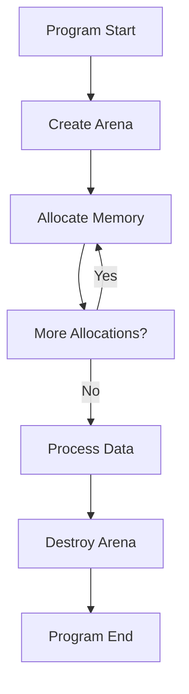
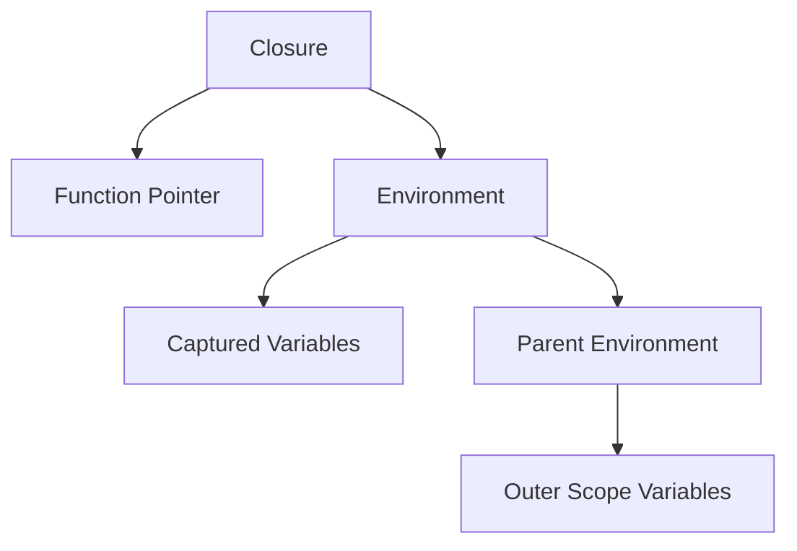
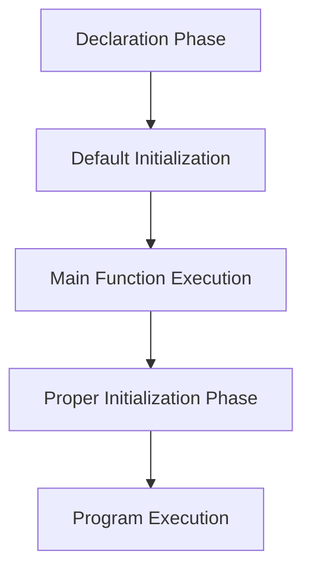

# Memory Management in Eshkol

## Table of Contents
- [Overview](#overview)
- [Arena-Based Memory Allocation](#arena-based-memory-allocation)
- [How Memory Allocation Works](#how-memory-allocation-works)
- [Closure Memory Management](#closure-memory-management)
- [Global Variable Initialization](#global-variable-initialization)
- [Code Examples](#code-examples)
- [Best Practices](#best-practices)
- [Performance Considerations](#performance-considerations)
- [Troubleshooting](#troubleshooting)

## Overview

Eshkol uses arena-based memory allocation instead of traditional garbage collection. This approach provides predictable performance characteristics without the unpredictable pauses associated with garbage collection.

## Arena-Based Memory Allocation



The arena allocator in Eshkol works by pre-allocating large blocks of memory and then distributing smaller chunks from these blocks as needed. When a block is exhausted, a new, larger block is allocated.

```mermaid
subgraph "Arena Internals"
    H[Initial Block] --> I[Block 2]
    I --> J[Block 3]
    J --> K[...]
end

C --> H
```

## How Memory Allocation Works

The arena allocator in Eshkol works by pre-allocating large blocks of memory and then distributing smaller chunks from these blocks as needed. When a block is exhausted, a new, larger block is allocated.

1. When you create an arena, an initial memory block is allocated
2. Allocation requests are served from this block until it's exhausted
3. When more memory is needed, a new block (typically larger) is allocated
4. When the arena is destroyed, all blocks are freed at once

This approach has several advantages:
- No need to track individual allocations
- No memory fragmentation
- Predictable performance (no GC pauses)
- Efficient bulk deallocation

## Closure Memory Management

Closures in Eshkol require specialized memory management because they capture variables from their enclosing scope. The closure system uses a combination of arena allocation and reference counting to manage memory.

### Closure Architecture

Closures consist of two main components:
1. The closure function pointer
2. An environment that contains captured variables



### Closure Memory Allocation

Closures and their environments are typically allocated from an arena:

```c
// Create a closure
EshkolClosure* create_closure(Arena* arena, void* (*fn)(EshkolEnvironment*, void**), EshkolEnvironment* env) {
    EshkolClosure* closure = (EshkolClosure*)arena_alloc(arena, sizeof(EshkolClosure));
    closure->fn = fn;
    closure->env = env;
    return closure;
}

// Create an environment
EshkolEnvironment* create_environment(Arena* arena, EshkolEnvironment* parent, size_t var_count) {
    EshkolEnvironment* env = (EshkolEnvironment*)arena_alloc(arena, sizeof(EshkolEnvironment));
    env->variables = (void**)arena_alloc(arena, sizeof(void*) * var_count);
    env->count = var_count;
    env->parent = parent;
    env->ref_count = 1;  // Initialize reference count
    return env;
}
```

### Reference Counting for Environments

Environments use reference counting to manage their lifetime, especially when they're shared between multiple closures:

```c
// Retain (increment reference count)
void environment_retain(EshkolEnvironment* env) {
    if (env) {
        env->ref_count++;
        if (env->parent) {
            environment_retain(env->parent);  // Also retain parent
        }
    }
}

// Release (decrement reference count)
void environment_release(EshkolEnvironment* env) {
    if (env && --env->ref_count == 0) {
        if (env->parent) {
            environment_release(env->parent);  // Also release parent
        }
        // Environment memory is not freed here because it's in an arena
        // Just cleanup any resources held by captured variables if needed
    }
}
```

### Closure Memory Usage Patterns

Closures typically follow these memory patterns:

1. **Creation**: Allocate closure and environment from an arena
2. **Variable Capture**: Store references to variables in the environment
3. **Sharing**: Multiple closures may share the same environment
4. **Composition**: Composed closures maintain references to their component closures
5. **Invocation**: Closures access their environment during execution
6. **Cleanup**: Reference counting ensures proper cleanup of shared environments

## Global Variable Initialization

Initializing global variables in Eshkol, especially those containing closures, requires special handling due to C language constraints.

### Challenges with Global Variables

1. **C Initialization Limitations**: C doesn't allow non-constant expressions for global variable initialization
2. **Function Calls**: Function calls cannot be used to initialize globals at compile time
3. **Closures in Globals**: Closures cannot be directly initialized in global scope
4. **Initialization Order**: Dependencies between global variables require careful initialization order

### Two-Phase Initialization Approach

To address these challenges, Eshkol uses a two-phase initialization approach:



#### 1. Declaration Phase

Global variables are declared with default values (typically NULL):

```c
// Global variable declarations with NULL initialization
void* global_closure = NULL;
int* global_data = NULL;
```

#### 2. Initialization Phase

Proper initialization happens in the `main` function:

```c
int main() {
    // Initialize arena
    arena = arena_create(1024 * 1024);
    
    // Initialize environment
    env = eshkol_environment_create(NULL, 10, 0);
    
    // Initialize global variables
    global_closure = create_my_closure();
    global_data = create_my_data();
    
    // Rest of program...
    
    return 0;
}
```

### Safe Global Variable Usage

To ensure safety when using global variables:

```c
// Safe function for using global closures
void* call_closure(void* closure, void* arg) {
    if (closure == NULL) {
        fprintf(stderr, "Error: NULL closure in call\n");
        return NULL;
    }
    
    if (eshkol_is_closure(closure)) {
        return eshkol_closure_call((EshkolClosure*)closure, (void*[]){arg});
    } else {
        return ((void* (*)(void*))closure)(arg);
    }
}

// Example usage
void* result = call_closure(global_closure, some_argument);
```

### Static Constructor Approach (Optional)

On platforms that support it, static constructors can provide a cleaner approach:

```c
void* global_closure = NULL;

// Static constructor runs before main
static void __attribute__((constructor)) initialize_globals() {
    arena = arena_create(1024 * 1024);
    env = eshkol_environment_create(NULL, 10, 0);
    global_closure = create_my_closure();
}

// Static destructor runs after main
static void __attribute__((destructor)) cleanup_globals() {
    // Release global resources
    arena_destroy(arena);
}
```

**Note**: This approach is not portable across all platforms and should be used with caution.

## Code Examples

### Basic Arena Usage

```c
// Create an arena with initial block size of 1024 bytes
Arena* arena = create_arena(1024);

// Allocate memory from the arena
char* buffer = (char*)arena_alloc(arena, 100);
strcpy(buffer, "Hello, Eshkol!");

// Use the memory...

// Destroy the arena when done (frees all allocated memory at once)
destroy_arena(arena);
```

### Using Arenas in Eshkol

```scheme
;; Create a new arena
(define arena (make-arena 1024))

;; Allocate memory from the arena
(define data (arena-alloc arena 100))

;; Use the memory...

;; Destroy the arena when done
(destroy-arena arena)
```

### Creating and Using Closures

```scheme
;; Create a simple counter closure
(define (make-counter initial-value)
  (let ((count initial-value))
    (lambda ()
      (set! count (+ count 1))
      count)))

;; Create a counter
(define counter (make-counter 0))

;; Use the counter
(display (counter))  ;; Displays 1
(display (counter))  ;; Displays 2
```

Generated C code (simplified):

```c
void* make_counter(int initial_value) {
    // Create environment
    EshkolEnvironment* env = eshkol_environment_create(arena, 1, NULL);
    
    // Capture variable
    int* count = arena_alloc(arena, sizeof(int));
    *count = initial_value;
    env->variables[0] = count;
    
    // Create and return closure
    return eshkol_closure_create(counter_lambda, env, NULL, NULL, 0);
}

void* counter_lambda(EshkolEnvironment* env, void** args) {
    // Access captured variable
    int* count = (int*)env->variables[0];
    
    // Update count
    *count = *count + 1;
    
    // Return new count
    return (void*)(intptr_t)*count;
}
```

### Global Closure Example

```scheme
;; Define closure creator
(define (identity-maker)
  (lambda (x) x))

;; Global variable to hold closure
(define identity (identity-maker))

;; Use global closure
(display (identity 42))  ;; Displays 42
```

Generated C code:

```c
// Function that creates a closure
void* identity_maker() {
    // Create environment
    EshkolEnvironment* env = eshkol_environment_create(NULL, 0, 2);
    
    // Create and return closure
    return eshkol_closure_create(identity_lambda, env, NULL, NULL, 1);
}

// Lambda function implementation
void* identity_lambda(EshkolEnvironment* env, void** args) {
    void* x = args[0];
    return x;
}

// Global variable declaration
void* identity = NULL;

int main() {
    // Initialize arena
    arena = arena_create(1024 * 1024);
    
    // Initialize environment
    env = eshkol_environment_create(NULL, 10, 0);
    
    // Initialize global variable
    identity = identity_maker();
    
    // Use global closure
    printf("identity(42): %d\n", (int)call_closure(identity, (void*)42));
    
    // Cleanup
    arena_destroy(arena);
    
    return 0;
}
```

### Nested Arenas

```scheme
;; Create a parent arena for long-lived objects
(define parent-arena (make-arena 4096))

;; Function that uses a child arena for temporary allocations
(define (process-data input)
  ;; Create a child arena for temporary allocations
  (define temp-arena (make-arena 1024))
  
  ;; Process data using temporary allocations
  (let* ((temp-buffer (arena-alloc temp-arena 512))
         (result (do-processing input temp-buffer))
         ;; Copy the result to the parent arena
         (final-result (copy-to-arena result parent-arena)))
    
    ;; Destroy the temporary arena
    (destroy-arena temp-arena)
    
    ;; Return the result (which lives in the parent arena)
    final-result))
```

## Best Practices

### 1. Match Arena Lifetimes to Data Lifetimes

Create arenas that match the lifetime of the data they will contain:

```scheme
;; Good: Arena lifetime matches data lifetime
(define (process-request request)
  (define request-arena (make-arena 1024))
  (let ((result (process-with-arena request request-arena)))
    (destroy-arena request-arena)
    result))

;; Bad: Arena outlives its data
(define global-arena (make-arena 1024))
(define (process-request request)
  (process-with-arena request global-arena))
;; Memory will accumulate in global-arena, potentially leading to excessive memory consumption.
```

### 2. Size Arenas Appropriately

```scheme
;; Too small: Will require many block allocations
(define tiny-arena (make-arena 64))

;; Too large: Wastes memory if not fully used
(define huge-arena (make-arena 1024 * 1024 * 100))

;; Just right: Based on expected usage
(define (make-appropriate-arena expected-data-size)
  (make-arena (* expected-data-size 1.5))) ;; 50% buffer
```

### 3. Use Nested Arenas for Different Lifetimes

```scheme
;; Create arenas for different data lifetimes
(define session-arena (make-arena 16384))
(define (handle-request request)
  (define request-arena (make-arena 1024))
  ;; Process request...
  (let ((session-data (extract-session-data request))
        (response-data (generate-response request)))
    ;; Store session data in long-lived arena
    (store-in-session (copy-to-arena session-data session-arena))
    ;; Return response (will be copied out of request-arena)
    (destroy-arena request-arena)
    response-data))
```

### 4. Proper Closure Management

```scheme
;; Create closures with appropriate environment sharing
(define (create-related-closures)
  ;; Create shared environment
  (let ((shared-state 0))
    ;; Return multiple closures that share the environment
    (list
      (lambda () (set! shared-state (+ shared-state 1)) shared-state)
      (lambda () (set! shared-state (- shared-state 1)) shared-state)
      (lambda () shared-state))))
```

### 5. Safe Global Variable Initialization

```scheme
;; Proper initialization in Eshkol
(define (make-processor)
  (lambda (x) (+ x 1)))

;; Global declaration (compiler will initialize to NULL)
(define processor (make-processor))

;; In generated C code, the compiler will:
;; 1. Declare: void* processor = NULL;
;; 2. Initialize in main: processor = make_processor();
;; 3. Use safely: result = call_closure(processor, arg);
```

### 6. Validate Closures Before Use

```scheme
;; In Eshkol code, validation is done automatically
(define (safe-call closure arg)
  (if closure  ; Automatic NULL check
      (closure arg)
      (begin
        (display "Error: NULL closure")
        #f)))
```

In C code, always validate closures before use:

```c
// Helper function for safe closure calls
void* call_closure(void* closure, void* arg) {
    if (closure == NULL) {
        fprintf(stderr, "Error: NULL closure in call\n");
        return NULL;
    }
    
    if (eshkol_is_closure(closure)) {
        return eshkol_closure_call((EshkolClosure*)closure, (void*[]){arg});
    } else {
        return ((void* (*)(void*))closure)(arg);
    }
}
```

## Performance Considerations

1. **Initial Size**: Choose an appropriate initial size to minimize the number of block allocations
2. **Allocation Pattern**: Sequential allocations are more efficient than interleaved allocations from different arenas
3. **Memory Overhead**: Each arena has some overhead, so don't create too many small arenas
4. **Block Growth Strategy**: Eshkol uses a doubling strategy for block sizes, which balances memory usage and allocation cost
5. **Closure Allocation**: Allocating closures is more expensive than regular function calls, but the cost is amortized over multiple uses
6. **Environment Sharing**: Sharing environments between closures reduces memory usage and improves locality

### Benchmarking Arena Performance

```scheme
(define (benchmark-arena-vs-gc iterations)
  (define start-time (current-time))
  
  ;; Arena-based allocation
  (let ((arena (make-arena 1024)))
    (for-each (lambda (_)
                (arena-alloc arena 100))
              (range 0 iterations))
    (destroy-arena arena))
  
  (define arena-time (- (current-time) start-time))
  (set! start-time (current-time))
  
  ;; GC-based allocation
  (for-each (lambda (_)
              (make-bytes 100))
            (range 0 iterations))
  
  (define gc-time (- (current-time) start-time))
  
  (display "Arena time: " arena-time)
  (display "GC time: " gc-time)
  (display "Ratio: " (/ gc-time arena-time)))
```

### Benchmarking Closure Performance

```scheme
(define (benchmark-closure-vs-function iterations)
  ;; Regular function
  (define (increment x) (+ x 1))
  
  ;; Closure equivalent
  (define increment-closure
    (let ((dummy 0))  ;; Force environment creation
      (lambda (x) (+ x 1))))
  
  ;; Benchmark function
  (define start-time (current-time))
  (let loop ((i 0) (result 0))
    (if (< i iterations)
        (loop (+ i 1) (increment result))
        result))
  (define function-time (- (current-time) start-time))
  
  ;; Benchmark closure
  (set! start-time (current-time))
  (let loop ((i 0) (result 0))
    (if (< i iterations)
        (loop (+ i 1) (increment-closure result))
        result))
  (define closure-time (- (current-time) start-time))
  
  (display "Function time: " function-time)
  (display "Closure time: " closure-time)
  (display "Overhead: " (- (/ closure-time function-time) 1.0)))
```

## Troubleshooting

### Common Memory Issues

#### Issue: Memory Leak in Arena
**Symptom:** Program memory usage grows continuously
**Cause:** Arena is not being destroyed after use
**Solution:** Ensure `destroy_arena()` is called when the arena is no longer needed:

```c
void process_data() {
  Arena* arena = create_arena(1024);
  // ... process data ...
  destroy_arena(arena);  // Don't forget this!
}
```

#### Issue: Accessing Freed Memory
**Symptom:** Program crashes with segmentation fault
**Cause:** Accessing memory after arena destruction
**Solution:** Ensure all references to arena-allocated memory are invalidated after arena destruction:

```c
void incorrect_usage() {
  Arena* arena = create_arena(1024);
  char* data = arena_alloc(arena, 100);
  destroy_arena(arena);
  printf("%s", data);  // WRONG: data is invalid after arena destruction
}

void correct_usage() {
  Arena* arena = create_arena(1024);
  char* data = arena_alloc(arena, 100);
  // Copy data if needed beyond arena lifetime
  char* persistent_data = strdup(data);
  destroy_arena(arena);
  printf("%s", persistent_data);
  free(persistent_data);
}
```

#### Issue: Running Out of Memory
**Symptom:** Arena allocation fails
**Cause:** Initial arena size too small or too many allocations
**Solution:** Use larger initial size or create multiple arenas:

```scheme
;; Handle large data sets with appropriate arena size
(define (process-large-data data)
  (define estimated-size (* (length data) 16))  ;; 16 bytes per item estimate
  (define arena (make-arena (max 1024 estimated-size)))
  ;; Process data...
  (destroy-arena arena))
```

#### Issue: Memory Fragmentation
**Symptom:** Inefficient memory usage
**Cause:** Interleaved allocations between different arenas
**Solution:** Group related allocations in the same arena:

```scheme
;; Bad: Interleaved allocations
(define arena1 (make-arena 1024))
(define arena2 (make-arena 1024))
(define a1 (arena-alloc arena1 100))
(define b1 (arena-alloc arena2 100))
(define a2 (arena-alloc arena1 100))
(define b2 (arena-alloc arena2 100))

;; Good: Grouped allocations
(define arena1 (make-arena 1024))
(define arena2 (make-arena 1024))
(define a1 (arena-alloc arena1 100))
(define a2 (arena-alloc arena1 100))
(define b1 (arena-alloc arena2 100))
(define b2 (arena-alloc arena2 100))
```

#### Issue: Null Closure in Global Variable
**Symptom:** "Error: NULL closure in call" message
**Cause:** Global closure variable not properly initialized
**Solution:** Ensure proper two-phase initialization:

```c
// Declaration (compiler generated)
void* global_closure = NULL;

int main() {
  // Initialize environment and arena
  arena = arena_create(1024 * 1024);
  env = eshkol_environment_create(NULL, 10, 0);
  
  // Initialize global closure
  global_closure = create_closure_function();
  
  // Safe usage with validation
  result = call_closure(global_closure, arg);
}
```

#### Issue: Circular References in Closures
**Symptom:** Memory leaks or unexpected behavior
**Cause:** Closures that reference each other creating circular dependencies
**Solution:** Be careful with circular references and use weak references when appropriate:

```scheme
;; Potential circular reference
(define (create-circular)
  (let ((a #f) (b #f))
    (set! a (lambda () b))
    (set! b (lambda () a))
    (cons a b)))

;; Solution: Break the circle or use weak references
(define (create-better)
  (let ((a #f) (b #f))
    (set! a (lambda () (if b (b) #f)))
    (set! b (lambda () (list a)))
    ;; Explicit cleanup function
    (define (cleanup)
      (set! a #f)
      (set! b #f))
    (list a b cleanup)))
```

For more information on memory management and its implementation details, see the [Compiler Architecture](COMPILER_ARCHITECTURE.md) documentation.
