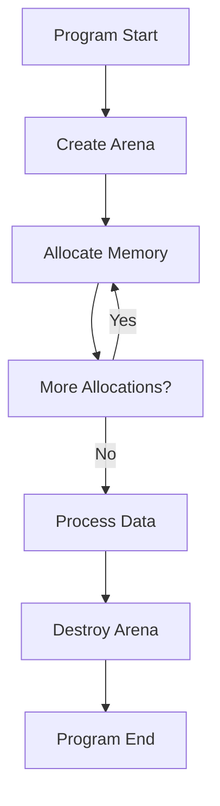

# Memory Management in Eshkol

## Table of Contents
- [Overview](#overview)
- [Arena-Based Memory Allocation](#arena-based-memory-allocation)
- [How Memory Allocation Works](#how-memory-allocation-works)
- [Code Examples](#code-examples)
- [Best Practices](#best-practices)
- [Performance Considerations](#performance-considerations)
- [Troubleshooting](#troubleshooting)

## Overview

Eshkol uses arena-based memory allocation instead of traditional garbage collection. This approach provides predictable performance characteristics without the unpredictable pauses associated with garbage collection.

## Arena-Based Memory Allocation



The arena allocator in Eshkol works by pre-allocating large blocks of memory and then distributing smaller chunks from these blocks as needed. When a block is exhausted, a new, larger block is allocated.

```mermaid
subgraph "Arena Internals"
    H[Initial Block] --> I[Block 2]
    I --> J[Block 3]
    J --> K[...]
end

C --> H
```

## How Memory Allocation Works

The arena allocator in Eshkol works by pre-allocating large blocks of memory and then distributing smaller chunks from these blocks as needed. When a block is exhausted, a new, larger block is allocated.

1. When you create an arena, an initial memory block is allocated
2. Allocation requests are served from this block until it's exhausted
3. When more memory is needed, a new block (typically larger) is allocated
4. When the arena is destroyed, all blocks are freed at once

This approach has several advantages:
- No need to track individual allocations
- No memory fragmentation
- Predictable performance (no GC pauses)
- Efficient bulk deallocation

## Code Examples

### Basic Arena Usage

```c
// Create an arena with initial block size of 1024 bytes
Arena* arena = create_arena(1024);

// Allocate memory from the arena
char* buffer = (char*)arena_alloc(arena, 100);
strcpy(buffer, "Hello, Eshkol!");

// Use the memory...

// Destroy the arena when done (frees all allocated memory at once)
destroy_arena(arena);
```

### Using Arenas in Eshkol

```scheme
;; Create a new arena
(define arena (make-arena 1024))

;; Allocate memory from the arena
(define data (arena-alloc arena 100))

;; Use the memory...

;; Destroy the arena when done
(destroy-arena arena)
```

### Nested Arenas

```scheme
;; Create a parent arena for long-lived objects
(define parent-arena (make-arena 4096))

;; Function that uses a child arena for temporary allocations
(define (process-data input)
  ;; Create a child arena for temporary allocations
  (define temp-arena (make-arena 1024))
  
  ;; Process data using temporary allocations
  (let* ((temp-buffer (arena-alloc temp-arena 512))
         (result (do-processing input temp-buffer))
         ;; Copy the result to the parent arena
         (final-result (copy-to-arena result parent-arena)))
    
    ;; Destroy the temporary arena
    (destroy-arena temp-arena)
    
    ;; Return the result (which lives in the parent arena)
    final-result))
```

## Best Practices

### 1. Match Arena Lifetimes to Data Lifetimes

Create arenas that match the lifetime of the data they will contain:

```scheme
;; Good: Arena lifetime matches data lifetime
(define (process-request request)
  (define request-arena (make-arena 1024))
  (let ((result (process-with-arena request request-arena)))
    (destroy-arena request-arena)
    result))

;; Bad: Arena outlives its data
(define global-arena (make-arena 1024))
(define (process-request request)
  (process-with-arena request global-arena))
;; Memory will accumulate in global-arena, potentially leading to excessive memory consumption.
```

### 2. Size Arenas Appropriately

```scheme
;; Too small: Will require many block allocations
(define tiny-arena (make-arena 64))

;; Too large: Wastes memory if not fully used
(define huge-arena (make-arena 1024 * 1024 * 100))

;; Just right: Based on expected usage
(define (make-appropriate-arena expected-data-size)
  (make-arena (* expected-data-size 1.5))) ;; 50% buffer
```

### 3. Use Nested Arenas for Different Lifetimes

```scheme
;; Create arenas for different data lifetimes
(define session-arena (make-arena 16384))
(define (handle-request request)
  (define request-arena (make-arena 1024))
  ;; Process request...
  (let ((session-data (extract-session-data request))
        (response-data (generate-response request)))
    ;; Store session data in long-lived arena
    (store-in-session (copy-to-arena session-data session-arena))
    ;; Return response (will be copied out of request-arena)
    (destroy-arena request-arena)
    response-data))
```

## Performance Considerations

1. **Initial Size**: Choose an appropriate initial size to minimize the number of block allocations
2. **Allocation Pattern**: Sequential allocations are more efficient than interleaved allocations from different arenas
3. **Memory Overhead**: Each arena has some overhead, so don't create too many small arenas
4. **Block Growth Strategy**: Eshkol uses a doubling strategy for block sizes, which balances memory usage and allocation cost

### Benchmarking Arena Performance

```scheme
(define (benchmark-arena-vs-gc iterations)
  (define start-time (current-time))
  
  ;; Arena-based allocation
  (let ((arena (make-arena 1024)))
    (for-each (lambda (_)
                (arena-alloc arena 100))
              (range 0 iterations))
    (destroy-arena arena))
  
  (define arena-time (- (current-time) start-time))
  (set! start-time (current-time))
  
  ;; GC-based allocation
  (for-each (lambda (_)
              (make-bytes 100))
            (range 0 iterations))
  
  (define gc-time (- (current-time) start-time))
  
  (println "Arena time: " arena-time)
  (println "GC time: " gc-time)
  (println "Ratio: " (/ gc-time arena-time)))
```

## Troubleshooting

### Common Memory Issues

#### Issue: Memory Leak in Arena
**Symptom:** Program memory usage grows continuously
**Cause:** Arena is not being destroyed after use
**Solution:** Ensure `destroy_arena()` is called when the arena is no longer needed:

```c
void process_data() {
  Arena* arena = create_arena(1024);
  // ... process data ...
  destroy_arena(arena);  // Don't forget this!
}
```

#### Issue: Accessing Freed Memory
**Symptom:** Program crashes with segmentation fault
**Cause:** Accessing memory after arena destruction
**Solution:** Ensure all references to arena-allocated memory are invalidated after arena destruction:

```c
void incorrect_usage() {
  Arena* arena = create_arena(1024);
  char* data = arena_alloc(arena, 100);
  destroy_arena(arena);
  printf("%s", data);  // WRONG: data is invalid after arena destruction
}

void correct_usage() {
  Arena* arena = create_arena(1024);
  char* data = arena_alloc(arena, 100);
  // Copy data if needed beyond arena lifetime
  char* persistent_data = strdup(data);
  destroy_arena(arena);
  printf("%s", persistent_data);
  free(persistent_data);
}
```

#### Issue: Running Out of Memory
**Symptom:** Arena allocation fails
**Cause:** Initial arena size too small or too many allocations
**Solution:** Use larger initial size or create multiple arenas:

```scheme
;; Handle large data sets with appropriate arena size
(define (process-large-data data)
  (define estimated-size (* (length data) 16))  ;; 16 bytes per item estimate
  (define arena (make-arena (max 1024 estimated-size)))
  ;; Process data...
  (destroy-arena arena))
```

#### Issue: Memory Fragmentation
**Symptom:** Inefficient memory usage
**Cause:** Interleaved allocations between different arenas
**Solution:** Group related allocations in the same arena:

```scheme
;; Bad: Interleaved allocations
(define arena1 (make-arena 1024))
(define arena2 (make-arena 1024))
(define a1 (arena-alloc arena1 100))
(define b1 (arena-alloc arena2 100))
(define a2 (arena-alloc arena1 100))
(define b2 (arena-alloc arena2 100))

;; Good: Grouped allocations
(define arena1 (make-arena 1024))
(define arena2 (make-arena 1024))
(define a1 (arena-alloc arena1 100))
(define a2 (arena-alloc arena1 100))
(define b1 (arena-alloc arena2 100))
(define b2 (arena-alloc arena2 100))
```

For more information on memory management and its implementation details, see the [Compiler Architecture](COMPILER_ARCHITECTURE.md) documentation.
