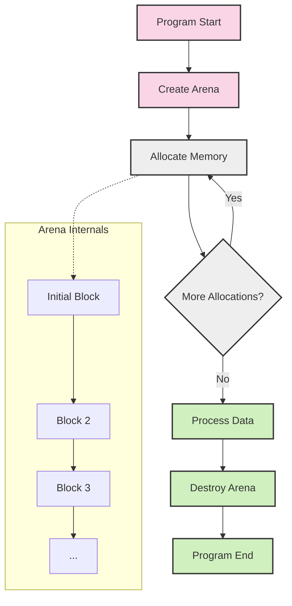

# Memory Management in Eshkol

## Arena-Based Memory Allocation

Eshkol uses arena-based memory allocation instead of traditional garbage collection. This approach provides predictable performance characteristics without the unpredictable pauses associated with garbage collection.



## How Memory Allocation Works

The arena allocator in Eshkol works by pre-allocating large blocks of memory and then distributing smaller chunks from these blocks as needed. When a block is exhausted, a new, larger block is allocated.

### Core Components

1. **Arena Structure**: Manages a linked list of memory blocks
2. **Block Structure**: Contains metadata and a flexible array for actual data
3. **Allocation Functions**: Provide memory from the current block or create new blocks

### Code Example: Arena Creation and Usage

```c
// Create a memory arena with 1MB initial capacity
Arena* arena = arena_create(1024 * 1024);
if (!arena) {
    fprintf(stderr, "Failed to create memory arena\n");
    return 1;
}

// Allocate memory from the arena
void* data1 = arena_alloc(arena, 1000);
void* data2 = arena_alloc(arena, 2000);
void* data3 = arena_alloc_aligned(arena, 4000, 16);  // 16-byte aligned allocation

// Use the allocated memory...

// Free all memory at once
arena_destroy(arena);
```

## Benefits of Arena Allocation

### Performance Advantages

1. **No GC Pauses**: Deterministic performance without garbage collection pauses
2. **Fast Allocation**: Allocation is typically just a pointer increment
3. **Bulk Deallocation**: Free all memory at once with minimal overhead
4. **Cache Locality**: Allocations are contiguous, improving cache performance

### Memory Usage Patterns

```
┌────────────────────────────────────────┐
│ Arena Block 1 (e.g., 1MB)              │
├────────┬────────┬────────┬─────────────┤
│ Alloc 1│ Alloc 2│ Alloc 3│ Free Space  │
└────────┴────────┴────────┴─────────────┘

When Block 1 fills up:

┌────────────────────────────────────────┐
│ Arena Block 1 (e.g., 1MB) - FULL       │
├────────┬────────┬────────┬─────────────┤
│ Alloc 1│ Alloc 2│ Alloc 3│ Alloc 4     │
└────────┴────────┴────────┴─────────────┘

┌────────────────────────────────────────────────────┐
│ Arena Block 2 (e.g., 2MB)                          │
├────────┬────────┬──────────────────────────────────┤
│ Alloc 5│ Alloc 6│ Free Space                       │
└────────┴────────┴──────────────────────────────────┘
```

## Comparison with Traditional Memory Management

| Feature | Arena Allocation | Garbage Collection | Manual Management |
|---------|-----------------|-------------------|-------------------|
| Allocation Speed | Very Fast | Moderate | Fast |
| Deallocation | Bulk only | Automatic | Manual per object |
| Memory Fragmentation | Low | Varies | High |
| Memory Overhead | Low | High | Low |
| Determinism | High | Low | High |
| Ease of Use | Simple API | Transparent | Error-prone |
| Memory Leaks | Only at arena level | Rare | Common |
| Use Case | Short-lived computations | General purpose | Performance-critical |

## Implementation Details

The Eshkol arena allocator is implemented in `src/core/memory/arena.c` and includes the following key functions:

```c
// Create a new arena with the specified initial capacity
Arena* arena_create(size_t initial_capacity);

// Allocate memory from an arena
void* arena_alloc(Arena* arena, size_t size);

// Allocate aligned memory from an arena
void* arena_alloc_aligned(Arena* arena, size_t size, size_t alignment);

// Reset an arena (keep blocks but mark all as free)
void arena_reset(Arena* arena);

// Destroy an arena and free all its memory
void arena_destroy(Arena* arena);

// Get statistics about arena usage
size_t arena_get_used_memory(const Arena* arena);
size_t arena_get_allocation_count(const Arena* arena);
```

## Best Practices

1. **Match Arena Lifetimes to Data Lifetimes**: Create arenas for data with similar lifespans
2. **Size Appropriately**: Choose initial sizes based on expected allocation patterns
3. **Reset vs. Destroy**: Reset arenas for reuse when appropriate instead of destroying and recreating
4. **Avoid Mixing Allocation Methods**: Don't mix `malloc` and arena allocations for related data
5. **Consider Alignment**: Use aligned allocations for SIMD operations and other alignment-sensitive data

## Limitations and Considerations

1. **Individual Deallocation**: Not possible to free individual allocations
2. **Memory Pressure**: Long-lived arenas can hold onto memory longer than necessary
3. **Sizing Challenges**: Choosing optimal initial sizes requires understanding usage patterns
4. **Fragmentation Within Blocks**: Can occur if allocations vary widely in size

## Advanced Usage: Nested Arenas

For complex applications, Eshkol supports creating hierarchical arena structures:

```c
// Create parent arena
Arena* parent_arena = arena_create(1024 * 1024);

// Create child arena for a specific computation
Arena* child_arena = arena_create(64 * 1024);

// Perform computation with child arena
// ...

// Free child arena when computation is complete
arena_destroy(child_arena);

// Parent arena continues to be used
// ...

// Eventually free parent arena
arena_destroy(parent_arena);
```

This approach allows for more fine-grained control over memory lifetimes while maintaining the performance benefits of arena allocation.
