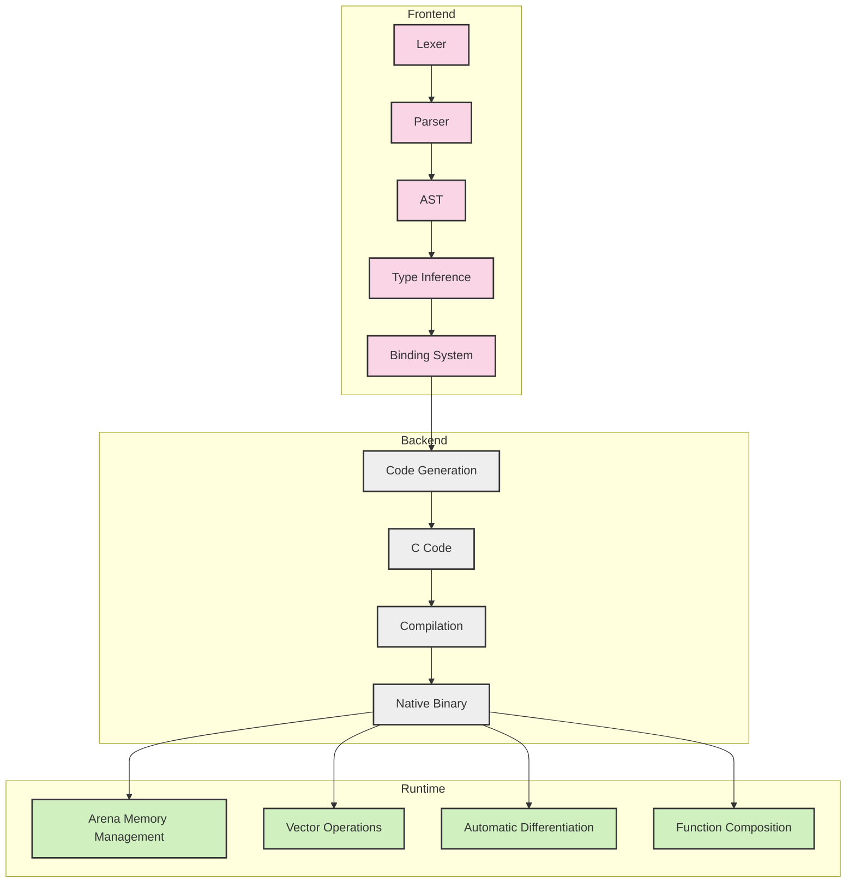

# Eshkol Language Overview

## Core Philosophy and Design Principles

Eshkol is designed around several key principles:

1. **Performance without compromise** - Achieve C-like performance while maintaining high-level language expressiveness
2. **Memory safety without garbage collection** - Use arena-based memory management for predictable performance
3. **Gradual typing** - Combine dynamic and static typing for flexibility and safety
4. **Scientific computing first** - Built-in support for vector operations and automatic differentiation
5. **Scheme-inspired syntax** - Clean, minimal syntax based on S-expressions
6. **Compilation to native code** - Generate efficient C code that compiles to native binaries

## High-Level Architecture



## Key Features and Capabilities

### Arena-Based Memory Management

Eshkol uses arena-based memory allocation instead of traditional garbage collection. This approach offers:

- Predictable performance without GC pauses
- Efficient bulk deallocation
- Reduced memory fragmentation
- Cache-friendly memory layout

```c
// Create a memory arena
Arena* arena = arena_create(1024 * 1024);  // 1MB arena

// Allocate memory from the arena
void* data = arena_alloc(arena, 1000);

// Use the memory...

// Free all memory at once
arena_destroy(arena);
```

### Gradual Typing System

Eshkol supports both dynamic and static typing:

```scheme
;; Dynamic typing (no type annotations)
(define add (lambda (a b) (+ a b)))

;; Static typing (with type annotations)
(define add : (-> (Int Int) Int)
  (lambda (a : Int b : Int) (+ a b)))

;; Type declarations can also be separate
(declare double-value (-> (Float) Float))
(define double-value (lambda (x) (* x 2.0)))
```

### Scientific Computing

Built-in support for vector operations and automatic differentiation:

```scheme
;; Vector operations with SIMD optimization
(define v1 (vector 1.0 2.0 3.0))
(define v2 (vector 4.0 5.0 6.0))
(define v3 (vector-add v1 v2))  ;; [5.0, 7.0, 9.0]

;; Automatic differentiation
(define (f x) (* x x))  ;; f(x) = x²
(define df (gradient f))  ;; df(x) = 2x
(df 3.0)  ;; 6.0
```

### Function Composition

First-class functions and closures:

```scheme
(define (compose f g)
  (lambda (x) (f (g x))))

(define square (lambda (x) (* x x)))
(define add1 (lambda (x) (+ x 1)))

(define square-then-add1 (compose add1 square))
(square-then-add1 5)  ;; 26
```

## Combining Scheme Syntax with C Performance

Eshkol achieves C-like performance while maintaining Scheme's expressiveness by:

1. **Compiling to C** - Eshkol programs are translated to efficient C code
2. **Eliminating runtime overhead** - Static typing allows for direct compilation without boxing/unboxing
3. **SIMD optimization** - Automatic vectorization of mathematical operations
4. **Arena allocation** - Avoiding garbage collection overhead
5. **Function inlining** - Aggressive inlining of small functions
6. **Tail call optimization** - Proper tail calls without stack growth

Example of generated C code:

```c
// Original Eshkol code:
// (define factorial
//   (lambda (n)
//     (if (= n 0)
//         1
//         (* n (factorial (- n 1))))))

int32_t factorial(int32_t n) {
    if (n == 0) {
        return 1;
    } else {
        return n * factorial(n - 1);
    }
}
```

## Use Cases

Eshkol is particularly well-suited for:

- **Scientific computing** - Vector/matrix operations, simulations
- **Machine learning** - Neural networks, gradient-based optimization
- **Systems programming** - High-performance applications
- **Data processing** - Efficient data transformation pipelines
- **Embedded systems** - When compiled with appropriate constraints

## Getting Started

See the [Getting Started Guide](GETTING_STARTED.md) for installation instructions and your first Eshkol program.
