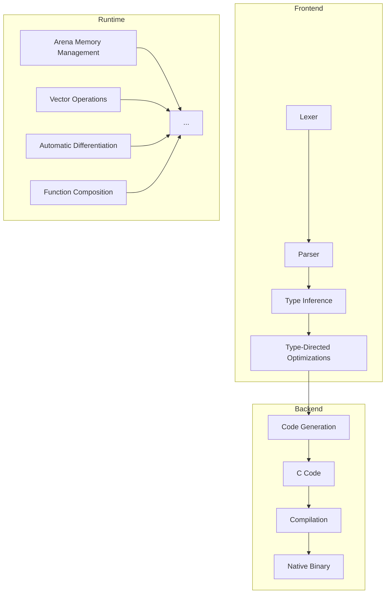

# Eshkol Language Overview

## Table of Contents
- [Core Philosophy and Design Principles](#core-philosophy-and-design-principles)
- [High-Level Architecture](#high-level-architecture)
- [Key Features](#key-features)
- [When to Use Eshkol](#when-to-use-eshkol)
- [Comparison with Other Languages](#comparison-with-other-languages)

## Core Philosophy and Design Principles

Eshkol is designed around several key principles:

1. **Performance without compromise** - Achieve C-like performance while maintaining high-level language expressiveness
2. **Memory safety without garbage collection** - Use arena-based memory management for predictable performance
3. **Gradual typing** - Combine dynamic and static typing for flexibility and safety
4. **Scientific computing first** - Built-in support for vector operations and automatic differentiation
5. **Scheme-inspired syntax** - Clean, minimal syntax based on S-expressions
6. **Compilation to native code** - Generate efficient C code that compiles to native binaries

## High-Level Architecture



## Key Features

### Arena-Based Memory Management

Eshkol uses arena-based memory allocation instead of traditional garbage collection, providing predictable performance without unpredictable pauses.

```scheme
;; Create an arena
(define arena (make-arena 1024))

;; Allocate memory from the arena
(define data (arena-alloc arena 100))

;; Use the memory...

;; Destroy the arena when done
(destroy-arena arena)
```

For more details, see [Memory Management](MEMORY_MANAGEMENT.md).

### Gradual Typing System

Eshkol implements a gradual typing system that combines the flexibility of dynamic typing with the safety and performance of static typing.

```scheme
;; Dynamic typing (no type annotations)
(define add (lambda (a b) (+ a b)))

;; Static typing (with type annotations)
(define multiply : (Int -> Int -> Int)
  (lambda (a b) (* a b)))
```

For more details, see [Type System](TYPE_SYSTEM.md).

### Function Composition

Eshkol provides powerful function composition capabilities, enabling a functional programming style.

```scheme
;; Define two simple functions
(define (square x) (* x x))
(define (add-one x) (+ x 1))

;; Compose them: first add-one, then square
(define square-after-add-one (compose square add-one))

;; Usage
(square-after-add-one 4)  ; Returns 25: (4+1)^2 = 5^2 = 25
```

For more details, see [Function Composition](FUNCTION_COMPOSITION.md).

### Automatic Differentiation

Eshkol includes built-in support for automatic differentiation, making it ideal for machine learning and scientific computing.

```scheme
;; Define a function
(define (f x) (* x x))

;; Compute the derivative
(define df (gradient f))

;; Evaluate the derivative at x = 3
(df 3)  ; Returns 6 (derivative of x^2 is 2x, so 2*3 = 6)
```

For more details, see [Automatic Differentiation](AUTODIFF.md).

## When to Use Eshkol

Eshkol is particularly well-suited for:

1. **Scientific Computing**: The built-in support for vector operations and automatic differentiation makes Eshkol ideal for numerical simulations, data analysis, and scientific modeling.

2. **Machine Learning**: Automatic differentiation, efficient memory management, and high performance make Eshkol suitable for implementing machine learning algorithms.

3. **Systems Programming**: The combination of high-level abstractions with C-like performance makes Eshkol appropriate for systems programming tasks that would traditionally require C or C++.

4. **Performance-Critical Applications**: When you need the expressiveness of a high-level language but can't afford the performance overhead of garbage collection.

## Comparison with Other Languages

| Feature | Eshkol | Scheme | C | Python | Rust |
|---------|--------|--------|---|--------|------|
| Memory Management | Arena-based | Garbage Collection | Manual | Garbage Collection | Ownership |
| Type System | Gradual | Dynamic | Static | Dynamic | Static |
| Performance | High | Medium | High | Low | High |
| Syntax | S-expressions | S-expressions | C-style | Indentation | C-style |
| Automatic Differentiation | Built-in | Library | Library | Library | Library |
| Vector Operations | Built-in | Library | Library | NumPy | Library |
| Compilation | To native code | Interpreted/JIT | To native code | Interpreted | To native code |

### Eshkol vs. Scheme

Eshkol borrows Scheme's elegant syntax and functional programming paradigm but replaces garbage collection with arena-based memory management for more predictable performance. It also adds gradual typing and built-in support for scientific computing.

### Eshkol vs. C

Eshkol provides higher-level abstractions than C (such as closures and automatic differentiation) while maintaining similar performance characteristics. Memory management is simplified through arenas, reducing the risk of memory leaks and use-after-free bugs.

### Eshkol vs. Python

Eshkol offers significantly better performance than Python, especially for numerical computations. While Python relies on external libraries like NumPy and TensorFlow, Eshkol provides built-in support for vector operations and automatic differentiation.

### Eshkol vs. Rust

Both Eshkol and Rust focus on performance and memory safety, but they take different approaches. Rust uses a compile-time ownership system, while Eshkol uses arena-based allocation. Eshkol's syntax is more concise, and its gradual typing system offers more flexibility than Rust's strict static typing.
