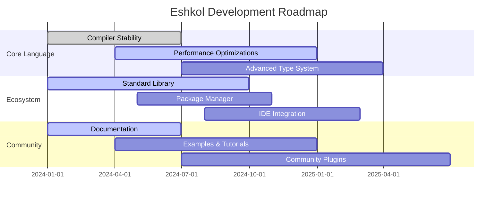

# Eshkol Language Roadmap

## Table of Contents
- [Overview](#overview)
- [Current Status](#current-status)
- [Short-term Goals (0-6 months)](#short-term-goals-0-6-months)
- [Medium-term Goals (6-12 months)](#medium-term-goals-6-12-months)
- [Long-term Goals (12-24 months)](#long-term-goals-12-24-months)
- [Feature Prioritization](#feature-prioritization)
- [Release Schedule](#release-schedule)
- [Community Contributions](#community-contributions)
- [Compatibility Commitments](#compatibility-commitments)

## Overview

This roadmap outlines the planned development trajectory for the Eshkol programming language. It provides a high-level view of our priorities, upcoming features, and long-term vision. The roadmap is a living document that will evolve based on community feedback, technological advancements, and changing requirements.

## Current Status

Eshkol is currently in alpha stage (v0.1.0), with the following components implemented:

- **Core Language Features**
  - Basic syntax and semantics
  - Arena-based memory management
  - Gradual type system
  - Function composition
  - Automatic differentiation

- **Compiler**
  - Frontend (lexer, parser, type checker)
  - Backend (C code generation)
  - Basic optimizations

- **Standard Library**
  - Core data structures
  - Basic I/O operations
  - Vector operations
  - Memory management utilities

- **Documentation**
  - Language overview
  - Core feature documentation
  - API reference

## Short-term Goals (0-6 months)

### 1. Compiler Stability and Performance

- **Bug Fixes and Stability Improvements**
  - Address known compiler bugs
  - Improve error messages and diagnostics
  - Enhance compiler test coverage to >90%

- **Performance Optimizations**
  - Implement function inlining
  - Add loop optimization passes
  - Improve memory allocation patterns
  - Reduce compilation time by 30%

- **Platform Support**
  - Ensure full compatibility with Linux, macOS, and Windows
  - Add CI/CD pipelines for all supported platforms

### 2. Standard Library Enhancements

- **Data Structures**
  - Implement efficient hash maps and sets
  - Add persistent data structures
  - Develop specialized scientific computing containers

- **I/O and Networking**
  - Add asynchronous I/O operations
  - Implement networking primitives
  - Develop file system utilities

- **Concurrency**
  - Implement basic concurrency primitives
  - Add thread-safe data structures
  - Develop work-stealing scheduler

### 3. Developer Experience

- **Tooling**
  - Create a language server protocol (LSP) implementation
  - Develop VS Code extension
  - Build interactive REPL with debugging capabilities

- **Documentation**
  - Complete comprehensive language reference
  - Add interactive tutorials
  - Create cookbook with common patterns and solutions

- **Error Handling**
  - Improve error messages with suggestions
  - Add source location information to runtime errors
  - Implement structured error handling

## Medium-term Goals (6-12 months)

### 1. Advanced Language Features

- **Type System Enhancements**
  - Implement higher-kinded types
  - Add effect system for side-effect tracking
  - Develop refinement types for stronger guarantees

- **Metaprogramming**
  - Add compile-time code generation
  - Implement hygienic macros
  - Develop reflection capabilities

- **Interoperability**
  - Improve C/C++ FFI
  - Add Python interoperability
  - Develop WebAssembly target

### 2. Ecosystem Development

- **Package Manager**
  - Build central package repository
  - Implement dependency resolution
  - Add versioning and compatibility checking

- **Build System**
  - Develop integrated build system
  - Add support for mixed-language projects
  - Implement incremental compilation

- **Testing Framework**
  - Create property-based testing tools
  - Implement fuzzing infrastructure
  - Add code coverage reporting

### 3. Domain-Specific Features

- **Scientific Computing**
  - Optimize numerical algorithms
  - Add specialized tensor operations
  - Implement automatic vectorization

- **Machine Learning**
  - Enhance automatic differentiation
  - Add neural network primitives
  - Implement model serialization

- **Systems Programming**
  - Improve low-level memory control
  - Add inline assembly support
  - Develop OS interface abstractions

## Long-term Goals (12-24 months)

### 1. Advanced Compiler Technology

- **Whole Program Optimization**
  - Implement cross-module inlining
  - Add global data flow analysis
  - Develop specialized optimizations for scientific computing

- **Alternative Backends**
  - Add LLVM backend for improved performance
  - Implement GPU code generation (CUDA/OpenCL)
  - Develop JIT compilation support

- **Formal Verification**
  - Add support for formal proofs
  - Implement property checking
  - Develop verification-friendly subset of the language

### 2. Ecosystem Maturity

- **IDE Support**
  - Enhance debugging capabilities
  - Add refactoring tools
  - Implement visualization for scientific computing

- **Standard Library Expansion**
  - Add comprehensive data science tools
  - Implement graphics and visualization libraries
  - Develop distributed computing support

- **Community Growth**
  - Establish governance model
  - Create contribution guidelines
  - Develop mentorship program

### 3. Industry Adoption

- **Performance Benchmarking**
  - Publish comprehensive benchmarks
  - Optimize for key use cases
  - Demonstrate advantages over existing languages

- **Case Studies**
  - Document success stories
  - Develop reference implementations
  - Create migration guides from other languages

- **Enterprise Features**
  - Add security hardening
  - Implement auditing capabilities
  - Develop deployment tools

## Feature Prioritization

Features are prioritized based on the following criteria:

1. **Impact**: How many users will benefit from the feature
2. **Complexity**: How difficult the feature is to implement
3. **Dependencies**: What other features must be completed first
4. **Community Interest**: Level of community demand for the feature

Current top priorities:

| Feature | Impact | Complexity | Dependencies | Priority |
|---------|--------|------------|--------------|----------|
| Compiler stability | High | Medium | None | P0 |
| Performance optimizations | High | High | Compiler stability | P0 |
| Standard library enhancements | High | Medium | None | P1 |
| LSP implementation | Medium | Medium | None | P1 |
| Package manager | Medium | High | None | P2 |
| Advanced type system | Medium | High | Compiler stability | P2 |

## Release Schedule

Eshkol follows a time-based release schedule with feature-based milestones:

### v0.2.0 (Q2 2024)
- Compiler stability improvements
- Basic standard library enhancements
- Initial LSP implementation
- Comprehensive documentation

### v0.3.0 (Q4 2024)
- Performance optimizations
- Extended standard library
- Package manager beta
- VS Code extension

### v0.4.0 (Q2 2025)
- Advanced type system features
- Metaprogramming capabilities
- Improved interoperability
- Enhanced tooling

### v1.0.0 (Q4 2025)
- API stability
- Comprehensive standard library
- Production-ready performance
- Mature ecosystem

## Community Contributions

We welcome and encourage community contributions in the following areas:

### Documentation and Examples
- Language tutorials
- Example projects
- Best practices guides

### Standard Library
- Data structure implementations
- Algorithm optimizations
- Domain-specific utilities

### Tooling
- Editor integrations
- Development tools
- Build system enhancements

### Compiler
- Bug fixes
- Performance improvements
- New language features (with prior discussion)

## Compatibility Commitments

### Backward Compatibility

- **Alpha Phase (v0.x)**: No backward compatibility guarantees
- **Beta Phase (v0.5.0 - v0.9.x)**: Best-effort compatibility, breaking changes announced in advance
- **Stable Release (v1.0.0+)**: Strong backward compatibility guarantees with deprecation cycles

### Platform Support

- **Tier 1 Platforms** (fully supported):
  - Linux (x86_64, aarch64)
  - macOS (x86_64, Apple Silicon)
  - Windows (x86_64)

- **Tier 2 Platforms** (best effort):
  - FreeBSD
  - Linux (arm32, riscv64)
  - Windows (arm64)

- **Tier 3 Platforms** (community maintained):
  - Other Unix-like systems
  - Embedded platforms
  - WebAssembly

For more information on contributing to Eshkol or to discuss the roadmap, please join our community channels:
- GitHub Discussions: [github.com/openSVM/eshkol/discussions](https://github.com/openSVM/eshkol/discussions)
- Discord: [discord.gg/eshkol](https://discord.gg/eshkol)
- Mailing List: [eshkol-dev@googlegroups.com](mailto:eshkol-dev@googlegroups.com)
