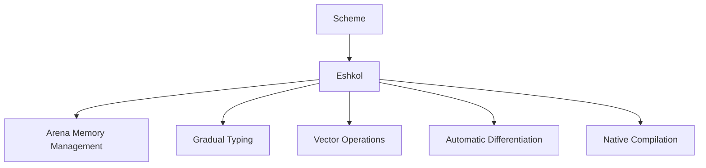

# Scheme Compatibility in Eshkol

## Table of Contents
- [Overview](#overview)
- [R5RS Compatibility](#r5rs-compatibility)
- [R7RS-small Compatibility](#r7rs-small-compatibility)
- [Differences from Standard Scheme](#differences-from-standard-scheme)
- [Importing Scheme Code](#importing-scheme-code)
- [Eshkol Extensions to Scheme](#eshkol-extensions-to-scheme)
- [Migration Guide](#migration-guide)
- [Interoperability](#interoperability)

## Overview

Eshkol is heavily inspired by Scheme, adopting its clean syntax and functional programming paradigm while extending it with features for performance, memory safety, and scientific computing. This document outlines the compatibility between Eshkol and standard Scheme implementations, focusing on R5RS and R7RS-small standards.



## R5RS Compatibility

Eshkol implements most of the R5RS (Revised⁵ Report on the Algorithmic Language Scheme) standard, with some modifications to accommodate its performance and safety goals.

### Supported R5RS Features

#### Core Syntax and Procedures

```scheme
;; Basic syntax
(define x 42)
(set! x 43)
(if (> x 0) "positive" "non-positive")
(cond ((< x 0) "negative") ((= x 0) "zero") (else "positive"))
(and #t #f)
(or #t #f)

;; Lambda expressions
(define add (lambda (a b) (+ a b)))
(define (multiply a b) (* a b))

;; Let bindings
(let ((x 1) (y 2)) (+ x y))
(let* ((x 1) (y (* x 2))) (+ x y))
(letrec ((even? (lambda (n) (if (zero? n) #t (odd? (- n 1)))))
         (odd? (lambda (n) (if (zero? n) #f (even? (- n 1))))))
  (even? 10))

;; Quote and quasiquote
(quote (1 2 3))
'(1 2 3)
`(1 ,(+ 1 1) 3)
```

#### Data Types

```scheme
;; Booleans
#t
#f

;; Numbers
42       ; integer
3.14     ; real
1/2      ; rational (supported but converted to float)
1+2i     ; complex (supported in computational contexts)

;; Characters
#\a
#\space

;; Strings
"Hello, world!"

;; Symbols
'symbol

;; Lists
'(1 2 3)
(cons 1 '(2 3))
(car '(1 2 3))
(cdr '(1 2 3))

;; Vectors
#(1 2 3)
```

#### Standard Procedures

```scheme
;; Arithmetic
(+ 1 2 3)
(- 5 2)
(* 2 3 4)
(/ 10 2)
(modulo 10 3)

;; Comparison
(= 1 1)
(< 1 2)
(> 3 2)
(<= 1 1)
(>= 3 3)

;; Type predicates
(number? 42)
(string? "hello")
(symbol? 'sym)
(list? '(1 2 3))

;; List operations
(append '(1 2) '(3 4))
(length '(1 2 3))
(list-ref '(a b c) 1)

;; Higher-order functions
(map (lambda (x) (* x x)) '(1 2 3))
(filter (lambda (x) (even? x)) '(1 2 3 4))
(fold + 0 '(1 2 3 4))
```

### R5RS Features with Modified Behavior

1. **Continuations**: Eshkol supports a limited form of continuations through `call-with-current-continuation` (or `call/cc`), but with restrictions for performance reasons.

2. **Tail Call Optimization**: Eshkol implements tail call optimization, but may not guarantee it in all contexts due to its compilation to C.

3. **Exact/Inexact Numbers**: Eshkol primarily uses floating-point numbers for performance, with limited support for exact arithmetic.

## R7RS-small Compatibility

Eshkol also implements many features from R7RS-small, the latest standardized version of Scheme.

### Supported R7RS-small Features

#### Libraries and Modules

```scheme
;; Defining a library
(define-library (example math)
  (export square cube)
  (import (eshkol base))
  
  (begin
    (define (square x) (* x x))
    (define (cube x) (* x x x))))

;; Importing a library
(import (example math))
(square 4)  ; Returns 16
```

#### Additional Syntax

```scheme
;; Case expression
(case x
  ((1) "one")
  ((2) "two")
  (else "other"))

;; When and unless
(when (> x 0)
  (display "x is positive"))
  
(unless (< x 0)
  (display "x is non-negative"))
```

#### String Operations

```scheme
(string-append "Hello, " "world!")
(string-length "Hello")
(substring "Hello, world!" 0 5)
```

#### Additional Data Structures

```scheme
;; Bytevectors
(define bv (make-bytevector 5 0))
(bytevector-u8-set! bv 0 255)
(bytevector-u8-ref bv 0)  ; Returns 255
```

## Differences from Standard Scheme

While Eshkol aims for compatibility with Scheme, there are several key differences:

### 1. Memory Management

Eshkol uses arena-based memory management instead of garbage collection:

```scheme
;; Scheme (with garbage collection)
(define (process-data data)
  (let ((result (make-vector (length data))))
    ;; Process data...
    result))  ; Result will be garbage collected when no longer needed

;; Eshkol (with arena-based allocation)
(define (process-data data)
  (let ((arena (make-arena 1024))
        (result (arena-alloc-vector arena (length data))))
    ;; Process data...
    (let ((final-result (copy-to-global result)))
      (destroy-arena arena)
      final-result)))
```

### 2. Type System

Eshkol implements a gradual typing system, allowing optional type annotations:

```scheme
;; Scheme (dynamically typed)
(define (add a b) (+ a b))

;; Eshkol (with optional type annotations)
(define (add : (Number -> Number -> Number))
  (lambda (a b) (+ a b)))
```

### 3. Performance Optimizations

Eshkol includes various performance optimizations that may affect semantics:

```scheme
;; Scheme (preserves tail call optimization)
(define (sum-to n)
  (let loop ((i 1) (acc 0))
    (if (> i n)
        acc
        (loop (+ i 1) (+ acc i)))))

;; Eshkol (may use loop unrolling or other optimizations)
(define (sum-to n)
  (let loop ((i 1) (acc 0))
    (if (> i n)
        acc
        (loop (+ i 1) (+ acc i)))))
;; The Eshkol compiler might transform this into a more efficient form
```

### 4. Native Compilation

Eshkol compiles to native code via C, while many Scheme implementations are interpreted or use JIT compilation:

```scheme
;; Scheme (typically interpreted or JIT compiled)
(define (factorial n)
  (if (<= n 1)
      1
      (* n (factorial (- n 1)))))

;; Eshkol (compiled to C, then to native code)
(define (factorial n)
  (if (<= n 1)
      1
      (* n (factorial (- n 1)))))
;; Compiles to efficient C code
```

## Importing Scheme Code

Eshkol provides tools to import existing Scheme code with minimal modifications.

### Automatic Conversion

The `eshkol import` tool can automatically convert Scheme code to Eshkol:

```bash
eshkol import scheme-file.scm --output eshkol-file.esh
```

### Manual Conversion Steps

1. **Replace GC-dependent patterns** with arena-based allocation:

```scheme
;; Original Scheme code
(define (process-list lst)
  (map (lambda (x) (* x x)) lst))

;; Converted Eshkol code
(define (process-list lst)
  (let ((arena (make-arena 1024)))
    (let ((result (map-with-arena arena (lambda (x) (* x x)) lst)))
      result)))
```

2. **Add type annotations** for better performance (optional):

```scheme
;; Original Scheme code
(define (vector-dot v1 v2)
  (let ((sum 0))
    (for-each (lambda (i)
                (set! sum (+ sum (* (vector-ref v1 i) (vector-ref v2 i)))))
              (range 0 (vector-length v1)))
    sum))

;; Converted Eshkol code with type annotations
(define (vector-dot : (Vector -> Vector -> Number))
  (lambda (v1 v2)
    (let ((sum 0))
      (for-each (lambda (i)
                  (set! sum (+ sum (* (vector-ref v1 i) (vector-ref v2 i)))))
                (range 0 (vector-length v1)))
      sum)))
```

3. **Replace unsupported features** with Eshkol equivalents:

```scheme
;; Original Scheme code using call/cc
(define (find-first pred lst)
  (call/cc
   (lambda (return)
     (for-each (lambda (x)
                 (if (pred x)
                     (return x)))
               lst)
     #f)))

;; Converted Eshkol code using early return
(define (find-first pred lst)
  (let/ec return
    (for-each (lambda (x)
                (if (pred x)
                    (return x)))
              lst)
    #f))
```

## Eshkol Extensions to Scheme

Eshkol extends Scheme with several features for performance and scientific computing:

### 1. Arena-Based Memory Management

```scheme
;; Create an arena
(define arena (make-arena 1024))

;; Allocate memory from the arena
(define vec (arena-alloc-vector arena 100))

;; Destroy the arena when done
(destroy-arena arena)
```

### 2. Gradual Typing

```scheme
;; Type annotations
(define (add : (Number -> Number -> Number))
  (lambda (a b) (+ a b)))

;; Type definitions
(define-type Point
  (record
    (x : Number)
    (y : Number)))

;; Type inference
(define (distance p1 p2)  ; Types inferred from usage
  (let ((dx (- (point-x p1) (point-x p2)))
        (dy (- (point-y p1) (point-y p2))))
    (sqrt (+ (* dx dx) (* dy dy)))))
```

### 3. Vector Operations

```scheme
;; SIMD-optimized vector operations
(define v1 (vector 1 2 3 4))
(define v2 (vector 5 6 7 8))

(vector-add v1 v2)  ; Returns #(6 8 10 12)
(vector-dot v1 v2)  ; Returns 70
```

### 4. Automatic Differentiation

```scheme
;; Define a function
(define (f x) (* x x))

;; Compute its derivative
(define df (gradient f))

;; Evaluate the derivative
(df 3)  ; Returns 6
```

## Migration Guide

### From Scheme to Eshkol

1. **Start with direct translation**:
   ```scheme
   ;; Original Scheme
   (define (factorial n)
     (if (<= n 1)
         1
         (* n (factorial (- n 1)))))
   
   ;; Direct translation to Eshkol (works as-is)
   (define (factorial n)
     (if (<= n 1)
         1
         (* n (factorial (- n 1)))))
   ```

2. **Add memory management**:
   ```scheme
   ;; Original Scheme (relies on GC)
   (define (process-data data)
     (let ((result (make-vector (length data))))
       ;; Process data...
       result))
   
   ;; Eshkol with explicit memory management
   (define (process-data data)
     (let ((arena (make-arena (* (length data) 8))))
       (let ((result (arena-alloc-vector arena (length data))))
         ;; Process data...
         (let ((final-result (copy-to-global result)))
           (destroy-arena arena)
           final-result))))
   ```

3. **Add type annotations**:
   ```scheme
   ;; Original Scheme
   (define (add a b) (+ a b))
   
   ;; Eshkol with type annotations
   (define (add : (Number -> Number -> Number))
     (lambda (a b) (+ a b)))
   ```

4. **Use Eshkol-specific features**:
   ```scheme
   ;; Original Scheme
   (define (dot-product v1 v2)
     (let ((sum 0))
       (for-each (lambda (i)
                   (set! sum (+ sum (* (vector-ref v1 i) (vector-ref v2 i)))))
                 (range 0 (vector-length v1)))
       sum))
   
   ;; Eshkol with optimized vector operations
   (define (dot-product v1 v2)
     (vector-dot v1 v2))
   ```

### From Eshkol to Scheme

1. **Replace arena-based allocation with standard allocation**:
   ```scheme
   ;; Eshkol
   (define (process-data data)
     (let ((arena (make-arena 1024)))
       (let ((result (arena-alloc-vector arena (length data))))
         ;; Process data...
         (let ((final-result (copy-to-global result)))
           (destroy-arena arena)
           final-result))))
   
   ;; Scheme
   (define (process-data data)
     (let ((result (make-vector (length data))))
       ;; Process data...
       result))
   ```

2. **Remove type annotations**:
   ```scheme
   ;; Eshkol
   (define (add : (Number -> Number -> Number))
     (lambda (a b) (+ a b)))
   
   ;; Scheme
   (define (add a b) (+ a b))
   ```

3. **Replace Eshkol-specific features with standard Scheme**:
   ```scheme
   ;; Eshkol
   (define (dot-product v1 v2)
     (vector-dot v1 v2))
   
   ;; Scheme
   (define (dot-product v1 v2)
     (let ((sum 0))
       (for-each (lambda (i)
                   (set! sum (+ sum (* (vector-ref v1 i) (vector-ref v2 i)))))
                 (range 0 (vector-length v1)))
       sum))
   ```

## Interoperability

Eshkol provides several ways to interoperate with existing Scheme code:

### Embedding Scheme Interpreters

Eshkol can embed Scheme interpreters for compatibility:

```scheme
;; Load a Scheme interpreter
(import (eshkol interop scheme))

;; Evaluate Scheme code
(scheme-eval '(define (factorial n)
                (if (<= n 1)
                    1
                    (* n (factorial (- n 1))))))

;; Call Scheme function from Eshkol
(scheme-call 'factorial 5)  ; Returns 120
```

### Foreign Function Interface

Eshkol can call functions from Scheme libraries:

```scheme
;; Load a Scheme library
(import (eshkol ffi))
(define scheme-lib (ffi-load "libscheme.so"))

;; Get a function from the library
(define scheme-func (ffi-get-function scheme-lib "scheme_function"))

;; Call the function
(scheme-func 42)
```

### Compatibility Layer

Eshkol includes a compatibility layer for common Scheme libraries:

```scheme
;; Import Scheme compatibility layer
(import (eshkol compat srfi-1))  ; SRFI-1: List Library

;; Use SRFI-1 functions
(fold + 0 '(1 2 3 4))  ; Returns 10
```

For more information on specific language features, refer to the following documentation:
- [Getting Started](GETTING_STARTED.md)
- [Memory Management](MEMORY_MANAGEMENT.md)
- [Type System](TYPE_SYSTEM.md)
- [Compiler Architecture](COMPILER_ARCHITECTURE.md)
