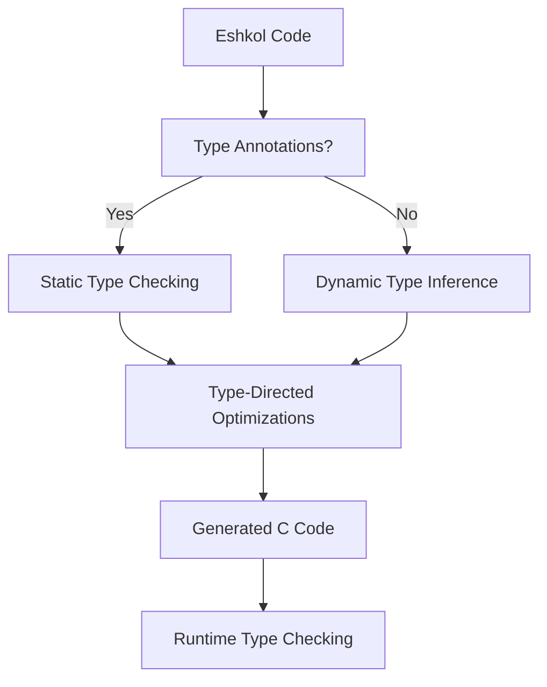

# Type System in Eshkol

## Table of Contents
- [Overview](#overview)
- [Gradual Typing](#gradual-typing)
- [Typing Approaches](#typing-approaches)
- [Type Inference](#type-inference)
- [Type-Directed Optimizations](#type-directed-optimizations)
- [Code Examples](#code-examples)
- [Common Type Errors](#common-type-errors)
- [Best Practices](#best-practices)

## Overview

Eshkol implements a gradual typing system that combines the flexibility of dynamic typing with the safety and performance of static typing. This approach allows developers to choose the appropriate level of type annotation based on their needs.



## Gradual Typing

Eshkol's gradual typing system allows you to mix statically typed and dynamically typed code within the same program. This provides flexibility while still enabling type safety where needed.

```scheme
;; Dynamically typed function
(define (add-dynamic a b)
  (+ a b))

;; Statically typed function
(define (add-static : (Int -> Int -> Int))
  (lambda (a b) (+ a b)))

;; Mixed usage
(add-dynamic 1 2)       ; Works fine
(add-dynamic "a" "b")   ; Runtime error: Cannot add strings
(add-static 1 2)        ; Works fine
(add-static "a" "b")    ; Compile-time error: Type mismatch
```

## Typing Approaches

Eshkol supports three main approaches to typing:

### 1. Implicit Typing (Type Inference)

The compiler automatically infers types without explicit annotations:

```scheme
;; Define a function
(define add (lambda (a b) (+ a b)))

;; Types inferred as integers
(define result (add 5 10))  ; Types inferred as integers
```

### 2. Inline Explicit Typing

Types can be explicitly specified inline:

```scheme
;; Explicitly typed function
(define (add : (Int -> Int -> Int))
  (lambda (a b) (+ a b)))

;; Explicitly typed variable
(define x : Int 42)
```

### 3. Structural Typing

Eshkol supports structural typing for complex data types:

```scheme
;; Define a record type
(define-type Point
  (record
    (x : Float)
    (y : Float)))

;; Create a point
(define p : Point (make-Point 3.0 4.0))

;; Function that works with any structure that has x and y fields
(define (distance : ({x : Float, y : Float} -> Float))
  (lambda (point)
    (sqrt (+ (square point.x) (square point.y)))))
```

## Type Inference

Eshkol's type inference system automatically determines the types of expressions without requiring explicit annotations. This makes the code more concise while still providing type safety.

### How Type Inference Works

1. The compiler analyzes the operations performed on values
2. It assigns the most general type that satisfies all constraints
3. It propagates type information through the program
4. It reports errors when type constraints cannot be satisfied

```scheme
;; The compiler infers that x is an integer
(define x (+ 1 2))

;; The compiler infers that y is a string
(define y (string-append "hello" " world"))

;; The compiler infers that z is a list of integers
(define z (map (lambda (n) (* n 2)) '(1 2 3)))
```

## Type-Directed Optimizations

Eshkol uses type information to perform various optimizations:

1. **Specialized Operations**: When types are known, specialized versions of operations can be used
2. **Unboxing**: Primitive values can be unboxed for better performance
3. **Inline Expansion**: Functions can be inlined when their types are fully known
4. **Dead Code Elimination**: Code paths that are unreachable due to type constraints can be eliminated

## Code Examples

### Basic Type Annotations

```scheme
;; Function with type annotation
(define (square : (Number -> Number))
  (lambda (x) (* x x)))

;; Variable with type annotation
(define pi : Float 3.14159)

;; List with type annotation
(define numbers : (List Int) '(1 2 3 4 5))
```

### Polymorphic Functions

```scheme
;; Polymorphic identity function
(define (identity : (forall a. a -> a))
  (lambda (x) x))

;; Polymorphic map function
(define (map : (forall a b. (a -> b) -> (List a) -> (List b)))
  (lambda (f lst)
    (if (null? lst)
        '()
        (cons (f (car lst))
              (map f (cdr lst))))))
```

### Union Types

```scheme
;; Define a union type
(define-type Result
  (union
    (Success (value : Any))
    (Error (message : String))))

;; Function that returns a Result
(define (safe-divide : (Number -> Number -> Result))
  (lambda (a b)
    (if (= b 0)
        (make-Error "Division by zero")
        (make-Success (/ a b)))))

;; Pattern matching on union types
(define (handle-result : (Result -> Any))
  (lambda (result)
    (match result
      ((Success value) value)
      ((Error message) (display message) #f))))
```

## Common Type Errors

### Type Mismatch

```scheme
;; Type error: Cannot add a number and a string
(define (add-error x y)
  (+ x "hello"))  ; Error: Expected Number, got String
```

**Error Message**: Type mismatch: Expected Number but got String in argument to +

### Undefined Variable

```scheme
;; Type error: Undefined variable
(define (undefined-var)
  (+ x 1))  ; Error: Undefined variable x
```

**Error Message**: Undefined variable: x

### Wrong Number of Arguments

```scheme
;; Type error: Wrong number of arguments
(define (two-args a b) (+ a b))
(two-args 1)  ; Error: Wrong number of arguments
```

**Error Message**: Wrong number of arguments: expected 2, got 1

### Incompatible Types in Conditional

```scheme
;; Type error: Incompatible types in conditional branches
(define (conditional-error x)
  (if x
      42
      "hello"))  ; Error: Branches have incompatible types
```

**Error Message**: Type mismatch in conditional branches: Int vs String

## Best Practices

### 1. Start with Minimal Type Annotations

Begin with minimal or no type annotations and add them incrementally as needed:

```scheme
;; Start without annotations
(define (factorial n)
  (if (<= n 1)
      1
      (* n (factorial (- n 1)))))

;; Add annotations for clarity or safety
(define (factorial : (Int -> Int))
  (lambda (n)
    (if (<= n 1)
        1
        (* n (factorial (- n 1))))))
```

### 2. Annotate Public Interfaces

Always add type annotations to public functions and data structures:

```scheme
;; Public function with clear type annotation
(define (parse-json : (String -> (Union JsonObject JsonError)))
  (lambda (json-string)
    ;; Implementation...
    ))
```

### 3. Use Type Aliases for Complex Types

Create type aliases to make complex types more readable:

```scheme
;; Without type alias
(define process-data : ((List (Record (name : String) (age : Int))) -> (Map String Int))
  (lambda (data) ...))

;; With type alias
(define-type Person (Record (name : String) (age : Int)))
(define-type PersonDatabase (Map String Int))
(define process-data : ((List Person) -> PersonDatabase)
  (lambda (data) ...))
```

### 4. Leverage Polymorphism

Use polymorphic types to create reusable functions:

```scheme
;; Generic function that works with any comparable type
(define (find : (forall a. (a -> Boolean) -> (List a) -> (Maybe a)))
  (lambda (predicate lst)
    (if (null? lst)
        (Nothing)
        (if (predicate (car lst))
            (Just (car lst))
            (find predicate (cdr lst))))))
```

### 5. Combine Static and Dynamic Typing Appropriately

Use static typing for critical code paths and dynamic typing for prototyping or less critical sections:

```scheme
;; Critical function with static typing
(define (calculate-trajectory : (Vector -> Float -> Vector))
  (lambda (initial-position time)
    ;; Implementation with guaranteed type safety
    ))

;; Utility function with dynamic typing for flexibility
(define (debug-print data)
  (display (format-data data))
  data)
```

For more information on the type system and its implementation details, see the [Compiler Architecture](COMPILER_ARCHITECTURE.md) documentation.
