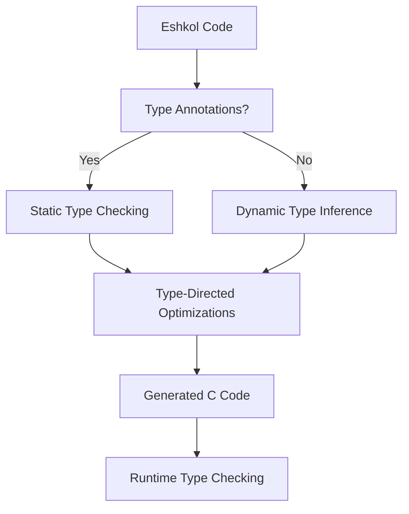

# Type System in Eshkol

## Table of Contents
- [Overview](#overview)
- [Gradual Typing](#gradual-typing)
- [Typing Approaches](#typing-approaches)
  - [Implicit Typing](#implicit-typing)
  - [Inline Explicit Typing](#inline-explicit-typing)
  - [Separate Type Declarations](#separate-type-declarations)
- [Type Inference](#type-inference)
- [Type-Directed Optimizations](#type-directed-optimizations)
- [MCP Tools for Type Analysis](#mcp-tools-for-type-analysis)
- [Code Examples](#code-examples)
- [Common Type Errors](#common-type-errors)
- [Best Practices](#best-practices)

## Overview

Eshkol implements a gradual typing system that combines the flexibility of dynamic typing with the safety and performance of static typing. This approach allows developers to choose the appropriate level of type annotation based on their needs.



## Gradual Typing

Eshkol's gradual typing system allows you to mix statically typed and dynamically typed code within the same program. This provides flexibility while still enabling type safety where needed.

```scheme
;; Dynamically typed function
(define (add-dynamic a b)
  (+ a b))

;; Statically typed function
(define (add-static : (number -> number -> number))
  (lambda (a b) (+ a b)))

;; Mixed usage
(add-dynamic 1 2)       ; Works fine
(add-dynamic "a" "b")   ; Runtime error: Cannot add strings
(add-static 1 2)        ; Works fine
(add-static "a" "b")    ; Compile-time error: Type mismatch
```

## Typing Approaches

Eshkol supports three main approaches to typing:

### Implicit Typing

Implicit typing relies on Eshkol's type inference system to automatically determine types based on how values are used. This approach requires no type annotations, making it ideal for rapid prototyping or when migrating existing Scheme code.

```scheme
;; No type annotations, but fully type-checked
(define (add x y)
  (+ x y))

;; The compiler infers that x and y must be numbers
;; and that the function returns a number
```

Eshkol also supports naming conventions for implicit typing, where variable names can suggest their types:

```scheme
;; Function with implicit integer parameters (i_ prefix suggests integers)
(define (sum-integers i_a i_b)
  (+ i_a i_b))

;; Function with implicit float parameters (f_ prefix suggests floats)
(define (average-floats f_a f_b)
  (/ (+ f_a f_b) 2.0))

;; Function with implicit vector parameter (v_ prefix suggests vector)
(define (vector-magnitude v_input)
  (let ((x (vector-ref v_input 0))
        (y (vector-ref v_input 1))
        (z (vector-ref v_input 2)))
    (sqrt (+ (* x x) (* y y) (* z z)))))
```

Benefits of implicit typing:

- **Clean, concise code** that looks like standard Scheme
- **No annotation overhead** for straightforward code
- **Seamless integration** with existing Scheme codebases

Limitations:

- Type errors may be reported far from their source
- Complex polymorphic functions may require annotations
- Less self-documenting than explicit approaches

### Inline Explicit Typing

Inline explicit typing allows programmers to annotate parameters and return types directly in the function definition. This provides clear documentation and ensures type safety at the definition site.

```scheme
;; Explicitly typed parameters and return type
(define (add-integers x : number y : number) : number
  (+ x y))

;; Vector operations with explicit types
(define (compute-distance point1 : vector<float> point2 : vector<float>) : float
  (let ((x1 (vector-ref point1 0))
        (y1 (vector-ref point1 1))
        (x2 (vector-ref point2 0))
        (y2 (vector-ref point2 1)))
    (sqrt (+ (expt (- x2 x1) 2) (expt (- y2 y1) 2)))))
```

Benefits of inline explicit typing:

- **Self-documenting code** that clearly states expectations
- **Localized type errors** at the definition site
- **IDE support** for autocompletion and tooltips

### Separate Type Declarations

Separate type declarations allow programmers to specify types separately from the implementation. This is particularly useful for complex type signatures or when adding types to existing code without modifying it.

```scheme
;; Separate type declaration
(: add-numbers (-> number number number))
;; Implementation of the add-numbers function
(define (add-numbers x y)
  (+ x y))

;; Type declaration for gradient descent function
(: gradient-descent (-> function vector<float> number vector<float>))
;; Implementation of the gradient-descent function
(define (gradient-descent f initial-point learning-rate)
  (let ((gradient (autodiff-gradient f initial-point)))
    (v- initial-point (v* gradient learning-rate))))
```

Benefits of separate type declarations:

- **Clean separation** of types from implementation
- **Complex type signatures** without cluttering function definitions
- **Adding types** to existing code without modification
- **Library interfaces** can be typed separately from implementation

## Type Inference

Eshkol's type inference system automatically determines the types of expressions without requiring explicit annotations. This makes the code more concise while still providing type safety.

### How Type Inference Works

1. The compiler analyzes the operations performed on values
2. It assigns the most general type that satisfies all constraints
3. It propagates type information through the program
4. It reports errors when type constraints cannot be satisfied

```scheme
;; The compiler infers that x is an integer
(define x (+ 1 2))

;; The compiler infers that y is a string
(define y (string-append "hello" " world"))

;; The compiler infers that z is a list of integers
(define z (map (lambda (n) (* n 2)) '(1 2 3)))
```

## Type-Directed Optimizations

Eshkol uses type information to perform various optimizations:

1. **Specialized Operations**: When types are known, specialized versions of operations can be used
2. **Unboxing**: Primitive values can be unboxed for better performance
3. **Inline Expansion**: Functions can be inlined when their types are fully known
4. **Dead Code Elimination**: Code paths that are unreachable due to type constraints can be eliminated
5. **SIMD Vectorization**: Vector operations can be optimized using SIMD instructions when types are known

## MCP Tools for Type Analysis

Eshkol provides MCP tools for analyzing and working with the type system:

### 1. analyze-types

This tool analyzes type inference and type checking for an Eshkol file:

```bash
use_mcp_tool eshkol-tools analyze-types '{"filePath": "examples/inline_typed.esk", "detail": "detailed"}'
```

The tool provides different levels of detail:

- **basic**: Shows a summary of type annotations and inferred types
- **detailed**: Shows detailed information about function parameters and return types
- **verbose**: Shows the step-by-step process of type inference, including constraints and unification

### 2. debug-codegen

This tool helps debug the code generation process, including type-directed optimizations:

```bash
use_mcp_tool eshkol-tools debug-codegen '{"filePath": "examples/inline_typed.esk", "stage": "all"}'
```

### 3. analyze-binding-access

This tool analyzes how bindings are used, including their types:

```bash
use_mcp_tool eshkol-tools analyze-binding-access '{"filePath": "examples/inline_typed.esk", "bindingName": "compute-distance"}'
```

## Code Examples

### Basic Type Annotations

```scheme
;; Function with type annotation
(define (square : (number -> number))
  (lambda (x) (* x x)))

;; Variable with type annotation
(define pi : float 3.14159)

;; List with type annotation
(define numbers : (list int) '(1 2 3 4 5))
```

### Polymorphic Functions

```scheme
;; Polymorphic identity function
(define (identity : (forall a. a -> a))
  (lambda (x) x))

;; Polymorphic map function
(define (map : (forall a b. (a -> b) -> (list a) -> (list b)))
  (lambda (f lst)
    (if (null? lst)
        '()
        (cons (f (car lst))
              (map f (cdr lst))))))
```

### Function Types

```scheme
;; Function that takes a function as an argument
(define (apply-twice f : (-> number number) x : number) : number
  (f (f x)))

;; Higher-order function with type annotation
(define (compose : ((b -> c) -> (a -> b) -> (a -> c)))
  (lambda (f g)
    (lambda (x)
      (f (g x)))))
```

### Vector Types

```scheme
;; Function with vector parameter
(define (compute-distance point1 : vector<float> point2 : vector<float>) : float
  (let ((x1 (vector-ref point1 0))
        (y1 (vector-ref point1 1))
        (x2 (vector-ref point2 0))
        (y2 (vector-ref point2 1)))
    (sqrt (+ (expt (- x2 x1) 2) (expt (- y2 y1) 2)))))
```

## Common Type Errors

### Type Mismatch

```scheme
;; Type error: Cannot add a number and a string
(define (add-error x y)
  (+ x "hello"))  ; Error: Expected number, got string
```

**Error Message**: Type mismatch: Expected number but got string in argument to +

### Undefined Variable

```scheme
;; Type error: Undefined variable
(define (undefined-var)
  (+ x 1))  ; Error: Undefined variable x
```

**Error Message**: Undefined variable: x

### Wrong Number of Arguments

```scheme
;; Type error: Wrong number of arguments
(define (two-args a b) (+ a b))
(two-args 1)  ; Error: Wrong number of arguments
```

**Error Message**: Wrong number of arguments: expected 2, got 1

### Incompatible Types in Conditional

```scheme
;; Type error: Incompatible types in conditional branches
(define (conditional-error x)
  (if x
      42
      "hello"))  ; Error: Branches have incompatible types
```

**Error Message**: Type mismatch in conditional branches: number vs string

## Best Practices

### 1. Start with Minimal Type Annotations

Begin with minimal or no type annotations and add them incrementally as needed:

```scheme
;; Start without annotations
(define (factorial n)
  (if (<= n 1)
      1
      (* n (factorial (- n 1)))))

;; Add annotations for clarity or safety
(define (factorial : (int -> int))
  (lambda (n)
    (if (<= n 1)
        1
        (* n (factorial (- n 1))))))
```

### 2. Annotate Public Interfaces

Always add type annotations to public functions and data structures:

```scheme
;; Public function with clear type annotation
(define (parse-json : (string -> (union json-object json-error)))
  (lambda (json-string)
    ;; Implementation...
    ))
```

### 3. Use Type Aliases for Complex Types

Create type aliases to make complex types more readable:

```scheme
;; Without type alias
(define process-data : ((list (record (name : string) (age : int))) -> (map string int))
  (lambda (data) ...))

;; With type alias
(define-type person (record (name : string) (age : int)))
(define-type person-database (map string int))
(define process-data : ((list person) -> person-database)
  (lambda (data) ...))
```

### 4. Leverage Polymorphism

Use polymorphic types to create reusable functions:

```scheme
;; Generic function that works with any comparable type
(define (find : (forall a. (a -> boolean) -> (list a) -> (maybe a)))
  (lambda (predicate lst)
    (if (null? lst)
        (nothing)
        (if (predicate (car lst))
            (just (car lst))
            (find predicate (cdr lst))))))
```

### 5. Combine Static and Dynamic Typing Appropriately

Use static typing for critical code paths and dynamic typing for prototyping or less critical sections:

```scheme
;; Critical function with static typing
(define (calculate-trajectory : (vector -> float -> vector))
  (lambda (initial-position time)
    ;; Implementation with guaranteed type safety
    ))

;; Utility function with dynamic typing for flexibility
(define (debug-print data)
  (display (format-data data))
  data)
```

### 6. Use Type Annotations for Documentation

Type annotations serve as documentation for your code:

```scheme
;; Type annotation documents the expected input and output
(define (safe-divide : (number -> number -> (maybe number)))
  (lambda (a b)
    (if (= b 0)
        (nothing)
        (just (/ a b)))))
```

### 7. Leverage Type Inference for Concise Code

Let the type inference system do the work when types are obvious:

```scheme
;; No need for type annotations here
(define (sum-list lst)
  (if (null? lst)
      0
      (+ (car lst) (sum-list (cdr lst)))))
```

For more information on the type system and its implementation details, see the [Compiler Architecture](COMPILER_ARCHITECTURE.md) documentation and the [Type System Reference](../reference/TYPE_SYSTEM_REFERENCE.md).
