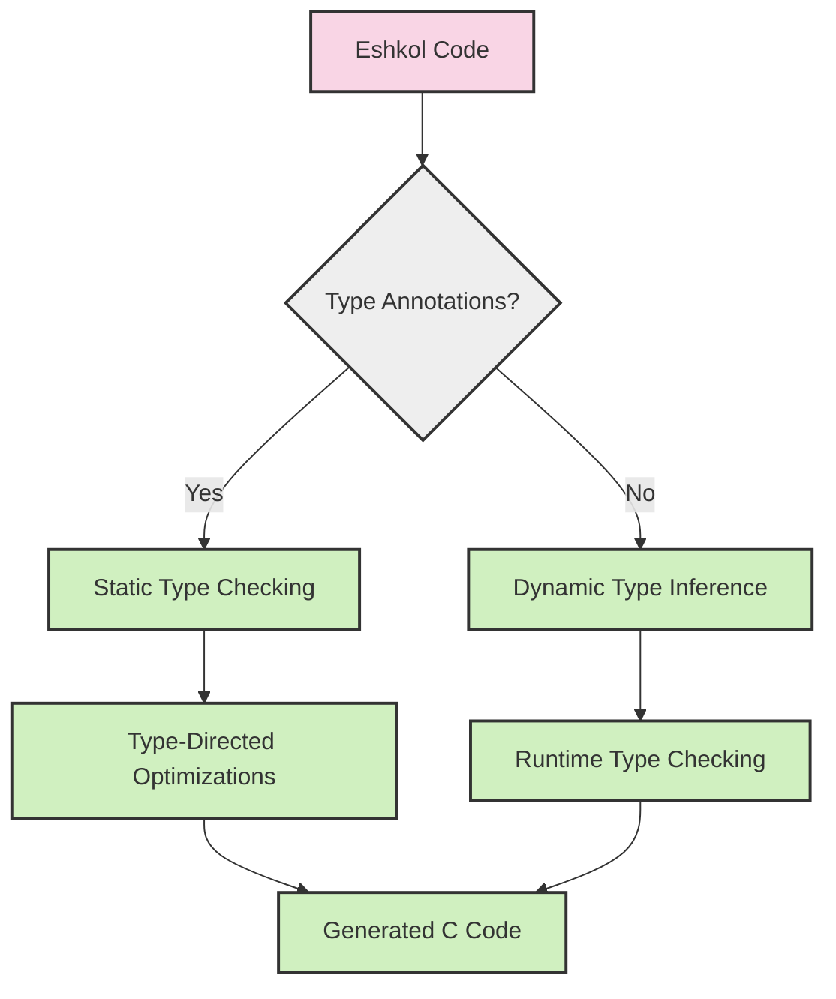

# Type System in Eshkol

## Gradual Typing

Eshkol implements a gradual typing system that combines the flexibility of dynamic typing with the safety and performance of static typing. This approach allows developers to choose the appropriate level of type annotation based on their needs.



## Typing Approaches

Eshkol supports three main approaches to typing:

### 1. Implicit Typing (Type Inference)

The compiler automatically infers types without explicit annotations:

```scheme
(define add (lambda (a b) (+ a b)))
(define result (add 5 10))  ; Types inferred as integers
```

### 2. Inline Explicit Typing

Types can be specified directly in function parameters and return values:

```scheme
(define add (lambda (a : Int b : Int) : Int (+ a b)))
```

### 3. Separate Type Declarations

Types can be declared separately from function definitions:

```scheme
(declare add (-> (Int Int) Int))
(define add (lambda (a b) (+ a b)))
```

## Type System Features

### Basic Types

Eshkol provides a rich set of built-in types:

| Type | Description | Example |
|------|-------------|---------|
| `Void` | No value | `(void)` |
| `Boolean` | True or false | `#t`, `#f` |
| `Int` | 32-bit integer | `42` |
| `Int8`, `Int16`, `Int64` | Sized integers | `42i8`, `42i16`, `42i64` |
| `UInt`, `UInt8`, etc. | Unsigned integers | `42u`, `42u8` |
| `Float` | 32-bit floating point | `3.14` |
| `Double` | 64-bit floating point | `3.14d0` |
| `Char` | Unicode character | `#\a` |
| `String` | Text string | `"hello"` |
| `Symbol` | Unique identifier | `'symbol` |

### Compound Types

Eshkol also supports various compound types:

```scheme
;; Pairs and Lists
(define p : (Pair Int String) (cons 1 "one"))
(define lst : (List Int) '(1 2 3 4))

;; Vectors
(define v : (Vector Float 3) (vector 1.0 2.0 3.0))

;; Functions
(define f : (-> (Int Int) Int) (lambda (x y) (+ x y)))

;; Optional types
(define maybe-value : (Optional Int) (if (> x 0) x #f))
```

### Type Inference Process

The type inference system in Eshkol works through several phases:

1. **Collection of explicit types** - Gather all explicit type annotations
2. **Constraint generation** - Create type constraints from expressions
3. **Constraint solving** - Resolve constraints to determine types
4. **Type checking** - Verify type consistency
5. **Type-directed optimization** - Use type information for optimizations

## Integration with Scientific Computing

Eshkol's type system has special support for scientific computing types:

```scheme
;; Vector types with known dimensions
(define v : (Vector Float 3) (vector 1.0 2.0 3.0))

;; Matrix types
(define m : (Matrix Float 2 3) (matrix [[1.0 2.0 3.0] [4.0 5.0 6.0]]))

;; Dual numbers for automatic differentiation
(define x : (Dual Float) (dual 3.0 1.0))

;; Tensor types
(define t : (Tensor Float 3) (tensor [[[1.0 2.0] [3.0 4.0]] [[5.0 6.0] [7.0 8.0]]]))
```

## Type Safety and Flexibility

Eshkol balances type safety with flexibility through several mechanisms:

### Gradual Type Boundaries

At the boundary between statically and dynamically typed code, the compiler inserts appropriate runtime checks:

```scheme
;; Statically typed function
(define add : (-> (Int Int) Int)
  (lambda (a b) (+ a b)))

;; Dynamically typed function using a statically typed one
(define process-data
  (lambda (data)
    (add (first data) (second data))))  ; Runtime check inserted here
```

### Type Assertions and Predicates

Eshkol provides built-in predicates for type checking:

```scheme
(if (integer? x)
    (+ x 1)
    (error "Expected an integer"))

;; Type assertion
(define result (as Int (compute-value)))
```

## Implementation Details

The type system is implemented in the following files:

- `src/frontend/type_inference.c` - Main type inference engine
- `src/frontend/type_inference/context.c` - Type context management
- `src/frontend/type_inference/inference.c` - Type inference algorithms
- `src/core/utils/type_creation.c` - Type representation and creation

## Advanced Type Features

### Parametric Polymorphism

Eshkol supports generic types and functions:

```scheme
;; Generic identity function
(define id : (forall (T) (-> (T) T))
  (lambda (x) x))

;; Generic list map function
(define map : (forall (A B) (-> ((-> (A) B) (List A)) (List B)))
  (lambda (f lst)
    (if (null? lst)
        '()
        (cons (f (car lst)) (map f (cdr lst))))))
```

### Type Constraints

Types can be constrained to specific interfaces:

```scheme
;; Function that works on any numeric type
(define square : (forall (T) (-> (T) T) where (Numeric T))
  (lambda (x) (* x x)))
```

### Union Types

Eshkol supports union types for values that could be one of several types:

```scheme
;; Function that returns either a string or an integer
(define get-value : (-> () (Union String Int))
  (lambda ()
    (if (> (random) 0.5)
        "hello"
        42)))
```

## Best Practices

1. **Start with minimal type annotations** - Let the inference system work for you
2. **Add types at API boundaries** - Ensure interfaces are well-typed
3. **Use explicit types for complex functions** - Improve readability and catch errors early
4. **Leverage type-directed optimizations** - Add types to performance-critical code
5. **Use separate type declarations for library interfaces** - Keep implementation details flexible
