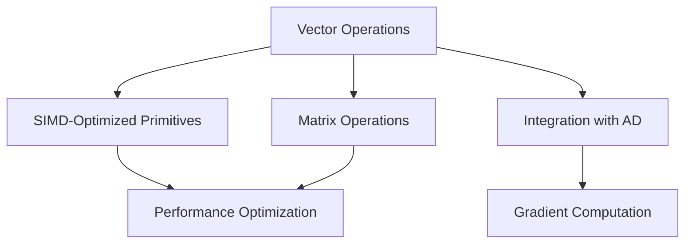

# Vector Operations in Eshkol

## Table of Contents
- [Overview](#overview)
- [Vector Primitives](#vector-primitives)
- [SIMD Optimization](#simd-optimization)
- [Matrix Operations](#matrix-operations)
- [Performance Considerations](#performance-considerations)
- [Code Examples](#code-examples)
- [Integration with Automatic Differentiation](#integration-with-automatic-differentiation)
- [Troubleshooting](#troubleshooting)

## Overview

Eshkol provides built-in support for efficient vector operations, optimized using SIMD (Single Instruction, Multiple Data) instructions when available. This makes Eshkol particularly well-suited for scientific computing, machine learning, and other domains that require high-performance numerical computations.



## Vector Primitives

Eshkol provides a rich set of vector primitives that operate efficiently on arrays of numeric data.

### Creating Vectors

```scheme
;; Create a vector with specified elements
(define v1 (vector 1 2 3 4))

;; Create a vector of zeros
(define v2 (make-vector 4 0))

;; Create a vector from a list
(define v3 (list->vector '(5 6 7 8)))

;; Create a vector with a generator function
(define v4 (vector-tabulate 4 (lambda (i) (* i i))))
```

### Basic Vector Operations

```scheme
;; Vector addition
(define v-sum (vector-add v1 v3))  ; Results in #(6 8 10 12)

;; Vector subtraction
(define v-diff (vector-subtract v3 v1))  ; Results in #(4 4 4 4)

;; Scalar multiplication
(define v-scaled (vector-scale v1 2))  ; Results in #(2 4 6 8)

;; Element-wise multiplication
(define v-product (vector-multiply v1 v3))  ; Results in #(5 12 21 32)

;; Dot product
(define dot-result (vector-dot v1 v3))  ; Results in 70
```

### Vector Transformations

```scheme
;; Map a function over a vector
(define v-squared (vector-map (lambda (x) (* x x)) v1))

;; Filter elements
(define v-even (vector-filter even? v1))

;; Reduce a vector
(define v-sum (vector-fold + 0 v1))

;; Sort a vector
(define v-sorted (vector-sort < v1))
```

## SIMD Optimization

Eshkol automatically uses SIMD instructions when available to accelerate vector operations. This is handled transparently by the compiler, but can be controlled with compiler flags.

### SIMD Implementation

The SIMD optimization in Eshkol works by:

1. Detecting the available SIMD instruction sets (SSE, AVX, NEON, etc.)
2. Automatically vectorizing operations when possible
3. Falling back to scalar code when vectorization isn't possible

```c
// Internal C implementation (simplified)
void vector_add_f32(float* result, const float* a, const float* b, size_t n) {
#if defined(__AVX__)
    // AVX implementation
    for (size_t i = 0; i < n; i += 8) {
        __m256 va = _mm256_loadu_ps(&a[i]);
        __m256 vb = _mm256_loadu_ps(&b[i]);
        __m256 vr = _mm256_add_ps(va, vb);
        _mm256_storeu_ps(&result[i], vr);
    }
#elif defined(__SSE__)
    // SSE implementation
    // ...
#else
    // Scalar fallback
    for (size_t i = 0; i < n; i++) {
        result[i] = a[i] + b[i];
    }
#endif
}
```

### Controlling SIMD Usage

You can control SIMD usage with compiler flags:

```bash
# Disable SIMD
eshkol compile --no-simd program.esk

# Force specific SIMD instruction set
eshkol compile --simd=avx2 program.esk
```

## Matrix Operations

Eshkol provides efficient matrix operations built on top of its vector primitives.

### Creating Matrices

```scheme
;; Create a matrix from nested vectors
(define m1 (matrix [[1 2 3] [4 5 6] [7 8 9]]))

;; Create a matrix of zeros
(define m2 (make-matrix 3 3 0))

;; Create an identity matrix
(define m-identity (identity-matrix 3))

;; Create a matrix from a function
(define m3 (matrix-tabulate 3 3 (lambda (i j) (+ i j))))
```

### Basic Matrix Operations

```scheme
;; Matrix addition
(define m-sum (matrix-add m1 m3))

;; Matrix subtraction
(define m-diff (matrix-subtract m1 m3))

;; Scalar multiplication
(define m-scaled (matrix-scale m1 2))

;; Matrix multiplication
(define m-product (matrix-multiply m1 m3))

;; Matrix transpose
(define m-transposed (matrix-transpose m1))
```

### Matrix Decompositions

```scheme
;; LU decomposition
(define-values (L U) (matrix-lu-decomposition m1))

;; QR decomposition
(define-values (Q R) (matrix-qr-decomposition m1))

;; Singular Value Decomposition
(define-values (U S V) (matrix-svd m1))
```

## Performance Considerations

### Optimizing Vector Operations

1. **Preallocate vectors** for best performance:
   ```scheme
   ;; Preallocate result vector
   (define result (make-vector 1000 0))
   (vector-add! result v1 v2)  ; In-place addition
   ```

2. **Use specialized operations** when available:
   ```scheme
   ;; General approach
   (vector-map (lambda (x) (+ x 1)) vec)
   
   ;; More efficient specialized operation
   (vector-add-scalar vec 1)
   ```

3. **Batch operations** for better cache utilization:
   ```scheme
   ;; Process vectors in batches
   (for-each-batch 64 process-vector vectors)
   ```

### Benchmarking

```scheme
(define (benchmark-vector-ops size iterations)
  (let* ((v1 (make-vector size 1.0))
         (v2 (make-vector size 2.0))
         (result (make-vector size 0.0))
         (start-time (current-time)))
    
    (for-each (lambda (_)
                (vector-add! result v1 v2))
              (range 0 iterations))
    
    (let ((elapsed (- (current-time) start-time)))
      (display (format "Size: ~a, Iterations: ~a, Time: ~a ms\n" 
                      size iterations (* elapsed 1000)))
      (display (format "Operations per second: ~a\n"
                      (/ (* size iterations) elapsed))))))
```

## Code Examples

### Vector Normalization

```scheme
(define (normalize-vector v)
  (let* ((squared-sum (vector-fold (lambda (acc x) (+ acc (* x x))) 0 v))
         (magnitude (sqrt squared-sum)))
    (if (zero? magnitude)
        v  ; Avoid division by zero
        (vector-scale v (/ 1.0 magnitude)))))
```

### Matrix-Vector Multiplication

```scheme
(define (matrix-vector-multiply M v)
  (let* ((rows (matrix-rows M))
         (result (make-vector rows 0)))
    (for-each (lambda (i)
                (vector-set! result i
                             (vector-dot (matrix-row M i) v)))
              (range 0 rows))
    result))
```

### Implementing a Neural Network Layer

```scheme
(define (forward-layer input weights biases activation-fn)
  (let* ((weighted-sum (vector-add (matrix-vector-multiply weights input) biases))
         (activation (vector-map activation-fn weighted-sum)))
    activation))

(define (relu x)
  (max 0 x))

(define (layer-forward input layer)
  (forward-layer input 
                (layer-weights layer) 
                (layer-biases layer) 
                relu))
```

## Integration with Automatic Differentiation

Eshkol's vector operations integrate seamlessly with its automatic differentiation system, making it easy to compute gradients of vector-valued functions.

```scheme
;; Define a vector-valued function
(define (f v)
  (let* ((squared (vector-map (lambda (x) (* x x)) v))
         (sum (vector-fold + 0 squared)))
    sum))

;; Compute the gradient of f with respect to v
(define v (vector 1 2 3))
(define grad-f (gradient f))
(define grad-at-v (grad-f v))  ; Results in #(2 4 6)
```

### Implementing Gradient Descent

```scheme
(define (gradient-descent f initial-params learning-rate iterations)
  (let* ((grad-f (gradient f))
         (loop (lambda (params i)
                 (if (>= i iterations)
                     params
                     (let* ((grad (grad-f params))
                            (scaled-grad (vector-scale grad learning-rate))
                            (new-params (vector-subtract params scaled-grad)))
                       (loop new-params (+ i 1)))))))
    (loop initial-params 0)))
```

## Troubleshooting

### Common Issues

#### Issue: Poor Performance
**Symptom:** Vector operations are slower than expected
**Cause:** SIMD optimizations might not be enabled
**Solution:** Check compiler flags and ensure SIMD is enabled:
```bash
eshkol compile --simd=auto program.esk
```

#### Issue: Numerical Instability
**Symptom:** Calculations produce NaN or Inf values
**Cause:** Division by zero or overflow
**Solution:** Add guards against edge cases:
```scheme
(define (safe-normalize v)
  (let ((magnitude (vector-magnitude v)))
    (if (< magnitude 1e-10)
        (make-vector (vector-length v) 0)  ; Return zero vector
        (vector-scale v (/ 1.0 magnitude)))))
```

#### Issue: Memory Usage
**Symptom:** High memory usage with large vectors
**Cause:** Creating too many intermediate vectors
**Solution:** Use in-place operations when possible:
```scheme
;; Instead of this (creates a new vector)
(define result (vector-add v1 v2))

;; Use this (modifies an existing vector)
(define result (make-vector (vector-length v1) 0))
(vector-add! result v1 v2)
```

### Debugging Vector Operations

```scheme
;; Print vector statistics
(define (vector-stats v)
  (let* ((len (vector-length v))
         (min-val (vector-fold min +inf.0 v))
         (max-val (vector-fold max -inf.0 v))
         (sum (vector-fold + 0 v))
         (mean (/ sum len))
         (var (/ (vector-fold (lambda (acc x) 
                               (+ acc (square (- x mean)))) 
                             0 v) 
                len)))
    (display (format "Length: ~a\n" len))
    (display (format "Min: ~a\n" min-val))
    (display (format "Max: ~a\n" max-val))
    (display (format "Mean: ~a\n" mean))
    (display (format "Variance: ~a\n" var))
    (display (format "Standard Deviation: ~a\n" (sqrt var)))))
```

For more information on using vector operations in scientific computing applications, see the [Scientific Computing Examples](examples/SCIENTIFIC_COMPUTING.md).
