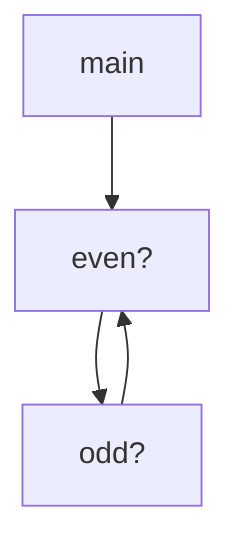
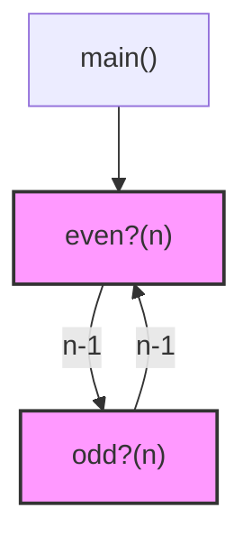
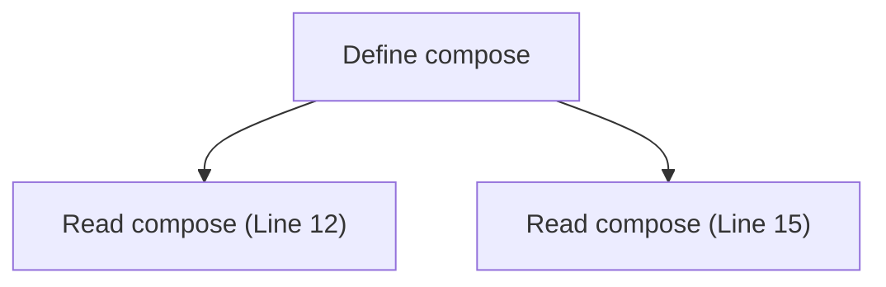
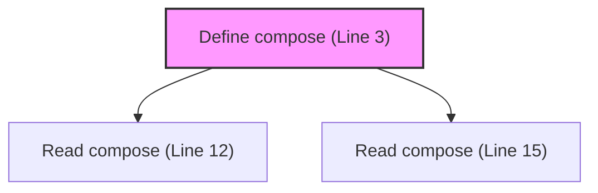
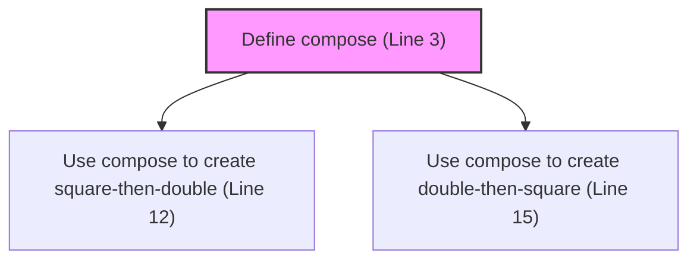
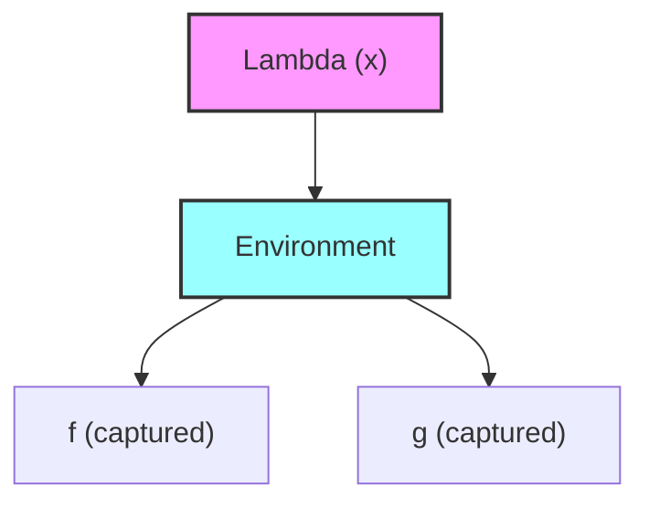

# MCP Tools for Scheme Compatibility Analysis

Last Updated: 2025-03-29

This document describes the MCP tools available for analyzing Scheme compatibility in Eshkol. These tools can help identify issues with Scheme code, mutual recursion, and other aspects of Scheme compatibility.

## Available MCP Tools

Eshkol provides several MCP tools for analyzing Scheme compatibility:

### analyze-scheme-recursion

The `analyze-scheme-recursion` tool analyzes mutual recursion and lambda captures in Scheme code using AST-based parsing.

**Usage:**
```bash
use_mcp_tool eshkol-tools analyze-scheme-recursion '{"filePath": "examples/mutual_recursion.esk", "detail": "detailed", "format": "mermaid"}'
```

**Parameters:**
- `filePath`: Path to the Eshkol source file
- `detail`: Level of detail in the analysis (basic, detailed, verbose)
- `format`: Output format for visualizations (mermaid, dot)

**Example Output (basic):**
```
# Scheme Recursion Analysis for examples/mutual_recursion.esk

## Summary

- Total functions: 3
- Recursive functions: 2
- Mutually recursive functions: 2
- Lambda expressions: 1

## Recursion Visualization


```

**Current Limitations:**
- Uses a simplified AST-based parser that may not handle all Scheme syntax
- Limited support for complex recursion patterns
- May not correctly analyze higher-order functions

### analyze-tscheme-recursion

The `analyze-tscheme-recursion` tool analyzes mutual recursion and lambda captures in Scheme code using the improved TScheme parser.

**Usage:**
```bash
use_mcp_tool eshkol-tools analyze-tscheme-recursion '{"filePath": "examples/mutual_recursion.esk", "detail": "detailed", "format": "mermaid"}'
```

**Parameters:**
- `filePath`: Path to the Eshkol source file
- `detail`: Level of detail in the analysis (basic, detailed, verbose)
- `format`: Output format for visualizations (mermaid, dot)

**Example Output (detailed):**
```
# TScheme Recursion Analysis for examples/mutual_recursion.esk

## Summary

- Total functions: 3
- Recursive functions: 2
- Mutually recursive functions: 2
- Lambda expressions: 1

## Function: even?

- Parameters: (n)
- Calls:
  - odd? (recursive)
- Called by:
  - odd? (recursive)
  - main

## Function: odd?

- Parameters: (n)
- Calls:
  - even? (recursive)
- Called by:
  - even? (recursive)

## Function: main

- Parameters: ()
- Calls:
  - even?
- Called by:
  - None

## Recursion Visualization


```

**Current Limitations:**
- May not correctly analyze complex recursion patterns
- Limited support for higher-order functions
- May not correctly analyze closures in recursive functions

### analyze-bindings

The `analyze-bindings` tool analyzes variable bindings in Scheme code.

**Usage:**
```bash
use_mcp_tool eshkol-tools analyze-bindings '{"filePath": "examples/function_composition.esk"}'
```

**Parameters:**
- `filePath`: Path to the Eshkol source file

**Example Output:**
```
# Binding Analysis for examples/function_composition.esk

## Summary

- Total bindings: 8
- Function bindings: 3
- Variable bindings: 5
- Lambda expressions: 2

## Bindings

- compose (function)
  - Parameters: (f g)
  - References: 1
  
- square (function)
  - Parameters: (x)
  - References: 1
  
- double (function)
  - Parameters: (x)
  - References: 1
  
- square-then-double (variable)
  - Type: function
  - References: 1
  
- double-then-square (variable)
  - Type: function
  - References: 1
```

**Current Limitations:**
- May not correctly analyze complex binding patterns
- Limited support for macros
- May not correctly analyze bindings in complex expressions

### analyze-binding-access

The `analyze-binding-access` tool analyzes how bindings are used in Scheme code.

**Usage:**
```bash
use_mcp_tool eshkol-tools analyze-binding-access '{"filePath": "examples/function_composition.esk", "bindingName": "compose"}'
```

**Parameters:**
- `filePath`: Path to the Eshkol source file
- `bindingName`: Name of a specific binding to analyze (optional)
- `format`: Output format for visualizations (mermaid, dot)

**Example Output:**
```
# Binding Access Analysis for examples/function_composition.esk

## Binding: compose

- Defined at: Line 3, Column 1
- Type: function
- Parameters: (f g)
- References: 2
  - Read at: Line 12, Column 3
  - Read at: Line 15, Column 3

## Access Pattern Visualization


```

**Current Limitations:**
- May not correctly analyze complex binding patterns
- Limited support for macros
- May not correctly analyze bindings in complex expressions

## Using MCP Tools for Scheme Compatibility Analysis

### Analyzing Mutual Recursion

To analyze mutual recursion in Scheme code:

1. Use the `analyze-tscheme-recursion` tool with the `detailed` option:
   ```bash
   use_mcp_tool eshkol-tools analyze-tscheme-recursion '{"filePath": "examples/mutual_recursion.esk", "detail": "detailed"}'
   ```

2. Look for:
   - Recursive function calls
   - Mutual recursion between functions
   - Potential infinite recursion
   - Base cases for recursion

3. Check for tail recursion:
   ```bash
   use_mcp_tool eshkol-tools analyze-tscheme-recursion '{"filePath": "examples/mutual_recursion.esk", "detail": "verbose"}'
   ```

### Analyzing Binding Issues

To analyze binding issues in Scheme code:

1. Use the `analyze-bindings` tool:
   ```bash
   use_mcp_tool eshkol-tools analyze-bindings '{"filePath": "examples/function_composition.esk"}'
   ```

2. Look for:
   - Unused bindings
   - Shadowed bindings
   - Bindings with few references
   - Complex binding patterns

3. Check how bindings are used:
   ```bash
   use_mcp_tool eshkol-tools analyze-binding-access '{"filePath": "examples/function_composition.esk"}'
   ```

### Analyzing Lambda Captures

To analyze lambda captures in Scheme code:

1. Use the `analyze-lambda-captures` tool:
   ```bash
   use_mcp_tool eshkol-tools analyze-lambda-captures '{"filePath": "examples/function_composition.esk", "detail": "detailed"}'
   ```

2. Look for:
   - Captured variables
   - Closure environments
   - Potential issues with captured variables

### Analyzing Type Issues

To analyze type issues in Scheme code:

1. Use the `analyze-types` tool:
   ```bash
   use_mcp_tool eshkol-tools analyze-types '{"filePath": "examples/function_composition.esk", "detail": "detailed"}'
   ```

2. Look for:
   - Type mismatches
   - Inferred types
   - Type annotations
   - Potential type errors

## Workarounds for Common Issues

### Mutual Recursion Issues

To work around mutual recursion issues in Scheme code:

1. Ensure all recursive functions have proper base cases:
   ```scheme
   ;; Instead of:
   (define (even? n)
     (if (= n 0)
         #t
         (odd? (- n 1))))
   
   (define (odd? n)
     (if (= n 0)
         #f
         (even? (- n 1))))
   
   ;; Use:
   (define (even? n)
     (if (< n 0)
         (even? (- n)) ; Handle negative numbers
         (if (= n 0)
             #t
             (odd? (- n 1)))))
   
   (define (odd? n)
     (if (< n 0)
         (odd? (- n)) ; Handle negative numbers
         (if (= n 0)
             #f
             (even? (- n 1)))))
   ```

2. Use tail recursion when possible:
   ```scheme
   ;; Instead of:
   (define (factorial n)
     (if (= n 0)
         1
         (* n (factorial (- n 1)))))
   
   ;; Use:
   (define (factorial n)
     (let loop ((n n) (acc 1))
       (if (= n 0)
           acc
           (loop (- n 1) (* acc n)))))
   ```

3. Break complex mutual recursion into simpler functions:
   ```scheme
   ;; Instead of complex mutual recursion:
   (define (f x)
     (if (= x 0)
         0
         (+ x (g (- x 1)))))
   
   (define (g x)
     (if (= x 0)
         1
         (+ x (f (- x 1)))))
   
   ;; Use a single function with an additional parameter:
   (define (fg x is-f)
     (if (= x 0)
         (if is-f 0 1)
         (+ x (fg (- x 1) (not is-f)))))
   
   (define (f x) (fg x #t))
   (define (g x) (fg x #f))
   ```

### Binding Issues

To work around binding issues in Scheme code:

1. Avoid shadowing bindings:
   ```scheme
   ;; Instead of:
   (let ((x 5))
     (let ((x 10))
       (+ x x)))
   
   ;; Use:
   (let ((x 5))
     (let ((y 10))
       (+ x y)))
   ```

2. Use meaningful names for bindings:
   ```scheme
   ;; Instead of:
   (define (f x)
     (let ((y (g x))
           (z (h x)))
       (+ y z)))
   
   ;; Use:
   (define (calculate-sum x)
     (let ((transformed-value (transform x))
           (scaled-value (scale x)))
       (+ transformed-value scaled-value)))
   ```

3. Minimize the scope of bindings:
   ```scheme
   ;; Instead of:
   (define (f x)
     (let ((y (g x)))
       (let ((z (h x)))
         (+ y z))))
   
   ;; Use:
   (define (f x)
     (+ (g x) (h x)))
   ```

### Lambda Capture Issues

To work around lambda capture issues in Scheme code:

1. Be explicit about captured variables:
   ```scheme
   ;; Instead of:
   (define (make-adder x)
     (lambda (y) (+ x y)))
   
   ;; Use:
   (define (make-adder x)
     (lambda (y) 
       ;; Explicitly document that x is captured
       ;; x from the outer scope
       (+ x y)))
   ```

2. Avoid capturing mutable variables:
   ```scheme
   ;; Instead of:
   (define (make-counter)
     (let ((count 0))
       (lambda ()
         (set! count (+ count 1))
         count)))
   
   ;; Use:
   (define (make-counter)
     (let ((count (box 0))) ; Use a box for mutable state
       (lambda ()
         (set-box! count (+ (unbox count) 1))
         (unbox count))))
   ```

3. Pass captured variables as parameters when possible:
   ```scheme
   ;; Instead of:
   (define (make-multiplier factor)
     (lambda (x) (* x factor)))
   
   ;; Use:
   (define (multiply x factor)
     (* x factor))
   
   (define (make-multiplier factor)
     (lambda (x) (multiply x factor)))
   ```

## New Tools and Features

### analyze-binding-lifetime

The `analyze-binding-lifetime` tool analyzes when bindings are created and destroyed in Scheme code.

**Usage:**
```bash
use_mcp_tool eshkol-tools analyze-binding-lifetime '{"filePath": "examples/function_composition.esk", "bindingName": "compose", "format": "mermaid"}'
```

**Parameters:**
- `filePath`: Path to the Eshkol source file
- `bindingName`: Name of a specific binding to analyze (optional)
- `format`: Output format for visualizations (mermaid, dot)

**Example Output:**
```
# Binding Lifetime Analysis for examples/function_composition.esk

## Binding: compose

- Defined at: Line 3, Column 1
- Type: function
- Parameters: (f g)
- Lifetime: Global
- References: 2
  - Read at: Line 12, Column 3
  - Read at: Line 15, Column 3

## Lifetime Visualization


```

**Current Limitations:**
- May not correctly analyze complex binding patterns
- Limited support for macros
- May not correctly analyze bindings in complex expressions

### visualize-binding-flow

The `visualize-binding-flow` tool tracks binding values through transformation stages.

**Usage:**
```bash
use_mcp_tool eshkol-tools visualize-binding-flow '{"filePath": "examples/function_composition.esk", "bindingName": "compose", "format": "mermaid"}'
```

**Parameters:**
- `filePath`: Path to the Eshkol source file
- `bindingName`: Name of a specific binding to track (optional)
- `format`: Output format for visualizations (mermaid, dot)

**Example Output:**
```
# Binding Flow Analysis for examples/function_composition.esk

## Binding: compose

- Defined at: Line 3, Column 1
- Type: function
- Parameters: (f g)
- Flow:
  - Define compose (Line 3)
  - Use compose to create square-then-double (Line 12)
  - Use compose to create double-then-square (Line 15)

## Flow Visualization


```

**Current Limitations:**
- May not correctly analyze complex binding patterns
- Limited support for macros
- May not correctly analyze bindings in complex expressions

### visualize-closure-memory

The `visualize-closure-memory` tool visualizes how closures are represented in memory.

**Usage:**
```bash
use_mcp_tool eshkol-tools visualize-closure-memory '{"filePath": "examples/function_composition_closure.esk", "lambdaId": "lambda1", "format": "mermaid"}'
```

**Parameters:**
- `filePath`: Path to the Eshkol source file
- `lambdaId`: ID of a specific lambda to visualize (optional)
- `format`: Output format for visualizations (mermaid, dot)

**Example Output:**
```
# Closure Memory Visualization for examples/function_composition_closure.esk

## Lambda: lambda1

- Defined at: Line 4, Column 3
- Parameters: (x)
- Captured Variables:
  - f (from parent scope)
  - g (from parent scope)

## Memory Visualization


```

**Current Limitations:**
- May not correctly analyze complex closure patterns
- Limited support for nested closures
- May not correctly analyze closures in complex expressions

### compare-generated-code

The `compare-generated-code` tool compares generated code with different binding strategies.

**Usage:**
```bash
use_mcp_tool eshkol-tools compare-generated-code '{"filePath": "examples/function_composition.esk", "strategies": ["default", "optimized"], "format": "diff"}'
```

**Parameters:**
- `filePath`: Path to the Eshkol source file
- `strategies`: Binding strategies to compare
- `format`: Output format for comparison (diff, summary)
- `highlightBindings`: Whether to highlight bindings in the code
- `highlightLambdas`: Whether to highlight lambdas in the code

**Example Output:**
```
# Generated Code Comparison for examples/function_composition.esk

## Strategy: default vs. optimized

```diff
@@ -10,7 +10,7 @@
 EshkolObject* compose(EshkolObject* f, EshkolObject* g) {
-  EshkolEnvironment* env = eshkol_create_environment();
-  eshkol_environment_add(env, "f", f);
-  eshkol_environment_add(env, "g", g);
+  // Optimized: No environment needed for simple lambda
+  // Captured variables passed directly to lambda
   return eshkol_create_lambda_with_env(lambda_body, env);
 }
```

**Current Limitations:**
- May not correctly analyze complex binding patterns
- Limited support for macros
- May not correctly analyze bindings in complex expressions

## Future Improvements

The MCP tools for Scheme compatibility analysis are continuously being improved:

1. **Better parsing**: Improved parsing of Scheme code, particularly for complex syntax
2. **More accurate recursion analysis**: Better analysis of mutual recursion, with more precise tracking of recursive calls
3. **Integration with the compiler pipeline**: Better integration with the compiler pipeline to provide more accurate analysis
4. **More visualization options**: More visualization options for Scheme code, including call graphs and data flow diagrams
5. **Performance improvements**: Faster analysis of large codebases with many Scheme functions
6. **Type predicate analysis**: Better analysis of type predicates and type checking
7. **Equality predicate analysis**: Better analysis of equality predicates and value comparison
8. **List processing analysis**: Better analysis of list processing functions and operations

## Related Documentation

- [SCHEME_COMPATIBILITY.md](SCHEME_COMPATIBILITY.md): Overview of Scheme compatibility in Eshkol
- [IMPLEMENTATION_PLAN.md](IMPLEMENTATION_PLAN.md): Plan for implementing Scheme features
- [KNOWN_ISSUES.md](KNOWN_ISSUES.md): Known issues and limitations in Eshkol
- [MCP_TOOLS_FOR_AUTODIFF.md](../type_system/MCP_TOOLS_FOR_AUTODIFF.md): MCP tools for autodiff analysis
- [type_predicates_roadmap.md](roadmaps/type_predicates_roadmap.md): Roadmap for implementing type predicates
- [equality_predicates_roadmap.md](roadmaps/equality_predicates_roadmap.md): Roadmap for implementing equality predicates
- [list_processing_roadmap.md](roadmaps/list_processing_roadmap.md): Roadmap for implementing list processing functions
