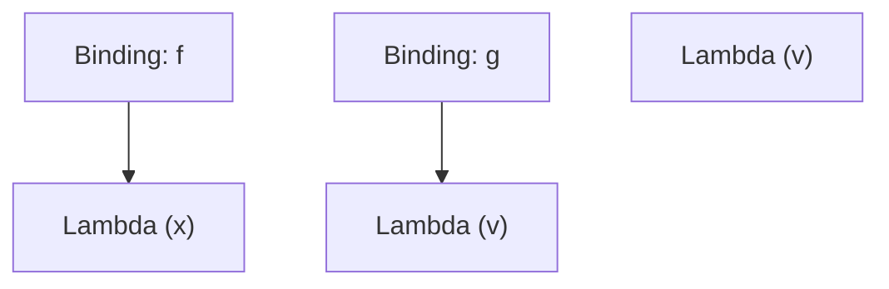
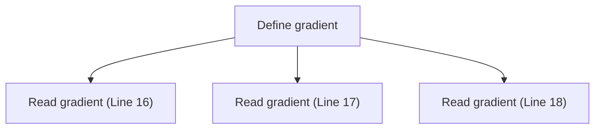
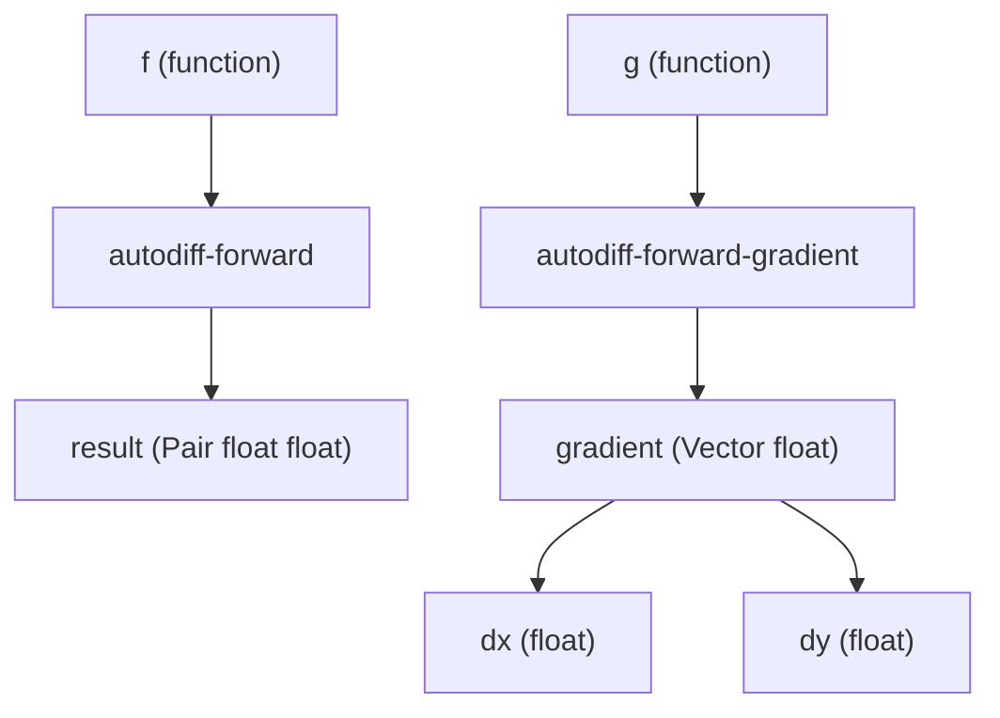

# MCP Tools for Automatic Differentiation Analysis

Last Updated: 2025-03-28

This document describes the MCP tools available for analyzing automatic differentiation in Eshkol. These tools can help identify issues with type inference, lambda captures, and other aspects of autodiff functions.

## Available MCP Tools

Eshkol provides several MCP tools for analyzing autodiff functions:

### analyze-types

The `analyze-types` tool analyzes type inference and type checking for Eshkol files, with a focus on autodiff functions.

**Usage:**
```bash
use_mcp_tool eshkol-tools analyze-types '{"filePath": "examples/autodiff_example.esk", "detail": "detailed"}'
```

**Parameters:**
- `filePath`: Path to the Eshkol source file
- `detail`: Level of detail in the analysis (basic, detailed, verbose)

**Example Output (detailed):**
```
# Detailed Type Analysis for autodiff_example.esk

## Summary

- File: autodiff_example.esk
- Explicit type annotations: 5
- Inferred types: 12

## Type Annotations

- `: f (-> float float)`
- `: g (-> (Vector float) float)`
- `: h (-> (Vector float) (Vector float))`
- `: result (Pair float float)`
- `: grad (Vector float)`

## Inferred Types

### Function: f
Parameters:
- x: float

Return type: float

### Function: g
Parameters:
- v: (Vector float)

Return type: float

### Function: h
Parameters:
- v: (Vector float)

Return type: (Vector float)

### Function: autodiff-forward
Parameters:
- f: (-> float float)
- x: float

Return type: (Pair float float)

### Function: autodiff-forward-gradient
Parameters:
- g: (-> (Vector float) float)
- v: (Vector float)

Return type: (Vector float)
```

**Current Limitations:**
- Uses a simplified implementation that doesn't fully parse the code
- May not correctly infer types for complex autodiff functions
- Limited support for higher-order functions and lambda captures

### analyze-lambda-captures

The `analyze-lambda-captures` tool analyzes free/bound variables and closure environments in Eshkol files, which is particularly important for autodiff functions.

**Usage:**
```bash
use_mcp_tool eshkol-tools analyze-lambda-captures '{"filePath": "examples/autodiff_example.esk", "detail": "detailed", "format": "mermaid"}'
```

**Parameters:**
- `filePath`: Path to the Eshkol source file
- `detail`: Level of detail in the analysis (basic, detailed, verbose)
- `format`: Output format for visualizations (mermaid, dot)
- `optimizationLevel`: Level of closure environment optimization to apply (none, minimal, aggressive)

**Example Output (basic):**
```
# Lambda Captures Analysis for examples/autodiff_example.esk

## Summary

- Total lambdas: 3
- Total captured bindings: 2
- Optimization level: none

## Lambda Capture Visualization



**Current Limitations:**
- May not correctly analyze complex lambda captures
- Limited support for mutual recursion
- May not correctly handle closures in autodiff functions

### analyze-binding-access

The `analyze-binding-access` tool analyzes how bindings are used in an Eshkol file, which is useful for understanding data flow in autodiff functions.

**Usage:**
```bash
use_mcp_tool eshkol-tools analyze-binding-access '{"filePath": "examples/autodiff_example.esk", "bindingName": "gradient"}'
```

**Parameters:**
- `filePath`: Path to the Eshkol source file
- `bindingName`: Name of a specific binding to analyze (optional)
- `format`: Output format for visualizations (mermaid, dot)

**Example Output:**
```
# Binding Access Analysis for examples/autodiff_example.esk

## Binding: gradient

- Defined at: Line 15, Column 3
- Type: (Vector float)
- References: 3
  - Read at: Line 16, Column 10
  - Read at: Line 17, Column 10
  - Read at: Line 18, Column 3

## Access Pattern Visualization


```

**Current Limitations:**
- May not correctly analyze complex binding patterns
- Limited support for higher-order functions
- May not correctly handle bindings in autodiff functions

### visualize-binding-flow

The `visualize-binding-flow` tool tracks binding values through transformation stages, which is useful for understanding how values flow through autodiff functions.

**Usage:**
```bash
use_mcp_tool eshkol-tools visualize-binding-flow '{"filePath": "examples/autodiff_example.esk", "format": "mermaid"}'
```

**Parameters:**
- `filePath`: Path to the Eshkol source file
- `bindingName`: Name of a specific binding to track (optional)
- `format`: Output format for visualizations (mermaid, dot)

**Example Output:**
```
# Binding Flow Visualization for examples/autodiff_example.esk

## Flow Diagram


```

**Current Limitations:**
- May not correctly visualize complex binding flows
- Limited support for higher-order functions
- May not correctly handle bindings in autodiff functions

## Using MCP Tools for Autodiff Analysis

### Analyzing Type Inference Issues

To analyze type inference issues in autodiff functions:

1. Use the `analyze-types` tool with the `detailed` or `verbose` option:
   ```bash
   use_mcp_tool eshkol-tools analyze-types '{"filePath": "examples/autodiff_example.esk", "detail": "verbose"}'
   ```

2. Look for inconsistencies in inferred types, particularly for:
   - Return types of autodiff functions
   - Types of gradient and Jacobian results
   - Types of higher-order derivatives

3. Check for type errors in the generated C code:
   ```bash
   use_mcp_tool eshkol-tools debug-codegen '{"filePath": "examples/autodiff_example.esk", "stage": "c-code"}'
   ```

### Analyzing Lambda Capture Issues

To analyze lambda capture issues in autodiff functions:

1. Use the `analyze-lambda-captures` tool with the `detailed` option:
   ```bash
   use_mcp_tool eshkol-tools analyze-lambda-captures '{"filePath": "examples/autodiff_example.esk", "detail": "detailed"}'
   ```

2. Look for:
   - Captured variables that should be parameters
   - Mutable variables captured by lambdas
   - Complex capture patterns that may cause issues

3. Try different optimization levels to see potential improvements:
   ```bash
   use_mcp_tool eshkol-tools analyze-lambda-captures '{"filePath": "examples/autodiff_example.esk", "detail": "detailed", "optimizationLevel": "aggressive"}'
   ```

### Analyzing Binding Access Issues

To analyze binding access issues in autodiff functions:

1. Use the `analyze-binding-access` tool:
   ```bash
   use_mcp_tool eshkol-tools analyze-binding-access '{"filePath": "examples/autodiff_example.esk"}'
   ```

2. Look for:
   - Bindings that are defined but not used
   - Bindings that are used before they are defined
   - Bindings that are modified after they are used in autodiff functions

### Analyzing Mutual Recursion Issues

To analyze mutual recursion issues in autodiff functions:

1. Use the `analyze-mutual-recursion` tool:
   ```bash
   use_mcp_tool eshkol-tools analyze-mutual-recursion '{"filePath": "examples/mutual_recursion.esk", "detail": "detailed"}'
   ```

2. Look for:
   - Recursive functions that call each other
   - Potential infinite recursion
   - Recursion that may cause issues with autodiff

## Workarounds for Common Issues

### Type Inference Issues

To work around type inference issues in autodiff functions:

1. Use explicit type annotations for autodiff functions:
   ```scheme
   (: f (-> float float))
   (define (f x)
     (* x x))
   
   (: df/dx (-> float float))
   (define df/dx (autodiff-gradient f))
   ```

2. Use intermediate variables with explicit types:
   ```scheme
   (: gradient (Vector float))
   (define gradient (autodiff-gradient g v))
   
   (: dx float)
   (define dx (vector-ref gradient 0))
   
   (: dy float)
   (define dy (vector-ref gradient 1))
   ```

3. Break complex expressions into simpler ones with explicit types:
   ```scheme
   ;; Instead of:
   (define result (autodiff-gradient (lambda (v) (g (h v))) input))
   
   ;; Use:
   (: h-output (Vector float))
   (define h-output (h input))
   
   (: g-gradient (-> (Vector float) (Vector float)))
   (define g-gradient (autodiff-gradient g))
   
   (: result (Vector float))
   (define result (g-gradient h-output))
   ```

### Lambda Capture Issues

To work around lambda capture issues in autodiff functions:

1. Avoid capturing mutable variables in lambdas:
   ```scheme
   ;; Instead of:
   (let ((x 0))
     (set! x 5)
     (autodiff-gradient (lambda (y) (+ x y))))
   
   ;; Use:
   (let ((x 5))
     (autodiff-gradient (lambda (y) (+ x y))))
   ```

2. Use explicit parameter passing instead of capturing variables:
   ```scheme
   ;; Instead of:
   (let ((a 1) (b 2))
     (autodiff-gradient (lambda (x) (+ (* a x) b))))
   
   ;; Use:
   (define (f x a b)
     (+ (* a x) b))
   
   (autodiff-gradient (lambda (x) (f x 1 2)))
   ```

3. Avoid complex higher-order functions in autodiff:
   ```scheme
   ;; Instead of:
   (autodiff-gradient (compose f g))
   
   ;; Use:
   (define (f-compose-g x)
     (f (g x)))
   
   (autodiff-gradient f-compose-g)
   ```

## Future Improvements

The MCP tools for autodiff analysis are continuously being improved:

1. **Better type inference**: Improved type inference for autodiff functions, particularly for lambda captures and vector return types
2. **More accurate lambda capture analysis**: Better analysis of lambda captures in autodiff functions, with more precise tracking of captured variables
3. **Integration with the compiler pipeline**: Better integration with the compiler pipeline to provide more accurate analysis
4. **More visualization options**: More visualization options for autodiff functions, including computational graph visualization
5. **Performance improvements**: Faster analysis of large codebases with many autodiff functions

## Related Documentation

- [AUTODIFF.md](AUTODIFF.md): Overview of automatic differentiation in Eshkol
- [TYPE_SYSTEM.md](TYPE_SYSTEM.md): Overview of Eshkol's type system
- [KNOWN_ISSUES.md](../scheme_compatibility/KNOWN_ISSUES.md): Known issues and limitations in Eshkol
